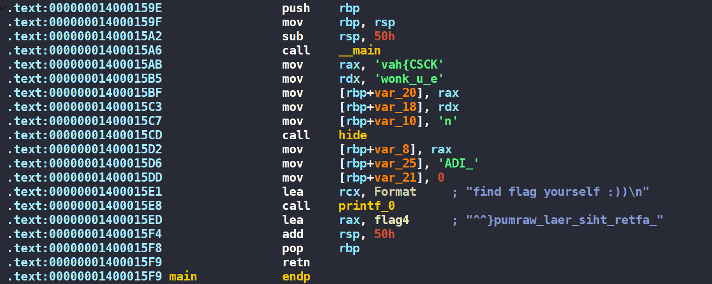

<!--more-->
<style>
img {
    box-shadow: rgba(0, 0, 0, 0.35) 0px 5px 15px;
    border-radius: 6px;
    display: block; 
    margin: 15px auto;
}
</style>

## rev/riel warmup


* 4 solves / 460 pts / by 13r_ə_Rɪst
* **Given files:** [chall.exe](https://drive.google.com/file/d/1Gqp0ioEYXpqxXcTxyA2oJHIoAPlLHhII/view?usp=sharing)
* **Description:** w-weo cum to REV, các bạn có thể tải ida tại đây


**Solution**

Load file đề bài cho vào IDA64, chuyển qua tab code assembly, ta có thể thấy được các phần của flag. Ghép chúng lại và ta được flag `KCSC{have_u_known_IDA_after_this_real_warmup}`



## rev/Elif


* 8 solves / 280 pts / by noobmannn
* **Given files:** [FlagChecker1.py](https://drive.google.com/file/d/1VgGgFI7VyzhQYUJwFXvyBvxE34DcnQL_/view?usp=sharing)
* **Description:** Có phải thứ này là code Al không vậy???


**Solution**

Đọc qua file được cho, ta thấy có rất nhiều phương trình có dạng như này

```python
inp[30] + inp[44] + inp[16] + inp[38] + inp[47] + inp[7] != 398
```

Để giải được dạng bài này, ta chỉ cần sử dụng Z3 và thu được flag là `KCSC{700_much_1f-3l53_f0r_fl46ch3ck3r!!!7ry_z3<3}`

```python
from z3 import *

inp = [Int(f"inp[{i}]") for i in range(49)]
s = Solver()

s.add(inp[0] == ord("K"))
s.add(inp[1] == ord("C"))
s.add(inp[2] == ord("S"))
s.add(inp[3] == ord("C"))
s.add(inp[4] == ord("{"))
s.add(inp[48] == ord("}"))

s.add(inp[30] + inp[44] + inp[16] + inp[38] + inp[47] + inp[7] == 398)
s.add(inp[41] + inp[22] + inp[38] + inp[33] + inp[28] + inp[20] == 451)
s.add(inp[10] + inp[3] + inp[39] + inp[14] + inp[4] + inp[47] == 440)
s.add(inp[2] + inp[12] + inp[45] + inp[4] + inp[42] + inp[30] == 581)
s.add(inp[36] + inp[36] + inp[26] + inp[43] + inp[21] + inp[1] == 587)
s.add(inp[16] + inp[3] + inp[16] + inp[20] + inp[38] + inp[39] == 274)
s.add(inp[28] + inp[39] + inp[18] + inp[38] + inp[47] + inp[8] == 372)
s.add(inp[25] + inp[19] + inp[36] + inp[19] + inp[20] + inp[31] == 470)
s.add(inp[44] + inp[27] + inp[5] + inp[41] + inp[16] + inp[42] == 565)
s.add(inp[46] + inp[35] + inp[8] + inp[1] + inp[4] + inp[47] == 447)
s.add(inp[41] + inp[20] + inp[42] + inp[40] + inp[3] + inp[43] == 503)
s.add(inp[36] + inp[4] + inp[21] + inp[46] + inp[34] + inp[38] == 532)
s.add(inp[43] + inp[45] + inp[3] + inp[45] + inp[3] + inp[17] == 382)
s.add(inp[24] + inp[2] + inp[6] + inp[2] + inp[25] + inp[1] == 490)
s.add(inp[38] + inp[41] + inp[33] + inp[34] + inp[21] + inp[42] == 569)
s.add(inp[17] + inp[38] + inp[1] + inp[15] + inp[46] + inp[35] == 364)
s.add(inp[40] + inp[17] + inp[34] + inp[33] + inp[39] + inp[19] == 398)
s.add(inp[18] + inp[21] + inp[4] + inp[27] + inp[19] + inp[29] == 541)
s.add(inp[30] + inp[34] + inp[42] + inp[26] + inp[18] + inp[47] == 588)
s.add(inp[23] + inp[24] + inp[30] + inp[1] + inp[13] + inp[7] == 471)
s.add(inp[17] + inp[16] + inp[32] + inp[16] + inp[15] + inp[14] == 343)
s.add(inp[30] + inp[10] + inp[24] + inp[3] + inp[40] + inp[3] == 519)
s.add(inp[10] + inp[34] + inp[27] + inp[38] + inp[46] + inp[40] == 480)
s.add(inp[6] + inp[6] + inp[46] + inp[35] + inp[5] + inp[13] == 357)
s.add(inp[18] + inp[16] + inp[5] + inp[6] + inp[12] + inp[32] == 411)
s.add(inp[1] + inp[3] + inp[37] + inp[4] + inp[22] + inp[44] == 514)
s.add(inp[26] + inp[11] + inp[12] + inp[47] + inp[22] + inp[2] == 541)
s.add(inp[32] + inp[32] + inp[18] + inp[34] + inp[31] + inp[37] == 454)
s.add(inp[38] + inp[25] + inp[1] + inp[23] + inp[28] + inp[27] == 403)
s.add(inp[37] + inp[11] + inp[2] + inp[24] + inp[39] + inp[21] == 457)
s.add(inp[21] + inp[4] + inp[3] + inp[11] + inp[42] + inp[2] == 588)
s.add(inp[11] + inp[36] + inp[27] + inp[1] + inp[18] + inp[19] == 549)
s.add(inp[16] + inp[18] + inp[37] + inp[41] + inp[25] + inp[45] == 446)
s.add(inp[19] + inp[19] + inp[18] + inp[8] + inp[25] + inp[14] == 453)
s.add(inp[19] + inp[2] + inp[40] + inp[34] + inp[27] + inp[5] == 461)
s.add(inp[48] + inp[41] + inp[33] + inp[41] + inp[23] + inp[37] == 533)
s.add(inp[45] + inp[9] + inp[8] + inp[32] + inp[4] + inp[26] == 531)
s.add(inp[47] + inp[27] + inp[2] + inp[32] + inp[3] + inp[38] == 393)
s.add(inp[32] + inp[27] + inp[2] + inp[34] + inp[27] + inp[14] == 506)
s.add(inp[24] + inp[14] + inp[39] + inp[20] + inp[3] + inp[17] == 365)
s.add(inp[10] + inp[17] + inp[43] + inp[28] + inp[48] + inp[48] == 565)
s.add(inp[35] + inp[47] + inp[27] + inp[42] + inp[35] + inp[37] == 415)
s.add(inp[10] + inp[37] + inp[37] + inp[44] + inp[21] + inp[15] == 502)
s.add(inp[9] + inp[44] + inp[9] + inp[48] + inp[38] + inp[15] == 600)
s.add(inp[16] + inp[47] + inp[12] + inp[27] + inp[39] + inp[16] == 386)
s.add(inp[2] + inp[37] + inp[32] + inp[41] + inp[9] + inp[13] == 485)
s.add(inp[25] + inp[18] + inp[25] + inp[41] + inp[40] + inp[11] == 566)
s.add(inp[36] + inp[37] + inp[4] + inp[12] + inp[35] + inp[42] == 546)
s.add(inp[45] + inp[32] + inp[12] + inp[19] + inp[16] + inp[3] == 371)

if s.check() == sat:
    model = s.model()
    flag = "".join([chr(model[i].as_long()) for i in inp])
    print(flag)
else:
    print(".....")
```

## rev/Go


* 4 solves / 460 pts / by noobmannn
* **Given files:** [FlagChecker2](https://drive.google.com/file/d/1JX5kqA6ovGxNYgJ0nHnek8QJkX1VHSEe/view?usp=sharing)
* **Description:** Thứ này khó nhìn quá :((( Bạn có thể giúp tôi xử lý nó được không???


**Solution**

Đây là một file binary được viết bằng Go. Sau một hồi phân tích kết hợp debug, mình đoán đây là đoạn code check độ dài input. Từ đây, có thể suy đoán được độ dài input là 51. 

```go
 if ( v10[1] != 51LL )
  {
    v14 = &unk_4A5580;
    v15 = &off_4DBC00;
    fmt_Fprintln();
    os_Exit();
    input = v10;
  }
```

Đoạn mã check flag nằm ở dưới đây 

```go
  for ( i = 0LL; i < 51; i = v4 + 1 )
  {
    if ( (unsigned __int64)i >= input[1] )
      runtime_panicIndex();
    v4 = i;
    v5 = i - (i & 0xFFFFFFFFFFFFFFE0LL);
    if ( v5 >= 32 )
      runtime_panicIndex();
    if ( *(&check + i) != ((unsigned __int8)key[v5] ^ (unsigned __int64)*(unsigned __int8 *)(i + *input)) )
    {
      v7 = i;
      v12 = &unk_4A5580;
      v13 = &off_4DBC10;
      fmt_Fprintln();
      os_Exit();
      input = v10;
      v4 = v7;
    }
  }
```

Đoạn kiểm tra trên có thể được mô tả như sau: 

```c
input[i] ^ key[i] == check[i] 
```

Thực hiện debug, mình có viết 1 script nhỏ để lấy toàn bộ giá trị của mảng `check` trong IDA Python 

```python
import idc 

start = 0x000000C0000D7D80
end = start + 51 * 8 
ans = []

for i in range(start, end, 8): 
    ans.append(idc.get_wide_byte(i))
print(ans)
# [18, 27, 5, 115, 26, 112, 81, 72, 87, 50, 8, 67, 6, 94, 5, 93, 27, 91, 5, 25, 110, 0, 124, 41, 1, 63, 64, 6, 15, 1, 35, 11, 106, 7, 97, 85, 0, 117, 93, 24, 83, 90, 102, 74, 106, 81, 2, 73, 67, 76, 72]
```

Sau khi đã có đầy đủ dữ liệu, ta dễ dàng viết lại thuật toán giải mã và thu được flag `KCSC{7h15_15_345y60l4n6_ch4ll3n63_7ea2da17_<3<3!!!}`

```python
key = "YXV0aG9ybm9vYm1hbm5uZnJvbWtjc2M="
check = [18, 27, 5, 115, 26, 112, 81, 72, 87, 50, 8, 67, 6, 94, 5, 93, 27, 91, 5, 25, 110, 0, 124, 41, 1, 63, 64, 6, 15, 1, 35, 11, 106, 7, 97, 85, 0, 117, 93, 24, 83, 90, 102, 74, 106, 81, 2, 73, 67, 76, 72]
for i in range(len(check)): 
		print(chr(ord(key[i % len(key)]) ^ check[i]), end="")
```

## rev/Time travel


* 3 solves / 482 pts / by 13r_ə_Rɪst
* **Given files:** 
  * [TimeTravel.zip](https://drive.google.com/drive/folders/1yPaSc-b-U9DAfHzMINJkrV0Zwrp-QRRT?usp=sharing)
* **Description:** Vì bí idea nên tôi nhờ người khác làm giúp chall này. Không biết cụ thể là khi nào, chắc tác giả đang đứng đâu đó trên dòng sông thời gian…\
**Hint:** Chẳng thứ gì nằm ngoài sự kiểm soát của kiểu dữ liệu…


**Solution**

Load file vào IDA64, ta thấy đoạn code của chương trình chính rất ngắn gọn. 


Chương trình khởi tạo seed để gọi hàm `rand()`, mở file `enc.txt` và ghi dữ liệu bị encrypt vào file. 

Ý tưởng để giải bài này rất đơn giản. Vì format flag là `KCSC{` vậy nên ta sẽ có được 5 giá trị random đầu tiên. Tiếp đến, ta sẽ bruteforce seed để tìm ra seed chính xác của tác giả. 

```cpp
#include <cstdio>
#include <cstdlib>

int randomArray[6] = {35, 43, 46, 133, 76};

int main() {
    for (long int s = 0; s < 4294967295; s++) {
        printf("seed = %ld\n", s);
        srand(s);
        int cnt = 0;

        for (int i = 0; i < 5; i++) {
            int tmp = rand() & 0xff;
            if (tmp != randomArray[i]) break;
            else cnt++;
        }

        if (cnt == 5) return 0;
    }
    return 0;
}
// seed = 16777215
```

Công việc còn lại là là xor ngược lại để lấy flag. Kết quả thu được là `KCSC{0xffffff_is_1970-07-14,I_created_this_challenge_at_"the_end"_of_time}`

```cpp
#include <cstdio>
#include <cstdlib>

int encryptedFlag[74] = { 104, 104, 125, 198, 55, 142, 253, 235, 52, 254, 23, 254, 157, 40, 224, 4, 112, 133, 183, 68, 104, 55, 192, 251, 34, 201, 160, 73, 189, 42, 182, 207, 184, 69, 189, 68, 80, 135, 177, 72, 243, 201, 124, 35, 184, 249, 46, 131, 189, 238, 168, 217, 8, 239, 55, 152, 28, 118, 197, 19, 246, 240, 220, 14, 42, 81, 189, 212, 35, 100, 132, 83, 225, 75 };

int main() {
    srand(16777215);

    for (int i = 0; i < 74; i++) {
        int tmp = rand() & 0xff;
        printf("%c", encryptedFlag[i] ^ tmp);
    }

    return 0;
} 
```

## rev/Từng Quen


* 1 solve / 500 pts / by 1conmeo
* **Given files:** 
  * [important_note.txt](https://drive.google.com/drive/folders/1NUBLuWt4a9oppIiWsRJhTdNhQ3E5JaxC?usp=sharing)
  * [mem.DMP](https://drive.google.com/drive/folders/1NUBLuWt4a9oppIiWsRJhTdNhQ3E5JaxC?usp=sharing)
  * [sample.exe](https://drive.google.com/drive/folders/1NUBLuWt4a9oppIiWsRJhTdNhQ3E5JaxC?usp=sharing)
* **Description:** Benjamin bị kẻ xấu loMbeoS mã hóa mất 1 file quan trọng, hãy giúp anh ấy khôi phục lại file này. Benj fan WREN EVANS


**Solution**

Load file đề bài cho vào IDA64, dưới đây là phần chính của chương trình. 


Ta thấy chương trình tạo 16 số random, đổi 4 số random cuối bằng giá trị có sẵn. Ở phần mã hóa, ta có thể tóm gọn lại như sau 

```python
encryptedFlag[i] ^= randomArray[i % 16]
```

Do flag format là `KCSC{` ta sẽ xor ngược lại để tính được 5 giá trị random đầu tiên. Sau đó sẽ bruteforce tất cả các seed để tìm ra seed chính xác của tác giả. 

Đây là đoạn code để mình lấy 5 giá trị random đầu tiên 

```python
randomArray = [0] * 16 
randomArray[12] = 0xCA
randomArray[13] = 0xFE
randomArray[14] = 0xBE
randomArray[15] = 0xEF

with open("important_note.txt", "rb") as file: 
    data = file.read() 

encodedflag = []
for i in data:
    encodedflag.append(i) 
print(f"Encodedflag = {encodedflag}")

flag = "KCSC{"
for i in range(5): 
    randomArray[i] = ord(flag[i]) ^ encodedflag[i]

print(randomArray) 
```

Sau khi có các giá trị random, mình sẽ đi bruteforce seed. Lưu ý là đề bài cho chúng ta file `exe` nên ta phải compile source code này trên Windows 

```c
#include <stdio.h>
#include <stdlib.h>

int seedList[] = {191, 245, 39, 4, 67}; 
int encodedflag[] = {244, 182, 116, 71, 56, 26, 174, 101, 212, 130, 165, 187, 234, 159, 208, 135, 159, 151, 72, 109, 99, 6, 169, 101, 154, 195, 174, 190, 234, 138, 214, 154, 222, 213, 85, 107, 42, 84, 178, 101, 215, 130, 165, 187, 234, 146, 223, 130, 159, 153, 72, 109, 99, 21, 168, 100, 154, 193, 168, 163, 171, 222, 202, 154, 209, 146, 7, 96, 34, 25, 230, 98, 213, 203, 224, 183, 164, 150, 158, 150, 218, 128, 7, 105, 44, 0, 230, 109, 211, 130, 180, 190, 175, 222, 208, 142, 198, 212, 6, 121};

int main() {
    for (long int s = 0; s < 4294967295; s++) {
        printf("seed = %ld\n", s); 
        srand(s); 
        int cnt = 0; 

        for (int i = 0; i < 5; i++) {
            int tmp = random() & 0xff; 
            if (tmp != seedList[i]) {
                break;  
            } else {
                cnt++; 
            }
        }

        if (cnt == 5) return 0; 
    }

    return 0;
}
// seed = 13973678
```

Khi đã tìm thấy seed, ta thực hiện xor ngược lại để tìm ra flag. Kết quả thu được là `KCSC{nhin em anh boi roi anh thua roi tim em lam loi anh chua tung dam noi anh yeu mot ai the nay!!}`

```c
#include <stdio.h>
#include <stdlib.h>

int seedList[] = {191, 245, 39, 4, 67};
int encodedflag[] = {244, 182, 116, 71, 56, 26, 174, 101, 212, 130, 165, 187, 234, 159, 208, 135, 159, 151, 72, 109, 99, 6, 169, 101, 154, 195, 174, 190, 234, 138, 214, 154, 222, 213, 85, 107, 42, 84, 178, 101, 215, 130, 165, 187, 234, 146, 223, 130, 159, 153, 72, 109, 99, 21, 168, 100, 154, 193, 168, 163, 171, 222, 202, 154, 209, 146, 7, 96, 34, 25, 230, 98, 213, 203, 224, 183, 164, 150, 158, 150, 218, 128, 7, 105, 44, 0, 230, 109, 211, 130, 180, 190, 175, 222, 208, 142, 198, 212, 6, 121};
int randomArray[16];

int main() {
        srand(13973678);
        for (int i = 0; i < 16; i++) {
            randomArray[i] = rand() & 0xff;
        }
        randomArray[12] = 0xCA;
        randomArray[13] = 0xFE;
        randomArray[14] = 0xBE;
        randomArray[15] = 0xEF;

        for (int i = 0; i < sizeof(encodedflag) / sizeof(encodedflag[0]); i++) {
            printf("%c", encodedflag[i] ^ randomArray[i % 16]);
        }

    return 0;
}
```

## rev/Shelter


* 0 solve / 500 pts / by noobmannn
* **Given files:** [FlagChecker3.exe](https://drive.google.com/file/d/1vTrfVm_wQIxnf_Ece-w3IYZ-VcI3W5-l/view?usp=sharing)
* **Description:** There is some Crypto in this :3\
**Hint 1:** https://learn.microsoft.com/en-us/windows/win32/api/wincrypt/nf-wincrypt-cryptencrypt \
**Hint 2:** Hint 1 → cách mã hoá, phân tích - tìm những thứ cần thiết và hãy để tool làm việc mà nó phải làm


**Solution**

Load file đề bài cho vào IDA64. Sau khi phân tích chức năng các hàm, mình đã rename lại và có kết quả như sau 

```c
int __cdecl main(int argc, const char **argv, const char **envp)
{
  getInput();
  paddingInput();
  sha256_key();
  md5_iv();
  encryptData();
  checkFlag();
  return 0;
}
```

Phân tích hàm `paddingInput()`, nhiệm vụ của hàm này chỉ là padding `0` vào `input` sao cho độ dài `input` chia hết cho 16 và không lớn hơn 80 byte. 

```c
int paddingInput()
{
  int result; // eax
  unsigned int inputLength; // [esp+Ch] [ebp-14h]
  unsigned int v2; // [esp+10h] [ebp-10h]
  unsigned int i; // [esp+14h] [ebp-Ch]

  inputLength = strlen(input);
  result = 16 - inputLength % 16;
  v2 = result;
  if ( result != 16 )
  {
    for ( i = 0; i < v2; ++i )
    {
      result = i + inputLength;
      if ( i + inputLength >= 80 )
        result = sub_C1756();
      input[i + inputLength] = 0;
    }
  }
  return result;
}
```

Hàm `sha256_key` sử dụng các hàm encrypt của WinAPI để tạo hash SHA256 của link `https://www.youtube.com/watch?v=fzQ6gRAEoy0`


Hàm `md5_iv()` có chức năng tương tự như hàm `sha256_key`. Thay vì tạo hash SHA256 thì sẽ tạo hash MD5 cho link `https://www.youtube.com/watch?v=fzQ6gRAEoy0`


Quan sát hàm `encryptData`, ta thấy hàm sử dụng thuật toán AES để mã hóa dữ liệu. 


Các bước thực hiện mã hóa của hàm này diễn ra như sau: 

1. Gọi hàm `CryptAcquireContextW` để set context mã hóa là AES. 
2. Gọi hàm `CryptImportKey` để lấy key `sha256Hash`. Nó được cất trong `pdData` ở phía dưới 


1. Gọi hàm `CryptSetKeyParam` để set IV và chế độ mã hóa AES CBC. 
2. Gọi hàm `CryptEncrypt` để mã hóa dữ liệu.  

Sau khi mã hóa dữ liệu, hàm `checkFlag` được gọi để so sánh encrypted input với mảng `ans` đã có sẵn 

```c
int checkFlag()
{
  unsigned int i; // [esp+0h] [ebp-4h]

  for ( i = 0; i < inputLength2; ++i )
  {
    if ( *(&copyInput + i) != (unsigned __int8)ans[i] )
    {
      sub_E21040("Wrong Flag!!!\n");
      exit(0);
    }
  }
  return sub_E21040("Correct!!! You are awesome <3\n");
}
```

Sau khi hiểu rõ toàn bộ luồng hoạt động của chương trình, mình đã viết lại toàn bộ các hàm để tạo ra `sha256_hash` và `md5_iv`. Sau đó gọi hàm `CryptDecrypt` của WinAPI để giải mã.\
Flag thu được là `KCSC{md5_4nd_5h4256_4nd_435_w17h_w1n4p1_YXV0aG9ybm9vYm1hbm5uZnJvbWtjc2M=}`
```cpp
#include <cstdio>
#include <Windows.h>

using namespace std;

int main() {
    DWORD pdwDataLen;
    HCRYPTPROV phProv;
    HCRYPTHASH phHash;
    const char *youtube = "https://www.youtube.com/watch?v=fzQ6gRAEoy0";
    BYTE byteArray32[32];
    BYTE byteArray16[16];

    if (CryptAcquireContextW(&phProv, 0, 0, PROV_RSA_AES, CRYPT_VERIFYCONTEXT)) {
        if (CryptCreateHash(phProv, CALG_SHA_256, 0, 0, &phHash)) {
            if (CryptHashData(phHash, (BYTE*) youtube, strlen(youtube), 0)) {
                pdwDataLen = 32;
                CryptGetHashParam(phHash, 2u, (BYTE*) byteArray32, &pdwDataLen, 0);
                CryptDestroyHash(phHash);
                CryptReleaseContext(phProv, 0);
            }
        }
    }

    if (CryptAcquireContextW(&phProv, 0, 0, PROV_RSA_AES, CRYPT_VERIFYCONTEXT)) {
        if (CryptCreateHash(phProv, CALG_MD5, 0, 0, &phHash)) {
            if (CryptHashData(phHash, (BYTE*) youtube, strlen(youtube), 0)) {
                pdwDataLen = 16;
                CryptGetHashParam(phHash, 2u, (BYTE*) byteArray16, &pdwDataLen, 0);
                CryptDestroyHash(phHash);
                CryptReleaseContext(phProv, 0);
            }
        }
    }

    const unsigned char pbData[44] = {
        0x08, 0x02, 0x00, 0x00, 0x10, 0x66, 0x00, 0x00, 0x20, 0x00,
        0x00, 0x00, 0xBB, 0x8C, 0x8C, 0x09, 0x51, 0xE8, 0x1C, 0x3C,
        0x56, 0x8C, 0x72, 0x81, 0xA3, 0x96, 0x46, 0x3B, 0x0F, 0x0E,
        0x05, 0x87, 0xBE, 0xA9, 0x9A, 0x26, 0x7A, 0xF1, 0x59, 0x83,
        0x2E, 0x71, 0x7F, 0x06
    };

    unsigned char ans[] =
    {
        0x5D, 0xDE, 0x8C, 0xAC, 0xAE, 0xE2, 0x2D, 0x9F, 0xF2, 0x49,
        0x3F, 0x18, 0x35, 0x09, 0x3C, 0x9E, 0xEF, 0xC5, 0xD1, 0x14,
        0xA5, 0x78, 0x02, 0x97, 0x18, 0x5A, 0xE8, 0xA0, 0x8E, 0x4C,
        0xDD, 0x19, 0x74, 0x5C, 0xE4, 0x9B, 0x29, 0x95, 0xB8, 0xD7,
        0xB9, 0x7D, 0xD0, 0x56, 0xBD, 0x94, 0x99, 0x72, 0xFF, 0x58,
        0xB9, 0x1E, 0x57, 0xE9, 0xDA, 0x27, 0xD5, 0xA9, 0x4D, 0xF5,
        0xB6, 0x3B, 0x07, 0x46, 0xC8, 0xDB, 0x37, 0x6E, 0x77, 0x95,
        0x97, 0xFA, 0x7F, 0x5D, 0x4D, 0x54, 0x86, 0xDA, 0xE3, 0x17
    };

    HCRYPTKEY phKey; 
    BYTE v6[4] = { 1, 0, 0, 0 };

    if (CryptAcquireContextW(&phProv, 0, L"Microsoft Enhanced RSA and AES Cryptographic Provider", PROV_RSA_AES, 0)) {
        if (CryptImportKey(phProv, (BYTE*) pbData, 44, 0, 0, &phKey))
        {
            if (CryptSetKeyParam(phKey, 4u, v6, 0) && CryptSetKeyParam(phKey, 1u, byteArray16, 0))
            {
                DWORD pdwDataLen = 80;
                if (CryptDecrypt(phKey, 0, 0, 0, (BYTE*) ans, &pdwDataLen))
                {
                    for (int i = 0; i < 80; i++) {
                        printf("%c", ans[i]);
                   }
                }
            }
        }
    }
   
    return 0;
}
```

Ngoài việc sử dụng WinAPI để decrypt, chúng ta có thể sử dụng python để giải mã như sau

```python
from Crypto.Cipher import AES
from hashlib import * 

url = b"https://www.youtube.com/watch?v=fzQ6gRAEoy0"

key = sha256(url).digest()
iv = md5(url).digest()

encryptedFlag = bytes([
    0x5D, 0xDE, 0x8C, 0xAC, 0xAE, 0xE2, 0x2D, 0x9F, 0xF2, 0x49,
    0x3F, 0x18, 0x35, 0x09, 0x3C, 0x9E, 0xEF, 0xC5, 0xD1, 0x14,
    0xA5, 0x78, 0x02, 0x97, 0x18, 0x5A, 0xE8, 0xA0, 0x8E, 0x4C,
    0xDD, 0x19, 0x74, 0x5C, 0xE4, 0x9B, 0x29, 0x95, 0xB8, 0xD7,
    0xB9, 0x7D, 0xD0, 0x56, 0xBD, 0x94, 0x99, 0x72, 0xFF, 0x58,
    0xB9, 0x1E, 0x57, 0xE9, 0xDA, 0x27, 0xD5, 0xA9, 0x4D, 0xF5,
    0xB6, 0x3B, 0x07, 0x46, 0xC8, 0xDB, 0x37, 0x6E, 0x77, 0x95,
    0x97, 0xFA, 0x7F, 0x5D, 0x4D, 0x54, 0x86, 0xDA, 0xE3, 0x17
])

cipher = AES.new(key, AES.MODE_CBC, iv) 
decryptedFlag = cipher.decrypt(encryptedFlag).decode("utf8")
print(decryptedFlag)
# KCSC{md5_4nd_5h4256_4nd_435_w17h_w1n4p1_YXV0aG9ybm9vYm1hbm5uZnJvbWtjc2M=}
```

## rev/s1mple flag checker but no SEE


* 2 solves / 496 pts / by 13r_ə_Rɪst
* **Given files:** [Flag_Checker.java](https://drive.google.com/file/d/1nxwQBgn1YKXaV0rKJXG0vfVYtYUzI35F/view?usp=sharing)
* **Description:** no SEE or no C, you see :))


**Solution**

Đề bài cho chúng ta một file flag checker được viết bởi ngôn ngữ Java

```java
import java.util.*;

public class Flag_Checker {
	static int[] pos = { 10, 15, 19, 28, 30, 44, 49 };
	static int[] f1nal = { 18, 20, 22, 23, 25, 26, 27, 31, 33, 34, 36, 37, 39, 40 };

	public static boolean check1(boolean ret, String s) {
		if ((!s.substring(0, 5).equals("KCSC{")) || !(s.charAt(s.length() - 1) == '}'))
			ret = false;
		return ret;
	}

	public static boolean check(boolean ret, String s, int[] arr) {
		for (int i = 0; i < arr.length; ++i) {
			if (s.charAt(arr[i]) != 95)
				return false;
		}
		return ret;
	}

	public static boolean check(boolean ret, String s, boolean[] arr) {
		int[] num = new int[10];

		for (int i = 0; i < s.length(); ++i) {
			if (Character.isDigit(s.charAt(i)) != arr[i])
				ret = false;
		}
		for (int i = 0; i < pos.length; ++i) {
			num[i] = s.charAt(pos[i]) - 0x30;
		}
		if ((num[1] != num[6])
				|| (num[0] != num[1] - num[6])
				|| (num[3] + num[4] != num[1])
				|| (num[6] * num[5] != 20)
				|| (num[0] != num[2])
				|| (Math.pow(num[3], num[5]) != 256)
				|| ((num[1] ^ num[4]) != 4)
				|| (num[1] != 5)) {
			ret = false;
		}
		return ret;
	}

	public static boolean check(boolean ret, String s, char[] arr) {
		int l = 5, r = 55, cnt = 0;
		while (cnt < arr.length) {
			while (!Character.isLetter(s.charAt(l)))
				l++;
			while (!Character.isLetter(s.charAt(r)))
				r--;
			if (s.charAt(r) != arr[cnt] || s.charAt(l) != arr[cnt + 1]) {
				ret = false;
			}
			cnt += 2;
			l++;
			r--;
		}
		return ret;
	}

	public static boolean check(boolean ret, String s, String tmp) {
		for (int i = 0; i < f1nal.length; ++i)
			tmp += s.charAt(f1nal[i]);

		if (((tmp.charAt(2) ^ tmp.charAt(0)) != 32)
				|| (tmp.charAt(0) + tmp.charAt(5) + tmp.charAt(6) != 294)
				|| (tmp.charAt(1) * tmp.charAt(3) != 8160)
				|| ((tmp.charAt(3) ^ tmp.charAt(4)) != 44)
				|| ((tmp.charAt(2) ^ tmp.charAt(3)) != 9)
				|| (tmp.charAt(0) * tmp.charAt(3) != 8058)
				|| (tmp.charAt(3) - tmp.charAt(4) != 28)
				|| ((tmp.charAt(2) ^ tmp.charAt(7)) != 28)
				|| (tmp.charAt(12) - tmp.charAt(13) + tmp.charAt(9) - tmp.charAt(8) != 38)
				|| (tmp.charAt(3) - tmp.charAt(4) != 28)
				|| ((tmp.charAt(2) ^ tmp.charAt(11)) != 0)
				|| (tmp.charAt(4) - tmp.charAt(6) != -44)
				|| ((tmp.charAt(6) ^ tmp.charAt(8)) != 19)
				|| (tmp.charAt(9) - tmp.charAt(5) != 25)
				|| (tmp.charAt(0) + tmp.charAt(5) + tmp.charAt(7) != 291)
				|| ((tmp.charAt(10) ^ tmp.charAt(5)) != 21)
				|| (tmp.charAt(1) != tmp.charAt(13))
				|| (tmp.charAt(11) != 111)
				|| (s.charAt(s.length() - 2) != 63)) {
			ret = false;
		}
		return ret;
	}

	public static void main(String[] args) {
		boolean[] isDigit = { false, false, false, false, false, false, false, false, false, false, true, false,
				false, false, false, true, false, false, false, true, false, false, false, false, false, false, false,
				false, true, false, true, false, false, false, false, false, false, false, false, false, false, false,
				false, false, true, false, false, false, false, true, false, false, false, false, false, false, false };
		int[] pos = { 17, 21, 24, 29, 32, 35, 38, 47, 52 };
		char[] let = { 't', 'P', 'i', 'o', 't', 'L', 'n', 'y', 'i', 'm', 'h', 'r', 'c', 'p', 'o', 'h', 'r', 'i',
				'P', 'm' };
		Scanner inp = new Scanner(System.in);
		System.out.print("Enter flag: ");
		String input = inp.next();
		boolean ret = true;
		if (check(check(check(check(check(ret, input), input, isDigit), input, pos), input, let), input, ""))
			System.out.println("Flag is correct");
		else
			System.out.println("Try another one");
	}
}
```

Đây là câu lệnh để kiểm tra flag bằng nhiều hàm `check` lồng nhau: 

```java
if (check(check(check(check(check(ret, input), input, isDigit), input, pos), input, let), input, ""))
```

Ta thấy tên hàm không khác nhau nhưng các đối số được truyền vào khác nhau. Đây là cách viết nạp chồng hàm trong lập trình hướng đối tượng. Để dễ phân biệt, mình sẽ rename các hàm lại tránh việc nhầm lẫn. 

### Hàm `check1`

Chỉ đơn giản là đi kiểm tra input có bắt đầu bằng cụm từ `KCSC{` và kết thúc bằng `}` hay không. 

```java
public static boolean check1(boolean ret, String s) {
	if ((!s.substring(0, 5).equals("KCSC{")) || !(s.charAt(s.length() - 1) == '}'))
		ret = false;
	return ret;
}
```

### Hàm `check2`

```java
static int[] pos = { 10, 15, 19, 28, 30, 44, 49 };
boolean[] isDigit = { false, false, false, false, false, false, false, false, false, false, true, false,
				false, false, false, true, false, false, false, true, false, false, false, false, false, false, false,
				false, true, false, true, false, false, false, false, false, false, false, false, false, false, false,
				false, false, true, false, false, false, false, true, false, false, false, false, false, false, false };
		
public static boolean check2(boolean ret, String s, boolean[] arr) {
	int[] num = new int[10];

	for (int i = 0; i < s.length(); ++i) {
		if (Character.isDigit(s.charAt(i)) != arr[i])
			ret = false;
	}
	for (int i = 0; i < pos.length; ++i) {
		num[i] = s.charAt(pos[i]) - 0x30;
	}
	if ((num[1] != num[6])
			|| (num[0] != num[1] - num[6])
			|| (num[3] + num[4] != num[1])
			|| (num[6] * num[5] != 20)
			|| (num[0] != num[2])
			|| (Math.pow(num[3], num[5]) != 256)
			|| ((num[1] ^ num[4]) != 4)
			|| (num[1] != 5)) {
		ret = false;
	}
	return ret;
}
```

Ý tưởng của hàm trên là đi kiểm tra giá trị tại các index trong mảng `pos[]` có phải là chữ số không. Sau đó convert thành số nguyên, lưu vào mảng `num[]` rồi đi kiểm tra các điều kiện biểu thức. Mình sẽ dùng Z3 để đi tìm các giá trị của mảng `num[]` như sau

```python
from z3 import * 

num = [BitVec(f"num[{i}]", 8) for i in range(10)]
s = Solver() 

s.add(num[1] == num[6])
s.add(num[0] == (num[1] - num[6]))
s.add((num[3] + num[4]) == num[1])
s.add((num[6] * num[5]) == 20)
s.add(num[0] == num[2])
# s.add((num[3] ** num[5]) == 256)
s.add((num[1] ^ num[4]) == 4)
s.add(num[1] == 5)

if s.check() == sat:
    model = s.model()
    print(model)
    # [num[4] = 1, num[2] = 0, num[3] = 4, num[5] = 4, num[0] = 0, num[6] = 5, num[1] = 5]
```

> Mình có comment lại 1 điều kiện do BitVec không tính mũ được nhưng kết quả tìm ra vẫn thỏa mãn tất cả các điều kiện.
> 

Sau bước check này, ta thu được flag có dạng `KCSC{*****0****5***0********4*1*************4****5******}`

### Hàm `check3`

```java
int[] pos = { 17, 21, 24, 29, 32, 35, 38, 47, 52 };
public static boolean check3(boolean ret, String s, int[] arr) {
	for (int i = 0; i < arr.length; ++i) {
		if (s.charAt(arr[i]) != 95)
			return false;
	}
	return ret;
}
```

Giá trị của các index trong mảng `pos[]` là `_`. Ta được flag có dạng `KCSC{*****0****5*_*0*_**_***4_1*_**_**_*****4***_5***_**}` 

### Hàm `check5`

```java
static int[] f1nal = { 18, 20, 22, 23, 25, 26, 27, 31, 33, 34, 36, 37, 39, 40 };
public static boolean check5(boolean ret, String s, String tmp) {
	for (int i = 0; i < f1nal.length; ++i)
		tmp += s.charAt(f1nal[i]);

	if (((tmp.charAt(2) ^ tmp.charAt(0)) != 32)
			|| (tmp.charAt(0) + tmp.charAt(5) + tmp.charAt(6) != 294)
			|| (tmp.charAt(1) * tmp.charAt(3) != 8160)
			|| ((tmp.charAt(3) ^ tmp.charAt(4)) != 44)
			|| ((tmp.charAt(2) ^ tmp.charAt(3)) != 9)
			|| (tmp.charAt(0) * tmp.charAt(3) != 8058)
			|| (tmp.charAt(3) - tmp.charAt(4) != 28)
			|| ((tmp.charAt(2) ^ tmp.charAt(7)) != 28)
			|| (tmp.charAt(12) - tmp.charAt(13) + tmp.charAt(9) - tmp.charAt(8) != 38)
			|| (tmp.charAt(3) - tmp.charAt(4) != 28)
			|| ((tmp.charAt(2) ^ tmp.charAt(11)) != 0)
			|| (tmp.charAt(4) - tmp.charAt(6) != -44)
			|| ((tmp.charAt(6) ^ tmp.charAt(8)) != 19)
			|| (tmp.charAt(9) - tmp.charAt(5) != 25)
			|| (tmp.charAt(0) + tmp.charAt(5) + tmp.charAt(7) != 291)
			|| ((tmp.charAt(10) ^ tmp.charAt(5)) != 21)
			|| (tmp.charAt(1) != tmp.charAt(13))
			|| (tmp.charAt(11) != 111)
			|| (s.charAt(s.length() - 2) != 63)) {
		ret = false;
	}
	return ret;
}
```

Hàm này chúng ta tiếp tục sử dụng Z3 để giải. 

```python
from z3 import *

tmp = [BitVec(f"tmp[{i}]", 8) for i in range(14)]
s = Solver()

s.add((tmp[2] ^ tmp[0]) == 32)
s.add(tmp[0] + tmp[5] + tmp[6] == 294)
s.add(tmp[1] * tmp[3] == 8160)
s.add((tmp[3] ^ tmp[4]) == 44)
s.add((tmp[2] ^ tmp[3]) == 9)
s.add(tmp[0] * tmp[3] == 8058)
s.add(tmp[3] - tmp[4] == 28)
s.add((tmp[2] ^ tmp[7]) == 28)
s.add(tmp[12] - tmp[13] + tmp[9] - tmp[8] == 38)
s.add(tmp[3] - tmp[4] == 28)
s.add((tmp[2] ^ tmp[11]) == 0)
s.add(tmp[4] - tmp[6] == -44)
s.add((tmp[6] ^ tmp[8]) == 19)
s.add(tmp[9] - tmp[5] == 25)
s.add(tmp[0] + tmp[5] + tmp[7] == 291)
s.add((tmp[10] ^ tmp[5]) == 21)
s.add(tmp[1] == tmp[13])
s.add(tmp[11] == 111)

if s.check() == sat:
    model = s.model()
    print(model)
    # [tmp[6] = 118, tmp[8] = 101, tmp[7] = 115, tmp[2] = 111, tmp[10] = 116, tmp[5] = 97, tmp[1] = 80, tmp[4] = 74, tmp[0] = 79, tmp[13] = 80, tmp[11] = 111, tmp[9] = 122, tmp[12] = 97, tmp[3] = 102]
```

Sau khi tìm được giá trị của mảng `tmp[]`, mình tiếp tục lắp ráp nó vào flag theo đúng vị trí trong mảng `f1nal[]`. 

```python
tmp = [0] * 14
tmp[6] = 118
tmp[8] = 101
tmp[7] = 115
tmp[2] = 111
tmp[10] = 116
tmp[5] = 97
tmp[1] = 80
tmp[4] = 74
tmp[0] = 79
tmp[13] = 80
tmp[11] = 111
tmp[9] = 122
tmp[12] = 97
tmp[3] = 102

flag = "KCSC{*****0****5*_*0*_**_***4_1*_**_**_*****4**_*5**_**?}"
flag = [ord(i) for i in flag]
idx = [18, 20, 22, 23, 25, 26, 27, 31, 33, 34, 36, 37, 39, 40]

for i in range(14): 
    flag[idx[i]] = tmp[i]
print("".join([chr(i) for i in flag]))
```

Flag chúng ta thu được là `KCSC{*****0****5*_O0P_of_Jav4_1s_ez_to_aP***4**_*5**_**?}`

### Hàm `check4`

```java
char[] let = { 't', 'P', 'i', 'o', 't', 'L', 'n', 'y', 'i', 'm', 'h', 'r', 'c', 'p', 'o', 'h', 'r', 'i',
				'P', 'm' };
public static boolean check4(boolean ret, String s, char[] arr) {
	int l = 5, r = 55, cnt = 0;
	while (cnt < arr.length) {
		while (!Character.isLetter(s.charAt(l)))
			l++;
		while (!Character.isLetter(s.charAt(r)))
			r--;
		if (s.charAt(r) != arr[cnt] || s.charAt(l) != arr[cnt + 1]) {
			ret = false;
		}
		cnt += 2;
		l++;
		r--;
	}
	return ret;
}
```

Hàm này duyệt một substring sau `KCSC{` và trước `}` trong input với 2 con trỏ `left` và `right`. Mỗi con trỏ này sẽ liên tục tăng lên và giảm đi, cuối cùng nó sẽ dừng tại vị trí mà ở đó là một ký tự. Tiếp theo, nó sẽ check `input[left] = let[cnt + 1]` và `input[right] = let[cnt]` không và `cnt += 2`. Lấy ví dụ như flag là `KCSC{*****0****5*_O0P_of_Jav4_1s_ez_to_aP***4**_*5**_**?}` thì `*` đầu tiên bên trái phải là `let[1] = 'P'` và `*` đầu tiên bên phải phải là `let[0] = 't'`. 

Tới đây, chúng ta hoàn toàn có thể làm bằng tay để hoàn thiện flag. Mình có viết một script nhỏ để làm công việc này. Kết quả chạy sẽ bị lỗi `out of range` nhưng mình không biết tại sao lại bị như vậy. Vì vậy, mỗi lần chạy mình sẽ in ra luôn mảng `flag` và kết quả cuối cùng thu được là chính xác. 

```python
flag = "KCSC{*****0****5*_O0P_of_Jav4_1s_ez_to_aP***4**_*5**_**?}"
flag = [ord(i) for i in flag]
charset = ['t', 'P', 'i', 'o', 't', 'L', 'n', 'y', 'i', 'm', 'h', 'r', 'c', 'p', 'o', 'h', 'r', 'i', 'P', 'm']

count = 0
left = 5
right = len(flag) - 2 
while (left <= right and count <= len(charset)): 
    while (flag[left] != ord('*')):
        left += 1
    while (flag[right] != ord('*')):
        right -= 1

    flag[left] = ord(charset[count + 1])
    flag[right] = ord(charset[count])
    
    count += 2
    left += 1
    right -= 1
    print(flag)
# [75, 67, 83, 67, 123, 80, 111, 76, 121, 109, 48, 114, 112, 104, 105, 53, 109, 95, 79, 48, 80, 95, 111, 102, 95, 74, 97, 118, 52, 95, 49, 115, 95, 101, 122, 95, 116, 111, 95, 97, 80, 80, 114, 111, 52, 99, 104, 95, 105, 53, 110, 116, 95, 105, 116, 63, 125]
```

Convert mảng kia thành string và thu được flag là `KCSC{PoLym0rphi5m_O0P_of_Jav4_1s_ez_to_aPPro4ch_i5nt_it?}`

```python
X = [75, 67, 83, 67, 123, 80, 111, 76, 121, 109, 48, 114, 112, 104, 105, 53, 109, 95, 79, 48, 80, 95, 111, 102, 95, 74, 97, 118, 52, 95, 49, 115, 95, 101, 122, 95, 116, 111, 95, 97, 80, 80, 114, 111, 52, 99, 104, 95, 105, 53, 110, 116, 95, 105, 116, 63, 125]
print("".join([chr(i) for i in X]))
```

# List Challenges

rev/Lies


* 0 solve / 500 pts / by noobmannn
* **Given files:** [FlagChecker4.exe](https://wru-my.sharepoint.com/:u:/g/personal/2251272678_e_tlu_edu_vn/EVINMsO5BGlJmJX5hSvxqw8BcFzIvrfmYXAUnWfHMcdmKA?e=G2XnDk)
* **Description:** Don’t miss anything


rev/ransom


* 0 solve / 500 pts
* **Given files:** [Public.zip](https://wru-my.sharepoint.com/:u:/g/personal/2251272678_e_tlu_edu_vn/EQ-Wu--Dr_ZCqBsyesGQFJsB1LKxenA0TiS08PawPmjq1Q?e=AGUQcp)
* **Description:** Mr.Benj rất thích nghe mumble rap. Một ngày anh ta trong bài hát yêu thích của anh ta có 1 đoạn nghe rất lạ. Hãy giúp anh ta tìm nó.


rev/Just not a s1mple flag checker


* 0 solve /500 pts / by 13r_ə_Rɪst
* **Given files:** [chall.exe](https://wru-my.sharepoint.com/:u:/g/personal/2251272678_e_tlu_edu_vn/EZfenASbke5AkyOsH9CqH_EB2tsf4duBjEnSPmBWoOsMxw?e=tU2UQT)
* **Description:** Cảnh này thật quen thuộc, ta đã từng thấy nó ở đâu rồi…
