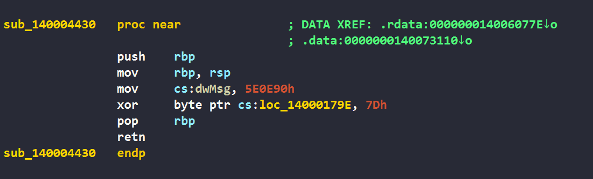

<!-- Solutions for some challenges in SEKAI CTF 2025 -->

<!--more-->
<style>
img {
    box-shadow: rgba(0, 0, 0, 0.35) 0px 5px 15px;
    border-radius: 6px;
    display: block; 
    margin-left: auto; 
    margin-right: auto;
}
</style>


## rev/Miku Music Machine (Hard) 


* **Description:** I've created the Miku Music Machine (MMM for short)! Just give it an input, and it will use coding and algorithms™ to generate a beautiful personalized tune based on your prompt. Can you compose a song that pleases Miku?
* **Note:** This challenge does not work on Wine.
* **Note:** The original version of this challenge (`miku-music-machine.exe`) relies on a specific Windows feature that was removed in most recent Windows versions. Running on these versions results in invalid flags being accepted by the binary. To avoid this issue, we've attached `mmm-v2.exe` which will work on all Windows versions. The flag is identical for both versions.
* **Author:** molenzwiebel
* **Given files:** [miku-music-machine.exe](https://2025.ctf.sekai.team/files/f26776cc0787577e3cf45b2bf31c322f/miku-music-machine.exe), [mmm-v2.exe](https://2025.ctf.sekai.team/files/e65a9f567a0e4df2ce5e03353654822a/mmm-v2.exe)


### Overview 

Đề bài cho một file PE64, thử chạy với một số input ngẫu nhiên, ta sẽ thấy được chương trình yêu cầu một input với độ dài hợp lệ. 

```Text
C:\Users\P\Downloads>mmm-v2.exe
Usage: mmm-v2.exe <prompt>

C:\Users\P\Downloads>mmm-v2.exe SEKAI{aaaaaaa}
You should work on the length of your prompt!
```

Phân tích file bởi IDA, ta thấy được luồng hoạt động không quá phức tạp. 


Chương trình thực hiện một số thao tác để kiểm tra tính chính xác của input. Cụ thể như sau: 
1. Kiểm tra độ dài input = 50. 
2. Mở MIDI (Musical Instrument Digital Interface). 
3. Xor từng ký tự với mảng `xor_values` cho trước, đồng thời tăng giá trị của biến `equal_418` lên. 
4. Tạo MIDI message dựa trên giá trị `equal_418` và gửi tới MIDI. 
5. Kiểm tra `equal_418` = 418 hay không. Nếu đúng sẽ in ra `That was beautiful!`. 

Sau một hồi quan sát, thứ làm mình chú ý tới nhất đó là `list_fn[v8]();`. Đây là một danh sách chứa các địa chỉ hàm khác nhau. 


### CFG/XFG

Đặt breakpoint ngay tại dòng `list_fn[v8]();` với input **SEKAI{aaaaaaaaaaaaaaaaaaaaaaaaaaaaaaaaaaaaaaaaaaa}**. Sau khi F9 để chương trình chạy liên tục, IDA đưa ra một thông báo lỗi  

```
7FFE06586490: unknown exception code C0000409 (exc.code c0000409, tid 19460)
```

Để biết chính xác tại sao bị lỗi này, mình đã chuyển qua code assembly ngay đoạn đặt breakpoint để tìm hiểu. Chương trình có call một hàm khá lạ `__guard_xfg_dispatch_icall_fptr`.  


Sau khi tìm kiếm trên Google, mình có đọc được một bài viết khá chi tiết nói về hàm này: 
- [https://connormcgarr.github.io/examining-xfg](https://connormcgarr.github.io/examining-xfg/)

Định nghĩa về **CFG** và **XFG** theo như mình tìm hiểu được như sau. Cả 2 đều có chức năng chống lại việc ghi đè function pointer trong Windows. 
- **CFG** hay còn được biết tới là **Control Flow Guard**. Khi một function pointer được gọi, cơ chế này sẽ kiểm tra xem địa chỉ được trỏ tới đã đăng ký ở trong bitmap hay chưa, nếu chưa sẽ ngăn chặn việc gọi hàm. Kỹ thuật này ngăn chặn được kỹ thuật ROP-chain nhưng vẫn không thể tránh được việc attacker ghi đè function pointer thành địa chỉ các hàm hệ thống nguy hiểm như: `VirtualProtect()`, `WriteProcessMemory()`, ...  
- **XFG** hay **Xtended Flow Guard** là phiên bản nâng cấp của CFG. Ngoài việc kiểm tra địa chỉ đã được đăng ký trong bitmap hay chưa, cơ chế này còn kiểm tra mã hash của một số thuộc tính như: số lượng parameter, kiểu dữ liệu của parmeter, kiểu dữ liệu trả về, ... Từ đó kẻ tấn công ngoài việc ghi đè function pointer còn phải thiết kế hàm sao cho trùng khớp với các thuộc tính đã nêu trên. 

Quay lại bài toán, ta thấy được tác giả đã sử dụng cơ chế bảo vệ XFG với `85F13E9656DA4870h` là mã hash để check. 

Câu hỏi được đặt ra là: Tại sao chương trình thông báo lỗi khi gặp XFG? 
1. Do hàm được gọi chưa được đăng ký trong bitmap? 
2. Do các thuộc tính của hàm gọi không trùng khớp với mã hash và gây crash? 

#### Checking the bitmap

Ở bài viết nêu trên, tác giả sử dụng công cụ [dumpbin.exe](https://github.com/Delphier/dumpbin) để extract ra bitmap. Kết quả thu được khá lớn, mình chỉ tập trung ở phần **Guard CF Function Table**, trong đó địa chỉ nào có dấu `X` là được bảo vệ bởi cơ chế XFG. 

```
C:\Users\P\Downloads\dumpbin-14.40.33811-x64>dumpbin.exe /LOADCONFIG mmm-v2.exe
Guard CF Function Table

    Address
    --------
    X 0000000140001010
    X 0000000140001050
    X 0000000140001070
    [...]
    X 0000000140004650
    X 00000001400046D0
    X 00000001400046F0
      00000001400049C0
      0000000140004C40
      0000000140004D00
    [...]
      0000000140014060
      0000000140015080
    X 0000000140015420
    X 0000000140015560
    [...]
    X 000000014005C840
    X 000000014005D270
    X 000000014005D310
      000000014005E440
      000000014005E5F0
```

Nhìn vào danh sách các địa chỉ các hàm của `list_fn` trong IDA.  


chúng ta có thể xác định được nhiệm vụ trước mắt phải làm: 
1. Rebase địa chỉ chương trình sao cho trùng khớp giữa IDA và bitmap. 
2. Kiểm tra các hàm nào đã được đăng ký cả trong IDA lẫn bitmap.

Nhìn ở bitmap, mình lấy `base_address` = 0x140000000 bởi vì: `min_address` = 0x140001010, `max_address` = 0x14005E5F0 dẫn tới giá trị sẽ là 0x140000000 + offset. 

Nhiệm vụ tiếp theo là xác định hàm nào trong `list_fn` đã được đăng ký bitmap. Mình viết một đoạn python script nhỏ để in các hàm đấy và index của nó. 

```python
ida_list_fn     = [0x1400025F0, 0x140001EF0, ..., 0x140003310, 0x140004110]
available_fn    = [0x140001010, 0x140001070, ..., 0x14005D270, 0x14005D310]
available_idx   = []

for i in range(len(ida_list_fn)): 
    if ida_list_fn[i] in available_fn: 
        available_idx.append(i)

print(available_idx)
# [22, 24, ..., 416, 418]
```

#### Checking signature

Sau khi xem qua các hàm trong `available_fn`, mình nhận ra có một số hàm hơi khác lạ. Ví dụ như hàm `sub_430()` có xuất hiện lệnh xor 0x7D với giá trị ở địa chỉ `loc_79E` thuộc hàm `sub_790()`. 



Hàm `sub_790()` là một hàm trong `available_fn` và có gọi tới `RtlFailFast()`. 


**Kết luận**: Khi hàm `sub_430()` được gọi thì hàm `sub_790()` sẽ được unlock.

Dựa vào keyword `0x7D`, mình tìm thêm được 5 hàm nữa có chức năng tương tự. 


Script để mình tìm index của các hàm như trên, đồng thời mình xóa bằng tay các index của unlocked function trong `available_idx`.

```python
map_fn = {
    0x140001570 : 0x1400014F0,
    0x140002970 : 0x1400023D0,
    0x140003650 : 0x140001410,
    0x140003F30 : 0x140002710,
    0x140004210 : 0x140002110,
    0x140004430 : 0x140001790
}

addr_to_index   = {addr: idx for idx, addr in enumerate(ida_list_fn)}
open_map_idx    = {addr_to_index[k]: addr_to_index[v] for k, v in map_fn.items()}
open_map_keys   = list(open_map_idx.keys())
open_map_values = list(open_map_idx.values())

print(open_map_idx)
# {187: 280, 368: 397, 153: 281, 383: 156, 235: 76, 26: 72}

# print(open_map_keys)
# print(open_map_values)

# updating available_idx
available_idx = [22, 24, 25, 26, 28, 29, 30, 31, 32, 33, 34, 35, 36, 37, 38, 39, 40, 43, 47, 55, 57, 59, 61, 64, 65, 66, 67, 68, 69, 70, 71, 74, 75, 78, 80, 82, 87, 93, 97, 99, 106, 107, 108, 110, 112, 114, 115, 116, 117, 118, 120, 121, 122, 123, 124, 131, 133, 139, 143, 148, 149, 150, 151, 152, 153, 154, 155, 157, 158, 159, 160, 161, 162, 164, 165, 166, 169, 179, 187, 190, 192, 194, 196, 197, 198, 199, 200, 201, 202, 204, 206, 208, 213, 215, 217, 219, 223, 225, 227, 229, 232, 234, 235, 236, 237, 238, 240, 241, 242, 244, 246, 247, 248, 249, 250, 253, 259, 267, 271, 274, 275, 276, 277, 278, 279, 282, 283, 284, 285, 286, 288, 290, 291, 292, 295, 299, 301, 303, 305, 307, 309, 311, 313, 316, 318, 319, 320, 322, 324, 326, 328, 330, 332, 334, 339, 341, 345, 349, 351, 355, 358, 359, 360, 362, 364, 365, 366, 367, 368, 370, 372, 373, 374, 376, 379, 381, 383, 387, 393, 395, 400, 402, 404, 405, 406, 408, 409, 410, 412, 413, 414, 416, 418]
```

### Solving the maze 

Kết hợp 2 dữ kiện ở trên, mình liên tưởng ngay đến bài toán maze cổ điển với quy tắc như sau: 
- Mỗi ký tự trong input sẽ được chia làm 4 phần, mỗi phần 2 bits tương ứng với di chuyển: lên, xuống, trái, phải. 
- Vị trí đi tới luôn bị thay đổi và phải đảm bảo nằm trong `available_idx`. 
- Có 6 vị trí khi tới đấy sẽ unlock được một vị trí khác. 

Tới đây đơn giản mình dùng thuật toán DFS để tìm ra các bước đi và tạo GIF để nhìn thấy quá trình của nó như sau 

```python
ida_list_fn     = [0x1400025F0, 0x140001EF0, 0x1400039B0, 0x140004090, 0x140002F70, 0x140003B70, 0x140002590, 0x140001210, 0x140002E70, 0x140004370, 0x140001E70, 0x140003A50, 0x140003D70, 0x1400033F0, 0x140002B50, 0x140003070, 0x140004250, 0x140003230, 0x1400013D0, 0x140002E30, 0x140002B10, 0x140001D50, 0x140001ED0, 0x140002190, 0x140001370, 0x1400016B0, 0x140004430, 0x140001770, 0x140004230, 0x140002530, 0x140002290, 0x140001710, 0x1400010B0, 0x1400015B0, 0x1400037D0, 0x140003290, 0x1400041B0, 0x140004270, 0x140001F70, 0x140003F70, 0x140003B10, 0x1400023B0, 0x1400034D0, 0x140003610, 0x1400018D0, 0x140004490, 0x140004450, 0x140003E70, 0x140003A70, 0x140001CD0, 0x140002D30, 0x1400020B0, 0x140003570, 0x140002DB0, 0x1400045F0, 0x140002EF0, 0x140003770, 0x140001910, 0x140002DD0, 0x1400029D0, 0x140002AD0, 0x140001F50, 0x140001A30, 0x140003D30, 0x140001DB0, 0x140003AD0, 0x140001B30, 0x1400017D0, 0x140002450, 0x140003FD0, 0x140002390, 0x140002350, 0x140001790, 0x1400013B0, 0x140003CD0, 0x140003030, 0x140002110, 0x140002770, 0x1400016D0, 0x1400019B0, 0x140003E10, 0x140001A90, 0x140003CF0, 0x1400017B0, 0x140002BB0, 0x140001F10, 0x140001890, 0x1400045D0, 0x140003C30, 0x1400011D0, 0x140001BD0, 0x140004510, 0x140001650, 0x140002150, 0x140003B50, 0x1400040D0, 0x140002830, 0x140004650, 0x1400012B0, 0x140003AB0, 0x140002C30, 0x1400019D0, 0x140003BB0, 0x140002B90, 0x140002370, 0x140003930, 0x140003810, 0x1400042F0, 0x140002F50, 0x140003250, 0x1400015F0, 0x140002630, 0x1400024D0, 0x140001830, 0x140003BD0, 0x1400046F0, 0x140002AF0, 0x140001C70, 0x140003710, 0x140002C70, 0x1400042D0, 0x140004010, 0x1400019F0, 0x140003050, 0x140002410, 0x140001DD0, 0x1400046B0, 0x140002230, 0x140004710, 0x140003DF0, 0x140001450, 0x140004070, 0x140003730, 0x140001090, 0x140003ED0, 0x140002670, 0x140003DB0, 0x1400016F0, 0x140003350, 0x1400034B0, 0x140004570, 0x140002CF0, 0x140003870, 0x140001B10, 0x1400032B0, 0x140002F30, 0x140001310, 0x140003D10, 0x140003850, 0x140003430, 0x140001430, 0x140001010, 0x1400042B0, 0x140003650, 0x140002850, 0x1400022F0, 0x140002710, 0x140003F10, 0x1400014D0, 0x140004590, 0x140003E90, 0x140001810, 0x140003E50, 0x140003EB0, 0x140001AF0, 0x140002270, 0x140002430, 0x140004130, 0x140003E30, 0x1400039D0, 0x140001970, 0x140001870, 0x140001290, 0x140002130, 0x1400035F0, 0x140003C90, 0x140002BD0, 0x140003550, 0x1400033D0, 0x140001FF0, 0x140002A30, 0x140002330, 0x1400010D0, 0x140001190, 0x140001530, 0x1400015D0, 0x140002810, 0x140001570, 0x1400043B0, 0x140002B30, 0x140002F10, 0x140001670, 0x140001CB0, 0x140002930, 0x1400040B0, 0x1400045B0, 0x140001730, 0x140002210, 0x1400017F0, 0x1400032F0, 0x1400046D0, 0x140001390, 0x1400039F0, 0x140002550, 0x140003590, 0x1400035D0, 0x1400026D0, 0x1400022B0, 0x140001FD0, 0x140003CB0, 0x140003A10, 0x1400041F0, 0x1400033B0, 0x140003A30, 0x140002910, 0x1400024B0, 0x140003A90, 0x1400021B0, 0x1400024F0, 0x1400041D0, 0x140004330, 0x1400034F0, 0x1400038D0, 0x140001630, 0x140001590, 0x140002DF0, 0x140003530, 0x140002C90, 0x140001F30, 0x140002A10, 0x1400023F0, 0x1400044D0, 0x140002AB0, 0x140003130, 0x140003DD0, 0x140004210, 0x140001510, 0x1400011B0, 0x140002030, 0x1400030B0, 0x140003470, 0x140002ED0, 0x1400040F0, 0x140003910, 0x1400011F0, 0x140002170, 0x1400012D0, 0x140002FF0, 0x140003C70, 0x140002090, 0x140003FF0, 0x1400018B0, 0x140002CB0, 0x140002C50, 0x140001550, 0x140003B90, 0x1400043F0, 0x140001D10, 0x140001D90, 0x140004170, 0x140003690, 0x140003510, 0x140003890, 0x140002A50, 0x140003370, 0x1400012F0, 0x1400037B0, 0x1400013F0, 0x140001C90, 0x1400028F0, 0x140002D10, 0x140004390, 0x140001DF0, 0x140001150, 0x140003AF0, 0x140002490, 0x1400043D0, 0x140003090, 0x140001470, 0x140003110, 0x1400014F0, 0x140001410, 0x140003EF0, 0x140004290, 0x140002050, 0x1400018F0, 0x140003270, 0x140002470, 0x140002610, 0x140003F90, 0x1400037F0, 0x140004310, 0x140004630, 0x140001270, 0x140002C10, 0x140002A90, 0x1400038B0, 0x140001AB0, 0x140001230, 0x140002F90, 0x140001C10, 0x140002250, 0x1400030F0, 0x1400036B0, 0x140002750, 0x140003210, 0x140001690, 0x140001BF0, 0x1400036F0, 0x1400028D0, 0x140004030, 0x140002A70, 0x1400021D0, 0x1400029F0, 0x140002870, 0x140002E10, 0x140003330, 0x1400031F0, 0x140001E50, 0x140003C10, 0x140001A50, 0x140001A70, 0x1400028B0, 0x140001B70, 0x1400025B0, 0x1400029B0, 0x140001990, 0x140003FB0, 0x140003670, 0x140001130, 0x140002010, 0x1400030D0, 0x140001F90, 0x140004690, 0x140001CF0, 0x140004190, 0x140004530, 0x140001E30, 0x1400027D0, 0x1400044F0, 0x1400025D0, 0x140001D70, 0x1400022D0, 0x140001950, 0x1400021F0, 0x140004410, 0x140003170, 0x140004670, 0x140001C50, 0x140002730, 0x140002B70, 0x1400020F0, 0x140003750, 0x140002FD0, 0x140001E90, 0x140003150, 0x1400038F0, 0x140002D70, 0x140001BB0, 0x140003410, 0x140002CD0, 0x1400026F0, 0x140002D90, 0x140001B50, 0x140002EB0, 0x1400032D0, 0x140002790, 0x140002070, 0x140002970, 0x140001850, 0x140001170, 0x140002950, 0x140001610, 0x140003490, 0x140004610, 0x140004470, 0x140001EB0, 0x140003830, 0x1400020D0, 0x140002BF0, 0x140002E50, 0x140003C50, 0x140004150, 0x140003F30, 0x140001350, 0x140001D30, 0x1400035B0, 0x1400027F0, 0x140003D90, 0x140004550, 0x140002FB0, 0x140003990, 0x140004050, 0x140002690, 0x140001930, 0x140002650, 0x140002990, 0x1400023D0, 0x1400044B0, 0x140001E10, 0x140002E90, 0x140001FB0, 0x140001250, 0x140003D50, 0x140001110, 0x140003970, 0x140001050, 0x140001A10, 0x140003450, 0x140001070, 0x140002570, 0x1400026B0, 0x1400031B0, 0x1400036D0, 0x140003190, 0x140001B90, 0x140003B30, 0x140002D50, 0x140001490, 0x140001750, 0x140001330, 0x140001C30, 0x140003790, 0x140002890, 0x140001AD0, 0x1400031D0, 0x1400014B0, 0x140003BF0, 0x140002310, 0x1400027B0, 0x140002510, 0x1400010F0, 0x140004350, 0x140003F50, 0x140003390, 0x140001030, 0x140003010, 0x140003630, 0x140003950, 0x140003310, 0x140004110]
available_fn    = [0x140001010, 0x140001070, 0x140001090, 0x1400010B0, 0x140001110, 0x140001170, 0x140001050, 0x1400011B0, 0x1400011F0, 0x140001250, 0x1400012D0, 0x140001370, 0x140001390, 0x1400013F0, 0x140001410, 0x140001430, 0x140001470, 0x140001490, 0x1400014D0, 0x1400014F0, 0x140001510, 0x140001570, 0x1400015B0, 0x1400015F0, 0x140001610, 0x140001630, 0x1400016B0, 0x1400016D0, 0x140001710, 0x140001730, 0x140001790, 0x1400017D0, 0x1400017F0, 0x140001810, 0x1400018F0, 0x140001910, 0x140001990, 0x1400019F0, 0x140001A50, 0x140001AF0, 0x140001B10, 0x140001B30, 0x140001BB0, 0x140001BF0, 0x140001C70, 0x140001CB0, 0x140001CF0, 0x140001D70, 0x140001DB0, 0x140001E50, 0x140001EB0, 0x140001ED0, 0x140001F50, 0x140001F70, 0x140001F90, 0x140001FD0, 0x140001FF0, 0x140002010, 0x140002030, 0x140002050, 0x140002070, 0x140002090, 0x1400020F0, 0x140002110, 0x140002150, 0x1400021B0, 0x140002210, 0x140002250, 0x140002270, 0x140002290, 0x1400022F0, 0x140002350, 0x140002390, 0x1400023D0, 0x140002410, 0x140002430, 0x140002450, 0x140002490, 0x1400024B0, 0x1400024D0, 0x140002530, 0x140002570, 0x1400025B0, 0x140002610, 0x140002650, 0x140002690, 0x1400026D0, 0x140002710, 0x140002730, 0x140002790, 0x1400027F0, 0x140002850, 0x1400028B0, 0x1400028D0, 0x140002970, 0x1400029D0, 0x1400029F0, 0x140002A10, 0x140002A70, 0x140002A90, 0x140002AB0, 0x140002AF0, 0x140002BF0, 0x140002C50, 0x140002C90, 0x140002CD0, 0x140002D90, 0x140002DF0, 0x140002E90, 0x140002EB0, 0x140002ED0, 0x140002EF0, 0x140002F10, 0x140002F50, 0x140002F90, 0x140002FF0, 0x140003030, 0x140003050, 0x140003090, 0x140003110, 0x140003150, 0x140003190, 0x1400031B0, 0x140003210, 0x140003270, 0x140003290, 0x1400032D0, 0x1400032F0, 0x140003330, 0x140003410, 0x140003430, 0x140003450, 0x140003470, 0x140003490, 0x1400034B0, 0x140003590, 0x140003610, 0x140003650, 0x140003670, 0x1400036B0, 0x1400036D0, 0x140003710, 0x1400037D0, 0x1400037F0, 0x140003810, 0x140003850, 0x140003970, 0x1400039D0, 0x1400039F0, 0x140003A30, 0x140003AB0, 0x140003AD0, 0x140003AF0, 0x140003B10, 0x140003B30, 0x140003BD0, 0x140003C10, 0x140003C50, 0x140003C70, 0x140003CD0, 0x140003CF0, 0x140003DD0, 0x140003E10, 0x140003E50, 0x140003E70, 0x140003E90, 0x140003EF0, 0x140003F10, 0x140003F30, 0x140003F70, 0x140003FD0, 0x140003FF0, 0x140004010, 0x140004070, 0x1400040B0, 0x1400040F0, 0x140004170, 0x1400041B0, 0x1400041D0, 0x140004210, 0x140004230, 0x140004270, 0x140004290, 0x1400042B0, 0x1400042D0, 0x1400042F0, 0x140004310, 0x140004390, 0x1400043D0, 0x140004410, 0x140004430, 0x1400044F0, 0x140004590, 0x1400045D0, 0x140004610, 0x140004630, 0x140004650, 0x1400046D0, 0x1400046F0, 0x140015420, 0x140015560, 0x14003ADA0, 0x14003ADD0, 0x14003AE90, 0x14003B830, 0x14003D7E0, 0x14003D800, 0x14003D830, 0x14003D840, 0x14003D850, 0x14003D870, 0x14003D880, 0x14003D890, 0x14003D8E0, 0x14003D8F0, 0x14003D940, 0x14003D9B0, 0x14003DCB0, 0x140040BC0, 0x140042670, 0x140042780, 0x140043280, 0x1400432D0, 0x140046650, 0x140046E80, 0x140046ED0, 0x140047630, 0x140047650, 0x14004A040, 0x14004B760, 0x14004B7D0, 0x14004C1C0, 0x14004C360, 0x14004CB30, 0x14004D100, 0x14004D9D0, 0x14004E570, 0x14004E860, 0x14004EE10, 0x14004F120, 0x14004F370, 0x14004FA40, 0x14004FA70, 0x14004FD90, 0x140057710, 0x14005C840, 0x14005D270, 0x14005D310]
xor_values      = [0x09, 0x40, 0x11, 0xE4, 0x1C, 0x81, 0x92, 0xDB, 0x0B, 0x75, 0x26, 0x6A, 0x2F, 0x7F, 0xDD, 0xD2, 0x52, 0x21, 0x76, 0x9F, 0xDF, 0x8E, 0x8F, 0xCD, 0x9F, 0x84, 0x61, 0x3F, 0x6D, 0x7A, 0x87, 0x1E, 0x21, 0x99, 0xC7, 0x65, 0xDC, 0xC8, 0x4A, 0x22, 0x7D, 0x28, 0x64, 0x69, 0xDC, 0x20, 0x34, 0xED, 0xFB, 0xD7]
available_idx   = []

map_fn = {
    0x140001570 : 0x1400014F0,
    0x140002970 : 0x1400023D0,
    0x140003650 : 0x140001410,
    0x140003F30 : 0x140002710,
    0x140004210 : 0x140002110,
    0x140004430 : 0x140001790
}

for i in range(len(ida_list_fn)): 
    if ida_list_fn[i] in available_fn: 
        available_idx.append(i)

# print(available_idx)
# [22, 24, 25, 26, 28, 29, 30, 31, 32, 33, 34, 35, 36, 37, 38, 39, 40, 43, 47, 55, 57, 59, 61, 64, 65, 66, 67, 68, 69, 70, 71, 72, 74, 75, 76, 78, 80, 82, 87, 93, 97, 99, 106, 107, 108, 110, 112, 114, 115, 116, 117, 118, 120, 121, 122, 123, 124, 131, 133, 139, 143, 148, 149, 150, 151, 152, 153, 154, 155, 156, 157, 158, 159, 160, 161, 162, 164, 165, 166, 169, 179, 187, 190, 192, 194, 196, 197, 198, 199, 200, 201, 202, 204, 206, 208, 213, 215, 217, 219, 223, 225, 227, 229, 232, 234, 235, 236, 237, 238, 240, 241, 242, 244, 246, 247, 248, 249, 250, 253, 259, 267, 271, 274, 275, 276, 277, 278, 279, 280, 281, 282, 283, 284, 285, 286, 288, 290, 291, 292, 295, 299, 301, 303, 305, 307, 309, 311, 313, 316, 318, 319, 320, 322, 324, 326, 328, 330, 332, 334, 339, 341, 345, 349, 351, 355, 358, 359, 360, 362, 364, 365, 366, 367, 368, 370, 372, 373, 374, 376, 379, 381, 383, 387, 393, 395, 397, 400, 402, 404, 405, 406, 408, 409, 410, 412, 413, 414, 416, 418]

addr_to_index   = {addr: idx for idx, addr in enumerate(ida_list_fn)}
open_map_idx    = {addr_to_index[k]: addr_to_index[v] for k, v in map_fn.items()}
open_map_keys   = list(open_map_idx.keys())
open_map_values = list(open_map_idx.values())

# print(open_map_idx)
# {187: 280, 368: 397, 153: 281, 383: 156, 235: 76, 26: 72}

# print(open_map_keys)
# print(open_map_values)

# updating available_idx
available_idx = [22, 24, 25, 26, 28, 29, 30, 31, 32, 33, 34, 35, 36, 37, 38, 39, 40, 43, 47, 55, 57, 59, 61, 64, 65, 66, 67, 68, 69, 70, 71, 74, 75, 78, 80, 82, 87, 93, 97, 99, 106, 107, 108, 110, 112, 114, 115, 116, 117, 118, 120, 121, 122, 123, 124, 131, 133, 139, 143, 148, 149, 150, 151, 152, 153, 154, 155, 157, 158, 159, 160, 161, 162, 164, 165, 166, 169, 179, 187, 190, 192, 194, 196, 197, 198, 199, 200, 201, 202, 204, 206, 208, 213, 215, 217, 219, 223, 225, 227, 229, 232, 234, 235, 236, 237, 238, 240, 241, 242, 244, 246, 247, 248, 249, 250, 253, 259, 267, 271, 274, 275, 276, 277, 278, 279, 282, 283, 284, 285, 286, 288, 290, 291, 292, 295, 299, 301, 303, 305, 307, 309, 311, 313, 316, 318, 319, 320, 322, 324, 326, 328, 330, 332, 334, 339, 341, 345, 349, 351, 355, 358, 359, 360, 362, 364, 365, 366, 367, 368, 370, 372, 373, 374, 376, 379, 381, 383, 387, 393, 395, 400, 402, 404, 405, 406, 408, 409, 410, 412, 413, 414, 416, 418]

current_pos = 22
end_pos     = 418
list_move   = []

def get_xor_value(value): 
    if value == 21: 
        return 2
    if value == -21:
        return 0 
    if value == 1: 
        return 1
    if value == -1: 
        return 3

def calc_flag(): 
    flag = ""
    for i in range(len(list_move) // 4): 
        char = 0
        for j in range(4):
            xor_value = get_xor_value(list_move[i * 4 + j])
            char |= xor_value << (j * 2) 
        char ^= xor_values[i]
        flag += chr(char) 
    print("Flag =", flag)

def print_maze():
    RED = '\033[91m'      # P - Player (Red)
    GREEN = '\033[92m'    # E - End (Green)
    YELLOW = '\033[93m'   # K - Key (Yellow)
    BLUE = '\033[94m'     # V - Door/Value (Blue)
    RESET = '\033[0m'     # Reset color
    
    for i in range(21):
        for j in range(21): 
            pos = i * 21 + j
            if pos == current_pos: 
                print(f"{RED}P{RESET}", end="")
            elif pos == end_pos:
                print(f"{GREEN}E{RESET}", end="")
            elif pos in open_map_keys: 
                print(f"{YELLOW}K{RESET}", end="")
            elif pos in open_map_values: 
                print(f"{BLUE}V{RESET}", end="")
            elif pos in available_idx:
                print(" ", end="")
            else:
                print("\u2588", end="")
        print()

def move(): 
    print("Please enter: w (up) | a (left) | s (down) | d (right)")
    inp = input("> ").strip().lower() 

    if inp == 'w': 
        return -21
    elif inp == 's':
        return 21 
    elif inp == 'a': 
        return -1
    else:
        return 1

def dfs_solve_maze_with_animation():
    global current_pos, list_move, available_idx, open_map_keys, open_map_values
    
    from PIL import Image, ImageDraw, ImageFont
    import os
    
    if not os.path.exists('frames'):
        os.makedirs('frames')
    
    for file in os.listdir('frames'):
        if file.endswith('.png'):
            os.remove(os.path.join('frames', file))
    
    initial_state = (current_pos, [], available_idx.copy(), open_map_keys.copy(), open_map_values.copy())
    stack = [initial_state]
    visited = set()
    
    step_count = 0
    frame_count = 0
    max_steps = 10000 
    
    create_maze_frame(frame_count, current_pos, available_idx, open_map_keys, open_map_values, [], "Initial State")
    frame_count += 1
    
    while stack and step_count < max_steps:
        step_count += 1
        pos, moves, available, keys, values = stack.pop()
        
        state_key = (pos, tuple(sorted(keys)), tuple(sorted(values)))
        if state_key in visited:
            continue
        visited.add(state_key)
        
        if step_count % 10 == 0 or pos in open_map_keys or pos == end_pos:
            create_maze_frame(frame_count, pos, available, keys, values, moves, f"Step {step_count}")
            frame_count += 1
        
        if pos == end_pos:
            list_move = moves
            create_maze_frame(frame_count, pos, available, keys, values, moves, "SOLUTION FOUND!")
            frame_count += 1
            break
        
        directions = [(-21, 'w'), (21, 's'), (-1, 'a'), (1, 'd')]
        
        for direction, direction_name in directions:
            new_pos = pos + direction
            
            if new_pos < 0 or new_pos >= 21 * 21 or new_pos not in available:
                continue
            
            new_available = available.copy()
            new_keys = keys.copy()
            new_values = values.copy()
            new_moves = moves + [direction]
            
            if new_pos in new_keys:
                key_idx = new_keys.index(new_pos)
                door_pos = new_values[key_idx]
                new_available.append(door_pos)
                
                del new_keys[key_idx]
                del new_values[key_idx]
            
            stack.append((new_pos, new_moves, new_available, new_keys, new_values))
    
    create_gif_from_frames(frame_count)
    print(f"Animation created with {frame_count} frames!")
    return True

def create_maze_frame(frame_num, current_pos, available, keys, values, moves, title):
    from PIL import Image, ImageDraw, ImageFont
    
    cell_size = 20
    width = 21 * cell_size + 200  # Thêm không gian cho text
    height = 21 * cell_size + 100
    
    img = Image.new('RGB', (width, height), 'white')
    draw = ImageDraw.Draw(img)
    
    colors = {
        'wall': (0, 0, 0),      # Đen
        'path': (255, 255, 255), # Trắng
        'player': (255, 0, 0),   # Đỏ
        'end': (0, 255, 0),      # Xanh lá
        'key': (255, 255, 0),    # Vàng
        'door': (0, 0, 255),     # Xanh dương
        'visited': (200, 200, 200) # Xám nhạt
    }
    
    for i in range(21):
        for j in range(21):
            pos = i * 21 + j
            x1 = j * cell_size
            y1 = i * cell_size
            x2 = x1 + cell_size
            y2 = y1 + cell_size
            
            if pos == current_pos:
                color = colors['player']
                draw.rectangle([x1, y1, x2, y2], fill=color)
                draw.text((x1 + 5, y1 + 5), 'P', fill='white')
            elif pos == 418:  # end_pos
                color = colors['end']
                draw.rectangle([x1, y1, x2, y2], fill=color)
                draw.text((x1 + 5, y1 + 5), 'E', fill='white')
            elif pos in keys:
                color = colors['key']
                draw.rectangle([x1, y1, x2, y2], fill=color)
                draw.text((x1 + 5, y1 + 5), 'K', fill='black')
            elif pos in values:
                color = colors['door']
                draw.rectangle([x1, y1, x2, y2], fill=color)
                draw.text((x1 + 5, y1 + 5), 'V', fill='white')
            elif pos in available:
                color = colors['path']
                draw.rectangle([x1, y1, x2, y2], fill=color)
            else:
                color = colors['wall']
                draw.rectangle([x1, y1, x2, y2], fill=color)
    
    if moves:
        for i, move in enumerate(moves):
            if i == 0:
                pos = 22  # start position
            else:
                pos += moves[i-1]
            
            row = pos // 21
            col = pos % 21
            x1 = col * cell_size + 2
            y1 = row * cell_size + 2
            x2 = x1 + cell_size - 4
            y2 = y1 + cell_size - 4
            
            draw.rectangle([x1, y1, x2, y2], fill=(255, 100, 100), outline=(255, 0, 0))
    
    try:
        font = ImageFont.truetype("/usr/share/fonts/truetype/dejavu/DejaVuSans-Bold.ttf", 16)
    except:
        font = ImageFont.load_default()
    
    draw.text((21 * cell_size + 10, 10), title, fill='black', font=font)
    
    info_y = 40
    draw.text((21 * cell_size + 10, info_y), f"Position: {current_pos}", fill='black', font=font)
    draw.text((21 * cell_size + 10, info_y + 20), f"Moves: {len(moves)}", fill='black', font=font)
    draw.text((21 * cell_size + 10, info_y + 40), f"Keys left: {len(keys)}", fill='black', font=font)
    draw.text((21 * cell_size + 10, info_y + 60), f"Doors open: {len(values)}", fill='black', font=font)
    
    legend_y = info_y + 100
    draw.text((21 * cell_size + 10, legend_y), "Legend:", fill='black', font=font)
    draw.rectangle([21 * cell_size + 10, legend_y + 20, 21 * cell_size + 30, legend_y + 40], fill=colors['player'])
    draw.text((21 * cell_size + 35, legend_y + 25), "P - Player", fill='black', font=font)
    
    draw.rectangle([21 * cell_size + 10, legend_y + 45, 21 * cell_size + 30, legend_y + 65], fill=colors['end'])
    draw.text((21 * cell_size + 35, legend_y + 50), "E - End", fill='black', font=font)
    
    draw.rectangle([21 * cell_size + 10, legend_y + 70, 21 * cell_size + 30, legend_y + 90], fill=colors['key'])
    draw.text((21 * cell_size + 35, legend_y + 75), "K - Key", fill='black', font=font)
    
    draw.rectangle([21 * cell_size + 10, legend_y + 95, 21 * cell_size + 30, legend_y + 115], fill=colors['door'])
    draw.text((21 * cell_size + 35, legend_y + 100), "V - Door", fill='black', font=font)
    
    img.save(f'frames/frame_{frame_num:04d}.png')

def create_gif_from_frames(frame_count):
    from PIL import Image
    
    frames = []
    for i in range(frame_count):
        try:
            frame = Image.open(f'frames/frame_{i:04d}.png')
            frames.append(frame)
        except:
            continue
    
    if frames:
        frames[0].save('dfs_animation.gif', 
                      save_all=True, 
                      append_images=frames[1:], 
                      duration=500, 
                      loop=0)
        print("GIF saved as 'dfs_animation.gif'")

def dfs_solve_maze():
    global current_pos, list_move, available_idx, open_map_keys, open_map_values
    
    initial_state = (current_pos, [], available_idx.copy(), open_map_keys.copy(), open_map_values.copy())
    stack = [initial_state]
    visited = set()
    
    step_count = 0
    max_steps = 10000 
    
    while stack and step_count < max_steps:
        step_count += 1
        pos, moves, available, keys, values = stack.pop()
        
        state_key = (pos, tuple(sorted(keys)), tuple(sorted(values)))
        if state_key in visited:
            continue
        visited.add(state_key)
        
        if pos == end_pos:
            list_move = moves
            return True
        
        directions = [(-21, 'w'), (21, 's'), (-1, 'a'), (1, 'd')]
        
        for direction, direction_name in directions:
            new_pos = pos + direction
            
            if new_pos < 0 or new_pos >= 21 * 21 or new_pos not in available:
                continue
            
            new_available = available.copy()
            new_keys = keys.copy()
            new_values = values.copy()
            new_moves = moves + [direction]
            
            if new_pos in new_keys:
                key_idx = new_keys.index(new_pos)
                door_pos = new_values[key_idx]
                new_available.append(door_pos)
                
                del new_keys[key_idx]
                del new_values[key_idx]
            
            stack.append((new_pos, new_moves, new_available, new_keys, new_values))
    
    print(f"No solution found after {step_count} steps!")
    return False

create_animation = True

if create_animation:
    if dfs_solve_maze_with_animation():
        print_maze()
        calc_flag()
else:
    if dfs_solve_maze():
        print_maze()
        calc_flag()
```

Flag thu được là: **SEKAI{https://www.youtube.com/watch?v=J---aiyznGQ}**


## rev/What in Ternation (Expert)