Việt Nam Vô Địch - Tôi Yêu Việt Nam :heart:

<!--more-->

## Happy New Year 2025 - Vietnam dominates AFF Cup 2024

Vào những ngày đầu xuân năm mới 2025 dương lịch, mình và toàn thể nhân dân đất nước Việt Nam đã được sống và hòa mình trong những giây phút hạnh phúc nhất của cuộc đời. Sau 6 năm chờ đợi, cuối cùng Việt Nam cũng đã nâng cao chiếc cúp AFF, tất cả người dân cả người đã có một đêm không ngủ để cùng nhau ra đường, vô vang khẩu hiệu "Việt Nam Vô Địch".  

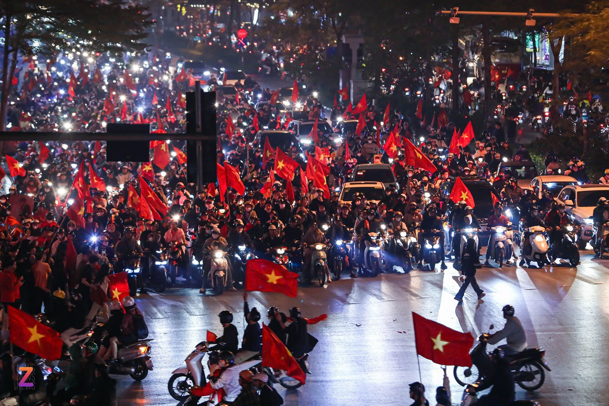

<!--  -->

    <figure style="display: inline-block; text-align: center;">
        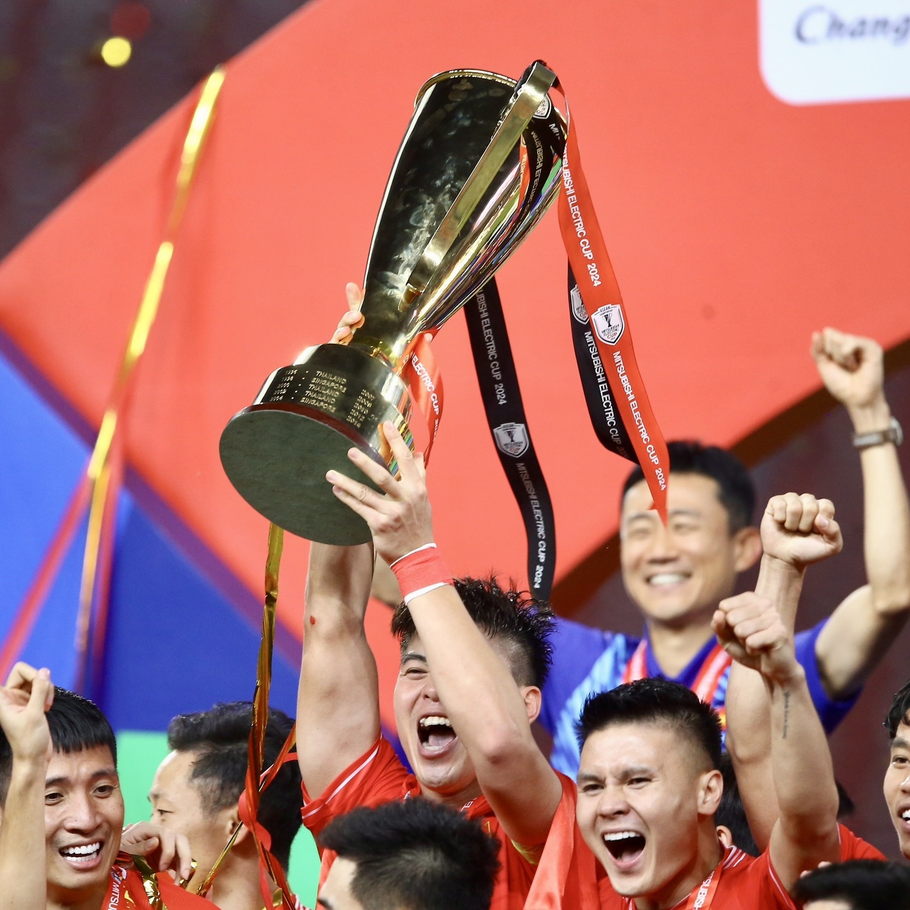
        <figcaption>Chiếc cúp vàng đã về Việt Nam</figcaption>
    </figure>

<!--  -->

Mình xem bóng đá lần đầu tiên là khoảng năm 2011, lúc đó giải V.League đang rất nóng, đặc biệt là những trận cầu của SLNA với một vài đối thủ như Hải Phòng, Hà Nội T&T, Thanh Hóa. Mình thường xem bóng cùng với bố hoặc bác trai vào những buổi chiều đi học về, dần dần tình yêu dành cho trái bóng ngày càng lớn. Tình cảm dành cho bóng đá đã nuôi dưỡng cho tâm hồn mình, cho mình những kỉ niệm vô cùng đẹp thời thơ ấu. 
Và cũng kể từ đó, đây là lần đầu tiên mình được thấy Đội tuyển Quốc gia Việt Nam đánh bại Thái Lan cả lượt đi lẫn lượt về. 

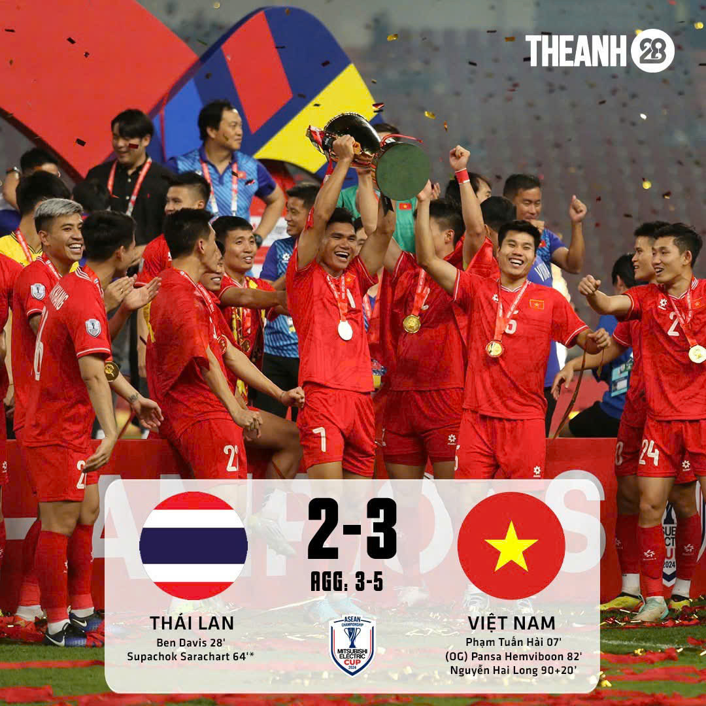

<!--  -->

Chiến thắng của Việt Nam ở giải đấu năm nay mang dấu ấn rất lớn của tiền đạo nhập tịch người Brazil Nguyễn Xuân Son. 

    <figure style="display: inline-block; text-align: center;">
        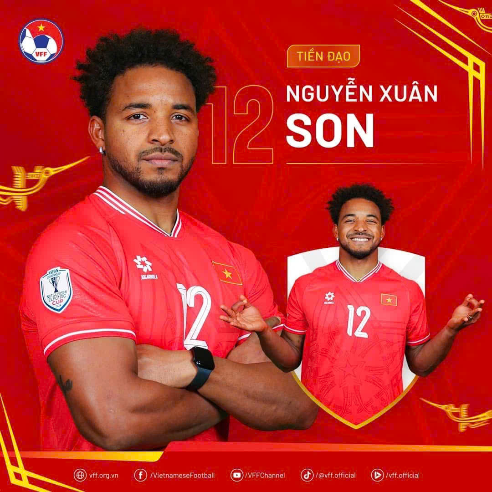
        <figcaption>Chiến binh Nguyễn Xuân Son</figcaption>
    </figure>

<!--  -->

Thật đáng tiếc khi anh đã dính chấn thương đứt dây chằng trong trận chung kết. Việt Nam đã mất đi một trụ cột rất quan trọng trong đội hình nhưng đó cũng là lời minh chứng cho sức mạnh đội tuyển khi không có sự xuất hiện của Xuân Son trên sân. 

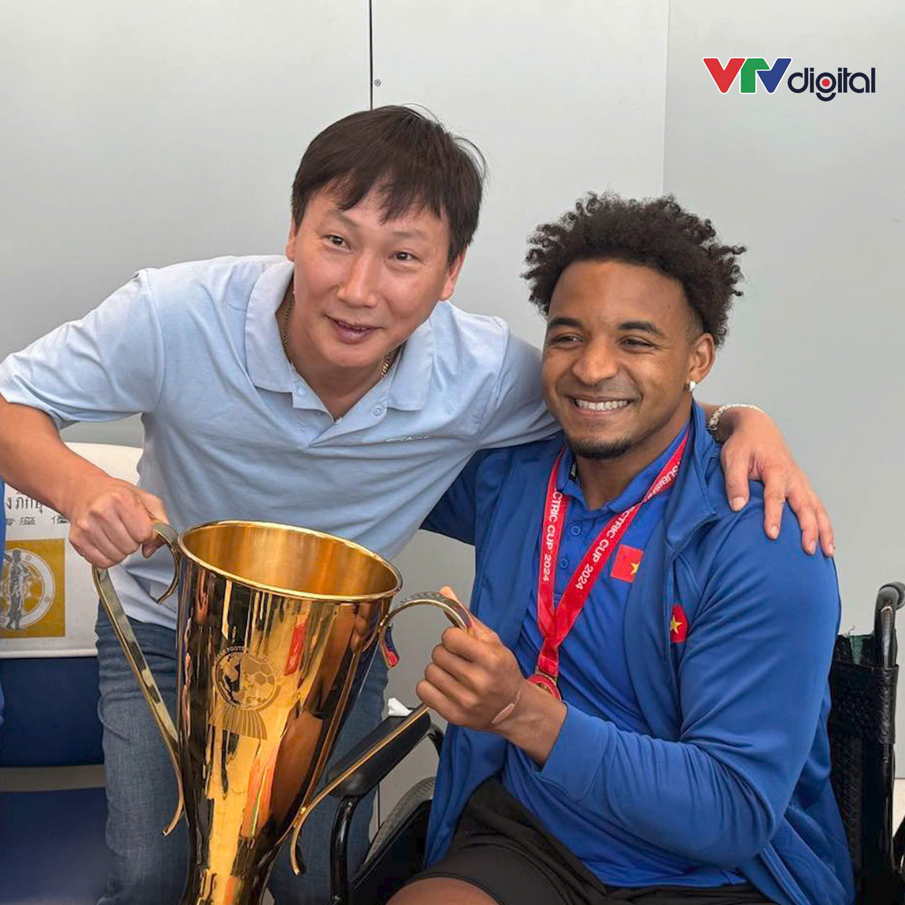

Quay về khoảng chục năm đổ lại, nếu không có drama của Phan Văn Santos và Việt Nam cởi mở hơn với việc gọi cầu thủ nhập tịch lên tuyển thì mình nghĩ Việt Nam sẽ có rất nhiều chiến thắng quan trọng trong quá khứ chứ không phải đợi tới bây giờ. Những cầu thủ Đinh Hoàng Max, Nguyễn Van Bakel, Hoàng Vũ Samson đủ chất lượng để có thể tạo nên được sự khác biệt. 

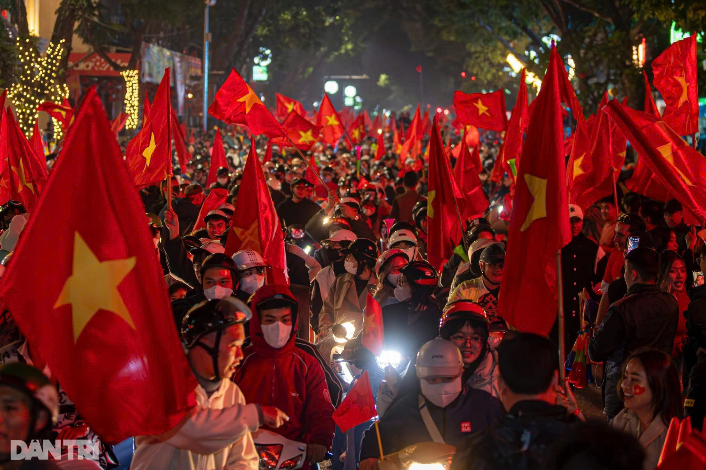

Theo quan điểm cá nhân của mình, ý kiến "Người Việt Nam có một tình yêu bóng đá mãnh liệt" là chưa thực sự đúng đắn. Dẫn chứng có thể dễ dàng nhìn thấy đó là số lượng khán giả tham gia những trận đấu ở VLeague chỉ ở mức trung bình hay ở vòng loại thứ 3 World Cup, Việt Nam phải đụng độ với các ông kẹ bóng đá châu Á và thường xuyên phải nhận thất bại. Người hâm mộ đã tỏ ra chán nản và nhiều người đã quay lưng lại với đội tuyển chúng ta. Từ đó mới thấy được rằng, quan điểm của thầy Park Hang Seo về bóng đá Việt Nam là có phần hợp lý và sâu sắc: "Người Việt Nam chỉ yêu thích bóng đá chiến thắng mà thôi".  

<!-- 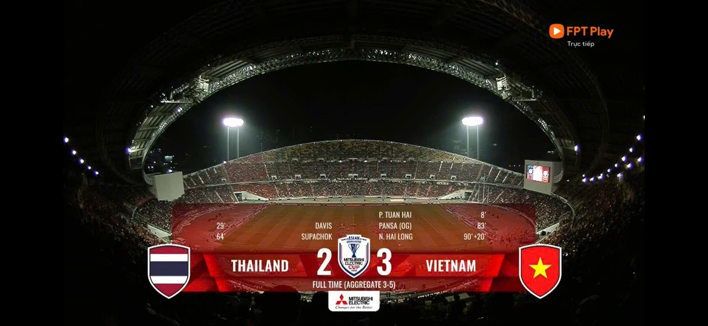 -->

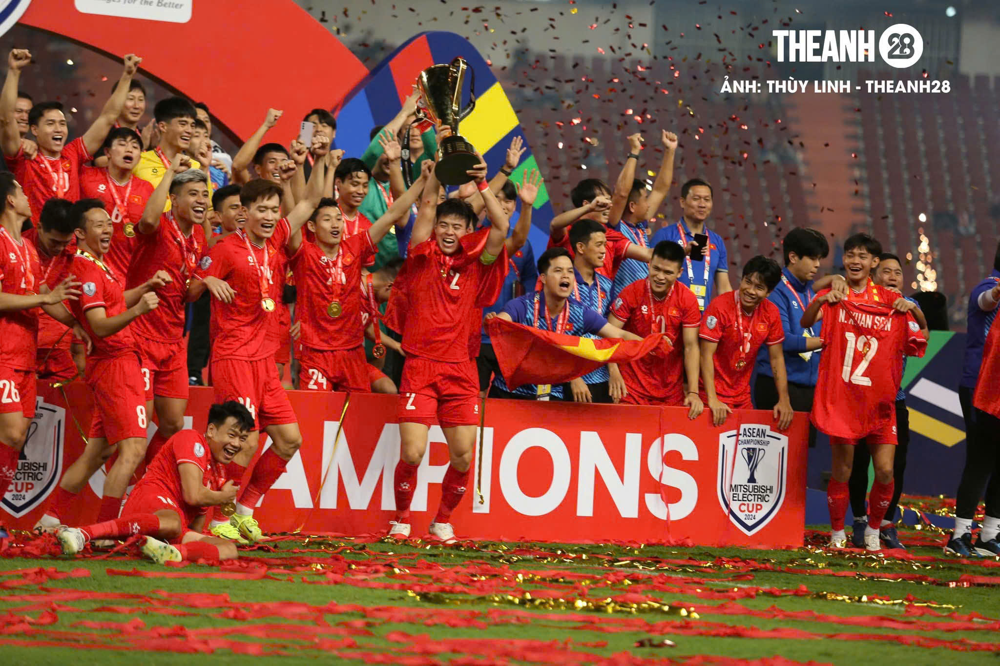

Nhìn sang đối thủ đáng gờm của chúng ta - Thái Lan, ta sẽ thấy họ đã bài bản như thế nào trong công việc đào tạo trẻ, phát triển giải quốc nội Thái League. Mình có xem một vài video về câu lạc bộ Buriram United, thực sự mà nói, chúng ta đang thua kém họ khá nhiều về cả việc đào tạo, đầu tư sân bãi, ... Mình hy vọng rằng, chính phủ Việt Nam, các đại gia trong và ngoài nước hãy rót thêm tiền vào việc đào tạo trẻ, nâng cấp sân bãi để Việt Nam có thể sản sinh ra được nhiều tầng lớp tài năng kế cận. Việc thưởng tiền, thưởng nhà lầu, ô tô cho các cầu thủ lập thành tích tốt không có gì là sai phạm, nhưng thử nghĩ lại khi những cầu thủ đã đầy đủ của cải, vật chất, nếu như không có một tinh thần thép "vượt sướng" thì thử hỏi những chiến binh có còn động lực để thi đấu nữa không. 

Nhìn về lò đào tạo trẻ SLNA, ở Nghệ An không thiếu những tài năng trẻ, minh chứng có thể thấy khi họ áp đảo các giải trẻ như U11, U13, U17, ... nhưng càng lên cao thì phong độ càng thụt lùi. Mình nghĩ đơn giản vì Nghệ An nghèo, họ thiếu ăn, thiếu mặc nên ý chí và quyết tâm rất lớn. Nhưng đến khi đã có một chân trên tuyển, đã có được tiền và chút danh tiếng thì ý chí đó lại bị phai mờ dần dẫn tới sự sa sút trong sự nghiệp. 

Trích một đoạn bình luận của thầy Nguyễn Hữu Việt Hưng: 

"Ai cũng biết doanh nghiệp đổ tiền vào bóng đá, nói cho cùng, cũng là để đánh bóng tên tuổi doanh nghiệp. Nhưng làm gì cũng phải có cách. Nếu bóng đã không lên thì nó không thể giúp doanh nghiệp đánh bóng tên tuổi được. Vì thế, các đại gia bỏ tiền vài trăm triệu, thậm chí vài tỷ, để thưởng một trận cầu hay, thì chỉ làm hư bóng đá. Hãy xem vài cầu thủ “có tài” Việt Nam, ngoài 20 tuổi đã có tiền vài tỷ, vợ đẹp con khôn xe hơi nhà lầu, họ không thèm đá bóng nữa. Người VN chí rất nhỏ, văn hóa càng thấp thì chí càng nhỏ. Giao thiệp càng ít thì chí càng nhỏ. Bảo sao các cầu thủ VN chưa là cái gì đã hết động lực đá bóng.
Các đại gia hãy đổ tiền lập câu lạc bộ bóng đá, xây sân vận động, mở trường đá bóng. Tiêu tốn mỗi năm vài chục tỷ, thậm chí hàng trăm tỷ. Đừng làm hư cầu thủ bóng đá VN nữa."

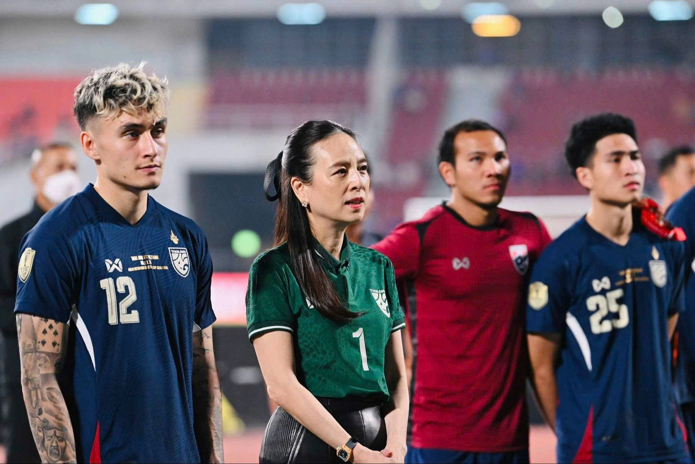

Quay lại với bàn thắng gây tranh cãi ở trận chung kết lượt về. Theo luật, đó là một bàn thắng hợp lệ, nhưng theo tinh thần thể thao - fairplay, thì đó thực sự là một bàn thắng vô cùng "xấu xí". 

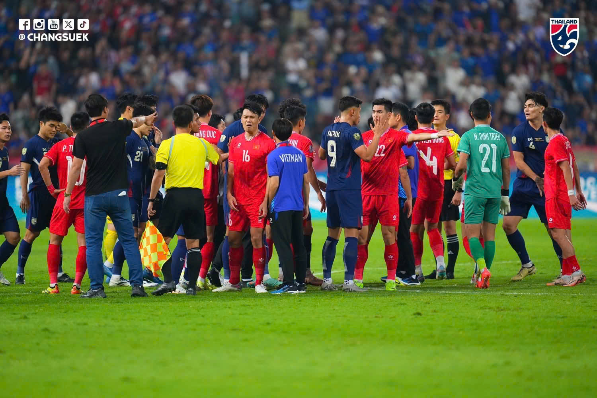

Mình nghĩ rằng, Supachok cũng sẽ không lấy làm vui vẻ gì khi ghi bàn thắng đó. Vì chính anh ấy hiểu rõ hơn ai hết, đó là một bàn thắng unfair-play. Nhưng vì lợi ích quốc gia phải đặt lên hàng đầu, mình nghĩ chúng ta cũng nên thông cảm cho anh ấy. 

Cuối cùng, Việt Nam chúng ta vẫn dành được chiến thắng. Điều đó càng làm cho mình thêm tin tưởng vào sự tử tế, cuộc đời sẽ mỉm cười đối với ai biết chia sẻ, cảm thông. 

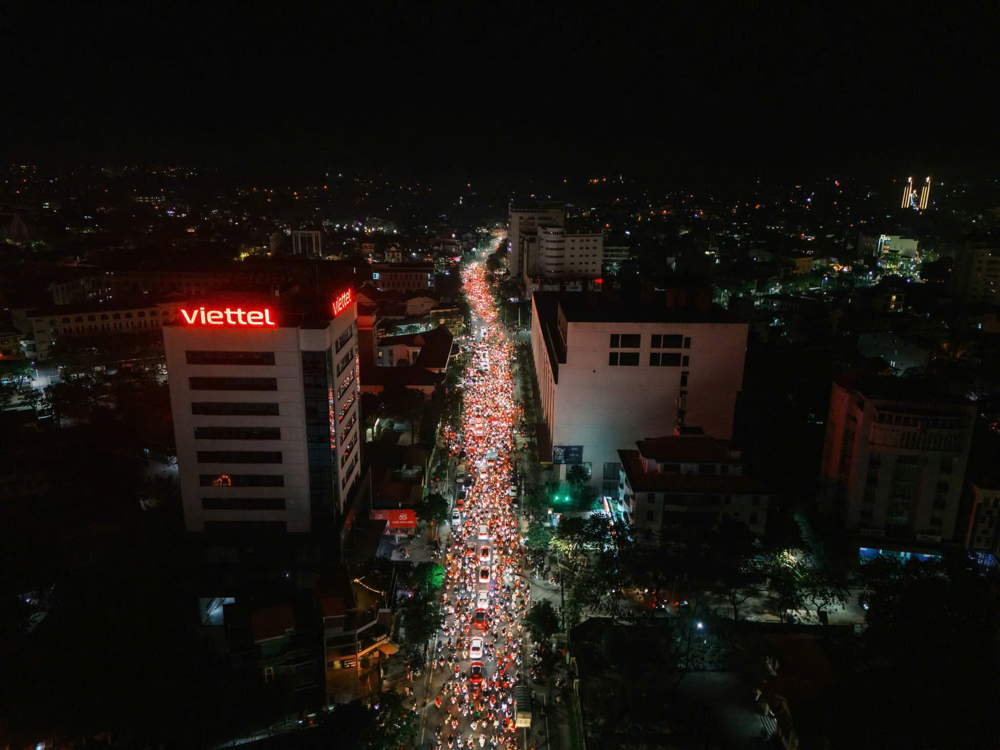
<!--  -->

Việt Nam Vô Địch - Tôi Yêu Việt Nam :heart:
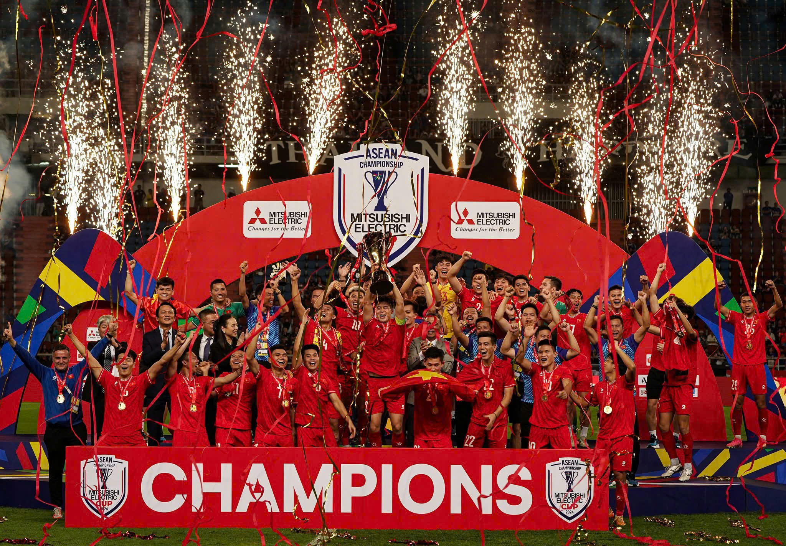
<!--  -->

<!-- 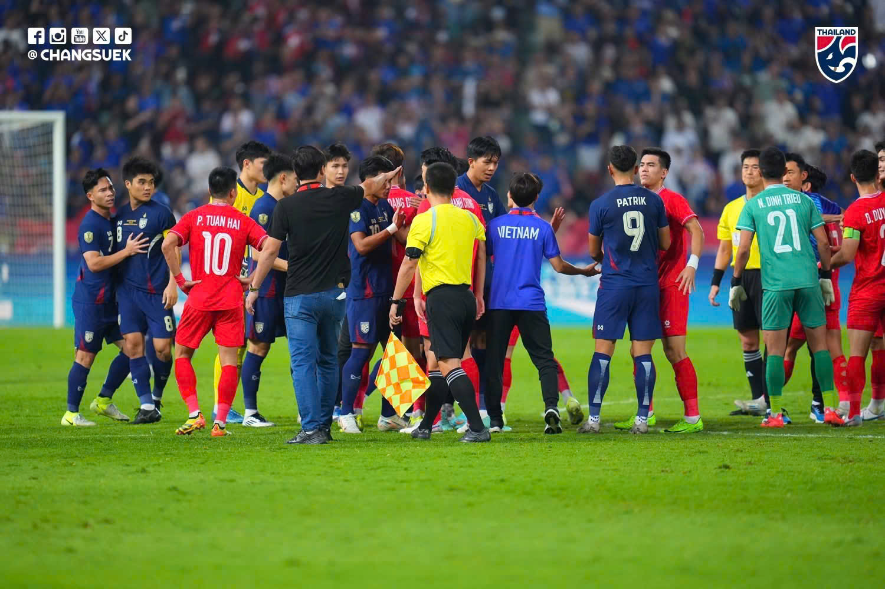 -->
<!-- 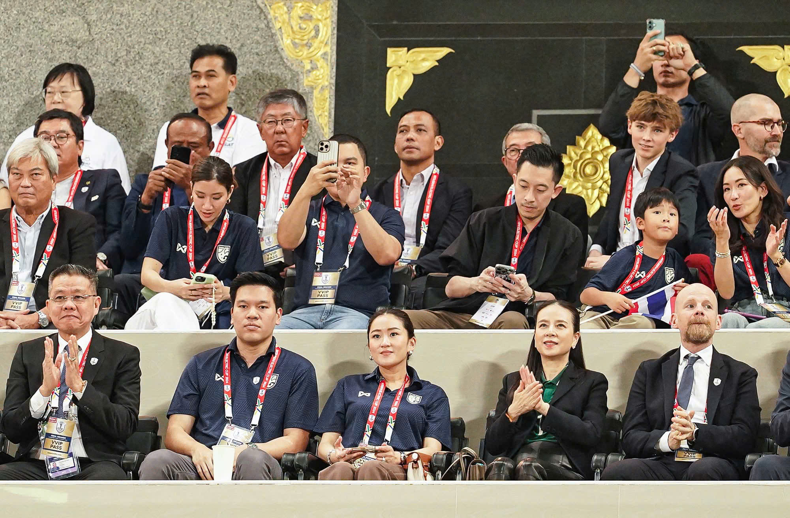 -->