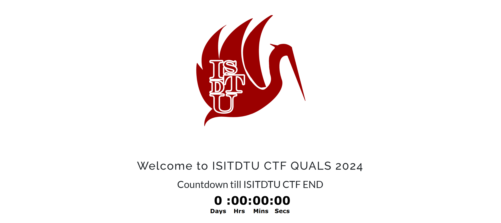
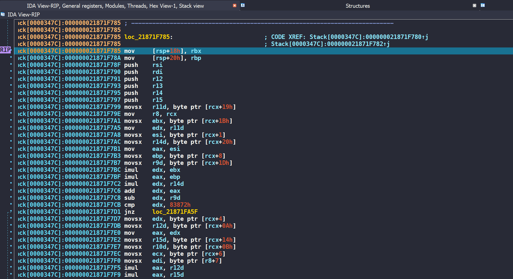
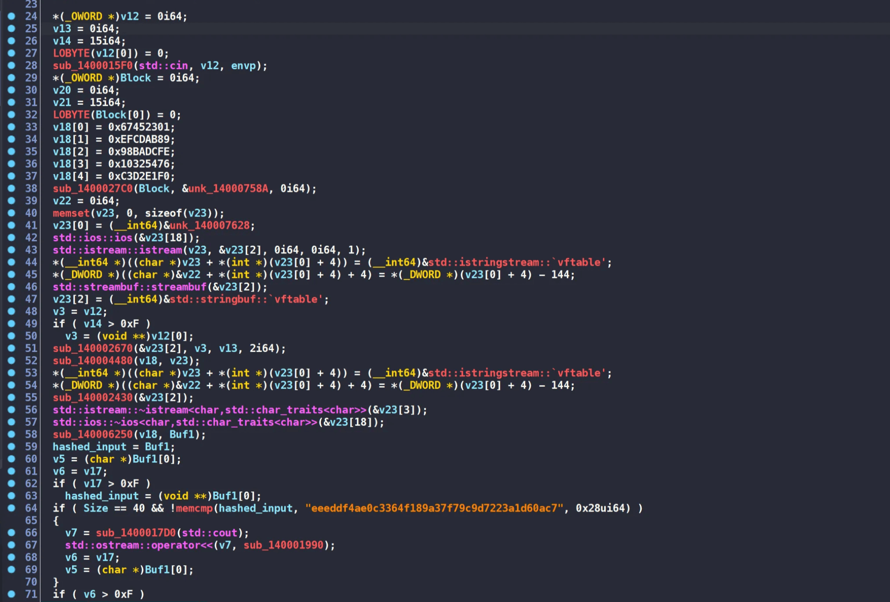
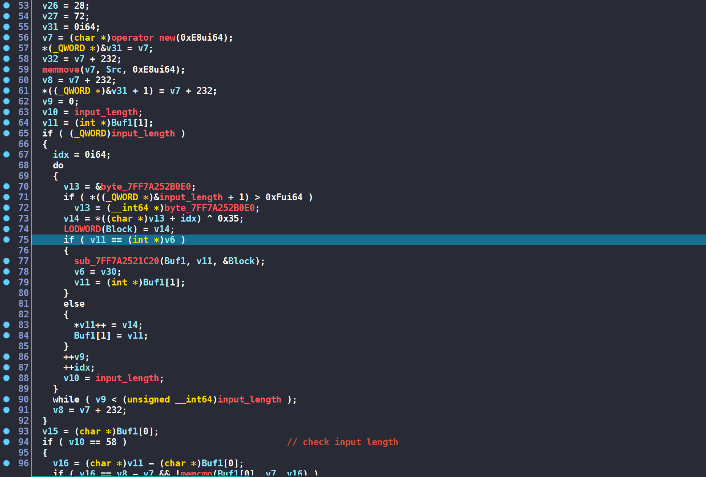
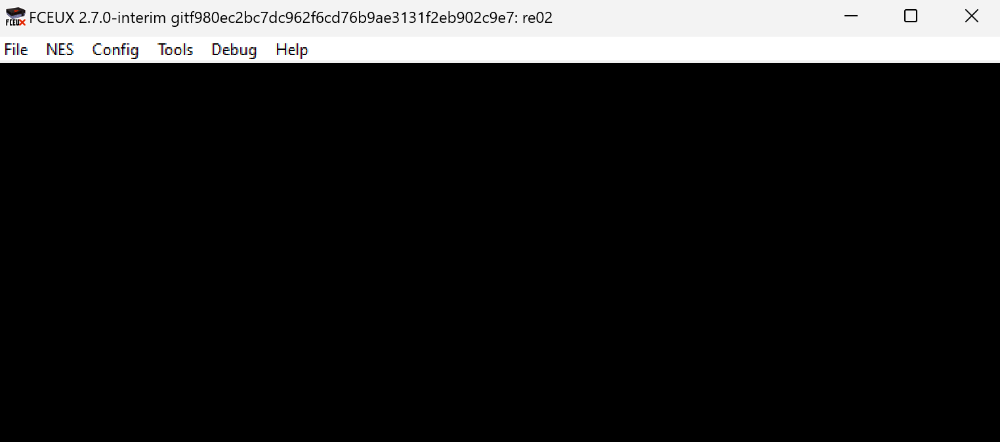
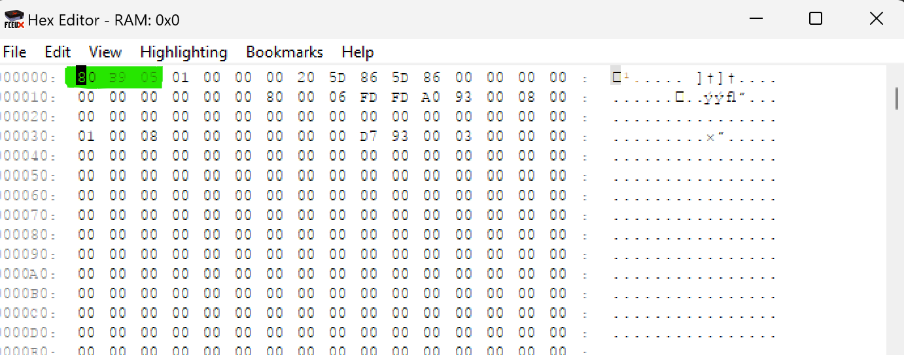
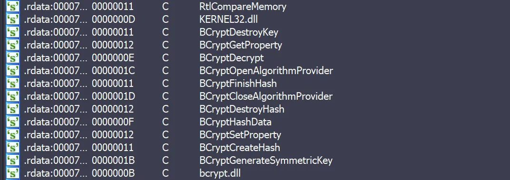
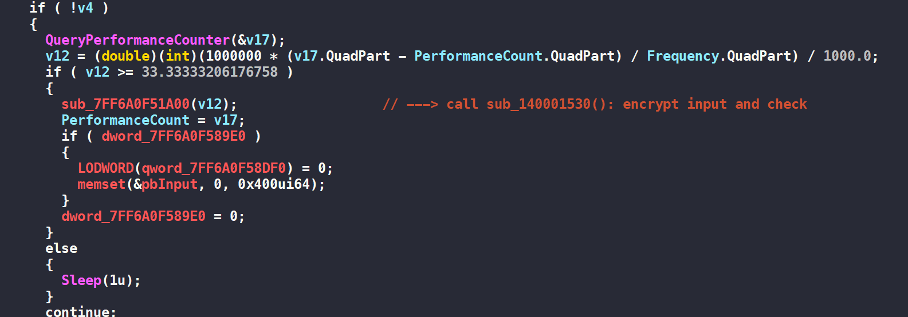
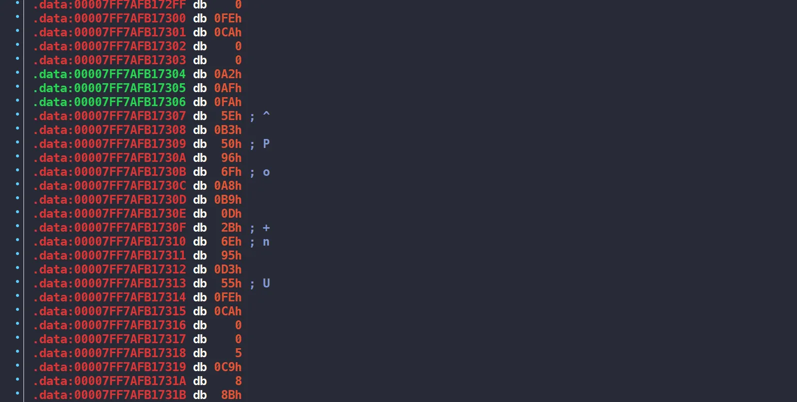

Solutions for some challenges in ISITDTU Quals 2024

<!--more-->

# ISITDTU Quals 2024



## rev/animal


* 31 solves / 100 pts / by kinjazz
* **Given files:** chall
* **Description:** Find the hidden animal


**Solution**

Đề bài cho chúng ta một file PE64. Mở bằng IDA64, tổng quan chương trình sẽ như sau


Chương trình yêu cầu nhập flag có độ dài 36 ký tự, trong đó có điều kiện check ở một số idex cụ thể.

Khi click vào hàm **`check_flag`**, ta nhận được thông báo lỗi như sau 


Qua tab IDA View chế độ non-graph, ta thấy đây chỉ là một lệnh gọi hàm bình thường


Vậy mình sẽ debug từng dòng và sửa các kết quả check để chương trình tới được đến đoạn này. Đây là chương trình khi mình nhảy vào **`rax`**



Ấn phím **`p`** để create function và thu được đống mã giả của hàm này như sau 

```c
_BOOL8 __fastcall sub_21871F785(char *a1)
{
    [...]

  v2 = a1[27];
  v3 = a1[1];
  v4 = a1[32];
  v5 = a1[8];
  v6 = a1[29];
  if ( v5 * v3 + v4 * v2 * a1[25] - v6 != 538738 )
    return 0i64;
  v7 = a1[4];
  v8 = a1[10];
  v9 = a1[20];
  if ( a1[7] + v9 * v8 * v7 - a1[6] - a1[11] != 665370 )
    return 0i64;
  v10 = a1[30];
  if ( a1[14] + (a1[16] - 1) * a1[31] - v10 * a1[22] != -2945 )
    return 0i64;
  v11 = a1[18];
  v12 = a1[33];
  if ( v12 + a1[3] - a1[9] - v11 - a1[11] - v7 != -191 )
    return 0i64;
  if ( v3 + v10 + v11 + a1[25] * v6 - v5 != 4853 )
    return 0i64;
  v13 = a1[7];
  v14 = a1[13];
  if ( v14 + a1[5] - v13 * a1[14] * a1[23] * a1[2] != -86153321 )
    return 0i64;
  v15 = a1[9];
  if ( v14 + v15 * a1[5] * a1[12] + v2 * v8 != 873682 )
    return 0i64;
  v16 = v15 * a1[21];
  v17 = a1[6];
  v18 = v11 * v16;
  v19 = a1[22];
  if ( v19 + a1[3] + v18 - v17 != 451644 )
    return 0i64;
  v20 = a1[24];
  if ( a1[21] + a1[34] + v20 + v4 * a1[23] - v7 != 9350 )
    return 0i64;
  v21 = a1[17];
  v22 = a1[19];
  v29 = a1[35];
  v28 = a1[26];
  if ( v20 + v29 + a1[17] - v22 - v28 - v17 != 27 )
    return 0i64;
  v23 = a1[15];
  if ( a1[14] + a1[13] + v23 + a1[23] * v22 - a1[3] == 11247
    && (v24 = v13 * a1[12], v25 = a1[2], v25 + v21 + v24 - v23 - a1[21] == 13297)
    && (v26 = *a1, v5 + v29 + v28 + a1[28] - v26 - v9 == 266)
    && v25 + v21 + v26 + a1[12] * a1[28] - v3 == 10422
    && v19 + v23 + a1[5] * v22 - a1[34] - a1[11] == 9883 )
  {
    return v8 * v12 + a1[16] * (1 - v9) - v26 == -5604;
  }
  else
  {
    return 0i64;
  }
}
```

Tới đây chúng ta sẽ biết được luôn phải dùng Z3 để tìm ra flag. Lời giải của mình như sau 

```python
from z3 import *

solver = Solver()

flag = [Int(f'flag[{i}]') for i in range(36)]

for i in range(36):
    solver.add(flag[i] >= 0, flag[i] <= 128)

solver.add(flag[0] == ord('I'))
solver.add(flag[1] == ord('S'))
solver.add(flag[2] == ord('I'))
solver.add(flag[3] == ord('T'))
solver.add(flag[4] == ord('D'))
solver.add(flag[5] == ord('T'))
solver.add(flag[6] == ord('U'))
solver.add(flag[7] == ord('{'))
solver.add(flag[8] == 0x61)
solver.add(flag[17] == 0x63)
solver.add(flag[18] == 0x61)
solver.add(flag[19] == 0x74)
solver.add(flag[33] == flag[34])
solver.add(flag[35] == ord('}'))

solver.add(flag[22] + flag[3] + flag[18] * flag[9] * flag[21] - flag[6] == 451644)
solver.add(flag[24] + flag[35] + flag[17] - flag[19] - flag[26] - flag[6] == 27)
solver.add(flag[8] * flag[1] + flag[32] * flag[27] * flag[25] - flag[29] == 0x83872)
solver.add(flag[7] + flag[20] * flag[10] * flag[4] - flag[6] - flag[11] == 665370)
solver.add(flag[14] + (flag[16] - 1) * flag[31] - flag[30] * flag[22] == -2945)
solver.add(flag[33] + flag[3] - flag[9] - flag[18] - flag[11] - flag[4] == -191)
solver.add(flag[1] + flag[30] + flag[18] + flag[25] * flag[29] - flag[8] == 4853)
solver.add(flag[13] + flag[5] - flag[7] * flag[14] * flag[23] * flag[2] == -86153321)
solver.add(flag[13] + flag[9] * flag[5] * flag[12] + flag[27] * flag[10] == 873682)
solver.add(flag[21] + flag[34] + flag[24] + flag[32] * flag[23] - flag[4] == 9350)
solver.add(flag[14] + flag[13] + flag[15] + flag[23] * flag[19] - flag[3] == 11247)
solver.add(flag[2] + flag[17] + flag[7] * flag[12] - flag[15] - flag[21] == 13297)
solver.add(flag[8] + flag[35] + flag[26] + flag[28] - flag[0] - flag[20] == 266)
solver.add(flag[2] + flag[17] + flag[0] + flag[12] * flag[28] - flag[1] == 10422)
solver.add(flag[22] + flag[15] + flag[5] * flag[19] - flag[34] - flag[11] == 9883)
solver.add(flag[10] * flag[33] + flag[16] * (1 - flag[20]) - flag[0] == -5604)

if solver.check() == sat:
    model = solver.model()
    print(model)
else:
    print("0xDEADBEEF")

flag[0] = 73
flag[1] = 83
flag[2] = 73
flag[3] = 84
flag[4] = 68
flag[5] = 84
flag[6] = 85
flag[7] = 123
flag[8] = 97
flag[17] = 99
flag[18] = 97
flag[19] = 116
flag[35] = 125
flag[33] = 33
flag[13] = 100
flag[12] = 108
flag[26] = 117
flag[22] = 110
flag[21] = 49
flag[20] = 95
flag[27] = 114
flag[23] = 95
flag[29] = 97
flag[10] = 103
flag[11] = 48
flag[32] = 97
flag[15] = 110
flag[31] = 101
flag[16] = 95
flag[30] = 114
flag[9] = 95
flag[14] = 101
flag[28] = 95
flag[25] = 48
flag[34] = 33
flag[24] = 121

print("".join([chr(i) for i in flag]))
```

Flag thu được là **`ISITDTU{a_g0lden_cat_1n_y0ur_area!!}`**

## rev/re01


* 46 solves / 100 pts
* **Given files:** re01.zip
* **Description:** VC++ ;)


**Solution**

Đề bài cho chúng ta một file PE64, mở bằng IDA64, quan sát tổng thể ta có thể thấy chương trình dùng SHA1 để hash input và so sánh với chuỗi hash **`eeeddf4ae0c3364f189a37f79c9d7223a1d60ac7`**



Sau một hồi thử crack chuỗi hash kia không được, mình tiếp tục đi xem có function nào đáng nghi không. Và đây chính là hàm mà mình chú ý tới **`TlsCallback_0`**


Chương trình sử dụng anti-debug và gọi nó trong hàm TLS. Mình đặt breakpoint ở đoạn check **`IsDebuggerPresent`** và sửa giá trị cho **`ZF`** để chương trình tiếp tục được đi vào trong hàm **`sub_140004000`**



Chúng ta dễ dàng nhận ra input length = 58. Mình sẽ tạo mới input và debug lại. Kiểm tra các giá trị ở đoạn so sánh, ta biết được điều kiện check flag sẽ là

```python
flag[i] ^ 0x35 == v7[i] 
```

Dễ dàng lấy toàn bộ giá trị của **`v7`** và xor ngược lại, ta thu được flag **`ISITDTU{Congrats_You_Solved_TLS_Callback_Re01_Have_Fun_:)}`**

```python
X = [0x7C, 0x00, 0x00, 0x00, 0x66, 0x00, 0x00, 0x00, 0x7C, 0x00, 
    0x00, 0x00, 0x61, 0x00, 0x00, 0x00, 0x71, 0x00, 0x00, 0x00, 
    0x61, 0x00, 0x00, 0x00, 0x60, 0x00, 0x00, 0x00, 0x4E, 0x00, 
    0x00, 0x00, 0x76, 0x00, 0x00, 0x00, 0x5A, 0x00, 0x00, 0x00, 
    0x5B, 0x00, 0x00, 0x00, 0x52, 0x00, 0x00, 0x00, 0x47, 0x00, 
    0x00, 0x00, 0x54, 0x00, 0x00, 0x00, 0x41, 0x00, 0x00, 0x00, 
    0x46, 0x00, 0x00, 0x00, 0x6A, 0x00, 0x00, 0x00, 0x6C, 0x00, 
    0x00, 0x00, 0x5A, 0x00, 0x00, 0x00, 0x40, 0x00, 0x00, 0x00, 
    0x6A, 0x00, 0x00, 0x00, 0x66, 0x00, 0x00, 0x00, 0x5A, 0x00, 
    0x00, 0x00, 0x59, 0x00, 0x00, 0x00, 0x43, 0x00, 0x00, 0x00, 
    0x50, 0x00, 0x00, 0x00, 0x51, 0x00, 0x00, 0x00, 0x6A, 0x00, 
    0x00, 0x00, 0x61, 0x00, 0x00, 0x00, 0x79, 0x00, 0x00, 0x00, 
    0x66, 0x00, 0x00, 0x00, 0x6A, 0x00, 0x00, 0x00, 0x76, 0x00, 
    0x00, 0x00, 0x54, 0x00, 0x00, 0x00, 0x59, 0x00, 0x00, 0x00, 
    0x59, 0x00, 0x00, 0x00, 0x57, 0x00, 0x00, 0x00, 0x54, 0x00, 
    0x00, 0x00, 0x56, 0x00, 0x00, 0x00, 0x5E, 0x00, 0x00, 0x00, 
    0x6A, 0x00, 0x00, 0x00, 0x67, 0x00, 0x00, 0x00, 0x50, 0x00, 
    0x00, 0x00, 0x05, 0x00, 0x00, 0x00, 0x04, 0x00, 0x00, 0x00, 
    0x6A, 0x00, 0x00, 0x00, 0x7D, 0x00, 0x00, 0x00, 0x54, 0x00, 
    0x00, 0x00, 0x43, 0x00, 0x00, 0x00, 0x50, 0x00, 0x00, 0x00, 
    0x6A, 0x00, 0x00, 0x00, 0x73, 0x00, 0x00, 0x00, 0x40, 0x00, 
    0x00, 0x00, 0x5B, 0x00, 0x00, 0x00, 0x6A, 0x00, 0x00, 0x00, 
    0x0F, 0x00, 0x00, 0x00, 0x1C, 0x00, 0x00, 0x00, 0x48, 0x00, 
    0x00, 0x00]

flag = "".join([chr(0x35 ^ int.from_bytes(X[i:i+4], "little")) for i in range(0, len(X), 4)])
print(flag)
```

## rev/re02


* 29 solves / 100 pts
* **Given files:** re02.zip
* **Description:** NES, good luck ;)


**Solution**

Đề bài cho chúng ta một file **`re02.nes`**, đây là một Nintendo ROM image file. Sau một hồi tìm kiếm, mình tìm được tool **`FCEUX`** có thể emulate và debug file này.  

Mở chương trình lên thì thấy một màn hình đen kịt 



Vào tab Debug → Hex Editor thấy 3 byte đầu nhảy liên tục, chứng tỏ rằng chương trình vẫn đang hoạt động bình thường. 



Sau khi thử nhập một vài phím và check toàn bộ dữ liệu trong tab Hex Editor, mình phát hiện input được xuất hiện ở các địa chỉ: 

- 0x0300
- 0x0B00
- 0x1300
- 0x1B00


và có một số đặc điểm như sau: 

- Độ dài tối đa input là 16
- Có 7 phím được chấp nhận và nó sẽ được map như sau:
    - **`s`** → **`a`**
    - **`d`** → **`u`**
    - **`f`** → **`t`**
    - **`up arrow`** → **`n`**
    - **`right arrow`** → **`i`**
    - **`down arrow`** → **`h`**
    - **`left arrow`** → **`l`**

Sau khi đã biết chỗ nhập input thì chỗ check flag sẽ nằm ở đâu? 

Mình vào tab Debug → Debugger, tìm đoạn code nào có chứa **`300`** (địa chỉ input) hoặc lệnh **`cmp`** thì ra được đoạn này 


Nếu tinh ý, ta có thể nhận ra các block check input khá tương tự nhau. Lấy các giá trị ở địa chỉ 300, 301 và 302 cộng với nhau, sau đó so sánh với 0x4A. Ví dụ cho block check đầu tiên sẽ là 

```python
input[0] + input[1] + input[2] == 0x4A
```

Thực hiện tương tự cho các block sau, chúng ta có thể tìm ra được **`mapped_input`** bằng Z3 

```python
from z3 import * 

solver = Solver()
flag = [BitVec(f'flag[{i}]', 8) for i in range(16)]

for i in range(16):
    solver.add(Or((flag[i] == ord('t')), (flag[i] == ord('u')), (flag[i] == ord('a')), (flag[i] == ord('n')), (flag[i] == ord('l')), (flag[i] == ord('i')), (flag[i] == ord('h'))))

solver.add(flag[0] + flag[1] + flag[2] == 0x4A)
solver.add(flag[1] + flag[2] + flag[3] == 0x44)
solver.add(flag[2] + flag[3] + flag[4] == 0x3B)
solver.add(flag[3] + flag[4] + flag[5] == 0x43)
solver.add(flag[4] + flag[5] + flag[6] == 0x43)
solver.add(flag[5] + flag[6] + flag[7] == 0x3F)
solver.add(flag[6] + flag[7] + flag[8] == 0x42)
solver.add(flag[7] + flag[8] + flag[9] == 0x3D)
solver.add(flag[8] + flag[9] + flag[10] == 0x43)
solver.add(flag[9] + flag[10] + flag[11] == 0x3F)
solver.add(flag[10] + flag[11] + flag[12] == 0x4A)
solver.add(flag[11] + flag[12] + flag[13] == 0x51)
solver.add(flag[12] + flag[13] + flag[14] == 0x4A)
solver.add(flag[13] + flag[14] + flag[15] == 0x44)

if solver.check() == sat:
    model = solver.model()
    res = ""
    for i in range(16):
        res += chr(model[flag[i]].as_long())
    print(res)
else:
    print("......")
```

Kết quả thu được là **`tuanlinhlinhtuan`,** bây giờ ta chỉ cần nhập input đúng với các key đã được map sẽ có được flag là **`ISITDTU{Throw_back_the_nested_if_NES_have_funnnn_:)}`**


## rev/The Chamber of Flag


* 28 solves / 100 pts / by ks75vl
* **Given files:** [TheChamberOfFlag_11BA527D91D85F332DEBC3145E3E1C4A.zip](https://ctf.isitdtu.com/files/77c8d53ffc4bef692852e6468b8174e7/TheChamberOfFlag_11BA527D91D85F332DEBC3145E3E1C4A.zip?token=eyJ1c2VyX2lkIjoyMzUwLCJ0ZWFtX2lkIjoxNDAyLCJmaWxlX2lkIjo1OX0.Zx57Aw.lAwlfdig9LbY7snwdAWv-QVZw2Q)
* **Description:** Try to unlock the Chamber and get the Flag.


**Solution**

Đề bài cho chúng ta một file PE64, chạy thử chương trình, ta thấy có 2 option để lựa chọn:

- login
    - input secret key
- about


Mình thử nhập secret và nhận thấy:

- Độ dài secret = 6
- Nhập sai sẽ cho nhập tiếp

Mở file bằng IDA64, chương trình nhìn rất lớn và phức tạp. Mình nhảy qua tab string và nhận thấy chương trình có gọi các hàm encrypt của WinAPI. 



Trace theo các hàm này, mình tìm ra được hàm **`sub_7FF6A0F51530`** thực hiện việc mã hóa input và đi kiểm tra tính hợp lệ của nó. 



Sau khi debug và decrypt **`AlgId`**, chúng ta biết được chương trình sử dụng hash SHA256. Thông tin chi tiết các bạn có thể đọc thêm ở đây https://learn.microsoft.com/en-us/windows/win32/api/bcrypt/nf-bcrypt-bcryptopenalgorithmprovider


Tiếp tục debug và ta lấy được **`checked_hash`** = **`26F2D45844BFDBC8E5A2AE67149AA6C50E897A2A48FBF479D1BFB9F0D4E24544`**

Với input có độ dài 6 ký tự, mình sẽ dùng **`hashcat`** để bruteforce nhằm tìm ra giá trị tương ứng với mã hash này. Kết quả thu được là **`808017`**


Đăng nhập thành công, chúng ta chọn option flag nhưng lại xuất hiện thông báo flag crashed.


Sau khi xref chuỗi trên, mình tìm ra được đoạn code có liên quan tới chuỗi trên ở đây. 


Đi phân tích hàm **`sub_7FF7AFB110C8`**, ta thấy nó decrypt dữ liệu bằng thuật toán AES mode CBC. 

```c
__int64 __fastcall sub_7FF7AFB110C8(PUCHAR pbInput, __int64 a2, __int64 a3, UCHAR *a4, PUCHAR a5)
{
  char v7; // al
  unsigned __int64 v8; // rcx
  unsigned __int64 v9; // rcx
  char v10; // al
  char v11; // bl
  char v12; // al
  unsigned __int64 v13; // rcx
  unsigned __int64 v14; // rcx
  unsigned int v15; // ebx
  HANDLE ProcessHeap; // rax
  UCHAR *v17; // rbx
  HANDLE v18; // rax
  WCHAR pszProperty[2]; // [rsp+50h] [rbp-61h] BYREF
  int v21; // [rsp+54h] [rbp-5Dh]
  int v22; // [rsp+58h] [rbp-59h]
  int v23; // [rsp+5Ch] [rbp-55h]
  int v24; // [rsp+60h] [rbp-51h]
  int v25; // [rsp+64h] [rbp-4Dh]
  int v26; // [rsp+68h] [rbp-49h]
  WCHAR pszAlgId[2]; // [rsp+70h] [rbp-41h] BYREF
  int v28; // [rsp+74h] [rbp-3Dh]
  __int16 v29; // [rsp+78h] [rbp-39h]
  char v30; // [rsp+80h] [rbp-31h]
  char v31; // [rsp+81h] [rbp-30h]
  UCHAR pbInputa[4]; // [rsp+82h] [rbp-2Fh] BYREF
  int v33; // [rsp+86h] [rbp-2Bh]
  int v34; // [rsp+8Ah] [rbp-27h]
  int v35; // [rsp+8Eh] [rbp-23h]
  int v36; // [rsp+92h] [rbp-1Fh]
  int v37; // [rsp+96h] [rbp-1Bh]
  int v38; // [rsp+9Ah] [rbp-17h]
  int v39; // [rsp+9Eh] [rbp-13h]
  BCRYPT_ALG_HANDLE phAlgorithm; // [rsp+A8h] [rbp-9h] BYREF
  BCRYPT_KEY_HANDLE phKey; // [rsp+B0h] [rbp-1h] BYREF
  UCHAR pbOutput[4]; // [rsp+B8h] [rbp+7h] BYREF
  ULONG pcbResult; // [rsp+BCh] [rbp+Bh] BYREF
  ULONG v44; // [rsp+C0h] [rbp+Fh] BYREF

  phAlgorithm = 0i64;
  phKey = 0i64;
  *(_DWORD *)pbOutput = 0;
  v7 = 98;
  pcbResult = 0;
  *(_DWORD *)pszAlgId = '#\0b';                 // AES
  v8 = 0i64;
  v28 = 3211303;
  v29 = 0;
  while ( 1 )
  {
    pszAlgId[++v8] ^= v7;
    if ( v8 >= 3 )
      break;
    v7 = pszAlgId[0];
  }
  v29 = 0;
  if ( BCryptOpenAlgorithmProvider(&phAlgorithm, &pszAlgId[1], 0i64, 0) )
    return 0i64;
  v9 = 0i64;
  *(_DWORD *)pbInputa = 6881346;                // ChangingModeCBC
  v10 = 1;
  v31 = 0;
  v30 = 1;
  v33 = 6815840;
  v11 = 111;
  v34 = 6815855;
  v35 = 6684783;
  v36 = 7209036;
  v37 = 6553701;
  v38 = 4390978;
  v39 = 66;
  while ( 1 )
  {
    *(_WORD *)&pbInputa[2 * v9++] ^= v10;
    if ( v9 >= 0xF )
      break;
    v10 = v30;
  }
  HIWORD(v39) = 0;
  v12 = 41;
  *(_DWORD *)pszProperty = 6946857;
  v13 = 0i64;
  v21 = 4718657;
  v22 = 4653120;
  v23 = 4653120;
  v24 = 6553678;
  v25 = 5046342;
  v26 = 76;
  while ( 1 )
  {
    pszProperty[++v13] ^= v12;
    if ( v13 >= 0xC )
      break;
    v12 = pszProperty[0];
  }
  HIWORD(v26) = 0;
  if ( BCryptSetProperty(phAlgorithm, &pszProperty[1], pbInputa, 0x20u, 0) )
    return 0i64;
  *(_DWORD *)pszProperty = 2097263;             // objectLength
  v21 = 327693;
  v14 = 0i64;
  v22 = 786442;
  v23 = 2293787;
  v24 = 65546;
  v25 = 1769480;
  v26 = 7;
  while ( 1 )
  {
    pszProperty[++v14] ^= v11;
    if ( v14 >= 0xC )
      break;
    v11 = pszProperty[0];
  }
  HIWORD(v26) = 0;
  if ( BCryptGetProperty(phAlgorithm, &pszProperty[1], pbOutput, 4u, &pcbResult, 0) )
    return 0i64;
  v15 = *(_DWORD *)pbOutput;
  ProcessHeap = GetProcessHeap();
  v17 = (UCHAR *)HeapAlloc(ProcessHeap, 0, v15);
  if ( !v17 )
    return 0i64;
  if ( BCryptGenerateSymmetricKey(phAlgorithm, &phKey, v17, *(ULONG *)pbOutput, &pbSecret, 0x20u, 0) )
    return 0i64;
  v44 = 16;
  if ( BCryptDecrypt(phKey, pbInput, 0x10u, 0i64, a4, 0x10u, a5, 0x10u, &v44, 0) )
    return 0i64;
  BCryptDestroyKey(phKey);
  BCryptCloseAlgorithmProvider(phAlgorithm, 0);
  v18 = GetProcessHeap();
  HeapFree(v18, 0, v17);
  return 1i64;
}
```

Nhưng khi chạy đến cuối hàm thì gặp lỗi này. 


Lỗi này gây ra do **`rcx`** chưa trỏ đúng vào vị trí bộ nhớ. 


Lúc này, mình tìm xung quanh các thanh ghi **`rcx`** để xem nó bị ảnh hưởng bởi thanh ghi nào. Ta thấy có **`rax`** và **`rbx`** tác động tới nó 


 Do **`rax`** trên stack nên mình bỏ qua, tìm xung quanh giá trị của **`rbx`**, ta thấy có đống dữ liệu rất khả nghi.



Đưa **`rcx`** trỏ về đây, chạy nốt chương trình và thu được flag **`ISITDTU{STATIC_STRUCt_INITIALIZATION_FAiLED}`**

## pwn/shellcode 2


* 61 solves / 100 pts / by code016hiro
* **Given files:** [https://drive.google.com/file/d/1_w9se3I6o9esnnMt1OyISZEqid5HGvUO/view](https://drive.google.com/file/d/1_w9se3I6o9esnnMt1OyISZEqid5HGvUO/view)
* **Description:** **`nc 152.69.210.130 3002`**


---

## List challenges

rev/2much


* 9 solves / 463 pts / by kinjazz
* **Given files:** 2much


rev/FlagCpp


* 6 solves / 486 pts / by ks75vl
* **Given files:** [FlagCpp_5C9F861EFCC1AFF273C435E3CC988438.zip](https://ctf.isitdtu.com/files/05153c62f8deaf01bbbf0e0cf1cf1ff8/FlagCpp_5C9F861EFCC1AFF273C435E3CC988438.zip?token=eyJ1c2VyX2lkIjoyMzUwLCJ0ZWFtX2lkIjoxNDAyLCJmaWxlX2lkIjo2M30.Zx57eg.J9fLcNCPDtdvOzQzBeZt29tsZqs)
* **Description:** Trust me, this program was written in **`C++`**.


pwn/shellcode 1


* 68 solves / 100 pts / by code016hiro
* **Given files:** [https://drive.google.com/file/d/1VYDG9AFhaSddgn9qr8cWCaN5qVb-fQCE/view](https://drive.google.com/file/d/1VYDG9AFhaSddgn9qr8cWCaN5qVb-fQCE/view)
* **Description:** **`nc 152.69.210.130 3001`**


pwn/Game of Luck


* 43 solves / 100 pts
* **Given files:** chall
* **Description:** **`nc 152.69.210.130 2004`**


pwn/no_name


* 29 solves / 100 pts
* **Given files:** no_name.zip
* **Description:** **`nc 152.69.210.130 1337`**


forensics/CPUsage


* 37 solves / 100 pts / by M4shl3
* **Given files:** [https://drive.proton.me/urls/5MM9NY7SZW#O3lmkiJIBJzr](https://drive.proton.me/urls/5MM9NY7SZW#O3lmkiJIBJzr)
* **Description:** My friend noticed a high usage of CPU after he opened his laptop, I just take a memory dump of his laptop, and needs you to investigate it. Q1- What is the name of the malicious process, full path of the process, parent process id? Q2- what is the ip that process communicate with, family name of the malware\
Format flag: **`ISITDTU{processName-FullPath-ID_ip-FamilyName}`** \
Eg: **`ISITDTU{Spotify.exe-Path-141_192.168.1.1-isitdtu}`**


forensics/Corrupted Hard Drive


* 46 solves / 100 pts / by M4shl3 x vizer
* **Given files:** [https://drive.proton.me/urls/15NQK5V8B0#VAesxikOWzxP](https://drive.proton.me/urls/15NQK5V8B0#VAesxikOWzxP)
* **Description:** You’ve come across a damaged disk image retrieved from my friend's laptop, he downloaded some good stuff then went to bathroom, but when came, he found that he can't access the disk. The file system appears to be corrupted, but hidden deep inside the broken structure lies critical information that could unlock the next step in your investigation.\
**`nc 152.69.210.130 1411`**


forensics/unexpected


* 17 solves / 349 pts / by 3r3m1t1c
* **Given files:** [https://drive.google.com/file/d/1_pfVtaS1oMeiWd9dgqLP97yiLfD60Sih/view](https://drive.google.com/file/d/1_pfVtaS1oMeiWd9dgqLP97yiLfD60Sih/view)
* **Description:** Aquanman Investigation Company is currently recruiting for the role of Digital Forensics Investigator. As part of the application process, candidates are required to complete a challenge designed to assess their skills in digital forensics. Applicants will need to investigate a simulated attack, analyze the provided evidence, and submit the flag.\
The flag is divided into three different parts!


forensics/swatted


* 15 solves / 385 pts / by 3r3m1t1c
* **Given files:** [https://drive.google.com/file/d/15fdpvHGRI94QGzUZ61CYX2rVbKGAYDVU/view](https://drive.google.com/file/d/15fdpvHGRI94QGzUZ61CYX2rVbKGAYDVU/view)
* **Description:** San Andreas PD recently conducted a raid on a suspect's residence, discovering that their laptop contains crucial evidence. As a Digital Forensics Investigator, it is now your responsibility to analyze the evidence and answer the related questions.\
**`nc 152.69.210.130 1259`**


forensics/Initial


* 10 solves / 453 pts / by M4shl3
* **Given files:** [https://drive.proton.me/urls/ZYS0NTACTC#2E4aPfRdGZum](https://drive.proton.me/urls/ZYS0NTACTC#2E4aPfRdGZum)
* **Description:** A Windows environment has been compromised .The attacker used a known feature in windows which served as the initial vector of the attack. Your task is to investigate & SEARCH how the attacker get the initial access.


web/Another one


* 103 solves / 100 pts / by khanhhnahk1
* **Given files:** [Another_one_dist.zip](https://ctf.isitdtu.com/files/4e936e9c5732e01b42eea36e1dc838f5/Another_one_dist.zip?token=eyJ1c2VyX2lkIjoyMzUwLCJ0ZWFtX2lkIjoxNDAyLCJmaWxlX2lkIjo2MH0.Zx6EFA.FTrsquEeeKuzC1Co3hVQxJga6tQ)
* **Description:** Tell them bring out the lobster :point_up: \
Please test locally before testing on remote.\
[http://152.69.210.130:5000](http://152.69.210.130:5000/) / [http://20.198.254.169:5000](http://20.198.254.169:5000/)


web/X Éc Éc


* 63 solves / 100 pts / by onrsa
* **Given files:** [https://drive.proton.me/urls/ZYS0NTACTC#2E4aPfRdGZum](https://drive.proton.me/urls/ZYS0NTACTC#2E4aPfRdGZum)
* **Description:** **`"dependencies":  {"dompurify": "^3.1.6"}`**\
Warm up liu tiu riu :v\
Chall: [http://152.69.210.130](http://152.69.210.130/)\
Bot: [http://152.69.210.130:81/report](http://152.69.210.130:81/report/)


web/S1mple


* 35 solves / 100 pts / by 0x90
* **Given files:** Dockerfile
* **Description:** Just a simple HTTP Server\
  [http://35.240.202.218:8000](http://35.240.202.218:8000/)


web/hihi


* 20 solves / 287 pts / by khanhhnahk1
* **Given files:** [https://drive.google.com/file/d/13p2eQemGAHZm35g1040T8Yo_rp26x8Sq/view](https://drive.google.com/file/d/13p2eQemGAHZm35g1040T8Yo_rp26x8Sq/view)
* **Description:** 🤭🤭\
  Chall: [http://213.35.127.196:8083](http://213.35.127.196:8083/)


web/niceray


* 17 solves / 349 pts / by Onsra x Deku
* **Given files:** [https://drive.google.com/file/d/1mTkXeAxAPmEGcwwjylxlZ7Xlni9Hw99o/view](https://drive.google.com/file/d/1mTkXeAxAPmEGcwwjylxlZ7Xlni9Hw99o/view)
* **Description:** Niceray or Nineray or Liferay :)))\
  Please test locally before testing on remote. Any team that has captured the flag on the local instance, please DM the two authors below or create a ticket, and we will open an instance for you to capture the flag remotely. The instance creation link will be updated soon (since we're getting a high-RAM VPS to support this challenge :v )\
**Hint**: Due to a configuration, teams can still exploit the 
endpoint **`/api/jsonws/invoke`** locally, but it won’t be exploitable remotely.


web/Hero


* 5 solves / 491 pts / by taidh
* **Description:** I'm too busy with work to create a hard challenge, so here is an easy one. Enjoy and get free points from it!\
Link challenge: [http://213.35.127.196:63432](http://213.35.127.196:63432/)


web/Geo Weapon


* 0 solve / 1000 pts / by pew
* **Given files:** dist.zip
* **Description:** Little weapon, little weapon, little weapon We're calling you There's a war, if the guns are just to tall for you. We'll find you something small to use Little weapon, little weapon, little weapon. We need you now, blaow!\
By: Pew (This challenge expects you to find a 0day. If one is found pls report it yourself to the respected party.) Please test locally before testing on remote, ips that abuse instance will be blocked !!!\
**`nc 213.35.127.196 4444`**


crypto/ShareMixer1


* 42 solves / 100 pts / by catto
* **Given files:** chall.py
* **Description:** Let's mix some shares!!!!!!!!!!!!!!!!!!!!!!!!!\
  **`nc 35.187.238.100 5001`**


crypto/ShareMixer2


* 32 solves / 100 pts / by catto
* **Given files:** chall.py
* **Description:** Let's mix some shares!!!!!!!!!!!!!!!!!!!!!!!!! Again :>\
  **`nc 35.187.238.100 5002`**


crypto/Sign


* 23 solves / 214 pts / by m1dm4n
* **Given files:** chall.py
* **Description:** I love giving out signatures :"> As long as my modulus are hidden, you can't know what I'm signing!\
**`nc 35.187.238.100 5003`**


crypto/thats so random


* 9 solves / 463 pts
* **Given files:** 
  * chall.py
  * output.txt


crypto/somesomesome


* 6 solves / 486 pts
* **Given files:** [somesomesome.py](https://ctf.isitdtu.com/files/3ed230ade12b92c7df7a99384f28008f/somesomesome.py?token=eyJ1c2VyX2lkIjoyMzUwLCJ0ZWFtX2lkIjoxNDAyLCJmaWxlX2lkIjo1Nn0.Zx6KVA.hpFJRHyfE-msiHu6eIHVEOFrQ-Q)
