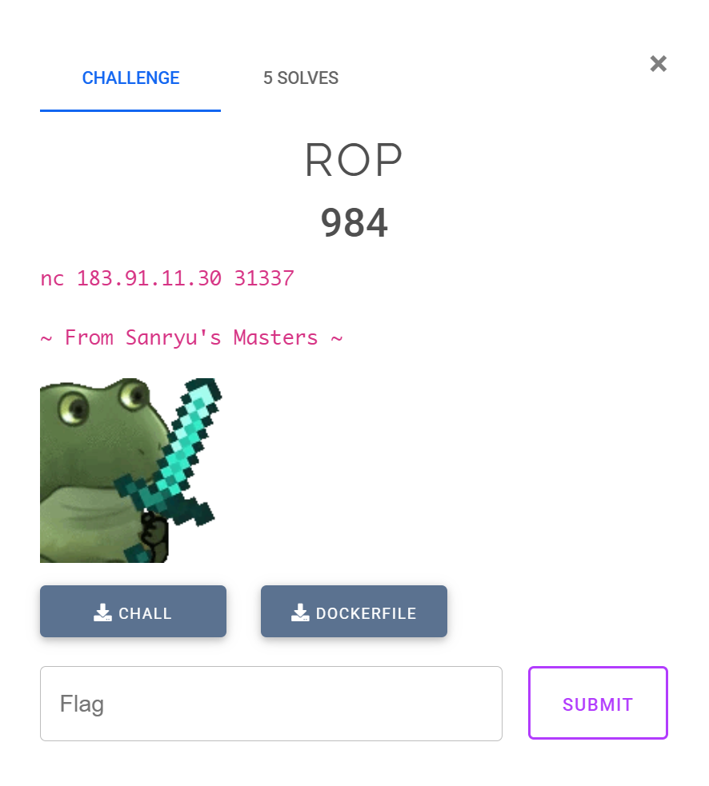
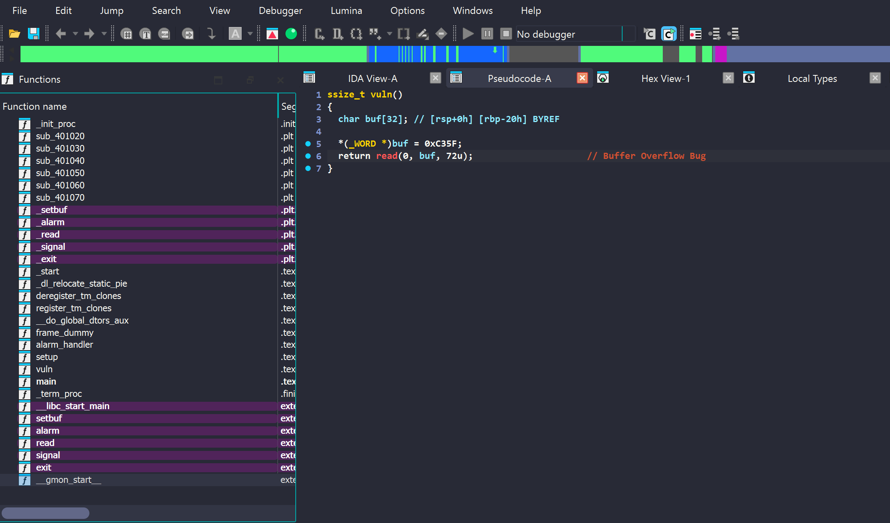

Sinh viên với An toàn Thông tin là cuộc thi CTF danh giá nhất cho sinh viên ở Việt Nam. Hằng năm, cuộc thi được tổ chức 3 vòng là: khởi động, sơ khảo và chung khảo. Dưới đây là các bài giải cho một số challenge pwnable và reversing ở các vòng thi của mình.  

<!--more-->

<style>
img {
    box-shadow: rgba(0, 0, 0, 0.35) 0px 5px 15px;
    border-radius: 6px;
    display: block; 
    margin: 15px auto;
}
</style>

# pwn/ROP



## 0x00. Overview

Kiểm tra thông tin của binary và các lớp bảo vệ.

```shell
➜  pwn-ROP file chall
chall: ELF 64-bit LSB executable, x86-64, version 1 (SYSV), dynamically linked, interpreter ./ld-linux-x86-64.so.2, for GNU/Linux 3.2.0, BuildID[sha1]=408b0fc1dee8dad901b33ff68c1e8179fef5bc89, not stripped

gef➤  checksec
Canary                        : ✘
NX                            : ✓
PIE                           : ✘
Fortify                       : ✘
RelRO                         : Partial
```

Đề bài cho một binary 64 bit, đã tắt canary và có thể ghi được GOT (Global Offset Table). 

Bên cạnh đó, đề bài còn cho Dockerfile, mình sẽ build docker lên và lấy libc, ld trong docker trước. Dự tính đầu tiên của mình là sử dụng kỹ thuật **ret2libc**. 

```shell
➜  pwn-ROP docker build . -t rop
➜  pwn-ROP docker run -p 5000:5000 --privileged -it rop
➜  pwn-ROP docker cp ee13afb344e4:/srv/usr/lib/x86_64-linux-gnu/libc.so.6 .
➜  pwn-ROP docker cp ee13afb344e4:/srv/usr/lib/x86_64-linux-gnu/ld-linux-x86-64.so.2 .
```
<br />

Dễ dàng thấy có bug Buffer Overflow trong hàm `vuln()`. Đặc biệt hơn khi không có bất cứ hàm nào in được output ra màn hình. Vì vậy kỹ thuật **ret2libc** nêu trên không thể sử dụng được. Kết hợp với việc GOT ghi đè được, mình có thể dùng kỹ thuật `ret2dlresolve` để giải hoặc stack pivot để overwrite bảng GOT của `alarm()` thành `execv()`.  



## 0x01. Stack Pivot 

Stack Pivot là một kỹ thuật đưa địa chỉ stack (luôn là một số ngẫu nhiên do [ASLR](https://en.wikipedia.org/wiki/Address_space_layout_randomization) bật) thành địa chỉ tĩnh của binary để dễ dàng xây dựng được các ROP chain. 