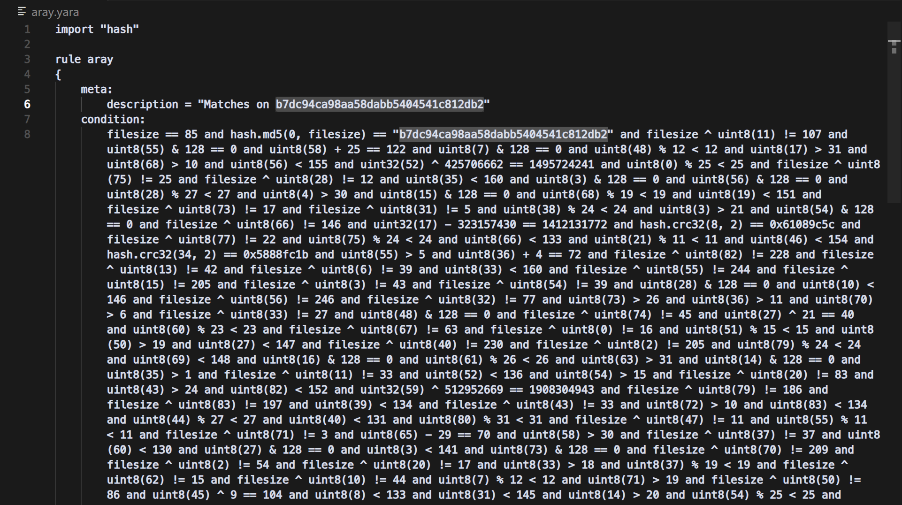
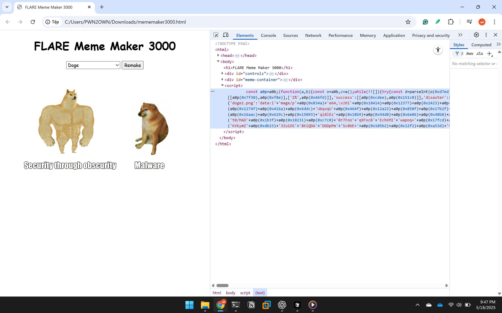
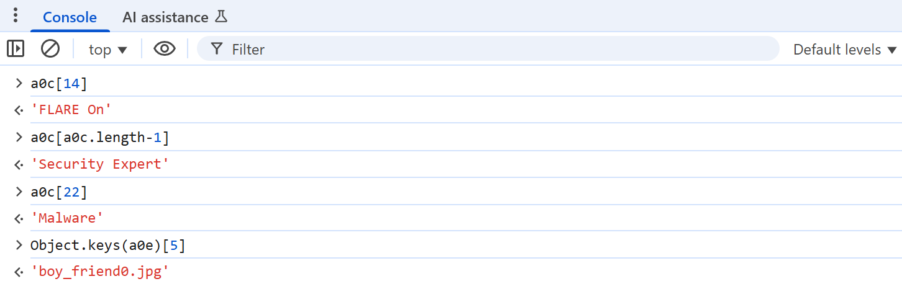
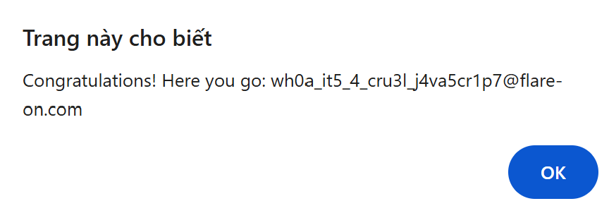

Solutions for some challenges in Flare On 11

<!--more-->

# Flare On 11

## Challenge 2: checksum

### Challenge Overview

The challenge provides us with a PE64 file written in Golang, along with several questions related to the result of a "checksum" calculation.

```
C:\Users\PWN2OWN>"C:\Users\PWN2OWN\FlareOn\2024\checksum.exe"
Check sum: 9418 + 92 = 9510
Good math!!!
------------------------------
Check sum: 9397 + 3991 = 13388
Good math!!!
------------------------------
Check sum: 5380 + 1695 = 7075
Good math!!!
------------------------------
Check sum: 3936 + 7655 = 11591
Good math!!!
------------------------------
Checksum: aaaaaaaaaaaaaaaaaaaaaaaaaaaaaaaa
Maybe it's time to analyze the binary! ;)
```

### Challenge Static Analysis 

The program contains three non-library functions: `main_main`, `main_a`, `main_b`. 


First, `randomTimes` represents the number of math questions to be generated, with its value randomly chosen in the range [0, 5]. This value is then increased by 3, resulting in a total of 3 to 8 arithmetic questions.

Each question randomly generates two operators, which I renamed to `fsRandom` and `seRandom`. The player's task is to input the correct sum of these two numbers. If all answers are correct, the program proceeds to the next stage.

The program then prompts for a checksum input and verifies its validity using a Golang API.


The `input_checksum` must be exactly 32 bytes long, where the first 24 bytes are extracted as the buffer. The program uses the XChaCha20-Poly1305 encryption algorithm, which requires a 32-byte key and a 24-byte nonce. Based on this, we can hypothesize that the buffer serves as the nonce in this encryption scheme.


By decoding the `encryptedFlagData` using the key and the nonce mentioned above, we obtain the decrypted data.


The decrypted data is hashed using SHA-256, then converted to a hexadecimal string and compared with input_checksum. If they match, the function `main_a` is called and the result is printed to `{os_UserCacheDir}\REAL_FLAREON_FLAG.JPG`.


Analyzing the `main_a` function, we can see that its logic is relatively straightforward. The `input_checksum` is XORed with the string `FlareOn2024`, then base64-encoded and compared with the string: `cQoFRQErX1YAVw1zVQdFUSxfAQNRBXUNAxBSe15QCVRVJ1pQEwd/WFBUAlElCFBFUnlaB1ULByRdBEFdfVtWVA==`. 


### Find flag 

```python
>>> x = b"cQoFRQErX1YAVw1zVQdFUSxfAQNRBXUNAxBSe15QCVRVJ1pQEwd/WFBUAlElCFBFUnlaB1ULByRdBEFdfVtWVA=="
>>> y = b"FlareOn2024"
>>> import base64
>>> xx = base64.b64decode(x)
>>> "".join(chr(xx[i] ^ y[i % len(y)]) for i in range(len(xx)))
'7fd7dd1d0e959f74c133c13abb740b9faa61ab06bd0ecd177645e93b1e3825dd'
```

Finding flag in local app data 


## Challenge 3: aray 

The challenge provides a YARA rule file, and the task is to find an input that satisfies all the conditions defined in the rule.



### Clean code 

First, clean up the code by replacing all occurrences of `and` with line breaks (\n) for better readability. At a glance, there are two types of data involved:

- uint8 
- unint32 

with operands: `+`, `-`, `&`, `%`. 

Additionally, there are several comparisons using hash functions like `sha256`, `md5`, and `crc32` such as:

```
hash.crc32(8, 2) == 0x61089c5c 
hash.crc32(34, 2) == 0x5888fc1b 
hash.crc32(63, 2) == 0x66715919 
hash.sha256(14, 2) == "403d5f23d149670348b147a15eeb7010914701a7e99aad2e43f90cfa0325c76f"
hash.sha256(56, 2) == "593f2d04aab251f60c9e4b8bbc1e05a34e920980ec08351a18459b2bc7dbf2f6"
hash.md5(0, 2) == "89484b14b36a8d5329426a3d944d2983"
hash.crc32(78, 2) == 0x7cab8d64 
hash.md5(76, 2) == "f98ed07a4d5f50f7de1410d905f1477f"
hash.md5(50, 2) == "657dae0913ee12be6fb2a6f687aae1c7"
hash.md5(32, 2) == "738a656e8e8ec272ca17cd51e12f558b"
```

With each chunk being only 2 bytes, it's easy to brute-force to find values that satisfy these conditions. 

```python
# Define all hash targets and positions
targets = [
    ('crc32',   8,  0x61089c5c),
    ('crc32',   34, 0x5888fc1b),
    ('crc32',   63, 0x66715919),
    ('sha256',  14, "403d5f23d149670348b147a15eeb7010914701a7e99aad2e43f90cfa0325c76f"),
    ('sha256',  56, "593f2d04aab251f60c9e4b8bbc1e05a34e920980ec08351a18459b2bc7dbf2f6"),
    ('md5',     0,  "89484b14b36a8d5329426a3d944d2983"),
    ('crc32',   78, 0x7cab8d64),
    ('md5',     76, "f98ed07a4d5f50f7de1410d905f1477f"),
    ('md5',     50, "657dae0913ee12be6fb2a6f687aae1c7"),
    ('md5',     32, "738a656e8e8ec272ca17cd51e12f558b"),
]

# Choose charset (printable ASCII)
charset = range(32, 127)

# Brute-force
for hash_type, offset, expected in targets:
    # print(f"[*] Brute-forcing {hash_type} at offset {offset}...")

    found = False
    for c1, c2 in itertools.product(charset, repeat=2):
        pair = bytes([c1, c2])

        if hash_type == 'crc32':
            h = binascii.crc32(pair) & 0xffffffff
            if h == expected:
                found = True
        elif hash_type == 'sha256':
            h = hashlib.sha256(pair).hexdigest()
            if h == expected:
                found = True
        elif hash_type == 'md5':
            h = hashlib.md5(pair).hexdigest()
            if h == expected:
                found = True

        if found:
            s.add(flag[offset] == c1)
            s.add(flag[offset + 1] == c2)
            break

    if not found:
        print(f"[-] No match found at offset {offset}")
```

For the remaining conditions, we can easily solve them using Z3. 

```python
from z3 import * 

filesize = 85
flag = [BitVec(f"b{i}", 85 * 8) for i in range(filesize)]

s = Solver()

s.add((filesize ^ flag[11]) != 107 )
s.add((flag[55]) & 128 == 0 )
s.add((flag[58]) + 25 == 122 )
s.add((flag[7]) & 128 == 0 )
s.add((flag[48]) % 12 < 12 )

[...]

if (s.check() == sat):
    res = bytearray()
    for b in flag:
        res.append(s.model()[b].as_long())
    print(res)
```

### Flag 

[Full script](./solve.py) 

```shell
C:\Users\PWN2OWN\CTF\Flare-On\Flare11\3_aray\aray>python brute.py
bytearray(b'rule flareon { strings: $f = "1RuleADayK33p$Malw4r3Aw4y@flare-on.com" condition: $f }')
```

## Challenge 4: FLARE Meme Maker 3000

The challenge provides a mememaker3000.html file containing an obfuscated JavaScript snippet.



### Deobfuscate

Deobfuscate using the website [https://deobfuscate.relative.im](https://deobfuscate.relative.im), the resulting source code is quite clear:

```javascript
const a0c = [
    'When you find a buffer overflow in legacy code',
    'Reverse Engineer',
    'When you decompile the obfuscated code and it makes perfect sense',
    'Me after a week of reverse engineering',
    'When your decompiler crashes',
    "It's not a bug, it'a a feature",
    "Security 'Expert'",
    'AI',
    "That's great, but can you hack it?",
    'When your code compiles for the first time',
    "If it ain't broke, break it",
    "Reading someone else's code",
    'EDR',
    'This is fine',
    'FLARE On',
    "It's always DNS",
    'strings.exe',
    "Don't click on that.",
    'When you find the perfect 0-day exploit',
    'Security through obscurity',
    'Instant Coffee',
    'H@x0r',
    'Malware',
    '$1,000,000',
    'IDA Pro',
    'Security Expert',
  ],
  a0d = {
    doge1: [
      ['75%', '25%'],
      ['75%', '82%'],
    ],
    boy_friend0: [
      ['75%', '25%'],
      ['40%', '60%'],
      ['70%', '70%'],
    ],
    draw: [['30%', '30%']],
    drake: [
      ['10%', '75%'],
      ['55%', '75%'],
    ],
    two_buttons: [
      ['10%', '15%'],
      ['2%', '60%'],
    ],
    success: [['75%', '50%']],
    disaster: [['5%', '50%']],
    aliens: [['5%', '50%']],
  },
  a0e = {
    'doge1.png':
      'data:image/png;base64, [...]',
    'draw.jpg':
      'data:image/jpeg;base64, [...]',
    'drake.jpg':
      'data:image/jpeg;base64, [...]',
    'two_buttons.jpg':
      'data:image/jpeg;base64, [...]',
    'fish.jpg':
    'data:binary/red;base64, [...]',
    'boy_friend0.jpg':
      'data:image/jpeg;base64, [...]',
    'success.jpg':
      'data:image/jpeg;base64, [...]',
    'disaster.jpg':
      'data:image/jpeg;base64, [...]',
    'aliens.jpg':
      'data:image/jpeg;base64, [...]',
  }
function a0f() {
  document.getElementById('caption1').hidden = true
  document.getElementById('caption2').hidden = true
  document.getElementById('caption3').hidden = true
  const a = document.getElementById('meme-template')
  var b = a.value.split('.')[0]
  a0d[b].forEach(function (c, d) {
    var e = document.getElementById('caption' + (d + 1))
    e.hidden = false
    e.style.top = a0d[b][d][0]
    e.style.left = a0d[b][d][1]
    e.textContent = a0c[Math.floor(Math.random() * (a0c.length - 1))]
  })
}
a0f()
const a0g = document.getElementById('meme-image'),
  a0h = document.getElementById('meme-container'),
  a0i = document.getElementById('remake'),
  a0j = document.getElementById('meme-template')
a0g.src = a0e[a0j.value]
a0j.addEventListener('change', () => {
  a0g.src = a0e[a0j.value]
  a0g.alt = a0j.value
  a0f()
})
a0i.addEventListener('click', () => {
  a0f()
})
function a0k() {
  const a = a0g.alt.split('/').pop()
  if (a !== Object.keys(a0e)[5]) {
    return
  }
  const b = a0l.textContent,
    c = a0m.textContent,
    d = a0n.textContent
  if (
    a0c.indexOf(b) == 14 &&
    a0c.indexOf(c) == a0c.length - 1 &&
    a0c.indexOf(d) == 22
  ) {
    var e = new Date().getTime()
    while (new Date().getTime() < e + 3000) {}
    var f = d[3] + 'h' + a[10] + b[2] + a[3] + c[5] + c[c.length - 1] + '5' + a[3] + '4' + a[3] + c[2] + c[4] + c[3] + '3' + d[2] + a[3] + 'j4' + a0c[1][2] + d[4] + '5' + c[2] + d[5] + '1' + c[11] + '7' + a0c[21][1] + b.replace(' ', '-') + a[11] + a0c[4].substring(12, 15)
    f = f.toLowerCase()
    alert(atob('Q29uZ3JhdHVsYXRpb25zISBIZXJlIHlvdSBnbzog') + f)
  }
}
const a0l = document.getElementById('caption1'),
  a0m = document.getElementById('caption2'),
  a0n = document.getElementById('caption3')
a0l.addEventListener('keyup', () => {
  a0k()
})
a0m.addEventListener('keyup', () => {
  a0k()
})
a0n.addEventListener('keyup', () => {
  a0k()
})
```

### Get flag 

There is a base64 encoded string with the content `Congratulations! Here you go: `. From this, we can deduce that the `a0k()` function contains the flag. There are 2 conditions that need to be bypassed:

First, the meme template must satisfy:

```javascript
if (a !== Object.keys(a0e)[5]) {
    return
}
``` 

Second, the text in the boxes must satisfy:

```javascript 
if (
    a0c.indexOf(b) == 14 &&
    a0c.indexOf(c) == a0c.length - 1 &&
    a0c.indexOf(d) == 22
)
```

To satisfy the first condition, we just need to declare:

```javascript
a = Object.keys(a0e)[5]
```

For the second condition, we just need to change the values of the elements right after randomization:



```javascript
function a0f() {
  document.getElementById('caption1').hidden = true
  document.getElementById('caption2').hidden = true
  document.getElementById('caption3').hidden = true
  const a = document.getElementById('meme-template')
  var b = a.value.split('.')[0]
  a0d[b].forEach(function (c, d) {
    var e = document.getElementById('caption' + (d + 1))
    e.hidden = false
    e.style.top = a0d[b][d][0]
    e.style.left = a0d[b][d][1]
    e.textContent = a0c[Math.floor(Math.random() * (a0c.length - 1))]
  })
  
  document.getElementById('caption1').textContent = 'FLARE On'
  document.getElementById('caption2').textContent = 'Security Expert'
  document.getElementById('caption3').textContent = 'Malware'
}
```

After reloading the page, we get the flag: `wh0a_it5_4_cru3l_j4va5cr1p7@flare-on.com`.



## Challenge 5: sshd 