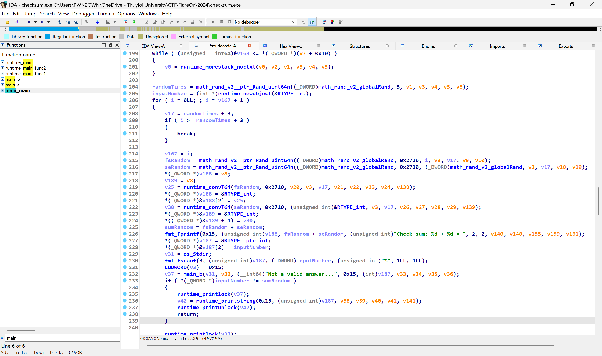
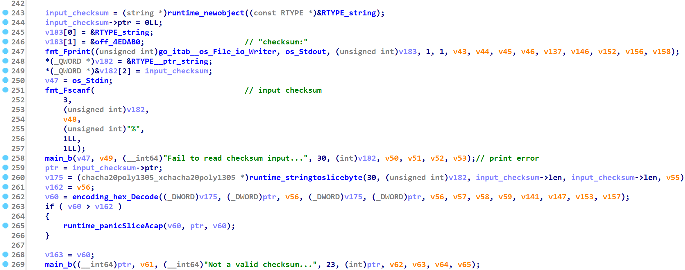
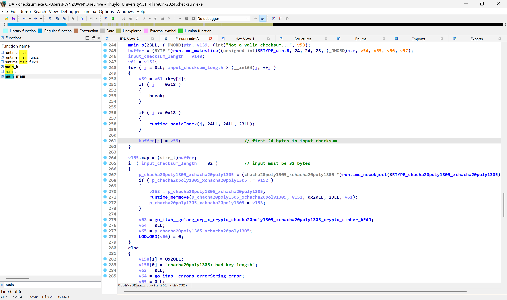
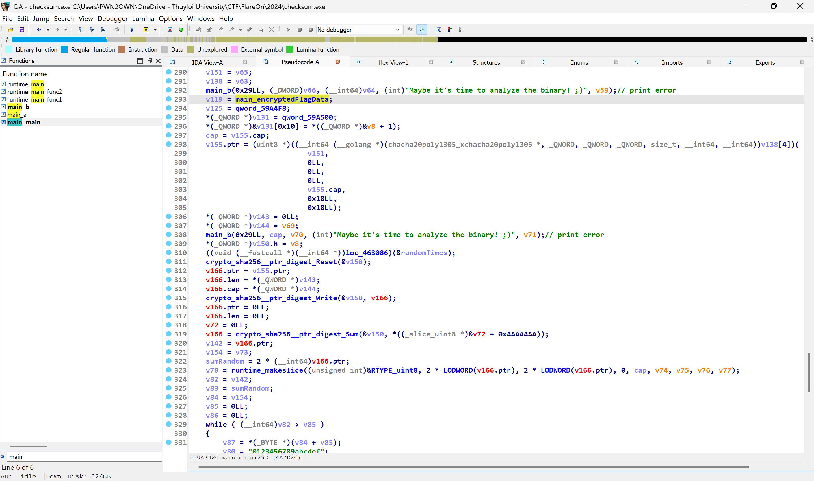
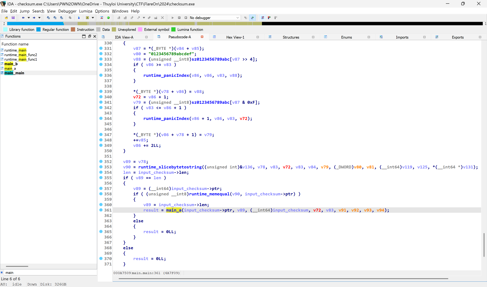
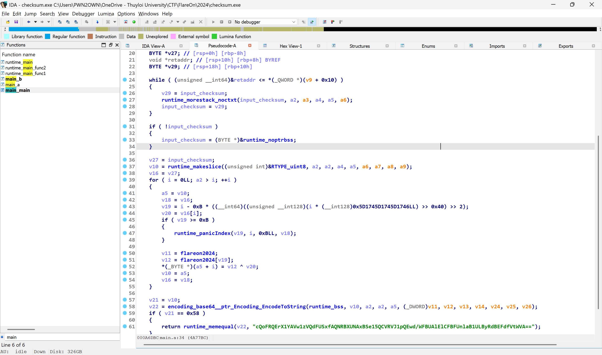
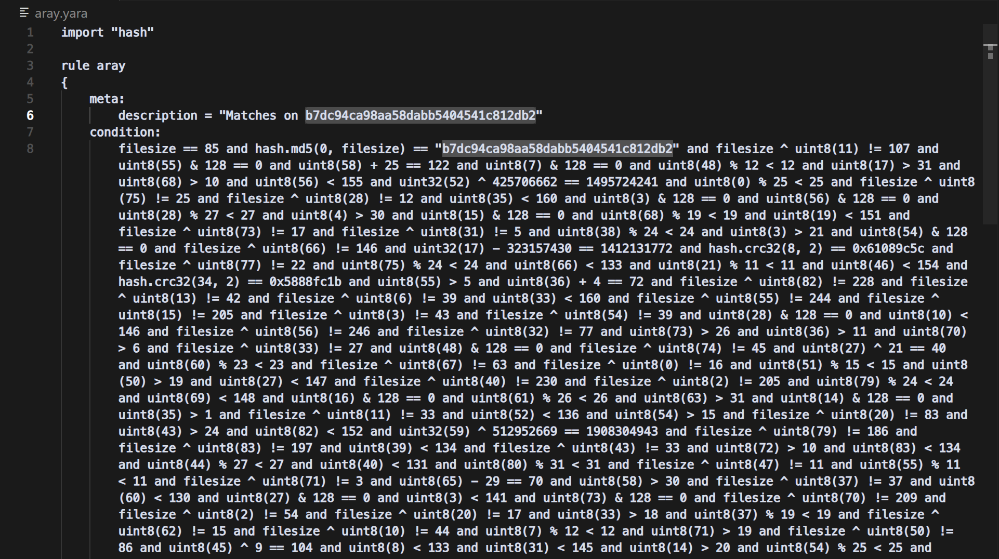

Solutions for some challenges in Flare On 11

<!--more-->

# Flare On 11

## Challenge 2: checksum

### Challenge Overview

Đề bài cho chúng ta một file PE64 viết bằng Go với một số câu hỏi liên quan tới kết quả tính toán cơ bản. 

```
C:\Users\PWN2OWN>"C:\Users\PWN2OWN\FlareOn\2024\checksum.exe"
Check sum: 9418 + 92 = 9510
Good math!!!
------------------------------
Check sum: 9397 + 3991 = 13388
Good math!!!
------------------------------
Check sum: 5380 + 1695 = 7075
Good math!!!
------------------------------
Check sum: 3936 + 7655 = 11591
Good math!!!
------------------------------
Checksum: aaaaaaaaaaaaaaaaaaaaaaaaaaaaaaaa
Maybe it's time to analyze the binary! ;)
```

### Challenge Static Analysis 

Chương trình có 3 hàm không phải là thư viện: `main_main`, `main_a`, `main_b`. 



Đầu tiên, `randomTimes` đại diện cho số lượng câu hỏi sẽ được tạo bởi hàm random, giá trị sẽ nằm trong khoảng [0, 5]. Giá trị này được cộng thêm 3 đơn vị. Vì vậy sẽ có từ 3 - 8 câu hỏi phép tính.\
Mỗi câu hỏi tiếp tục random ra 2 số hạng, tôi đã rename chúng thành `fsRandom` và `seRandom`. Nhiệm vụ của player sẽ là nhập chính xác kết quả tổng 2 số hạng vừa rồi. Nếu trả lời đúng toàn bộ câu hỏi sẽ bước tiếp vào phần sau chương trình. 

Chương trình tiếp tục yêu cầu nhập checksum và kiểm tra hợp lệ bằng Golang API. 



Yêu cầu của `input_checksum` là độ dài 32, trong đó 24 bytes đầu tiên được lấy làm `buffer`. Chương trình sử dụng thuật toán mã hóa XChaCha20-Poly1305, trong đó key 32 bytes và nonce 24 bytes. Từ đó, ta có thể đặt giả thiết `buffer` chính là nonce trong thuật toán này. 



Decode `encryptedFlagData` với key và nonce ở trên, chúng ta thu được decrypted data. 



Decrypted data được hash bởi SHA 256 rồi được chuyển thành mã hex, sau đó đem đi so sánh với `input_checksum`. Nếu bằng nhau thì `main_a` sẽ được gọi và in kết quả ở `{os_UserCacheDir}\REAL_FLAREON_FLAG.JPG`



Phân tích hàm `main_a`, ta thấy nội dung không quá phức tạp. `input_checksum` sẽ được xor với chuỗi `FlareOn2024`, mã hóa base 64 và đem đi so sánh với `cQoFRQErX1YAVw1zVQdFUSxfAQNRBXUNAxBSe15QCVRVJ1pQEwd/WFBUAlElCFBFUnlaB1ULByRdBEFdfVtWVA==`. 



### Flag 

Okay, chỉ cần xor ngược lại sẽ tìm được `input_checksum` yêu cầu. 

```python
>>> x = b"cQoFRQErX1YAVw1zVQdFUSxfAQNRBXUNAxBSe15QCVRVJ1pQEwd/WFBUAlElCFBFUnlaB1ULByRdBEFdfVtWVA=="
>>> y = b"FlareOn2024"
>>> import base64
>>> xx = base64.b64decode(x)
>>> "".join(chr(xx[i] ^ y[i % len(y)]) for i in range(len(xx)))
'7fd7dd1d0e959f74c133c13abb740b9faa61ab06bd0ecd177645e93b1e3825dd'
```

Tìm trong local app data, thu được flag challenge. 


## Challenge 3: aray 

Đề bài cho chúng ta một file YARA rule, nhiệm vụ là đi tìm input để khớp với những rule này. 



### Clean code 

Đầu tiên, làm sạch code bằng việc thay `and` thành `\n`. Nhìn sơ qua, có 2 kiểu dữ liệu là: 
- uint8 
- unint32 

với các toán tử `+`, `-`, `&`, `%`. 

Bên cạnh đó, có một vài phép so sánh sử dụng các hàm mã hóa `sha256`, `md5`, `crc32` kiểu như 

```
hash.crc32(8, 2) == 0x61089c5c 
hash.crc32(34, 2) == 0x5888fc1b 
hash.crc32(63, 2) == 0x66715919 
hash.sha256(14, 2) == "403d5f23d149670348b147a15eeb7010914701a7e99aad2e43f90cfa0325c76f"
hash.sha256(56, 2) == "593f2d04aab251f60c9e4b8bbc1e05a34e920980ec08351a18459b2bc7dbf2f6"
hash.md5(0, 2) == "89484b14b36a8d5329426a3d944d2983"
hash.crc32(78, 2) == 0x7cab8d64 
hash.md5(76, 2) == "f98ed07a4d5f50f7de1410d905f1477f"
hash.md5(50, 2) == "657dae0913ee12be6fb2a6f687aae1c7"
hash.md5(32, 2) == "738a656e8e8ec272ca17cd51e12f558b"
```

Với mỗi chunk chỉ có 2 bytes, dễ dàng brute-force được để tìm kiếm các giá trị thỏa mãn. 

```python
# Define all hash targets and positions
targets = [
    ('crc32',   8,  0x61089c5c),
    ('crc32',   34, 0x5888fc1b),
    ('crc32',   63, 0x66715919),
    ('sha256',  14, "403d5f23d149670348b147a15eeb7010914701a7e99aad2e43f90cfa0325c76f"),
    ('sha256',  56, "593f2d04aab251f60c9e4b8bbc1e05a34e920980ec08351a18459b2bc7dbf2f6"),
    ('md5',     0,  "89484b14b36a8d5329426a3d944d2983"),
    ('crc32',   78, 0x7cab8d64),
    ('md5',     76, "f98ed07a4d5f50f7de1410d905f1477f"),
    ('md5',     50, "657dae0913ee12be6fb2a6f687aae1c7"),
    ('md5',     32, "738a656e8e8ec272ca17cd51e12f558b"),
]

# Choose charset (printable ASCII)
charset = range(32, 127)

# Brute-force
for hash_type, offset, expected in targets:
    # print(f"[*] Brute-forcing {hash_type} at offset {offset}...")

    found = False
    for c1, c2 in itertools.product(charset, repeat=2):
        pair = bytes([c1, c2])

        if hash_type == 'crc32':
            h = binascii.crc32(pair) & 0xffffffff
            if h == expected:
                found = True
        elif hash_type == 'sha256':
            h = hashlib.sha256(pair).hexdigest()
            if h == expected:
                found = True
        elif hash_type == 'md5':
            h = hashlib.md5(pair).hexdigest()
            if h == expected:
                found = True

        if found:
            s.add(flag[offset] == c1)
            s.add(flag[offset + 1] == c2)
            break

    if not found:
        print(f"    [-] No match found at offset {offset}")
```

Đối với các câu điều kiện còn lại, dễ dàng dùng Z3 để giải quyết. 

```python
from z3 import * 

filesize = 85
flag = [BitVec(f"b{i}", 85 * 8) for i in range(filesize)]

s = Solver()

s.add((filesize ^ flag[11]) != 107 )
s.add((flag[55]) & 128 == 0 )
s.add((flag[58]) + 25 == 122 )
s.add((flag[7]) & 128 == 0 )
s.add((flag[48]) % 12 < 12 )

[...............]

if (s.check() == sat):
    res = bytearray()
    for b in flag:
        res.append(s.model()[b].as_long())
    print(res)
```

Full script các bạn có thể đọc ở [đây](./solve.py)

Kết quả thu được là 

```shell
C:\Users\PWN2OWN\CTF\Flare-On\Flare11\3_aray\aray>python brute.py
bytearray(b'rule flareon { strings: $f = "1RuleADayK33p$Malw4r3Aw4y@flare-on.com" condition: $f }')
```