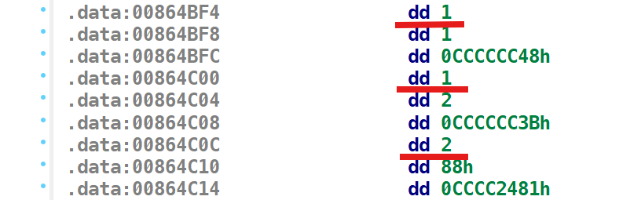
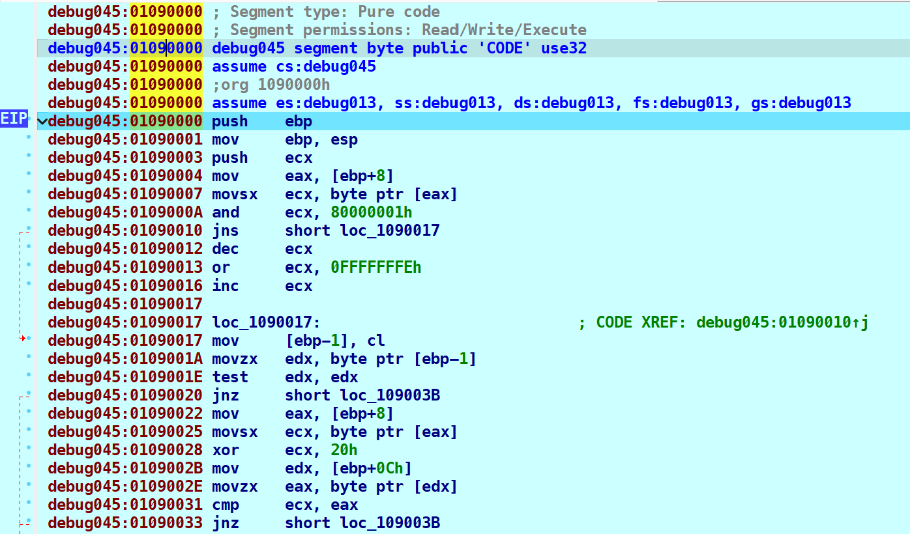
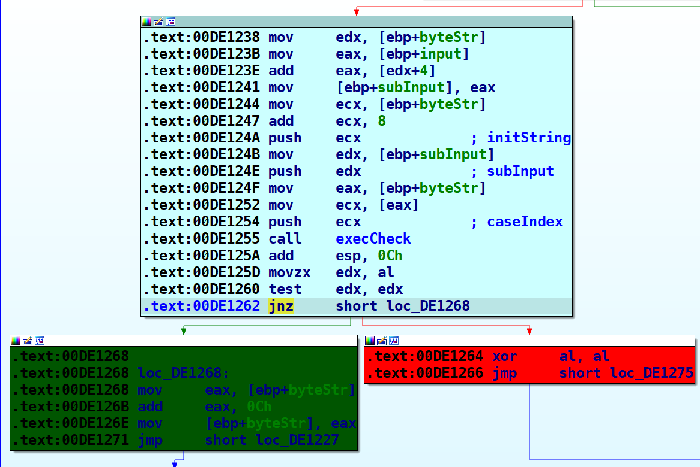
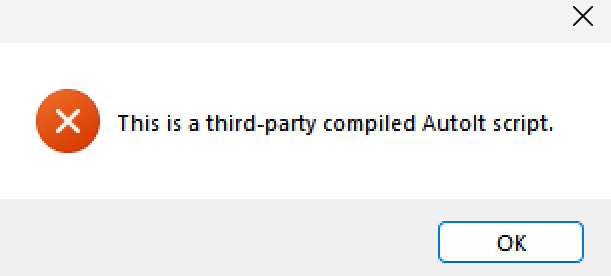
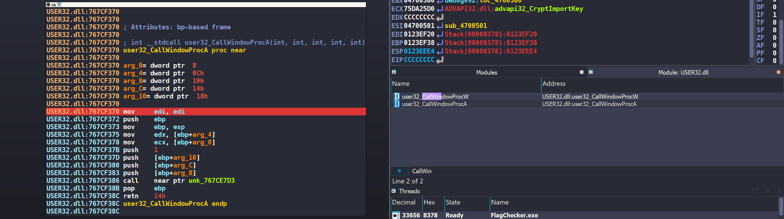
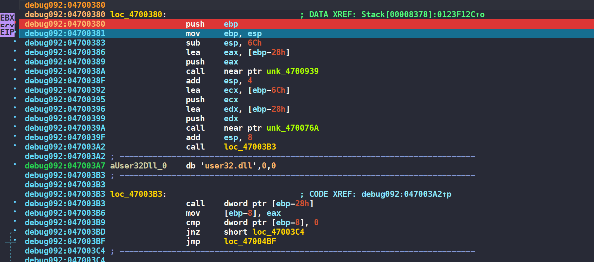
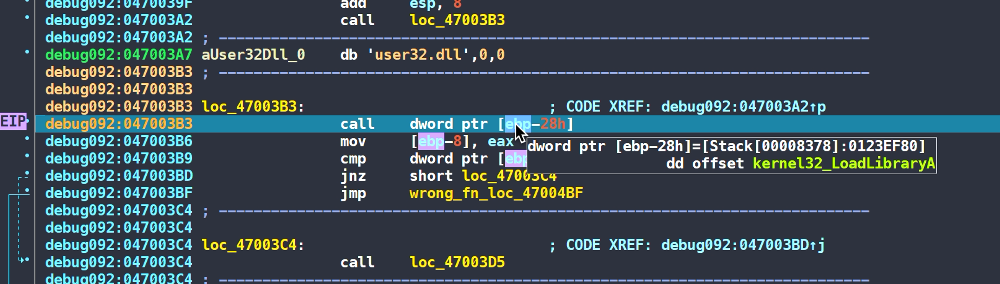

Lời giải cho một số bài reverse mình cảm thấy thích thú. 

<!--more-->

<style>
img {
    box-shadow: rgba(0, 0, 0, 0.35) 0px 5px 15px;
    border-radius: 6px;
    display: block; 
    margin-left: auto; 
    margin-right: auto;
}
</style>

# Kungfu RE

## [VCS Training] crackme_1

Decompile bằng IDA32, ta thu được pseudo-code của hàm `main()` như sau 

```c
int __cdecl main(int argc, const char **argv, const char **envp)
{
  char v4; // [esp+0h] [ebp-2CCh]
  char v5; // [esp+0h] [ebp-2CCh]
  char v6; // [esp+0h] [ebp-2CCh]
  char Format[160]; // [esp+8h] [ebp-2C4h] BYREF
  char input; // [esp+A8h] [ebp-224h] BYREF
  char v9[299]; // [esp+A9h] [ebp-223h] BYREF
  char v10[200]; // [esp+1D4h] [ebp-F8h] BYREF
  void *v11; // [esp+29Ch] [ebp-30h]
  int v12; // [esp+2A0h] [ebp-2Ch]
  int v13; // [esp+2A4h] [ebp-28h]
  char *v14; // [esp+2A8h] [ebp-24h]
  int v15; // [esp+2ACh] [ebp-20h]
  char *v16; // [esp+2B0h] [ebp-1Ch]
  int v17; // [esp+2B4h] [ebp-18h]
  int v18; // [esp+2B8h] [ebp-14h]
  char *p_input; // [esp+2BCh] [ebp-10h]
  char *addrInput; // [esp+2C0h] [ebp-Ch]
  int i; // [esp+2C8h] [ebp-4h]

  input = 0;
  memset(v9, 0, sizeof(v9));
  v12 = 335;
  memset(v10, 0, sizeof(v10));
  strcpy(
    Format,
    "Do you remember the good old days?! I don't know how about you,but I don't. Please help me to recover my memory, it'"
    "s password protected, and that's sad :(\n");
  v11 = &byte_864BE8;
  printf(Format, v4);
  printf("Enter password: ", v5);
  scanf("%300[^\n]s", (char)&input);
  addrInput = &input;
  v16 = v9;
  addrInput += strlen(addrInput);
  v15 = ++addrInput - v9;
  v17 = addrInput - v9;
  p_input = &input;
  v14 = v9;
  p_input += strlen(p_input);
  v13 = ++p_input - v9;
  if ( (unsigned int)(p_input - v9) >= 294 )
  {
    if ( checkInput(&input) )
    {
      v18 = v17 / 3;
      for ( i = 0; i < v17; ++i )
        v10[i % v18] ^= v9[i - 1];
      for ( i = 0; i < v12; ++i )
        byte_864020[i] ^= v10[i % v18];
      printf("\n\nCongratulation! Here is your memo :> \n\n", v6);
      printf("%s", (char)byte_864020);
    }
    else
    {
      printf("\nInvalid password\n", v6);
    }
    getchar();
    getchar();
    return 0;
  }
  else
  {
    printf("oh, no!", v6);
    return 0;
  }
}
```

Chương trình cho phép nhập vào tối đa 300 ký tự (không tính `\n`) và bắt đầu check input nếu độ dài ≥ 294. Ngược lại, chương trình sẽ in ra `oh, no!`

Nếu input của chúng ta hợp lệ, flag sẽ được in ra tại đoạn mã này. 

```c
v18 = v17 / 3;
for ( i = 0; i < v17; ++i )
  v10[i % v18] ^= v9[i - 1];
for ( i = 0; i < v12; ++i )
  byte_864020[i] ^= v10[i % v18];
printf("\n\nCongratulation! Here is your memo :> \n\n", v6);
printf("%s", (char)byte_864020);
```

Chúng ta bắt đầu đi vào hàm `checkInput()` để phân tích chức năng của nó.

```c
char __cdecl checkInput(const char *input)
{
  int i; // [esp+14h] [ebp-10h]
  _DWORD *byteStr; // [esp+18h] [ebp-Ch]

  byteStr = &unk_404BE8;
  if ( (int)strlen(input) < 55 )
    return 0;
  for ( i = 0; i < 122; ++i )
  {
    if ( !(unsigned __int8)execCheck(*byteStr, &input[byteStr[1]], byteStr + 2) )
      return 0;
    byteStr += 3;
  }
  return 1;
}
```

Chương trình khởi tạo một `byteStr`, kiểm tra độ dài `input` một lần nữa và bắt đầu thực hiện 122 round. Sau mỗi round, `byteStr` sẽ tăng thêm 3 đơn vị, mỗi DWORD có kích thước 4 byte. Vậy mỗi round cần dùng 12 byte → kích thước của `byteStr` sẽ là 12 * 122 = 1464 byte.

Trong mỗi round, hàm `execCheck()` sẽ được gọi với 3 đối số. 

```c
execCheck(*(_DWORD *)byteStr, (char *)&input[*((_DWORD *)byteStr + 1)], byteStr + 8)
```

Với kiểu dữ liệu DWORD trong IDA, mỗi đối số sẽ có kích thước 4 byte. Đây là một mẩu chuỗi byte nhỏ trong `byteStr`


> Trong IDA, `db` đại diện cho 1 byte, `dw` đại diện cho 2 byte và `dd` đại diện cho 4 byte
> 

Để biết chính xác các đối số đó làm nhiệm vụ gì, chúng ta sẽ đi tiếp vào trong hàm `execCheck()`

```c
char __cdecl execCheck(int caseIndex, char *subInput, char *initString)
{
  char v4[4]; // [esp+0h] [ebp-20h] BYREF
  LPVOID v5; // [esp+4h] [ebp-1Ch]
  LPVOID v6; // [esp+8h] [ebp-18h]
  SIZE_T v7; // [esp+Ch] [ebp-14h]
  SIZE_T v8; // [esp+10h] [ebp-10h]
  LPVOID lpAddress; // [esp+14h] [ebp-Ch]
  SIZE_T dwSize; // [esp+18h] [ebp-8h]
  char v11; // [esp+1Fh] [ebp-1h]

  v8 = 221;
  v5 = sub_861000((int)&unk_864288, 221, 5);
  v7 = 278;
  v6 = sub_861000((int)&unk_864170, 278, 6);
  if ( !v5 || !v6 )
    return 0;
  switch ( caseIndex )
  {
    case 1:
      dwSize = 97;
      lpAddress = sub_861000((int)&unk_864B80, 97, 1);
      break;
    case 2:
      dwSize = 142;
      lpAddress = sub_861000((int)&unk_864AF0, 142, 2);
      break;
    case 3:
      dwSize = 1685;
      lpAddress = sub_861000((int)&unk_864458, 0x695, 3);
      break;
    case 4:
      dwSize = 235;
      lpAddress = sub_861000((int)&unk_864368, 0xEB, 4);
      break;
    default:
      return 0;
  }
  if ( !lpAddress )
    return 0;
  v11 = ((int (__cdecl *)(char *, char *, char *))lpAddress)(subInput, initString, v4);
  VirtualFree(lpAddress, dwSize, 0x8000u);
  VirtualFree(v5, v8, 0x8000u);
  VirtualFree(v6, v7, 0x8000u);
  return v11;
}
```

Sau một hồi quan sát, ta biết được 3 đối số đó lần lượt là: 

- caseIndex: Có tổng cộng 4 caseIndex. Dưới đây là case 1, 1 và 2.
    
    
- subInput: Lấy ví dụ hình ảnh ở trên với case 2. Index của `subInput` là 88h, nghĩa là `subInput` sẽ được lấy từ `input[0x88]` đến hết.
- initString: Đây là chuỗi byte để so sánh kết quả của từng case.

Chúng ta thấy switch xử lý từng case một nhưng đều theo 1 format là 

```c
lpAddress = sub_861000((int)&unk_864B80, 97, 1);
```

Hàm `sub_861000()` thực hiện một số biến đổi và trả về cho ta là địa chỉ của hàm xử lý từng case đó tại biến `lpAddress`. Và đây là dòng lệnh khi hàm đó được gọi 

```c
v11 = ((int (__cdecl *)(char *, char *, char *))lpAddress)(subInput, initString, v4);
```

Nhiệm vụ của chúng ta là phải lấy được code hàm xử lý 4 case trên. Đặt breakpoint ngay tại dòng code trên, ấn `F7` để đi vào trong hàm xử lý từng case. Dưới đây là một đoạn code của hàm xử lý case 1.



Ấn phím `p` để IDA tạo function, ấn `F5` để xem mã giả của hàm xử lý. 

Thực hiện tương tự cho các case còn lại. Lưu ý là qua từng round, do input ban đầu chúng ta nhập chưa chính xác, chương trình sẽ end khi gọi hàm `execCheck()`. 



Tới câu lệnh `jnz`, mình chỉ cần sửa lại giá trị cờ `ZF` từ 1 thành 0 là có thể đi tiếp vào round sau. 


Bây giờ, chúng ta sẽ đi phân tích cụ thể chức năng của từng hàm.  

Hàm `checkCase1()` sẽ đem xor ký tự `subInput[0]` với 0x20 nếu mã ASCII của nó là chẵn và xor với 0x52 nếu ngược lại. 

```c
bool __cdecl checkCase1(char *subInput, char *initString)
{
  char v2; // cl

  v2 = *subInput % 2;
  if ( !v2 && (*subInput ^ 0x20) == (unsigned __int8)*initString )
    return 1;
  return v2 == 1 && (*subInput ^ 0x52) == (unsigned __int8)*initString;
}
```

Để tìm được kí tự thỏa mãn `checkCase1()` khá đơn giản bằng cách brute force. 

```python
def checkCase1(block): 
    pos = block[4] + block[5] * 256
    k = block[8]
    fsRes = k ^ 0x20 
    seRes = k ^ 0x52 
    
    if (0x20 <= fsRes and fsRes <= 0x7f and fsRes % 2 == 0): 
        flag[pos] = fsRes
    else:
        flag[pos] = seRes
```

> Lưu ý rằng, `block` của mình là một mảng có kích thước 12 byte.

Hàm `checkCase2()` thực hiện biến đổi 2 kí tự `subInput[0]` và `subInput[1]` qua 5 round.

```c
bool __cdecl checkCase2(char *subInput, char *initString)
{
  int i; // [esp+0h] [ebp-Ch]
  unsigned __int16 v4; // [esp+8h] [ebp-4h]

  v4 = subInput[1] | (unsigned __int16)(*subInput << 8);
  for ( i = 1; i <= 5; ++i )
    v4 = (((int)v4 >> (16 - i)) | (v4 << i)) ^ 0x1693;
  return *(unsigned __int16 *)initString == v4;
}
```

Chúng ta hoàn toàn brute force được để tìm được 2 kí tự thỏa mãn. Lưu ý là `v4` chỉ là số 2 byte, trong khi các phép biến đổi có thể làm `v4` vượt qua khoảng giới hạn. Vì vậy sau mỗi vòng brute force, ta phải `v4 &= 0xffff` để nó luôn là số 2 byte. 

```python
def checkCase2(block):
    pos = block[4]+ block[5] * 256
    res = block[9] * 256 + block[8]
    for i in range(0, 0x7f):
        for j in range(0, 0x7f): 
            tmp = j | (i << 8)
            for k in range(1, 6, 1):
                tmp = (((tmp >> (16 - k)) | (tmp << k)) ^ 0x1693) & 0xffff
            if tmp == res: 
                flag[pos] = i
                flag[pos + 1] = j
```

Đối với `checkCase3()`, chương trình biến đổi 3 kí tự đầu của `subInput` và đi so sánh với `initString`. Lưu ý rằng, dưới đây là toàn bộ mã giả do IDA sinh ra. Nếu chú ý sẽ thấy đoạn mã hóa giống y hệt như đoạn code mình đã comment. Mình đoán IDA đã gặp lỗi gì đó trong phân tích / do mình đoán bừa, nhưng không ảnh hưởng đến bài toán nên mình đã comment lại. 

```c
bool __cdecl checkCase3(char *subInput, char *initString)
{
  char alphabet[68]; // [esp+0h] [ebp-64h] BYREF
  int v4; // [esp+44h] [ebp-20h]
  int v5; // [esp+48h] [ebp-1Ch]
  int v7; // [esp+50h] [ebp-14h]
  int i; // [esp+54h] [ebp-10h]
  int v9; // [esp+58h] [ebp-Ch]
  unsigned __int8 idx0; // [esp+5Ch] [ebp-8h]
  unsigned __int8 idx1; // [esp+5Dh] [ebp-7h]
  unsigned __int8 idx2; // [esp+5Eh] [ebp-6h]
  char idx3; // [esp+5Fh] [ebp-5h]
  char subInput0; // [esp+60h] [ebp-4h]
  char subInput1; // [esp+61h] [ebp-3h]
  char subInput2; // [esp+62h] [ebp-2h]

  v9 = 0;
  i = 0;
  v7 = 3;
  v5 = 0;
  v4 = 0;
  qmemcpy(alphabet, "ABDCEHGFIJKLUNOPYRTSMVWXQZajcdefohibkmlngpqrstuv4xzy8123w56709+0", 64);
  while ( v7-- )
  {
    *(&subInput0 + v9++) = *subInput++;
    if ( v9 == 3 )
    {
      idx0 = (subInput0 & 0xFC) >> 2;
      if ( alphabet[idx0] != (unsigned __int8)*initString )
        return 0;
      idx1 = ((subInput1 & 0xF0) >> 4) + 16 * (subInput0 & 3);
      if ( alphabet[idx1] != (unsigned __int8)initString[1] )
        return 0;
      idx2 = ((subInput2 & 0xC0) >> 6) + 4 * (subInput1 & 0xF);
      if ( alphabet[idx2] != (unsigned __int8)initString[2] )
        return 0;
      idx3 = subInput2 & 0x3F;
      if ( alphabet[subInput2 & 0x3F] != (unsigned __int8)initString[3] )
        return 0;
      v9 = 0;
    }
  }
  // if ( v9 <= 0 )
  //   return 1;
  // for ( i = v9; i < 3; ++i )
  //   *(&subInput0 + i) = 0;
  // idx0 = (subInput0 & 0xFC) >> 2;
  // if ( alphabet[idx0] != (unsigned __int8)*initString )
  //   return 0;
  // idx1 = ((subInput1 & 0xF0) >> 4) + 16 * (subInput0 & 3);
  // if ( alphabet[idx1] != (unsigned __int8)initString[1] )
  //   return 0;
  // idx2 = ((subInput2 & 0xC0) >> 6) + 4 * (subInput1 & 0xF);
  // if ( alphabet[idx2] != (unsigned __int8)initString[2] )
  //   return 0;
  // idx3 = subInput2 & 0x3F;
  // return alphabet[subInput2 & 0x3F] == (unsigned __int8)initString[3];
}
```

Chúng ta tiếp tục brute force 3 kí tự để tìm ra đáp án.

```python
def checkCase3(block):
    pos = block[4]+ block[5] * 256
    alphabet = "ABDCEHGFIJKLUNOPYRTSMVWXQZajcdefohibkmlngpqrstuv4xzy8123w56709+0"
    
    for i in range(0, 0x7f):
        subInput0 = i 
        idx0 = (subInput0 & 0xFC) >> 2
        if (ord(alphabet[idx0]) == block[8]): 
            for j in range(0, 0x7f):
                subInput1 = j
                idx1 = ((subInput1 & 0xF0) >> 4) + 16 * (subInput0 & 3)
                if (ord(alphabet[idx1]) == block[9]):
                    for k in range(0, 0x7f):
                        subInput2 = k 
                        idx2 = ((subInput2 & 0xC0) >> 6) + 4 * (subInput1 & 0xF)
                        idx3 = subInput2 & 0x3F
                        if (ord(alphabet[idx2]) == block[10] and ord(alphabet[idx3]) == block[11]):
                            flag[pos] = i
                            flag[pos + 1] = j
                            flag[pos + 2] = k
```

Đây là mã giả của hàm `checkCase4()`. Ta thấy `createTable` và `checkFlag` là 2 con trỏ hàm. Vậy nên ta sẽ không double-click để xem sourcecode. Lúc debug, ta chỉ cần ấn `F7` là sẽ nhảy được vào trong từng hàm. 

```c
int __cdecl checkCase4(char *input, char *initString, int a3)
{
  char table[256]; // [esp+0h] [ebp-11Ch] BYREF
  int (__cdecl *checkFlag)(char *, char *, char *); // [esp+100h] [ebp-1Ch]
  void (__cdecl *createTable)(char *, char *); // [esp+104h] [ebp-18h]
  char copyInput[8]; // [esp+108h] [ebp-14h] BYREF
  char susanString[11]; // [esp+110h] [ebp-Ch] BYREF

  strcpy(susanString, "susan");
  createTable = *(void (__cdecl **)(char *, char *))(a3 + 4);
  checkFlag = *(int (__cdecl **)(char *, char *, char *))(a3 + 8);
  createTable(susanString, table);
  copyInput[0] = *input;
  copyInput[1] = input[1];
  copyInput[2] = input[2];
  copyInput[3] = input[3];
  copyInput[4] = 0;
  return checkFlag(table, copyInput, initString);
}
```

Hàm `createTable()` tạo cho chúng ta một bảng `table` có kích thước 256 byte với giá trị các ô nằm trong khoảng 0 → 255. Lưu ý là giá trị các ô đã bị hoán đổi sau vòng for kia. Nhưng do hàm luôn nhận string `susan` làm đối số, vì vậy giá trị của  `table` sẽ luôn được cố định.

```c
int __cdecl createTable(const char *susanString, int *table)
{
  signed int v2; // kr00_4
  int v4; // [esp+Ch] [ebp-14h]
  int i; // [esp+10h] [ebp-10h]
  int j; // [esp+18h] [ebp-8h]
  char v7; // [esp+1Eh] [ebp-2h]

  v2 = strlen(susanString);
  v4 = 0;
  for ( i = 0; i < 256; ++i )
    *((_BYTE *)table + i) = i;
  for ( j = 0; j < 256; ++j )
  {
    v4 = (susanString[j % v2] + v4 + *((unsigned __int8 *)table + j)) % 256;
    v7 = *((_BYTE *)table + j);
    *((_BYTE *)table + j) = *((_BYTE *)table + v4);
    *((_BYTE *)table + v4) = v7;
  }
  return 0;
}
```

Sau khi có `table` ở trên, hàm `checkFlag()` bắt đầu đi thực hiện biến đổi và kiểm tra. 

```c
char __cdecl checkFlag(char *table, const char *input, char *initString)
{
  unsigned int inputLength; // [esp+4h] [ebp-20h]
  unsigned int cnt; // [esp+10h] [ebp-14h]
  int idx2; // [esp+14h] [ebp-10h]
  int idx1; // [esp+1Ch] [ebp-8h]
  char tmp; // [esp+22h] [ebp-2h]

  idx1 = 0;
  idx2 = 0;
  cnt = 0;
  inputLength = strlen(input);
  while ( cnt < inputLength )
  {
    idx1 = (idx1 + 1) % 256;
    idx2 = (idx2 + table[idx1]) % 256;
    tmp = table[idx1];
    table[idx1] = table[idx2];
    table[idx2] = tmp;
    if ( initString[cnt] != (table[(table[idx2] + table[idx1]) % 256] ^ input[cnt]) )
      return 0;
    ++cnt;
  }
  return 1;
}
```

Ta dễ dàng viết script brute force để lấy được kết quả 

```python

def checkCase4(block):
    pos = block[4]+ block[5] * 256
    
    table = [0x73, 0xE9, 0x39, 0xD0, 0x98, 0xBB, 0xD6, 0x23, 0x16, 0x19, 
            0xFC, 0x7C, 0x0F, 0x32, 0x80, 0xB2, 0x9C, 0x57, 0x36, 0x9E, 
            0x91, 0x4D, 0xDF, 0x7A, 0x08, 0x42, 0x76, 0xA5, 0x11, 0xAD, 
            0x3E, 0xD2, 0x65, 0x4F, 0x71, 0x20, 0xA0, 0x28, 0xC3, 0x33, 
            0x4E, 0x6C, 0x79, 0x95, 0xAF, 0x6B, 0xC8, 0x70, 0xA2, 0x41, 
            0x92, 0xBA, 0x4B, 0xD1, 0xE3, 0xBC, 0x2B, 0xF4, 0x1C, 0x46, 
            0x78, 0xD9, 0xB6, 0x04, 0xED, 0x96, 0x68, 0x97, 0xF5, 0x09, 
            0x3A, 0x25, 0xEB, 0xBE, 0x49, 0xD8, 0x6D, 0xB5, 0x13, 0x7E, 
            0x00, 0x77, 0x6F, 0xB4, 0x0E, 0x1D, 0xB7, 0x2C, 0xCA, 0x7F, 
            0x3C, 0x5F, 0x7D, 0xA9, 0x88, 0xC4, 0xC0, 0x5E, 0x18, 0xCD, 
            0xE0, 0x0C, 0x62, 0x29, 0x54, 0x84, 0x07, 0x47, 0xC9, 0xF7, 
            0x2E, 0x06, 0xE2, 0x24, 0x83, 0xE4, 0x52, 0x15, 0x45, 0x43, 
            0xDA, 0x31, 0x82, 0x87, 0xB8, 0x14, 0xE7, 0xCF, 0xE5, 0x40, 
            0x1A, 0xDD, 0x9A, 0x35, 0x85, 0xF3, 0x63, 0xB1, 0xF0, 0x3D, 
            0x0D, 0xEA, 0x8B, 0xEE, 0x99, 0xAE, 0xA4, 0x51, 0xA8, 0x1E, 
            0x1B, 0xC5, 0x34, 0x4C, 0xFD, 0xFF, 0xEC, 0x37, 0x64, 0x75, 
            0x05, 0x01, 0x8C, 0x21, 0xA3, 0x60, 0x50, 0x6A, 0xB9, 0x5C, 
            0x53, 0xCE, 0x26, 0xC1, 0x3B, 0xF2, 0x3F, 0x66, 0xCC, 0x2F, 
            0xA1, 0x94, 0x56, 0x59, 0x4A, 0x9F, 0xD7, 0x89, 0x48, 0x5B, 
            0x12, 0x9D, 0x8F, 0x55, 0xD5, 0xBF, 0x5D, 0x2D, 0xF8, 0x1F, 
            0x30, 0x0B, 0x5A, 0x44, 0x67, 0x2A, 0x38, 0xF9, 0xF6, 0x6E, 
            0x7B, 0xEF, 0xE8, 0x8A, 0xDE, 0xC7, 0xF1, 0xA7, 0xCB, 0xDC, 
            0xD4, 0xD3, 0x27, 0xFE, 0x10, 0x02, 0xBD, 0x90, 0xFA, 0xE1, 
            0x69, 0xE6, 0x72, 0xAB, 0xAC, 0x22, 0x8E, 0x86, 0x9B, 0xFB, 
            0xA6, 0x17, 0xB3, 0x61, 0x74, 0xC6, 0xC2, 0x58, 0xB0, 0xAA, 
            0xDB, 0x93, 0x8D, 0x03, 0x0A, 0x81]
            
    idx1 = 0
    idx2 = 0
    for i in range(4):
        idx1 = (idx1 + 1) % 256
        idx2 = (idx2 + table[idx1]) % 256
        tmp = table[idx1]
        table[idx1] = table[idx2]
        table[idx2] = tmp

        for j in range(0, 0x7f):
            if ((table[(table[idx2] + table[idx1]) % 256] ^ j) == block[8 + i]):
                flag[pos + i] = j
                break
```

> Trong IDA có chức năng tạo mảng với chuỗi byte. Đầu tiên ta sẽ select đoạn byte cần tạo mảng, ấn `Shift E` và chọn các option phù hợp.

Sau khi hoàn thiện việc giải mã 4 hàm rồi, ta sẽ lấy toàn bộ chuỗi byte ban đầu, chia thành từng block và xử lý theo từng case một. 
    
```python
data = [0x01, 0x00, 0x00, 0x00, 0x00, 0x00, 0x00, 0x00, 0x74, 0xCC, 
    0xCC, 0xCC, 0x01, 0x00, 0x00, 0x00, 0x01, 0x00, 0x00, 0x00, 
    0x48, 0xCC, 0xCC, 0xCC, 0x01, 0x00, 0x00, 0x00, 0x02, 0x00, 
    0x00, 0x00, 0x3B, 0xCC, 0xCC, 0xCC, 0x02, 0x00, 0x00, 0x00, 
    0x88, 0x00, 0x00, 0x00, 0x81, 0x24, 0xCC, 0xCC, 0x03, 0x00, 
    0x00, 0x00, 0x6F, 0x00, 0x00, 0x00, 0x63, 0x33, 0x59, 0x6F, 
    0x02, 0x00, 0x00, 0x00, 0x84, 0x00, 0x00, 0x00, 0x01, 0x01, 
    0xCC, 0xCC, 0x02, 0x00, 0x00, 0x00, 0x0A, 0x00, 0x00, 0x00, 
    0x35, 0xAF, 0xCC, 0xCC, 0x01, 0x00, 0x00, 0x00, 0xD0, 0x00, 
    0x00, 0x00, 0x33, 0xCC, 0xCC, 0xCC, 0x03, 0x00, 0x00, 0x00, 
    0x0F, 0x00, 0x00, 0x00, 0x64, 0x4D, 0x78, 0x76, 0x04, 0x00, 
    0x00, 0x00, 0x12, 0x00, 0x00, 0x00, 0xDD, 0x20, 0xB1, 0x1A, 
    0x01, 0x00, 0x00, 0x00, 0x06, 0x01, 0x00, 0x00, 0x0C, 0xCC, 
    0xCC, 0xCC, 0x03, 0x00, 0x00, 0x00, 0xE8, 0x00, 0x00, 0x00, 
    0x6A, 0x44, 0x42, 0x35, 0x02, 0x00, 0x00, 0x00, 0x1D, 0x00, 
    0x00, 0x00, 0xA6, 0x21, 0xCC, 0xCC, 0x02, 0x00, 0x00, 0x00, 
    0x1F, 0x00, 0x00, 0x00, 0xBE, 0x8A, 0xCC, 0xCC, 0x01, 0x00, 
    0x00, 0x00, 0x21, 0x00, 0x00, 0x00, 0x4C, 0xCC, 0xCC, 0xCC, 
    0x02, 0x00, 0x00, 0x00, 0x22, 0x00, 0x00, 0x00, 0x26, 0x0E, 
    0xCC, 0xCC, 0x01, 0x00, 0x00, 0x00, 0x24, 0x00, 0x00, 0x00, 
    0x35, 0xCC, 0xCC, 0xCC, 0x01, 0x00, 0x00, 0x00, 0x5D, 0x00, 
    0x00, 0x00, 0x3B, 0xCC, 0xCC, 0xCC, 0x03, 0x00, 0x00, 0x00, 
    0x2B, 0x00, 0x00, 0x00, 0x6A, 0x45, 0x39, 0x75, 0x04, 0x00, 
    0x00, 0x00, 0x16, 0x00, 0x00, 0x00, 0x88, 0x3F, 0xED, 0x0D, 
    0x03, 0x00, 0x00, 0x00, 0xEB, 0x00, 0x00, 0x00, 0x6A, 0x33, 
    0x56, 0x7A, 0x02, 0x00, 0x00, 0x00, 0x32, 0x00, 0x00, 0x00, 
    0x35, 0xAF, 0xCC, 0xCC, 0x02, 0x00, 0x00, 0x00, 0x30, 0x00, 
    0x00, 0x00, 0xAB, 0x2F, 0xCC, 0xCC, 0x02, 0x00, 0x00, 0x00, 
    0x08, 0x00, 0x00, 0x00, 0x81, 0x36, 0xCC, 0xCC, 0x03, 0x00, 
    0x00, 0x00, 0x34, 0x00, 0x00, 0x00, 0x6A, 0x6C, 0x63, 0x75, 
    0x01, 0x00, 0x00, 0x00, 0x37, 0x00, 0x00, 0x00, 0x00, 0xCC, 
    0xCC, 0xCC, 0x02, 0x00, 0x00, 0x00, 0x38, 0x00, 0x00, 0x00, 
    0x25, 0x3C, 0xCC, 0xCC, 0x03, 0x00, 0x00, 0x00, 0x53, 0x00, 
    0x00, 0x00, 0x49, 0x46, 0x52, 0x67, 0x01, 0x00, 0x00, 0x00, 
    0x3E, 0x00, 0x00, 0x00, 0x21, 0xCC, 0xCC, 0xCC, 0x01, 0x00, 
    0x00, 0x00, 0x3F, 0x00, 0x00, 0x00, 0x54, 0xCC, 0xCC, 0xCC, 
    0x01, 0x00, 0x00, 0x00, 0x92, 0x00, 0x00, 0x00, 0x37, 0xCC, 
    0xCC, 0xCC, 0x01, 0x00, 0x00, 0x00, 0x86, 0x00, 0x00, 0x00, 
    0x74, 0xCC, 0xCC, 0xCC, 0x04, 0x00, 0x00, 0x00, 0x09, 0x01, 
    0x00, 0x00, 0xC0, 0x36, 0xFD, 0x13, 0x01, 0x00, 0x00, 0x00, 
    0x4A, 0x00, 0x00, 0x00, 0x00, 0xCC, 0xCC, 0xCC, 0x01, 0x00, 
    0x00, 0x00, 0x0D, 0x01, 0x00, 0x00, 0x52, 0xCC, 0xCC, 0xCC, 
    0x04, 0x00, 0x00, 0x00, 0x4D, 0x00, 0x00, 0x00, 0xC1, 0x3D, 
    0xBA, 0x43, 0x03, 0x00, 0x00, 0x00, 0x1C, 0x01, 0x00, 0x00, 
    0x64, 0x32, 0x77, 0x6F, 0x04, 0x00, 0x00, 0x00, 0x3A, 0x00, 
    0x00, 0x00, 0xCD, 0x73, 0xB0, 0x0C, 0x04, 0x00, 0x00, 0x00, 
    0x56, 0x00, 0x00, 0x00, 0xCD, 0x73, 0xB9, 0x06, 0x03, 0x00, 
    0x00, 0x00, 0x5A, 0x00, 0x00, 0x00, 0x51, 0x32, 0x6D, 0x79, 
    0x04, 0x00, 0x00, 0x00, 0x0F, 0x01, 0x00, 0x00, 0xCB, 0x36, 
    0xAE, 0x10, 0x01, 0x00, 0x00, 0x00, 0x5E, 0x00, 0x00, 0x00, 
    0x3D, 0xCC, 0xCC, 0xCC, 0x02, 0x00, 0x00, 0x00, 0x5F, 0x00, 
    0x00, 0x00, 0x01, 0x21, 0xCC, 0xCC, 0x04, 0x00, 0x00, 0x00, 
    0x68, 0x00, 0x00, 0x00, 0x88, 0x27, 0xB5, 0x06, 0x01, 0x00, 
    0x00, 0x00, 0xBA, 0x00, 0x00, 0x00, 0x44, 0xCC, 0xCC, 0xCC, 
    0x04, 0x00, 0x00, 0x00, 0x9A, 0x00, 0x00, 0x00, 0xDC, 0x3A, 
    0xBA, 0x06, 0x03, 0x00, 0x00, 0x00, 0x6C, 0x00, 0x00, 0x00, 
    0x49, 0x46, 0x4A, 0x6D, 0x04, 0x00, 0x00, 0x00, 0x04, 0x00, 
    0x00, 0x00, 0x88, 0x62, 0xAE, 0x43, 0x04, 0x00, 0x00, 0x00, 
    0x72, 0x00, 0x00, 0x00, 0xC1, 0x20, 0xFD, 0x0E, 0x02, 0x00, 
    0x00, 0x00, 0xC7, 0x00, 0x00, 0x00, 0x3D, 0x86, 0xCC, 0xCC, 
    0x01, 0x00, 0x00, 0x00, 0x7A, 0x00, 0x00, 0x00, 0x2B, 0xCC, 
    0xCC, 0xCC, 0x04, 0x00, 0x00, 0x00, 0x7B, 0x00, 0x00, 0x00, 
    0x88, 0x27, 0xB8, 0x0D, 0x01, 0x00, 0x00, 0x00, 0xC6, 0x00, 
    0x00, 0x00, 0x0E, 0xCC, 0xCC, 0xCC, 0x01, 0x00, 0x00, 0x00, 
    0x83, 0x00, 0x00, 0x00, 0x2B, 0xCC, 0xCC, 0xCC, 0x01, 0x00, 
    0x00, 0x00, 0x03, 0x00, 0x00, 0x00, 0x01, 0xCC, 0xCC, 0xCC, 
    0x04, 0x00, 0x00, 0x00, 0x93, 0x00, 0x00, 0x00, 0x88, 0x23, 
    0xBC, 0x13, 0x04, 0x00, 0x00, 0x00, 0xA9, 0x00, 0x00, 0x00, 
    0x88, 0x37, 0xB2, 0x43, 0x03, 0x00, 0x00, 0x00, 0x0C, 0x00, 
    0x00, 0x00, 0x5A, 0x47, 0x6D, 0x43, 0x04, 0x00, 0x00, 0x00, 
    0x8A, 0x00, 0x00, 0x00, 0xCE, 0x36, 0xBC, 0x11, 0x04, 0x00, 
    0x00, 0x00, 0x8E, 0x00, 0x00, 0x00, 0xDB, 0x73, 0xBC, 0x11, 
    0x04, 0x00, 0x00, 0x00, 0xAF, 0x00, 0x00, 0x00, 0xD1, 0x27, 
    0xB5, 0x0A, 0x02, 0x00, 0x00, 0x00, 0x44, 0x00, 0x00, 0x00, 
    0x25, 0xA5, 0xCC, 0xCC, 0x01, 0x00, 0x00, 0x00, 0x97, 0x00, 
    0x00, 0x00, 0x37, 0xCC, 0xCC, 0xCC, 0x02, 0x00, 0x00, 0x00, 
    0x98, 0x00, 0x00, 0x00, 0x01, 0x2F, 0xCC, 0xCC, 0x04, 0x00, 
    0x00, 0x00, 0x61, 0x00, 0x00, 0x00, 0xDC, 0x3C, 0xFD, 0x02, 
    0x01, 0x00, 0x00, 0x00, 0x9E, 0x00, 0x00, 0x00, 0x52, 0xCC, 
    0xCC, 0xCC, 0x04, 0x00, 0x00, 0x00, 0x9F, 0x00, 0x00, 0x00, 
    0xDB, 0x7D, 0xFD, 0x3A, 0x04, 0x00, 0x00, 0x00, 0x46, 0x00, 
    0x00, 0x00, 0xCB, 0x26, 0xB1, 0x17, 0x01, 0x00, 0x00, 0x00, 
    0xA7, 0x00, 0x00, 0x00, 0x33, 0xCC, 0xCC, 0xCC, 0x01, 0x00, 
    0x00, 0x00, 0x2F, 0x00, 0x00, 0x00, 0x00, 0xCC, 0xCC, 0xCC, 
    0x01, 0x00, 0x00, 0x00, 0x87, 0x00, 0x00, 0x00, 0x48, 0xCC, 
    0xCC, 0xCC, 0x01, 0x00, 0x00, 0x00, 0xAD, 0x00, 0x00, 0x00, 
    0x33, 0xCC, 0xCC, 0xCC, 0x01, 0x00, 0x00, 0x00, 0xAE, 0x00, 
    0x00, 0x00, 0x4E, 0xCC, 0xCC, 0xCC, 0x04, 0x00, 0x00, 0x00, 
    0xC9, 0x00, 0x00, 0x00, 0xC7, 0x26, 0xFD, 0x00, 0x02, 0x00, 
    0x00, 0x00, 0xB3, 0x00, 0x00, 0x00, 0x22, 0xA1, 0xCC, 0xCC, 
    0x01, 0x00, 0x00, 0x00, 0xB5, 0x00, 0x00, 0x00, 0x00, 0xCC, 
    0xCC, 0xCC, 0x04, 0x00, 0x00, 0x00, 0xB6, 0x00, 0x00, 0x00, 
    0xD1, 0x3C, 0xA8, 0x43, 0x03, 0x00, 0x00, 0x00, 0x65, 0x00, 
    0x00, 0x00, 0x51, 0x33, 0x59, 0x73, 0x01, 0x00, 0x00, 0x00, 
    0xBB, 0x00, 0x00, 0x00, 0x37, 0xCC, 0xCC, 0xCC, 0x01, 0x00, 
    0x00, 0x00, 0xBC, 0x00, 0x00, 0x00, 0x31, 0xCC, 0xCC, 0xCC, 
    0x04, 0x00, 0x00, 0x00, 0xD2, 0x00, 0x00, 0x00, 0xDC, 0x73, 
    0xA9, 0x0C, 0x03, 0x00, 0x00, 0x00, 0xBF, 0x00, 0x00, 0x00, 
    0x5A, 0x54, 0x42, 0x38, 0x02, 0x00, 0x00, 0x00, 0xC2, 0x00, 
    0x00, 0x00, 0x81, 0x21, 0xCC, 0xCC, 0x01, 0x00, 0x00, 0x00, 
    0xDA, 0x00, 0x00, 0x00, 0x4E, 0xCC, 0xCC, 0xCC, 0x04, 0x00, 
    0x00, 0x00, 0x7F, 0x00, 0x00, 0x00, 0xC9, 0x30, 0xB4, 0x17, 
    0x04, 0x00, 0x00, 0x00, 0x76, 0x00, 0x00, 0x00, 0xCD, 0x21, 
    0xB8, 0x0F, 0x04, 0x00, 0x00, 0x00, 0xFB, 0x00, 0x00, 0x00, 
    0xCD, 0x73, 0xAD, 0x11, 0x02, 0x00, 0x00, 0x00, 0xCD, 0x00, 
    0x00, 0x00, 0xA6, 0x26, 0xCC, 0xCC, 0x01, 0x00, 0x00, 0x00, 
    0xCF, 0x00, 0x00, 0x00, 0x00, 0xCC, 0xCC, 0xCC, 0x02, 0x00, 
    0x00, 0x00, 0x4B, 0x00, 0x00, 0x00, 0x25, 0x2C, 0xCC, 0xCC, 
    0x01, 0x00, 0x00, 0x00, 0xD1, 0x00, 0x00, 0x00, 0x31, 0xCC, 
    0xCC, 0xCC, 0x02, 0x00, 0x00, 0x00, 0xBD, 0x00, 0x00, 0x00, 
    0xA3, 0x22, 0xCC, 0xCC, 0x03, 0x00, 0x00, 0x00, 0x13, 0x01, 
    0x00, 0x00, 0x49, 0x47, 0x6D, 0x79, 0x02, 0x00, 0x00, 0x00, 
    0xC4, 0x00, 0x00, 0x00, 0x26, 0xA4, 0xCC, 0xCC, 0x03, 0x00, 
    0x00, 0x00, 0xEF, 0x00, 0x00, 0x00, 0x6A, 0x47, 0x6D, 0x6C, 
    0x04, 0x00, 0x00, 0x00, 0xDC, 0x00, 0x00, 0x00, 0xCD, 0x73, 
    0xBC, 0x0D, 0x01, 0x00, 0x00, 0x00, 0xEE, 0x00, 0x00, 0x00, 
    0x00, 0xCC, 0xCC, 0xCC, 0x04, 0x00, 0x00, 0x00, 0xE4, 0x00, 
    0x00, 0x00, 0xC6, 0x27, 0xAF, 0x0C, 0x03, 0x00, 0x00, 0x00, 
    0x1A, 0x00, 0x00, 0x00, 0x5A, 0x31, 0x39, 0x55, 0x01, 0x00, 
    0x00, 0x00, 0x2E, 0x00, 0x00, 0x00, 0x35, 0xCC, 0xCC, 0xCC, 
    0x04, 0x00, 0x00, 0x00, 0xE0, 0x00, 0x00, 0x00, 0xCC, 0x73, 
    0xBE, 0x0C, 0x01, 0x00, 0x00, 0x00, 0xDB, 0x00, 0x00, 0x00, 
    0x35, 0xCC, 0xCC, 0xCC, 0x02, 0x00, 0x00, 0x00, 0xF2, 0x00, 
    0x00, 0x00, 0x8C, 0xA4, 0xCC, 0xCC, 0x04, 0x00, 0x00, 0x00, 
    0xF4, 0x00, 0x00, 0x00, 0x88, 0x32, 0xB3, 0x07, 0x02, 0x00, 
    0x00, 0x00, 0x25, 0x00, 0x00, 0x00, 0xA7, 0x39, 0xCC, 0xCC, 
    0x04, 0x00, 0x00, 0x00, 0x40, 0x00, 0x00, 0x00, 0x88, 0x37, 
    0xB4, 0x05, 0x01, 0x00, 0x00, 0x00, 0xFF, 0x00, 0x00, 0x00, 
    0x3D, 0xCC, 0xCC, 0xCC, 0x03, 0x00, 0x00, 0x00, 0x00, 0x01, 
    0x00, 0x00, 0x51, 0x32, 0x56, 0x6B, 0x03, 0x00, 0x00, 0x00, 
    0x03, 0x01, 0x00, 0x00, 0x64, 0x58, 0x4A, 0x6D, 0x04, 0x00, 
    0x00, 0x00, 0x27, 0x00, 0x00, 0x00, 0xC7, 0x1D, 0xBA, 0x3C, 
    0x02, 0x00, 0x00, 0x00, 0x07, 0x01, 0x00, 0x00, 0x2B, 0x06, 
    0xCC, 0xCC, 0x04, 0x00, 0x00, 0x00, 0xA3, 0x00, 0x00, 0x00, 
    0xC7, 0x26, 0xFD, 0x00, 0x01, 0x00, 0x00, 0x00, 0xA8, 0x00, 
    0x00, 0x00, 0x4E, 0xCC, 0xCC, 0xCC, 0x01, 0x00, 0x00, 0x00, 
    0x0E, 0x01, 0x00, 0x00, 0x3D, 0xCC, 0xCC, 0xCC, 0x03, 0x00, 
    0x00, 0x00, 0xF8, 0x00, 0x00, 0x00, 0x49, 0x46, 0x52, 0x67, 
    0x04, 0x00, 0x00, 0x00, 0xD6, 0x00, 0x00, 0x00, 0x88, 0x30, 
    0xB5, 0x02, 0x02, 0x00, 0x00, 0x00, 0x16, 0x01, 0x00, 0x00, 
    0x25, 0x86, 0xCC, 0xCC, 0x04, 0x00, 0x00, 0x00, 0x18, 0x01, 
    0x00, 0x00, 0xDC, 0x20, 0xFD, 0x0C, 0x02, 0x00, 0x00, 0x00, 
    0x51, 0x00, 0x00, 0x00, 0xA8, 0xA2, 0xCC, 0xCC, 0x03, 0x00, 
    0x00, 0x00, 0x1F, 0x01, 0x00, 0x00, 0x63, 0x6C, 0x56, 0x33, 
    0x03, 0x00, 0x00, 0x00, 0x22, 0x01, 0x00, 0x00, 0x51, 0x58, 
    0x4A, 0x6B, 0x01, 0x00, 0x00, 0x00, 0x25, 0x01, 0x00, 0x00, 
    0x0E, 0xCC, 0xCC, 0xCC]

flag = [0] * 300 

def checkCase1(block): 
    pos = block[4] + block[5] * 256
    k = block[8]
    fsRes = k ^ 0x20 
    seRes = k ^ 0x52 
    
    if (0x20 <= fsRes and fsRes <= 0x7f and fsRes % 2 == 0): 
        flag[pos] = fsRes
    else:
        flag[pos] = seRes

def checkCase2(block):
    pos = block[4]+ block[5] * 256
    res = block[9] * 256 + block[8]
    for i in range(0, 0x7f):
        for j in range(0, 0x7f): 
            tmp = j | (i << 8)
            for k in range(1, 6, 1):
                tmp = (((tmp >> (16 - k)) | (tmp << k)) ^ 0x1693) & 0xffff
            if tmp == res: 
                flag[pos] = i
                flag[pos + 1] = j

def checkCase3(block):
    pos = block[4]+ block[5] * 256
    alphabet = "ABDCEHGFIJKLUNOPYRTSMVWXQZajcdefohibkmlngpqrstuv4xzy8123w56709+0"
    
    for i in range(0, 0x7f):
        subInput0 = i 
        idx0 = (subInput0 & 0xFC) >> 2
        if (ord(alphabet[idx0]) == block[8]): 
            for j in range(0, 0x7f):
                subInput1 = j
                idx1 = ((subInput1 & 0xF0) >> 4) + 16 * (subInput0 & 3)
                if (ord(alphabet[idx1]) == block[9]):
                    for k in range(0, 0x7f):
                        subInput2 = k 
                        idx2 = ((subInput2 & 0xC0) >> 6) + 4 * (subInput1 & 0xF)
                        idx3 = subInput2 & 0x3F
                        if (ord(alphabet[idx2]) == block[10] and ord(alphabet[idx3]) == block[11]):
                            flag[pos] = i
                            flag[pos + 1] = j
                            flag[pos + 2] = k
                            
def checkCase4(block):
    pos = block[4]+ block[5] * 256
    
    table = [0x73, 0xE9, 0x39, 0xD0, 0x98, 0xBB, 0xD6, 0x23, 0x16, 0x19, 
            0xFC, 0x7C, 0x0F, 0x32, 0x80, 0xB2, 0x9C, 0x57, 0x36, 0x9E, 
            0x91, 0x4D, 0xDF, 0x7A, 0x08, 0x42, 0x76, 0xA5, 0x11, 0xAD, 
            0x3E, 0xD2, 0x65, 0x4F, 0x71, 0x20, 0xA0, 0x28, 0xC3, 0x33, 
            0x4E, 0x6C, 0x79, 0x95, 0xAF, 0x6B, 0xC8, 0x70, 0xA2, 0x41, 
            0x92, 0xBA, 0x4B, 0xD1, 0xE3, 0xBC, 0x2B, 0xF4, 0x1C, 0x46, 
            0x78, 0xD9, 0xB6, 0x04, 0xED, 0x96, 0x68, 0x97, 0xF5, 0x09, 
            0x3A, 0x25, 0xEB, 0xBE, 0x49, 0xD8, 0x6D, 0xB5, 0x13, 0x7E, 
            0x00, 0x77, 0x6F, 0xB4, 0x0E, 0x1D, 0xB7, 0x2C, 0xCA, 0x7F, 
            0x3C, 0x5F, 0x7D, 0xA9, 0x88, 0xC4, 0xC0, 0x5E, 0x18, 0xCD, 
            0xE0, 0x0C, 0x62, 0x29, 0x54, 0x84, 0x07, 0x47, 0xC9, 0xF7, 
            0x2E, 0x06, 0xE2, 0x24, 0x83, 0xE4, 0x52, 0x15, 0x45, 0x43, 
            0xDA, 0x31, 0x82, 0x87, 0xB8, 0x14, 0xE7, 0xCF, 0xE5, 0x40, 
            0x1A, 0xDD, 0x9A, 0x35, 0x85, 0xF3, 0x63, 0xB1, 0xF0, 0x3D, 
            0x0D, 0xEA, 0x8B, 0xEE, 0x99, 0xAE, 0xA4, 0x51, 0xA8, 0x1E, 
            0x1B, 0xC5, 0x34, 0x4C, 0xFD, 0xFF, 0xEC, 0x37, 0x64, 0x75, 
            0x05, 0x01, 0x8C, 0x21, 0xA3, 0x60, 0x50, 0x6A, 0xB9, 0x5C, 
            0x53, 0xCE, 0x26, 0xC1, 0x3B, 0xF2, 0x3F, 0x66, 0xCC, 0x2F, 
            0xA1, 0x94, 0x56, 0x59, 0x4A, 0x9F, 0xD7, 0x89, 0x48, 0x5B, 
            0x12, 0x9D, 0x8F, 0x55, 0xD5, 0xBF, 0x5D, 0x2D, 0xF8, 0x1F, 
            0x30, 0x0B, 0x5A, 0x44, 0x67, 0x2A, 0x38, 0xF9, 0xF6, 0x6E, 
            0x7B, 0xEF, 0xE8, 0x8A, 0xDE, 0xC7, 0xF1, 0xA7, 0xCB, 0xDC, 
            0xD4, 0xD3, 0x27, 0xFE, 0x10, 0x02, 0xBD, 0x90, 0xFA, 0xE1, 
            0x69, 0xE6, 0x72, 0xAB, 0xAC, 0x22, 0x8E, 0x86, 0x9B, 0xFB, 
            0xA6, 0x17, 0xB3, 0x61, 0x74, 0xC6, 0xC2, 0x58, 0xB0, 0xAA, 
            0xDB, 0x93, 0x8D, 0x03, 0x0A, 0x81]
            
    idx1 = 0
    idx2 = 0
    for i in range(4):
        idx1 = (idx1 + 1) % 256
        idx2 = (idx2 + table[idx1]) % 256
        tmp = table[idx1]
        table[idx1] = table[idx2]
        table[idx2] = tmp

        for j in range(0, 0x7f):
            if ((table[(table[idx2] + table[idx1]) % 256] ^ j) == block[8 + i]):
                flag[pos + i] = j
                break

for i in range(0, len(data), 12):
    block = []
    for j in range(12):
        block.append(data[i + j])
    if (block[0] == 1): 
        checkCase1(block)
    elif (block[0] == 2):
        checkCase2(block)
    elif block[0] == 3:
        checkCase3(block)
    else: 
        checkCase4(block)

for i in range(len(flag)):
    print(chr(flag[i]), end="")
```
    
Kết quả message thu được là 

```
ThiS 1s A rIdiCuLously l0ng_Lon9_l0ng_loNg_lOng strIng. The most difficult thing is the decision to act, the rest is merely tenacity. The fears are paper tigers. You can do anything you decide to do. You can act to change and control your life; and the procedure, the process is its own reward.
```

Chạy lại chương trình và nhập message trên, ta được flag là `vcstraining{Aw3s0me_D4ta_tran5Form4t1oN_Kak4}`


## [KCSC CTF 2022] FlagChecker

Đề bài cho chúng ta một file PE32 được pack bởi `UPX` và viết bằng AutoIt. 


Sau khi unpack, mình sử dụng tool `unautoit` để extract script autoit nhờ bài viết này https://sec.vnpt.vn/2022/03/zer0pts22-ctf-writeup-a-part-flag-checker. 

> Có lẽ tác giả đã đổi tên nên sẽ không tìm được tool này trên Github. Các bạn có thể vào folder CTF của mình để tải công cụ này xuống.  

Hàm `checker()` gọi `CallWindowProcA` với đống shellcode phía trên cùng với `input` nhập vào.  

```au3
Func checker()
    Local $input = GUICtrlRead($iflag)
    Local $len_input = StringLen($input)
    Local $opcode = "0x558bec83ec6c8d45d850e8aa05000083c4048d4d94518d55d8" & "52e8cb03000083c408e80c0000007573657233322e646c6c00" & "00ff55d88945f8837df8007505e9fb000000e80c0000004d65" & "7373616765426f7841008b45f850e8b306000083c4088945f0" & "8b4d0851ff55e883f81c740b8b550cc60200e9c4000000c645" & "bcf8c645bd50c645beccc645bfefc645c0e6c645c13cc645c2" & "35c645c396c645c41dc645c561c645c6aec645c7c0c645c8c5" & "c645c931c645cacec645cbb0c645cce7c645cd1dc645ceedc6" & "45cfbcc645d05dc645d181c645d269c645d38ac645d435c645" & "d574c645d657c645d7b68b4508508d4d94518d55d852e84700" & "000083c40c8945f4c745fc00000000eb098b45fc83c0018945" & "fc837dfc1c7d1f8b4df4034dfc0fb6118b45fc0fb64c05bc3b" & "d174088b550cc60200eb08ebd28b450cc600018be55dc3558b" & "ec83ec445657b90b000000e82c00000068747470733a2f2f77" & "77772e796f75747562652e636f6d2f77617463683f763d6451" & "773477395767586351005e8d7dbcf3a5c745f800000000c745" & "f400000000c745fc000000008b4510508b4d088b5110ffd289" & "45ec6a006a016a006a008d45f8508b4d0c8b11ffd285c07507" & "33c0e91b0200008d45f4506a006a0068048000008b4df8518b" & "550c8b420cffd085c075156a008b4df8518b550c8b4224ffd0" & "33c0e9e9010000837df40075156a008b4df8518b550c8b4224" & "ffd033c0e9ce0100006a008d4dbc518b55088b4210ffd0508d" & "4dbc518b55f4528b450c8b4808ffd185c075218b55f4528b45" & "0c8b481cffd16a008b55f8528b450c8b4824ffd133c0e98a01" & "00008d55fc526a008b45f45068016800008b4df8518b550c8b" & "4214ffd085c075218b4df4518b550c8b421cffd06a008b4df8" & "518b550c8b4224ffd033c0e94a0100008b4df4518b550c8b42" & "1cffd06a008d4dec516a006a006a016a008b55fc528b450c8b" & "4810ffd185c07527837dfc0074218b55fc528b450c8b4820ff" & "d16a008b55f8528b450c8b4824ffd133c0e9f90000006a0468" & "001000008b55ec83c201526a008b45088b4808ffd18945e883" & "7de8007527837dfc0074218b55fc528b450c8b4820ffd16a00" & "8b55f8528b450c8b4824ffd133c0e9b10000008b55ec83c201" & "528b45e850e8cc06000083c408c745f000000000eb098b4df0" & "83c101894df08b55f03b55ec73128b45e80345f08b4d10034d" & "f08a118810ebdd8b4510508b4d088b5110ffd2508d45ec508b" & "4de8516a006a016a008b55fc528b450c8b4810ffd185c07524" & "837dfc00741e8b55fc528b450c8b4820ffd16a008b55f8528b" & "450c8b4824ffd133c0eb23837dfc00741a8b55fc528b450c8b" & "4820ffd16a008b55f8528b450c8b4824ffd18b45e85f5e8be5" & "5dc3558bec51e81000000061647661706933322e646c6c0000" & "00008b45088b08ffd18945fc837dfc00750732c0e99b010000" & "e818000000437279707441637175697265436f6e7465787441" & "000000008b55fc52e8d102000083c4088b4d0c8901e8100000" & "00437279707443726561746548617368008b55fc52e8ab0200" & "0083c4088b4d0c89410ce8100000004372797074496d706f72" & "744b657900008b55fc52e88402000083c4088b4d0c894104e8" & "1000000043727970744465726976654b657900008b55fc52e8" & "5d02000083c4088b4d0c894114e81000000043727970744861" & "7368446174610000008b55fc52e83602000083c4088b4d0c89" & "4108e8100000004372797074456e6372797074000000008b55" & "fc52e80f02000083c4088b4d0c894110e81400000043727970" & "7447657448617368506172616d0000008b55fc52e8e4010000" & "83c4088b4d0c894118e814000000437279707444657374726f" & "7948617368000000008b55fc52e8b901000083c4088b4d0c89" & "411ce810000000437279707444657374726f794b6579008b55" & "fc52e89201000083c4088b4d0c894120e81400000043727970" & "7452656c65617365436f6e74657874008b55fc52e867010000" & "83c4088b4d0c894124b0018be55dc3558bec83ec18e81c0000" & "006b00650072006e0065006c00330032002e0064006c006c00" & "00000000e88602000083c4048945fc837dfc00750732c0e915" & "010000e8100000004c6f61644c69627261727941000000008b" & "45fc50e8fb00000083c4088945f8837df800750732c0e9e400" & "0000e81000000047657450726f634164647265737300008b4d" & "fc51e8ca00000083c4088945f4837df400750732c0e9b30000" & "00e8100000005669727475616c416c6c6f63000000008b55fc" & "52e89900000083c4088945f0837df000750732c0e982000000" & "e80c0000005669727475616c46726565008b45fc50e86c0000" & "0083c4088945ec837dec00750432c0eb58e80c0000006c7374" & "726c656e41000000008b4dfc51e84200000083c4088945e883" & "7de800750432c0eb2e8b55088b45f889028b4d088b55f48951" & "048b45088b4df08948088b55088b45ec89420c8b4d088b55e8" & "895110b0018be55dc3558bec83ec3c8b45088945ec8b4dec0f" & "b71181fa4d5a0000740733c0e9350100008b45ec8b4d080348" & "3c894de4ba080000006bc2008b4de48d5401788955e88b45e8" & "833800750733c0e9080100008b4de88b118955e08b45e00345" & "088945f48b4df48b51188955dc8b45f48b481c894dd08b55f4" & "8b42208945d88b4df48b51248955d4c745f800000000eb098b" & "45f883c0018945f88b4df83b4ddc0f83b30000008b55080355" & "d88b45f88d0c82894dc88b55080355d48b45f88d0c42894dcc" & "8b55080355d08b45cc0fb7088d148a8955c48b45c88b4d0803" & "08894df0c745fc00000000c745fc00000000eb098b55fc83c2" & "018955fc8b450c0345fc0fbe0885c974278b55f00355fc0fbe" & "0285c0741a8b4d0c034dfc0fbe118b45f00345fc0fbe083bd1" & "7402eb02ebc38b550c0355fc0fbe0285c075198b4df0034dfc" & "0fbe1185d2750c8b45c48b4d0803088bc1eb07e938ffffff33" & "c08be55dc3558bec83ec34c745e40000000064a13000000089" & "45e48b4de48b510c8955d88b45d88b480c8b5010894dcc8955" & "d08b45cc8945d48b4dd4894de8837de8000f845a0100008b55" & "e8837a18000f844d0100008b45e8837830007502ebde8b4de8" & "8b51308955ecc745f000000000c745f000000000eb098b45f0" & "83c0018945f08b4df08b55080fb7044a85c00f84dd0000008b" & "4df08b55ec0fb7044a85c00f84cb0000008b4df08b55080fb7" & "044a83f85a7f378b4df08b55080fb7044a83f8417c288b4df0" & "8b55080fb7044a83c0208945e08b4df08b5508668b45e06689" & "044a668b4de066894dfeeb0e8b55f08b4508668b0c5066894d" & "fe668b55fe668955f88b45f08b4dec0fb7144183fa5a7f378b" & "45f08b4dec0fb7144183fa417c288b45f08b4dec0fb7144183" & "c2208955dc8b45f08b4dec668b55dc66891441668b45dc6689" & "45fceb0e8b4df08b55ec668b044a668945fc668b4dfc66894d" & "f40fb755f80fb745f43bd07402eb05e908ffffff8b4df08b55" & "080fb7044a85c075168b4df08b55ec0fb7044a85c075088b4d" & "e88b4118eb0f8b55e88b028945e8e99cfeffff33c08be55dc3" & "558bec518b45088945fc837d0c00741a8b4dfcc601008b55fc" & "83c2018955fc8b450c83e80189450cebe08b45088be55dc300" & "00000000000000000000000000000000000000000000000000" & "00000000000000000000000000000000000000000000000000" & "00000000000000000000000000000000000000000000000000" & "00000000000000000000000000000000000000000000000000" & "00000000000000000000000000000000000000000000000000" & "00000000000000000000000000000000000000000000000000" & "00000000000000000000000000000000000000000000000000" & "00000000000000000000000000000000000000000000000000" & "00000000000000000000000000000000000000000000000000" & "00000000000000000000000000000000000000000000000000" & "00000000000000000000000000000000000000000000000000" & "00000000000000000000000000000000000000000000000000" & "00000000000000000000000000000000000000000000000000" & "00000000000000000000000000000000000000000000000000" & "00000000000000000000000000000000000000000000000000" & "00000000000000000000000000000000000000000000000000" & "00000000000000000000000000000000000000000000000000" & "00000000000000000000000000000000000000000000"
    Local $opcode_buf = DllStructCreate("byte[" & BinaryLen($opcode) & "]")
    DllStructSetData($opcode_buf, 0x1, Binary($opcode))
    Local $input_buf = DllStructCreate("byte[" & BinaryLen($input) + 0x1 & "]")
    DllStructSetData($input_buf, 0x1, Binary($input))
    Local $is_flag = DllStructCreate("byte[1]")
    DllStructSetData($is_flag, 0x1, Binary("0x00"))
    DllCall("user32.dll", "none", "CallWindowProcA", "ptr", DllStructGetPtr($opcode_buf), "ptr", DllStructGetPtr($input_buf), "ptr", DllStructGetPtr($is_flag), "int", 0x0, "int", 0x0)
    If DllStructGetData($is_flag, 0x1) == "0x01" Then
        MsgBox(0x0, '', "Correct!")
    Else
        MsgBox($MB_ICONERROR, '', "Incorrect!")
    EndIf
EndFunc    ; -> checker
```

Thử debug với IDA, ta thấy chương trình thông báo lỗi, chứng tỏ có antidebug ở đây 



Sử dụng tab strings, ta dễ dàng tìm ra đoạn check debug và bypass nó. Đặt breakpoint tại `CallWindowProcA` trong `user32.dll`, F9 để chương trình chạy tới đoạn gọi shellcode và input. 



Đây là hình minh họa một đoạn shellcode ngắn của chương trình. 


Ta thấy string `user32.dll` nằm ngay ở shellcode, sau khi makecode trừ các chuỗi như trên, ta thu được kết quả như sau



Đối với file 32 bit, khi gọi hàm `loc_47003B3()`, chương trình sẽ push chuỗi `user32.dll` lên stack, khi đó hàm được gọi có thể sử dụng chuỗi này như một đối số được truyền vào của hàm. 

Thực hiện makecode tương tự cho các bytecode còn lại, chúng ta sẽ vừa debug trâu bò vừa ghi các hàm được gọi ra bản nháp để hiểu sâu hơn về chương trình.    

### Hàm loc_4700939
Hàm có sự xuất hiện của những strings như: 
- kernel32.dll 
- LoadLibraryA
- GetProcAddress
- VirtualAlloc
- VirtualFree
- lstrlenA

nên mình nghĩ khả năng cao nó sẽ load các hàm từ `kernell32.dll`.  

### Hàm loc_470076A
Tương tự như trên, ở hàm này, chương trình sẽ load các hàm thực hiện mã hóa từ `advapi32.dll`.
- CryptAcquireContextA
- CryptCreateHash
- CryptImportKey
- CryptDeriveKey
- CryptHashData
- CryptEncrypt
- CryptGetHashParam
- CryptDestroyHash
- CryptDestroyKey
- CryptReleaseContext

### Hàm loc_47003B3

Phần thực thi chính shellcode sẽ nằm ở đây. Như cách giải thích việc gọi hàm ở phía trên, 



việc gọi hàm như vậy sẽ tương đương với 
```c
HMODULE user32 = LoadLibraryA("user32.dll");
if (!user32) {
    wrong_fn_loc_47004BF();
}
```
Tiếp theo, chương trình có load hàm `MessageBoxA()`, kiểm tra độ dài `input` với 28. Đoạn mã phía dưới theo phỏng đoán của mình chính là `ciphertext` để check flag. 


Tới đây, mình dành vài tiếng để vừa makecode, debug và ghi chép mô phỏng lại toàn bộ các hàm được gọi. Kết quả được clean bởi ChatGPT như sau 
```cpp
#include <stdio.h>
#include <stdlib.h>
#include <windows.h>
#include <wincrypt.h>

#pragma comment(lib, "Advapi32.lib")

void wrong_fn_loc_47004BF() {
    printf("Something went wrong!\n");
    exit(1);
}

int main() {
    char input[1000];
    printf("Enter input: ");
    scanf("%999s", input); // Đảm bảo không tràn bộ nhớ

    // Load user32.dll
    HMODULE user32 = LoadLibraryA("user32.dll");
    if (!user32) {
        wrong_fn_loc_47004BF();
    }

    // Lấy địa chỉ hàm MessageBoxA
    FARPROC messageBoxA = GetProcAddress(user32, "MessageBoxA");
    if (!messageBoxA) {
        wrong_fn_loc_47004BF();
    }

    // Kiểm tra độ dài input
    int input_len = lstrlenA(input);
    if (input_len != 28) {
        wrong_fn_loc_47004BF();
    }

    // Mã hóa input với Cryptography API
    HCRYPTPROV hProv;
    if (!CryptAcquireContextA(&hProv, NULL, NULL, PROV_RSA_FULL, 0)) {
        wrong_fn_loc_47004BF();
    }

    HCRYPTHASH hHash;
    if (!CryptCreateHash(hProv, CALG_SHA, 0, 0, &hHash)) {
        wrong_fn_loc_47004BF();
    }

    char youtube_url[] = "https://www.youtube.com/watch?v=dQw4w9WgXcQ";
    int youtube_url_len = lstrlenA(youtube_url);

    // Hash dữ liệu URL
    if (!CryptHashData(hHash, (BYTE*)youtube_url, youtube_url_len, 0)) {
        wrong_fn_loc_47004BF();
    }

    HCRYPTKEY hKey;
    if (!CryptDeriveKey(hProv, CALG_RC4, hHash, 0, &hKey)) {
        wrong_fn_loc_47004BF();
    }

    // Giải phóng hash sau khi tạo key
    CryptDestroyHash(hHash);

    // Tính toán bộ nhớ cần thiết cho đầu ra mã hóa
    DWORD buf_len = input_len;
    if (!CryptEncrypt(hKey, 0, TRUE, 0, NULL, &buf_len, input_len)) {
        wrong_fn_loc_47004BF();
    }

    // Cấp phát bộ nhớ để chứa dữ liệu mã hóa
    BYTE* buffer = (BYTE*)VirtualAlloc(NULL, buf_len, MEM_COMMIT | MEM_RESERVE, PAGE_READWRITE);
    if (!buffer) {
        wrong_fn_loc_47004BF();
    }

    memset(buffer, 0, 0x1D);

    // Sao chép input vào buffer và thực hiện mã hóa
    memcpy(buffer, input, input_len);

    if (!CryptEncrypt(hKey, 0, TRUE, 0, buffer, &input_len, buf_len)) {
        wrong_fn_loc_47004BF();
    }

    printf("Encryption successful! Encrypted data length: %lu\n", buf_len);

    // Dọn dẹp
    CryptDestroyKey(hKey);
    CryptReleaseContext(hProv, 0);

    return 0;
}
```

Tới đây thì ta hoàn toàn hình dung được luồng thực thi của chương trình. Trước tiên sẽ cho phép nhập input mã hóa RC4 với key là SHA1 của `youtube_url`. Cuối cùng sẽ so sánh với mảng `ciphertext`. 

Mình sẽ lấy luôn các hàm decrypt bằng cryptoAPI để tránh những sai sót không mong muốn. 

```cpp
#include <stdio.h>
#include <stdlib.h>
#include <windows.h>
#include <wincrypt.h>

#pragma comment(lib, "Advapi32.lib")


int main() {
    // Ciphertext đã mã hóa
    BYTE ciphertext[] = {
        0xF8, 0x50, 0xCC, 0xEF, 0xE6, 0x3C, 0x35, 0x96, 0x1D, 0x61, 0xAE, 0xC0, 
        0xC5, 0x31, 0xCE, 0xB0, 0xE7, 0x1D, 0xED, 0xBC, 0x5D, 0x81, 0x69, 0x8A, 
        0x35, 0x74, 0x57, 0xB6
    };
    DWORD ciphertext_len = sizeof(ciphertext);

    // Tạo khóa RC4 từ URL cố định
    HCRYPTPROV hProv;
    if (CryptAcquireContextA(&hProv, NULL, NULL, PROV_RSA_FULL, 0)) {
        printf("Good\n");
    }

    HCRYPTHASH hHash;
    if (CryptCreateHash(hProv, CALG_SHA, 0, 0, &hHash)) {
        printf("Good\n");

    }

    BYTE youtube_url[] = "https://www.youtube.com/watch?v=dQw4w9WgXcQ";
    int youtube_url_len = lstrlenA((const char*) youtube_url);

    // Hash dữ liệu URL
    if (CryptHashData(hHash, youtube_url, youtube_url_len, 0)) {
        printf("Good\n");
    }

    HCRYPTKEY hKey;
    if (CryptDeriveKey(hProv, CALG_RC4, hHash, 0, &hKey)) {
        printf("Good\n");
    }

    // Giải phóng hash sau khi tạo key
    CryptDestroyHash(hHash);

    // Giải mã dữ liệu
    DWORD plaintext_len = ciphertext_len; // Độ dài plaintext sau khi giải mã
    if (CryptDecrypt(hKey, 0, TRUE, 0, (BYTE*) ciphertext, &plaintext_len)) {
        printf("Flag = %s", ciphertext);
    }

    // Dọn dẹp tài nguyên
    CryptDestroyKey(hKey);
    CryptReleaseContext(hProv, 0);

    return 0;
}
```

Flag thu được là `KCSC{rC4_8uT_1T_L00k2_W31Rd}`