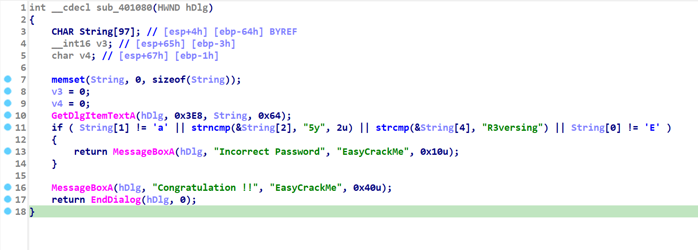
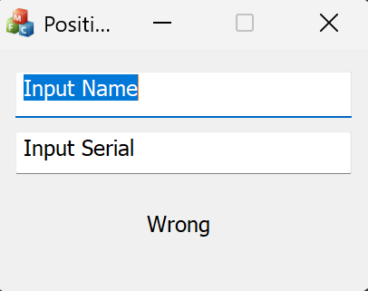
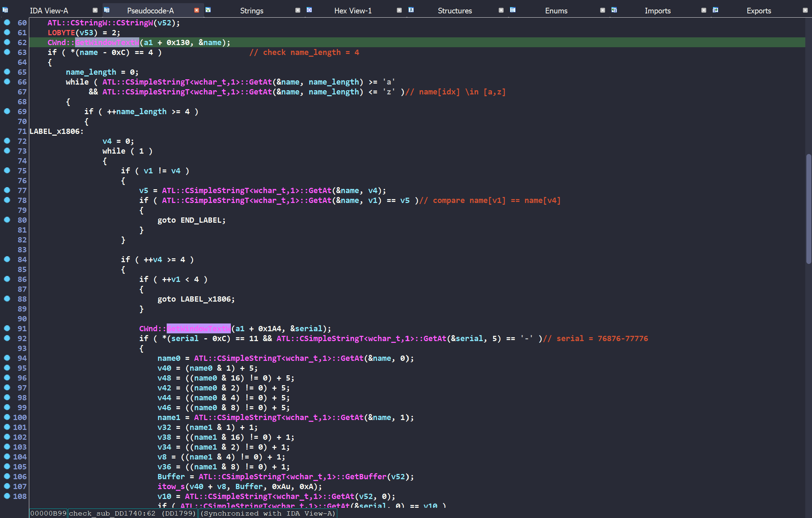

Vậy là mình đã kết thúc năm 3 đại học. Đúng là thời gian không chờ đợi một ai ... 

<!--more-->
<style>
img {
    box-shadow: rgba(0, 0, 0, 0.35) 0px 5px 15px;
    border-radius: 6px;
    display: block; 
    margin-left: auto; 
    margin-right: auto;
}
</style>

# reversing.kr

## Replace ~ 150 points 

### Overview 

Một bài yêu cầu nhập password chính xác. Khi click check, chương trình chạy một lúc và tự thoát ngay sau đó. 


### Static Analysis

Đây là mã giả của chương trình khi được phân tích trong IDAPRO32. 


Lời gọi hàm `sub_40466F()` dẫn tới lệnh `call $+5` rất lạ. Mình đặt breakpoint ngay chỗ này và debug để xem nó đang làm gì. 

### Dynamic Analysis

Quan sát kỹ càng, nhận thấy rằng giá trị `dword_4084D0` chính là giá trị hexacimal của input. 


Tiếp tục debug sâu vào từng dòng lệnh, giá trị `dword_4084D0` lần lượt được cộng thêm các giá trị: 2, 0x601605C7, 2. Chạy hết chương trình, xuất hiện cửa sổ lỗi như sau:


Instruction tham chiếu một địa chỉ không hợp lệ 0x60160A9D. Đây cũng chính là kết quả của `dword_4084D0`

```
dword_4084D0 = hex(input) + 2 + 0x601605C7 + 2
```

### Solving 

Vậy nhiệm vụ lúc này là chỉ cần đưa `dword_4084D0` trỏ về đoạn code `correct`. Giá trị input thỏa mãn là: 
```
input = (0x401071 - 2 - 0x601605C7 - 2) & 0xFFFFFFFF = 2687109798
```

> Do kết quả âm nên phải & 0xFFFFFFFF 

## ImagePrc ~ 120 points 

### Overview 

Chương trình cho người chơi vẽ hình bất kỳ và có nút check kết quả. 


Với dạng bài này, khả năng cao chương trình sẽ so sánh hình chúng ta vẽ với dữ liệu đã có sẵn. 

### Static Analysis

Chương trình đăng ký lớp cửa sổ với các thuộc tính: Background, Cursor, Icon, ... Sau đó tính toán vị trí để cửa sổ ở giữa màn hình, tạo cửa sổ và hiển thị. 


Hàm xử lý logic chính của chương trình chính là `sub_401130()`. Trước tiên, nó tạo một bitmap có kích thước 200x150.


Tiếp theo, gọi các hàm `FindResourceA()`, `LoadResource()`, `LockResource()` để tải tài nguyên có sẵn lên rồi đem đi so sánh với dữ liệu mình vẽ. 


### Solving 

Sử dụng tool Paint, tạo ra một bức ảnh có kích thước 200x150, lưu dưới dạng BMP picture. 


Copy toàn bộ tài nguyên bằng tool Resource Hacker, tiếp tục dùng tool HxD để paste chúng vào ảnh ở trên. Phần được select là phần được giữ lại của BMP picture. 


Save lại và mở ra, ta có được đáp án thử thách. 


## Music Player ~ 150 points 

### Overview

Chạy một đoạn nhạc mp3 có độ dài > 60s, một message box hiện lên với nội dung khá khó hiểu "????". 


Thử thách còn cung cấp một file `ReadMe.txt` với nội dung:  

```
This MP3 Player is limited to 1 minutes.
You have to play more than one minute.

There are exist several 1-minute-check-routine.
After bypassing every check routine, you will see the perfect flag.
```

Đọc qua, chúng ta có thể hình dung được nhiệm vụ sẽ phải đi bypass những đoạn check "1-minute" có trong chương trình. 

### Static Analysis

Chương trình được viết bởi ngôn ngữ Visual Basic, thực sự các hàm được IDAPRO tạo ra đều không đem lại giá trị quá nhiều. Mình bắt đầu đi tìm những đoạn code có liên quan tới việc hiển thị Message Box.

Kiểm tra ở tab Import, ta thấy `__imp_rtcMsgBox` giúp gợi nhớ tới Message Box và được gọi ở 2 hàm `sub_4038D0()` và `sub_4044C0()`. 


Ở `sub_4038D0()`, hàm `__imp_rtcMsgBox` được gọi khá nhiều nhưng mình không tìm thấy đoạn code nào có kiểm tra độ dài thời gian file mp3. 


Ở `sub_4044C0`, ta tìm được đoạn check thời gian ngay tại đây 


Chính đoạn check đó sẽ đưa chương trình vào nhánh sai (màu đỏ). Vì vậy, tôi sẽ dùng plugin KeyPatch để thay đổi từ lệnh `jl` thành `jmp` (nhảy trực tiếp) tới vị trí 0x004045FE. 


Apply patch, save và chạy lại chương trình. Một lỗi khác lại xuất hiện "Run-time error". 


Sau khi quan sát toàn bộ các hàm bên nhánh đúng, tôi đã đi hỏi [ChatGPT](https://chatgpt.com/share/68666386-bf3c-8010-86c7-dbbb1536e1b2) về các hàm có thể gây lỗi. Tôi đã quyết định sửa `jge` thành `jmp` để nó bỏ qua hàm `__imp___vbaHresultCheckObj()` đầu tiên. 


Lưu lại chương trình, ta thu được flag ở thanh tiêu đề chương trình. 


## Easy Crack ~ 100 points 

Hàm check input rất rõ ràng như sau 



Ghép nối các đoạn check lại, ta thu được flag "Ea5yR3versing". 

## Position ~ 160 points 

### Overview 

Chương trình là một bài keygen thuần túy. 



> Khi chạy chương trình, máy mình thông báo thiếu [msvcr100.dll](https://www.dll-files.com/download/ef3e115c225588a680acf365158b2f4a/msvcr100.dll.html?c=RzJuTXBnOWM1WFhYa0ZFY0hyOC9vZz09) và [mfc100u.dll](https://www.dll-files.com/download/6358cc2a77f3c12c5b9b16190d5477f7/mfc100u.dll.html?c=Q1JBekRTNVFtelcwZmJmVEoySVZPZz09). Lên mạng download các dll còn thiếu về rồi paste vào thư mục challenge để fix các lỗi. 

Ngoài ra, còn có một file `README.txt.` có nội dung như sau: 

```
ReversingKr KeygenMe

Find the Name when the Serial is 76876-77776
This problem has several answers.

Password is ***p
```

Từ đó, ta có thể hình dung được phải đi tìm `name` có tận cùng là chữ `p` và thỏa mãn serial bằng `76876-77776`.

### Static Analysis

Sau khi tìm kiếm các hàm trong IDAPRO, ta dễ dàng nhận biết được `sub_DD1740()` chính là hàm check input. 



Về cơ bản, hàm này sẽ 
- Kiểm tra độ dài `name` có bằng 4 hay không? 
- Kiểm tra các ký tự trong `name` có thuộc khoảng [a-z] không? 
- Kiểm tra các ký tự trong `name` có trùng lặp hay không? 
- Kiểm tra độ dài `serial` có bằng 11 hay không? Ký tự thứ 6 (serial[5]) có phải là dấu `-` hay không? 
- Tạo ra các giá trị trung gian dựa trên biến `name` rồi đem đi so sánh với `serial`. 

### Solving 

Do `name` có 4 ký tự, ký tự cuối cùng là `p` nên ta chỉ cần brute-force 3 ký tự còn lại là tìm ra kết quả. 

```python
from itertools import permutations

def bit_sum(c, mask):
    return ((ord(c) & mask) != 0)

def calc_serial_part(c0, c1, c2, c3):
    vals = [0] * 10

    # name[0], name[1]
    vals[0] = (ord(c0) & 1) + 5 + bit_sum(c1, 4) + 1
    vals[1] = bit_sum(c0, 8) + 5 + bit_sum(c1, 8) + 1
    vals[2] = bit_sum(c0, 2) + 5 + bit_sum(c1, 0x10) + 1
    vals[3] = bit_sum(c0, 4) + 5 + (ord(c1) & 1) + 1
    vals[4] = bit_sum(c0, 0x10) + 5 + bit_sum(c1, 2) + 1

    vals[5] = '-' 

    # name[2], name[3]
    vals[6] = (ord(c2) & 1) + 5 + bit_sum(c3, 4) + 1
    vals[7] = bit_sum(c2, 8) + 5 + bit_sum(c3, 8) + 1
    vals[8] = bit_sum(c2, 2) + 5 + bit_sum(c3, 0x10) + 1
    vals[9] = bit_sum(c2, 4) + 5 + (ord(c3) & 1) + 1
    vals.append(bit_sum(c2, 0x10) + 5 + bit_sum(c3, 2) + 1)

    return vals[:5] + vals[6:]

def check_name(name, target_serial="76876-77776"):
    # Check format
    if len(name) != 4 or len(set(name)) != 4:
        return False

    # Serial target
    expected = list(target_serial)
    if expected[5] != '-':
        return False

    c0, c1, c2, c3 = name
    computed_vals = calc_serial_part(c0, c1, c2, c3)

    for i in range(5):
        if str(computed_vals[i])[0] != expected[i]:
            return False
    for i in range(5, 10):
        if str(computed_vals[i])[0] != expected[i + 1]: 
            return False

    return True

from string import ascii_lowercase

for name_tuple in permutations(ascii_lowercase, 3):
    name = ''.join(name_tuple) + 'p' 
    if check_name(name):
        print(f"[+] Found valid name: {name}")

# [+] Found valid name: bump
# [+] Found valid name: cqmp
# [+] Found valid name: ftmp
```

## Direct3D FPS ~ 140 points 