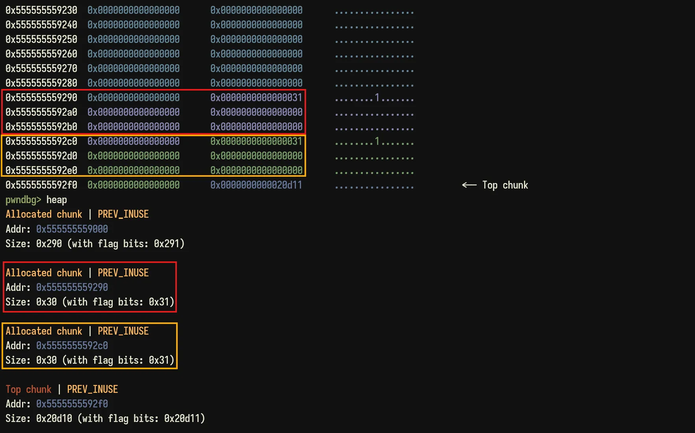
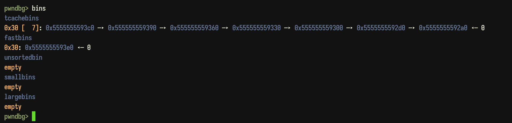
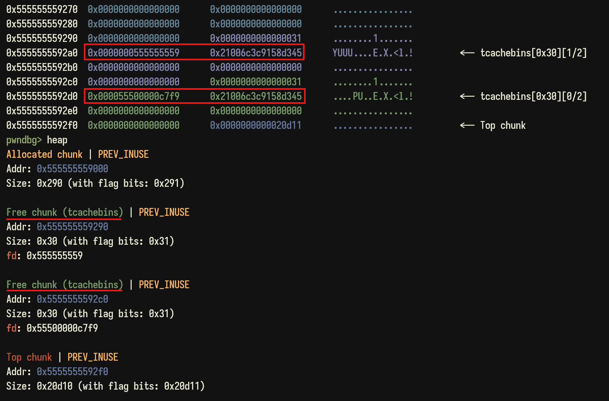
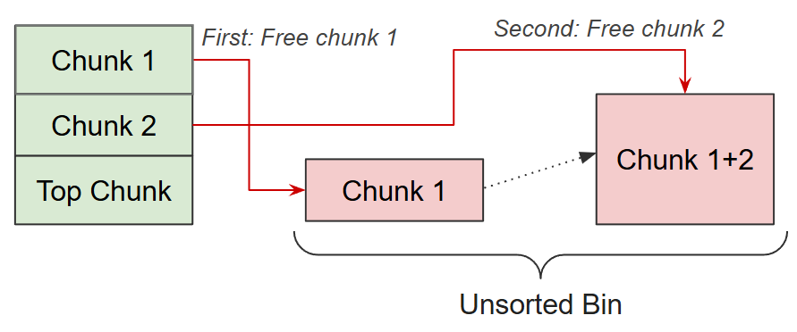
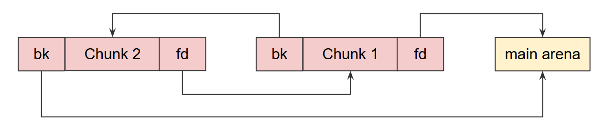
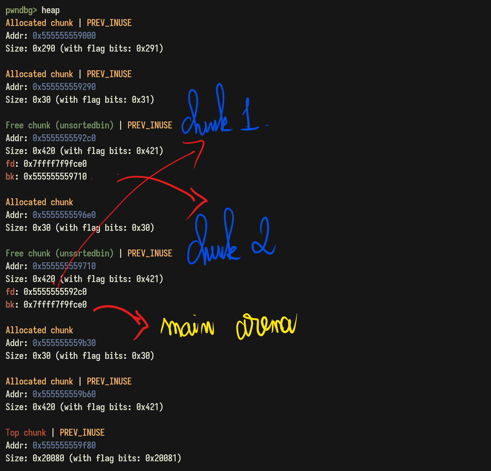

<style>
img {
    box-shadow: rgba(0, 0, 0, 0.35) 0px 5px 15px;
    border-radius: 6px;
    display: block; 
    margin: 0 auto 15px;
}
</style>


Nội dung bài viết sẽ không đi sâu vào nghiên cứu các cơ chế hoạt động của Heap. Thay vào đó là những nội dung khái quát, vừa đủ để người chơi có thể làm quen được với các dạng bài Heap Exploitation trong Capture The Flag. 

## 0x1 Malloc Chunk

Khi chương trình gọi hàm `malloc`/`calloc`, một vùng nhớ mới sẽ được tạo ra gọi là **heap chunk**. Cấu trúc của một chunk sẽ gồm 2 phần: **heap metadata** và **heap content**. 

**Phần 1 - Heap Metadata**: Có kích thước 0x8/0x10 bytes (đối với binary 32/64 bits), chứa các thông tin như là: **chunk size**, **flag mode**, **previous size**.

> Trong phạm vi bài viết này, mình sẽ chỉ làm việc với binary 64 bits. 

- **Previous Size**: Nằm ở 8 bytes đầu tiên của chunk. Chứa kích thước của chunk được `free` trước nó.
- **Chunk size**: Nằm ở 8 bytes tiếp theo của chunk. Chứa kích thước của chunk hiện tại (tính cả metadata).
- **Flag mode**: Là bit thể hiện trạng thái của chunk, được cộng vào chunk size nhưng không làm ảnh hưởng tới kích thước thật sự của chunk. Bao gồm 3 trạng thái:
  1. **Previous chunk in use [0x1]**: Bit này được thêm vào khi chunk phía trước đang được sử dụng. 
  2. **Is mmapped [0x2]**: Kích thước chunk yêu cầu vượt quá kích thước của top chunk dẫn tới việc phải cấp phát động qua hàm `mmap()`.  
  3. **Non in main arena [0x4]**: Chương trình luôn tồn tại main arena nhưng đối với chương trình multi-threading thì mỗi thread lại dùng arena riêng. Vì thế, bit này được bật khi heap chunk không nằm trong main arena. 

**Phần 2 - Heap Content**: Chứa nội dung của heap chunk.

Ví dụ: `malloc` 2 chunk với kích thước 0x20, tính thêm cả metadata là 0x30. Các chunk này đều có bit Previous chunk in use [0x1]. 



## 0x2 Binning

Khi một heap chunk được `free`, nó sẽ được đẩy vào các bin tương ứng. Bin được định nghĩa là các vùng nhớ chứa các chunk được giải phóng, giúp chương trình thuận tiện cấp phát lại bộ nhớ mới khi có yêu cầu. 

Có tổng cộng 5 bin đó là: Fast Bin, Tcache Bin, Unsorted Bin, Small Bin, Large Bin. 

### 1. Fast Bin

Fast Bin có cấu trúc là danh sách liên kết đơn, chứa các chunk được `free` có kích thước từ **[0x20, 0x80] (đã tính metadata)** và hoạt động theo cơ chế LIFO - được đẩy vào sau sẽ được lấy ra trước, tương tự như cơ chế của stack. 

### 2. Tcache Bin

Được xuất hiện từ **phiên bản Glibc 2.26**, có cấu trúc tương tự như Fast Bin truyền thống. Ưu điểm so với Fast Bin đó là giữa các tiến trình sẽ phải dùng chung một Fast Bin nhưng với Tcache thì mỗi thread đều có Tcache riêng nên sẽ tối ưu hơn cho việc cấp phát lại các chunk. 

Khi `free` một chunk có kích thước **[0x20, 0x410] (đã thêm metadata)** thì chunk đó sẽ được ưu tiên đẩy vào Tcache Bin trước. 

Cấu trúc của Tcache Bin là một danh sách liên kết đơn và hoạt động theo cơ chế LIFO tương tự Fast Bin. Đối với từng kích thước, Tcache Bin sẽ chỉ chứa tối đa được 7 chunks, đây cũng chính là nhược điểm của Tcache Bin. 

Ví dụ đoạn mã sau đây, `malloc` liên tục 8 chunks và sau đó `free` hết cả 8 chunks.

```c
#include <stdio.h>
#include <stdlib.h>

int main() {
    char *ptr[8]; 

    for (int i = 0; i < 8; i++) {
        ptr[i] = malloc(0x20); 
    }

    for (int i = 0; i < 8; i++) {
        free(ptr[i]); 
    }
} 
```

Sau khi `free` 7 chunks có size 0x30 liên tiếp, chúng sẽ được chứa ở Tcache Bin, chunk thứ 8 sẽ bị đẩy vào Fast Bin. 





Khi `free` một chunk, 16 byte đầu ở Heap Content sẽ bị ghi đè. 

**8 byte đầu**: chứa giá trị được tính toán bởi cơ chế **Safe Linking (có từ phiên bản 2.32)** của Tcache theo công thức:

$$ v = pa \oplus (a \gg 12) $$

trong đó: 

- $v$: giá trị ở 8 byte đầu sau khi `free`.
- $pa$ - previous address: địa chỉ chunk được `free` trước đó, nếu là chunk đầu tiên được `free` thì $pa = 0$.
- $a$: địa chỉ của chunk hiện tại.

Ví dụ khi `free` chunk thứ 2: 

- $pa$ = 0x5555555592a0
- $a$ = 0x5555555592d0
- $v$ = 0x5555555592a0 ^ (0x5555555592d0 >> 12) = 0x55500000c7f9



**8 bytes sau**: một giá trị Key ngẫu nhiên nhằm chống lại kỹ thuật khai thác Double Free. 

### 3. Unsorted Bin | Small Bin | Large Bin

Ba loại bin này có mối quan hệ chặt chẽ với nhau, chúng được lưu trữ trong cùng một mảng nhưng có các vị trí khác nhau: 

- Unsorted Bin: 0x01
- Small Bin: 0x02 → 0x3F
- Large Bin: 0x40 → 0x7E



Unsorted Bin là nơi chứa các chunk được `free` với **size > 0x410** (không vào được Tcache Bin) hoặc **size = [0x80 - 0x410]** (không vào được Fast Bin, vào được Tcache Bin nhưng đã đầy 7 chunks). Cấu trúc của nó là danh sách liên kết đôi và sẽ xử lý chunk sau khi được `free` theo 2 cách:
1. Gộp chunk. 
2. Trỏ tới chunk kế tiếp. 



**Cách 1: Gộp chunk**

Nếu 2 chunks ở cạnh nhau trong Unsorted Bin, được `free` liên tiếp thì chúng sẽ được gộp lại thành 1 chunk.  



Ví dụ `malloc` 2 chunks size 0x410 và `free` liên tiếp. Kết quả sẽ được một chunk có size 0x840 (đã tính metadata) trong Unsorted Bin. 

```c
#include <stdio.h>
#include <stdlib.h>

int main() {
    char *ptr[2]; 

    for (int i = 0; i < 2; i++) {
        ptr[i] = malloc(0x410); 
    }

    for (int i = 0; i < 8; i++) {
        free(ptr[i]); 
    }
}
```

Sau khi `malloc` 2 chunk trên 

```bash
pwndbg> heap
Allocated chunk | PREV_INUSE
Addr: 0x555555559000
Size: 0x290 (with flag bits: 0x291)

Allocated chunk | PREV_INUSE
Addr: 0x555555559290
Size: 0x420 (with flag bits: 0x421)

Allocated chunk | PREV_INUSE
Addr: 0x5555555596b0
Size: 0x420 (with flag bits: 0x421)
```

Lần lượt `free` từng chunk một, kết quả sẽ cho ta thấy có sự gộp chunk. 

```bash
=======================
==== Chunk 1 freed ====
=======================

pwndbg> heap
Allocated chunk | PREV_INUSE
Addr: 0x555555559000
Size: 0x290 (with flag bits: 0x291)

Free chunk (unsortedbin) | PREV_INUSE
Addr: 0x555555559290
Size: 0x420 (with flag bits: 0x421)
fd: 0x7ffff7f9fce0
bk: 0x7ffff7f9fce0

Allocated chunk
Addr: 0x5555555596b0
Size: 0x420 (with flag bits: 0x420)

=======================
==== Chunk 2 freed ====
=======================

pwndbg> heap
Allocated chunk | PREV_INUSE
Addr: 0x555555559000
Size: 0x290 (with flag bits: 0x291)

Free chunk (unsortedbin) | PREV_INUSE
Addr: 0x555555559290
Size: 0x840 (with flag bits: 0x841)
fd: 0x7ffff7f9fce0
bk: 0x7ffff7f9fce0
```



**Cách 2: Trỏ tới chunk kế tiếp**

Khi giữa 2 chunk được `free` có một chunk đứng giữa làm “ranh giới” thì sẽ không còn hiện tượng gộp chunk. Thay vào đó các chunk sẽ nối tiếp với nhau trong danh sách liên kết đôi. 



Ví dụ: `malloc` đan xen các chunk có size 0x20 và 0x410. Sau đó `free` liên tiếp các chunk có size 0x410.  

```c
#include <stdio.h>
#include <stdlib.h>

int main() {
    char *ptr1[8]; 
    char *ptr2[8]; 

    for (int i = 0; i < 3; i++) {
        ptr2[i] = malloc(0x20); 
        ptr1[i] = malloc(0x410); 
    }

    for (int i = 0; i < 3; i++) {
        free(ptr1[i]); 
    }

    return 0;
}
```

Kết quả cho thấy con trỏ `bk` và `fd` của các chunk được `free` trỏ tới nhau mà không bị gộp.



Khi một chunk được yêu cầu `malloc`, nếu Tcache Bin và Fast Bin không đáp ứng được, Unsorted Bin sẽ được xem xét đến. Có 2 trường hợp xảy ra là:  

1. Size của chunk được `malloc` (#1) < Size của chunk trong Tcache Bin (#2) → Cắt một phần của Chunk #2 cho Chunk #1. 
2. Ngược lại, bộ nhớ sẽ trích từ Top Chunk ra cho Chunk #1, đồng thời thực hiện đưa:  
  - Chunk có size [0x20 - 0x410] trong Unsorted Bin → đưa vào Small Bin.  
  - Chunk có size > 0x410 (#3) trong Unsorted Bin → đưa vào Large Bin.
  - Chunk trong Fast Bin 
    - Nếu liền kề với chunk #3 → gộp chunk và cùng đưa vào Large Bin.
    - Ngược lại → đưa vào Small Bin.

## 0x3 Top Chunk

Top chunk là vùng nhớ lớn cuối cùng của heap dùng để giữ các khối bộ nhớ chưa được phân bổ. Khi có một yêu cầu cấp phát bộ nhớ, trình quản lý heap sẽ tìm kiếm các khối bộ nhớ đủ rộng để cấp phát. Nếu không đủ lớn, top chunk sẽ cắt một phần của mình và trả về vùng nhớ mới.

```Bash
pwndbg> heap
Allocated chunk | PREV_INUSE
Addr: 0x555555559000
Size: 0x290 (with flag bits: 0x291)

Free chunk (tcachebins) | PREV_INUSE
Addr: 0x555555559290
Size: 0x20 (with flag bits: 0x21)
fd: 0x555555559

Allocated chunk | PREV_INUSE
Addr: 0x5555555592b0
Size: 0x20 (with flag bits: 0x21)

Top chunk | PREV_INUSE
Addr: 0x5555555592d0
Size: 0x20d30 (with flag bits: 0x20d31)
```

## 0x4 References
[1]. [Heap Exploitation Nightmare](https://guyinatuxedo.github.io/25-heap/index.html)