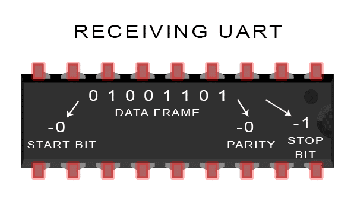

## 0x00. Overview

Một số thiết bị nhúng, IoT có serial console để phục vụ cho việc khời động, giám sát, debug, … Nếu như chúng ta may mắn kết nối được tới nó thông qua UART, ta có thể lấy được shell. Một số hướng để nghiên cứu như là: 
- Có shell, backdoor được thiết bị
- Dịch ngược firmware để tìm lỗ hổng

## 0x01 UART protocol

UART là viết tắt của Universal Asynchronous Receiver / Transmitter. Dịch nôm na là giao thức truyền nhận bất đồng bộ. UART interface có 4 chân cơ bản, đó là: `RX`, `TX`, `VCC`, `GND`. Trong đó có 3 chân thường thấy là `RX`, `TX` và `GND` có công dụng như sau:
- `TX`: viết tắt của **Transmitter** là chân truyền dữ liệu
- `RX`: viết tắt của **Receiver** là chân nhận dữ liệu
- `GND`: viết tắt của **Ground reference** hay còn gọi là **tham chiếu "đất"**, dùng làm điểm để tham chiếu cho giá trị 0V và khử các tín hiệu nhiễu

Để xác định chính xác các chân, ta có thể sử dụng đồng hồ vạn năng hoặc Logic Anayzer 

Chúng ta có thể thảo khảo thêm cách sử dụng ở đây: 
- [Hacker's Guide to UART Root Shells](https://www.youtube.com/watch?v=01mw0oTHwxg)
- [Hardware Hacking 101: Getting a root shell via UART](https://riverloopsecurity.com/blog/2020/01/hw-101-uart/)

---

Trường hợp 1. Sử dụng đồng hồ vạn năng
- Nếu có tiếng kêu → Đó là chân GND
- Nếu điện áp là 0V → Đó là chân RX vì nó đợi dữ liệu
- Nếu điện áp thay đôi → Đó là chân TX vì nó đang gửi dữ liệu

Trường hợp 2. Sử dụng Logic Anayzer

Công cụ chúng ta sử dụng để bắt các tín hiệu là Saleae Logic Anayzer. Phần mềm để phân tích các tín hiệu là Logic 2. Để tiến hành phân tích, ta sẽ thực hiện các bước sau:
1. Chọn Analyzers 
2. Chọn Async Serial 
3. Thiết lập các giá trị phù hợp cho Bit Rate, Stop Bits, Parity Bit. Những giá trị còn lại thường sẽ để standard.

Lấy ví dụ minh họa là kết quả bài ctf hardware/An4lyz3_1t ở giải ACSC 2024

## 0x02 UART frame 

Để truyền dữ liệu đi, dữ liệu sẽ được đóng gói thành các packet. Cấu trúc của packet như trên ảnh: 

- Bit khởi đầu: 1 bit
- Bit dữ liệu: 5 → 8 bits
- Bit chẵn lẻ: 1 bit
- Bit kết thúc: 1 → 2 bits

Dưới đây là hình ảnh của frame khi truyền chữ cái A (0x41)

## 0x03 UART transmission 

Step 1. Transmitting UART nhận dữ liệu song song từ các bus dữ liệu 

Step 2. Đóng gói packet, thêm các bit như start bit, parity, stop bit 

Step 3. Truyền dữ liệu 

Step 4. Receiving UART unpack, lấy dữ liệu trong data frame

Step 5. Receiving UART truyền song song các dữ liệu vào các bus dữ liệu

## 0x04 Baud Rates

Tốc độ truyền dữ liệu cho biết dữ liệu đã được truyền qua dây nhanh như nào. Đồng thời, tốc độ truyền và nhận dữ liệu phải bằng nhau. 

Một số tốc độ phổ biến là: 
- 9600 (bps) trên thiết bị cũ
- 115200 (bps) trên thiết bị hiện đại

Công thức tính bps = 1 / bit width

