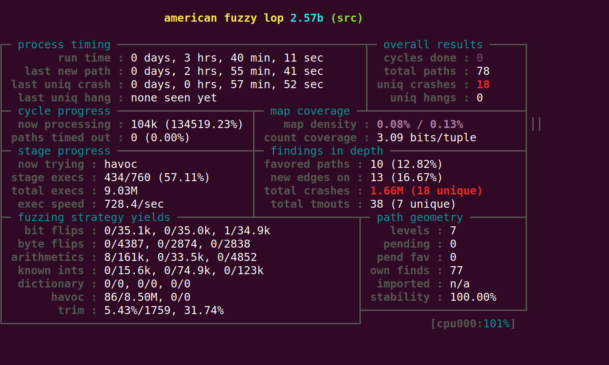
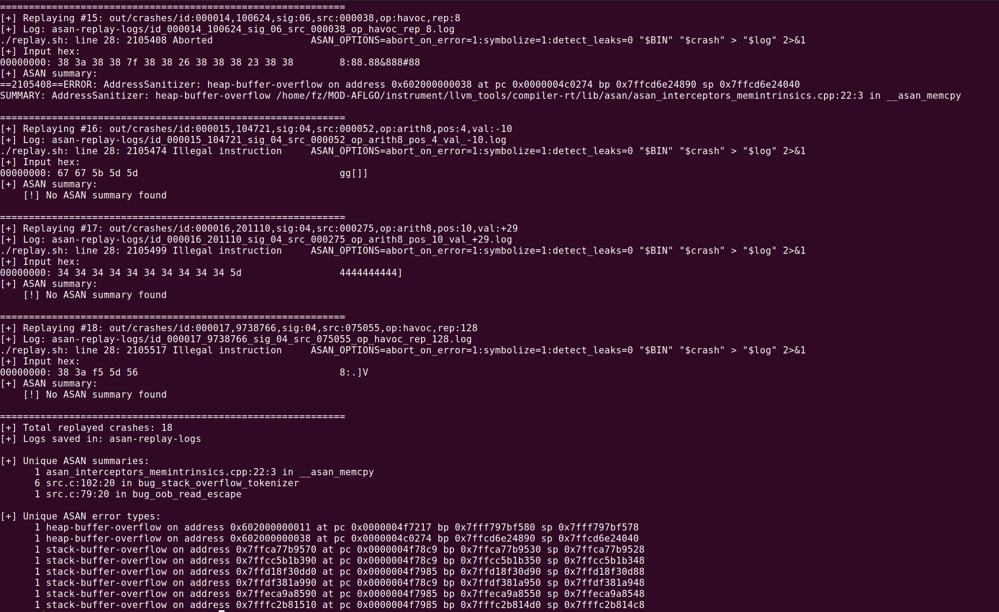

<style>
img {
    box-shadow: rgba(0, 0, 0, 0.35) 0px 5px 15px;
    border-radius: 6px;
    display: block; 
    margin: 0 auto 15px;
}
</style>

<video controls width="100%" preload="metadata">
  <source src="/videos/DEMO.mp4" type="video/mp4">
  Your browser does not support the video tag.
</video>


## 0x01 Example

File `src.c` là một chương trình C đọc input từ file hoặc `stdin`, sau đó truyền buffer vào các hàm parser nhỏ. Mỗi hàm chứa một lỗi bộ nhớ khác nhau.

```c
#include <stdio.h>
#include <stdlib.h>
#include <stdint.h>
#include <string.h>
#include <ctype.h>
#include <limits.h>

static volatile unsigned char sink;

static unsigned char *read_input(int argc, char **argv, size_t *out_size) {
    FILE *fp = NULL;

    if (argc >= 2) {
        fp = fopen(argv[1], "rb");
        if (!fp) {
            perror("fopen");
            exit(1);
        }
    } else {
        fp = stdin;
    }

    size_t cap = 1024;
    size_t len = 0;
    unsigned char *buf = malloc(cap);

    if (!buf) {
        perror("malloc");
        exit(1);
    }

    while (1) {
        if (len == cap) {
            cap *= 2;
            unsigned char *tmp = realloc(buf, cap);
            if (!tmp) {
                free(buf);
                perror("realloc");
                exit(1);
            }
            buf = tmp;
        }

        size_t n = fread(buf + len, 1, cap - len, fp);
        len += n;

        if (n == 0) {
            break;
        }
    }

    if (fp != stdin) {
        fclose(fp);
    }

    unsigned char *exact = malloc(len == 0 ? 1 : len);
    if (!exact) {
        free(buf);
        perror("malloc exact");
        exit(1);
    }

    if (len > 0) {
        memcpy(exact, buf, len);
    }

    free(buf);

    *out_size = len;
    return exact;
}

/*
 * Bug #1: OOB Read
 */
static void bug_oob_read_escape(const unsigned char *data, size_t size) {
    for (size_t i = 0; i < size; i++) {
        if (data[i] == '\\') {
            sink = data[i + 1];  // OOB Read if the last byte of input is backslash '\\'
        }
    }
}

/*
 * Bug #2: Stack Buffer Overflow
 */
static void bug_stack_overflow_tokenizer(const unsigned char *data, size_t size) {
    char token[16];
    size_t j = 0;

    for (size_t i = 0; i < size; i++) {
        unsigned char c = data[i];

        if (c == ' ' || c == '\t' || c == '\n' || c == ':' || c == ';') {
            if (j > 0) {
                sink = token[0];
            }
            j = 0;
            continue;
        }

        token[j++] = (char)c;  // Don't check length of token 
    }

    if (j > 0) {
        sink = token[0];
    }
}

/*
 * Bug #3: Heap buffer overflow
 */
static void bug_heap_overflow_length_field(const unsigned char *data, size_t size) {
    int declared_len = 0;
    size_t i = 0;

    while (i < size && isdigit(data[i])) {
        declared_len = declared_len * 10 + (data[i] - '0');
        i++;
    }

    if (i >= size || data[i] != ':') {
        return;
    }

    i++; 

    if (declared_len <= 0 || declared_len > 1024) {
        return;
    }

    size_t payload_len = size - i;

    char *buf = malloc((size_t)declared_len);
    if (!buf) {
        return;
    }

    /*
     * allocated size = declared_len
     * copy size      = payload_len
     */
    memcpy(buf, data + i, payload_len);  // heap-buffer-overflow

    sink = buf[0];
    free(buf);
}

/*
 * Bug #4: Use-after-free
 */
static void bug_use_after_free_state_machine(const unsigned char *data, size_t size) {
    char *state = malloc(16);
    if (!state) {
        return;
    }

    memset(state, 0, 16);

    for (size_t i = 0; i < size; i++) {
        if (data[i] == '#') {
            free(state);
            /*
             * Not set state = NULL.
             */
            continue;
        }

        if (isalnum(data[i])) {
            state[0] = (char)data[i]; 
        }
    }

    int saw_hash = 0;
    for (size_t i = 0; i < size; i++) {
        if (data[i] == '#') {
            saw_hash = 1;
            break;
        }
    }

    if (!saw_hash) {
        free(state);
    }
}

/*
 * Bug #5: Double free
 */
static void bug_double_free_reset(const unsigned char *data, size_t size) {
    char *buf = malloc(32);
    if (!buf) {
        return;
    }

    int freed = 0;

    for (size_t i = 0; i < size; i++) {
        if (data[i] == '#') {
            free(buf); // 1

            if (freed) {
                free(buf); // 2
            }

            freed = 1;
        }
    }

    if (!freed) {
        free(buf);
    }
}

/*
 * Bug #6: Null pointer dereference
 */
static void bug_null_deref_bad_bracket_state(const unsigned char *data, size_t size) {
    char local[8];
    char *current = local;
    int depth = 0;

    for (size_t i = 0; i < size; i++) {
        if (data[i] == '[') {
            depth++;
        } else if (data[i] == ']') {
            depth--;

            if (depth < 0) {
                current = NULL;
            }
        }

        if (current) {
            current[0] = (char)data[i];
        } else {
            current[0] = 'X';  // null pointer dereference
        }
    }

    sink = local[0];
}

int main(int argc, char **argv) {
    size_t size = 0;
    unsigned char *data = read_input(argc, argv, &size);

    if (size == 0) {
        free(data);
        return 0;
    }

    bug_oob_read_escape(data, size);
    bug_stack_overflow_tokenizer(data, size);
    bug_heap_overflow_length_field(data, size);
    bug_double_free_reset(data, size);
    bug_use_after_free_state_machine(data, size);
    bug_null_deref_bad_bracket_state(data, size);

    free(data);  

    return 0;
}
```

Các nhóm bug chính trong source:

| # | Function | Bug |
|---|---|---|
| 1 | `bug_oob_read_escape()` | Out-of-bounds read | 
| 2 | `bug_stack_overflow_tokenizer()` | Stack buffer overflow |
| 3 | `bug_heap_overflow_length_field()` | Heap buffer overflow | 
| 4 | `bug_use_after_free_state_machine()` | Use-after-free | 
| 5 | `bug_double_free_reset()` | Double free |
| 6 | `bug_null_deref_bad_bracket_state()` | Null pointer dereference |


## 0x02 Build binary

### 1. Generating BBtargets 

DGF cần biết trước các vị trí đích trong chương trình nhằm tập trung khai thác. Các vị trí này được mô tả trong file `BBtargets.txt`, mỗi dòng có định dạng:

```text
<source-file>:<line-number>
```

Trong demo này, các target được chọn là các dòng chứa thao tác lỗi bộ nhớ trong `src.c`, bao gồm:

| Bug                      | Line      |
| ------------------------ | --------- |
| Out-of-bounds read       |  src.c:79 |
| Stack buffer overflow    | src.c:102 |
| Heap buffer overflow     | src.c:143 |
| Use-after-free           | src.c:170 |
| Double free              | src.c:203 |
| Null pointer dereference | src.c:237 |


File `BBtargets.txt` có thể được tạo tự động bằng cách tìm các pattern tương ứng trong source code:

```bash
: > "$TMP_DIR/BBtargets.txt"

add_line_fixed() {
    local name="$1"
    local pattern="$2"
    local line

    line="$(grep -nF "$pattern" "$SRC" | head -n1 | cut -d: -f1 || true)"

    if [ -n "$line" ]; then
        echo "$SRC:$line" >> "$TMP_DIR/BBtargets.txt"
        echo "[+] $name -> $SRC:$line"
    else
        echo "[!] Không tìm thấy target: $name"
        echo "    pattern: $pattern"
    fi
}

add_line_awk() {
    local name="$1"
    local awk_script="$2"
    local line

    line="$(awk "$awk_script" "$SRC" | head -n1 || true)"

    if [ -n "$line" ]; then
        echo "$SRC:$line" >> "$TMP_DIR/BBtargets.txt"
        echo "[+] $name -> $SRC:$line"
    else
        echo "[!] Không tìm thấy target bằng awk: $name"
    fi
}

echo "[+] Detecting AFLGo targets from $SRC"

# Bug #1: out-of-bounds read
add_line_fixed \
    "OOB_READ" \
    "sink = data[i + 1];"

# Bug #2: stack buffer overflow
add_line_fixed \
    "STACK_OVERFLOW" \
    "token[j++] = (char)c;"

# Bug #3: heap buffer overflow
add_line_fixed \
    "HEAP_OVERFLOW" \
    "memcpy(buf, data + i, payload_len);"

# Bug #4: use-after-free
add_line_fixed \
    "USE_AFTER_FREE" \
    "state[0] = (char)data[i];"

# Bug #5: double free
# Lấy free(buf) thứ hai trong function bug_double_free_reset
add_line_awk \
    "DOUBLE_FREE" \
    '
    /static void bug_double_free_reset/ {flag=1}
    /static void bug_null_deref_bad_bracket_state/ {flag=0}
    flag && /free\(buf\);/ {
        c++;
        if (c == 2) {
            print NR;
            exit;
        }
    }
    '

# Bug #6: null pointer dereference
add_line_fixed \
    "NULL_DEREF" \
    "current[0] = 'X';"

if [ ! -s "$TMP_DIR/BBtargets.txt" ]; then
    echo "[-] BBtargets.txt rỗng. Không thể chạy AFLGo distance."
    exit 1
fi

sort -u "$TMP_DIR/BBtargets.txt" -o "$TMP_DIR/BBtargets.txt"

echo
echo "[+] Final BBtargets.txt:"
cat "$TMP_DIR/BBtargets.txt"
echo
```

### 2. AFLGo preprocessing

Mục tiêu nhằm thu thập metadata cho AFLGo bao gồm:

- `BBnames.txt`
- `BBcalls.txt`
- `Fnames.txt`
- `Ftargets.txt`

Lệnh build chính trong `run.sh`:

```bash
export AFLGO="${AFLGO:-/home/fz/MOD-AFLGO}"
export TMP_DIR="$PWD/obj-aflgo/temp"
export CC="$AFLGO/instrument/aflgo-clang"

ADDITIONAL="-targets=$TMP_DIR/BBtargets.txt -outdir=$TMP_DIR -flto -fuse-ld=gold -Wl,-plugin-opt=save-temps"

"$CC" \
    -g -O0 \
    -fno-omit-frame-pointer \
    -Wno-error \
    $ADDITIONAL \
    src.c \
    -o src
```

### 3. Generating distance

Quá trình này cho fuzzer biết mỗi basic block trong chương trình đang gần hay xa các dòng target bug mà ta đã chọn trong `BBtargets.txt`.

```bash
$AFLGO/distance/gen_distance_orig.sh "$PWD" "$TMP_DIR" "src"
```

Kết quả thu được:

```text
obj-aflgo/temp/distance.cfg.txt
```

### 4. Distance instrumentation + ASAN

Ở quá trình này, AFLGo nhúng thông tin khoảng cách vào binary thông qua tham số `-distance`. Thông tin này cho phép fuzzer biết đường thực thi của mỗi input đang gần hay xa các vị trí mục tiêu. Ngoài ra, AddressSanitizer được bật nhằm phát hiện các lỗi an toàn bộ nhớ.

```bash
"$CC" \
    -g -O1 \
    -fsanitize=address \
    -fno-omit-frame-pointer \
    -Wno-error \
    -distance="$TMP_DIR/distance.cfg.txt" \
    src.c \
    -o obj-dist/src
```

## 0x03 Fuzzing

Biến môi trường và cấu hình mặc định:

```bash
FUZZ_TIME=24h
COOLING_TIME=45m

export AFL_SKIP_CPUFREQ=1
export AFL_I_DONT_CARE_ABOUT_MISSING_CRASHES=1
export ASAN_OPTIONS=abort_on_error=1:symbolize=0:detect_leaks=0
```

Lệnh fuzz:

```bash
timeout "$FUZZ_TIME" \
    "$AFLGO/afl-2.57b/afl-fuzz" \
    -m none \
    -z gexp \
    -c "$COOLING_TIME" \
    -i in \
    -o out \
    -- obj-dist/src @@
```

Kết quả sau khi quá trình fuzzing được thực thi




## 0x04 Replay crash

Sau khi fuzzing, các crash được lưu trong `out/crashes/`. Replay từng crash bằng binary đã build với ASAN:

```bash
ASAN_OPTIONS=abort_on_error=1:symbolize=1:detect_leaks=0 \
./obj-dist/src <crash-file>
```

Script replay toàn bộ crash:

```bash
#!/bin/bash

set -euo pipefail

BIN="${BIN:-./obj-dist/src}"
CRASH_DIR="${CRASH_DIR:-out/crashes}"
LOG_DIR="${LOG_DIR:-asan-replay-logs}"

if [ ! -x "$BIN" ]; then
    echo "[-] Binary not found or not executable: $BIN"
    exit 1
fi

if [ ! -d "$CRASH_DIR" ]; then
    echo "[-] Crash directory not found: $CRASH_DIR"
    exit 1
fi

mkdir -p "$LOG_DIR"

echo "[+] Binary    : $BIN"
echo "[+] Crash dir : $CRASH_DIR"
echo "[+] Log dir   : $LOG_DIR"
echo

count=0

for crash in "$CRASH_DIR"/id:*; do
    if [ ! -f "$crash" ]; then
        continue
    fi

    count=$((count + 1))

    base="$(basename "$crash" | tr ':,' '__')"
    log="$LOG_DIR/$base.log"
    input_hex="$LOG_DIR/$base.hex"

    echo "============================================================"
    echo "[+] Replaying #$count: $crash"
    echo "[+] Log: $log"

    xxd -g 1 "$crash" > "$input_hex"

    ASAN_OPTIONS=abort_on_error=1:symbolize=1:detect_leaks=0 \
    "$BIN" "$crash" > "$log" 2>&1 || true

    echo "[+] Input hex:"
    head -n 5 "$input_hex"

    echo "[+] ASAN summary:"
    grep -E \
        "ERROR: AddressSanitizer|SUMMARY: AddressSanitizer|AddressSanitizer:|SEGV|heap-buffer-overflow|stack-buffer-overflow|heap-use-after-free|double-free|attempting double-free" \
        "$log" | head -n 12 || echo "    [!] No ASAN summary found"

    echo
done

echo "============================================================"
echo "[+] Total replayed crashes: $count"
echo "[+] Logs saved in: $LOG_DIR"
echo

echo "[+] Unique ASAN summaries:"
grep -R "SUMMARY: AddressSanitizer" "$LOG_DIR" 2>/dev/null | \
    sed 's|.*/||' | \
    sort | uniq -c || true

echo
echo "[+] Unique ASAN error types:"
grep -R "ERROR: AddressSanitizer" "$LOG_DIR" 2>/dev/null | \
    sed -E 's/.*ERROR: AddressSanitizer: //' | \
    sort | uniq -c || true
```

Kết quả thu được như sau: 



## 0x05 Analysis 

Kết quả replay cho thấy fuzzer đã sinh nhiều testcase gây crash từ seed ban đầu `A`.

### 1. Out-of-bounds read

Crash đầu tiên có input là ký tự backslash `\`. Input chỉ có một byte, vì vậy khi parser gặp `data[i] == '\\'`, nó đọc tiếp:

```c
sink = data[i + 1];
```

Với `size = 1` và `i = 0`, chương trình đọc `data[1]`, nằm ngoài vùng hợp lệ. ASAN báo:

```text
==2104661==ERROR: AddressSanitizer: heap-buffer-overflow 
SUMMARY: AddressSanitizer: heap-buffer-overflow /home/fz/MOD-AFLGO/examples/demo/src.c:79:20 in bug_oob_read_escape
```

ASAN gọi chung là `heap-buffer-overflow`, nhưng bản chất thao tác là read vì chương trình đọc từ `data[i + 1]`.

### 2. Stack buffer overflow

Nhiều testcase khác nhau đều được ASAN gom về cùng lỗi:

```text
SUMMARY: AddressSanitizer: stack-buffer-overflow src.c:102:20 in bug_stack_overflow_tokenizer
```

Đoạn code lỗi:

```c
char token[16];
size_t j = 0;
...
token[j++] = (char)c;
```

Mảng `token` chỉ có 16 phần tử hợp lệ:

```text
token[0] ... token[15]
```

Khi fuzzer sinh input có token liên tiếp dài hơn 16 byte, `j` tăng đến 16 và chương trình ghi vào:

```c
token[16]
```

Đây là ghi vượt ra ngoài mảng cục bộ trên stack.

### 3. Heap buffer overflow

Một testcase có input bắt đầu bằng:

```text
38 3a ...
```

`0x38` là ký tự `8`, `0x3a` là `:`. Input có dạng gần với:

```text
8:<payload>
```

Trong source, parser lấy `declared_len` từ phần trước dấu `:`, sau đó cấp phát:

```c
char *buf = malloc((size_t)declared_len);
```

Nhưng lại copy toàn bộ payload thực tế:

```c
memcpy(buf, data + i, payload_len);
```

Nếu `payload_len > declared_len`, `memcpy` sẽ ghi vượt ra khỏi vùng heap đã cấp phát.

### 4. Null Pointer

Một số testcase chứa ký tự `]` gây:

```text
Illegal instruction
[!] No ASAN summary found
```

Ví dụ input `]`. Theo logic source, ký tự `]` trước `[` làm `depth` giảm xuống âm, sau đó `current = NULL`. Chương trình tiếp tục ghi:

```c
current[0] = 'X';
```

Đây là lỗi null pointer dereference. Tuy nhiên, trong binary hiện tại, compiler có thể tối ưu nhánh undefined behavior thành trap instruction, dẫn tới `SIGILL / Illegal instruction`.

## 0x06 Conclusion 

| # | Input | ASAN| Function | Bug |
|---:|---|---|---|---|
| 1 | `\`| Heap Buffer Overflow | `bug_oob_read_escape` | OOB Read |
| 2 | `len(token)` > 16 | Stack Buffer Overflow | `bug_stack_overflow_tokenizer` | Stack Buffer Overflow |
| 3 | `8:<payload>` | Heap Buffer Overflow | `bug_heap_overflow_length_field` | Heap Buffer Overflow |
| 4 | `]` | SIGILL | `bug_null_deref_bad_bracket_state` | Null Deref/UB |