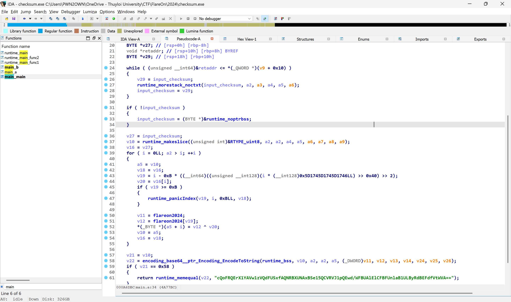
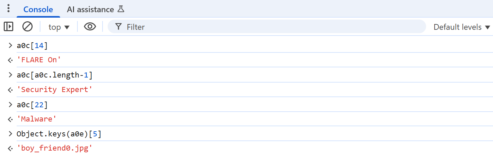
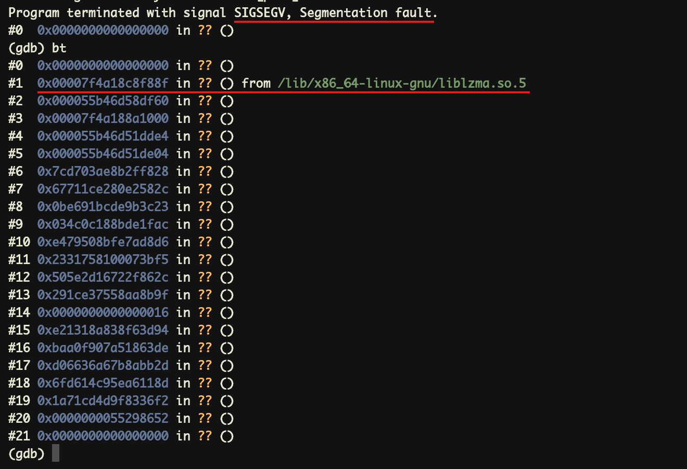
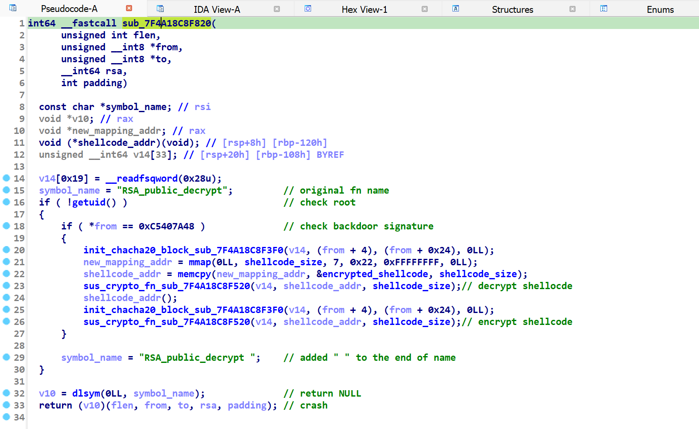
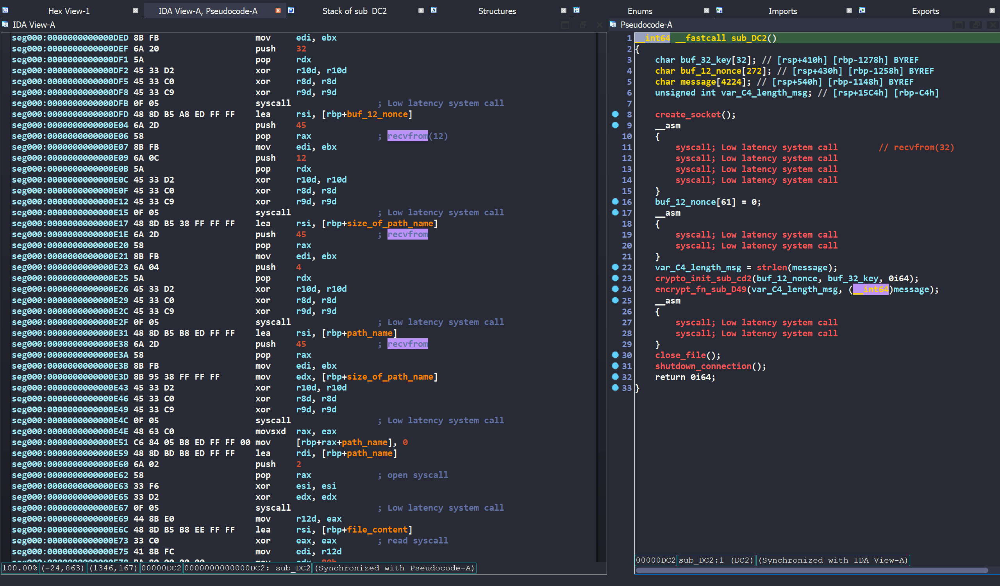
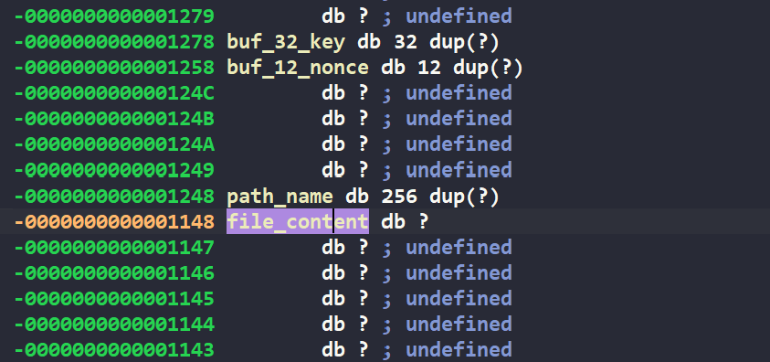

# Flare-On 11


<style>
img {
    box-shadow: rgba(0, 0, 0, 0.35) 0px 5px 15px;
    border-radius: 6px;
    display: block; 
    margin: 0 auto 15px;
}
</style>

## Challenge 1: frog

A game written in Python: your task is to move the frog to the correct spot to get the flag.


### 0x01 Getting the flag 

We can open the game's source code to read it - it's in the `frog.py` file. At a glance, there's a function that generates the "flag" called `GenerateFlagText()` :

```python
def GenerateFlagText(x, y):
    key = x + y*20
    encoded = "\xa5\xb7\xbe\xb1\xbd\xbf\xb7\x8d\xa6\xbd\x8d\xe3\xe3\x92\xb4\xbe\xb3\xa0\xb7\xff\xbd\xbc\xfc\xb1\xbd\xbf"
    return ''.join([chr(ord(c) ^ key) for c in encoded])
```

We don't need the exact values of `x` and `y`. Instead, we'll brute-force all values from 0 to 999 to find the correct flag.

```python
def GenerateFlagText(x, y):
    key = x + y*20
    encoded = "\xa5\xb7\xbe\xb1\xbd\xbf\xb7\x8d\xa6\xbd\x8d\xe3\xe3\x92\xb4\xbe\xb3\xa0\xb7\xff\xbd\xbc\xfc\xb1\xbd\xbf"
    return ''.join([chr(ord(c) ^ key) for c in encoded])

for x in range(0, 999):
    for y in range(0, 999): 
        flag = GenerateFlagText(x, y)
        if "flare" in flag:
            print(flag)
            break

# welcome_to_11@flare-on.com
```

## Challenge 2: checksum

### 0x01 Overview

The challenge provides us with a PE64 file written in Golang, along with several questions related to the result of a "checksum" calculation.

```
C:\Users\PWN2OWN>"C:\Users\PWN2OWN\FlareOn\2024\checksum.exe"
Check sum: 9418 + 92 = 9510
Good math!!!
------------------------------
Check sum: 9397 + 3991 = 13388
Good math!!!
------------------------------
Check sum: 5380 + 1695 = 7075
Good math!!!
------------------------------
Check sum: 3936 + 7655 = 11591
Good math!!!
------------------------------
Checksum: aaaaaaaaaaaaaaaaaaaaaaaaaaaaaaaa
Maybe it's time to analyze the binary! ;)
```

### 0x02 Static Analysis 

The program contains three non-library functions: `main_main`, `main_a`, `main_b`. 


First, `randomTimes` represents the number of math questions to be generated, with its value randomly chosen in the range [0, 5]. This value is then increased by 3, resulting in a total of 3 to 8 arithmetic questions.

Each question randomly generates two operators, which I renamed to `fsRandom` and `seRandom`. The player's task is to input the correct sum of these two numbers. If all answers are correct, the program proceeds to the next stage.

```c
  randomTimes = math_rand_v2__ptr_Rand_uint64n(math_rand_v2_globalRand, 5);
  inputNumber = (int *)runtime_newobject(&RTYPE_int);
  for ( i = 0; i < randomTimes + 3; i = v45 + 1 )
  {
    v45 = i;
    fsRandom = math_rand_v2__ptr_Rand_uint64n(math_rand_v2_globalRand, 10000);
    seRandom = math_rand_v2__ptr_Rand_uint64n(math_rand_v2_globalRand, 10000);
    v66 = 0;
    v67 = 0;
    v2 = runtime_convT64(fsRandom);
    *(_QWORD *)&v66 = &RTYPE_int;
    *((_QWORD *)&v66 + 1) = v2;
    v3 = runtime_convT64(seRandom);
    *(_QWORD *)&v67 = &RTYPE_int;
    *((_QWORD *)&v67 + 1) = v3;
    sumRandom = fsRandom + seRandom;
    fmt_Fprintf(go_itab__os_File_io_Writer, os_Stdout, "Check sum: %d + %d = ", 21, &v66, 2, 2);
    v65[0] = &RTYPE__ptr_int;
    v65[1] = inputNumber;
    v72 = fmt_Fscanf(go_itab__os_File_io_Reader, os_Stdin, "%d\n", 3, v65, 1, 1);
    v4 = main_b(v72._r1, v72._r2, "Not a valid answer...", 21);
    if ( *(_QWORD *)inputNumber != fsRandom + seRandom )
    {
      runtime_printlock(v4);
      v5 = runtime_printstring("Try again! ;)\n", 14);
      runtime_printunlock(v5);
      return;
    }
    ((void (*)(void))runtime_printlock)();
    v1 = runtime_printstring("Good math!!!\n------------------------------\n", 44);
    runtime_printunlock(v1);
  }
```

The program then prompts for a checksum input and verifies its validity using a Golang API.

```c
  input_checksum = (string *)runtime_newobject(&RTYPE_string);
  input_checksum->ptr = 0;
  v64[0] = &RTYPE_string;
  v64[1] = &off_4EDAB0;                         // checksum
  fmt_Fprint(go_itab__os_File_io_Writer, os_Stdout, v64, 1, 1);
  v63[0] = &RTYPE__ptr_string;
  v63[1] = input_checksum;
  v70 = fmt_Fscanf(go_itab__os_File_io_Reader, os_Stdin, "%s\n", 3, v63, 1, 1);
  main_b(v70._r1, v70._r2, "Fail to read checksum input...", 30);
```
<!--  -->

The `input_checksum` must be exactly 32 bytes long, where the first 24 bytes are extracted as the buffer. The program uses the XChaCha20-Poly1305 encryption algorithm, which requires a 32-byte key and a 24-byte nonce. Based on this, we can hypothesize that the buffer serves as the nonce in this encryption scheme.

```c
  buffer = (BYTE *)runtime_makeslice(&RTYPE_uint8, 24, 24);
  input_checksum_length = v44;
  v14 = r0;
  for ( j = 0; input_checksum_length > (__int64)j && j != 24; ++j )
  {
    if ( j >= 0x18 )
      goto LABEL_33;
    buffer[j] = v14->key[j];                    // buffer = input_checksum[0:24]
  }
  v59.cap = (size_t)buffer;
  if ( input_checksum_length == 32 )            // must be 32 bytes
  {
    p_chacha20poly1305_xchacha20poly1305 = (chacha20poly1305_xchacha20poly1305 *)runtime_newobject(&RTYPE_chacha20poly1305_xchacha20poly1305);
    if ( p_chacha20poly1305_xchacha20poly1305 != r0 )
    {
      v57 = p_chacha20poly1305_xchacha20poly1305;
      runtime_memmove(p_chacha20poly1305_xchacha20poly1305, r0, 32);
      p_chacha20poly1305_xchacha20poly1305 = v57;
    }
    v16 = go_itab__golang_org_x_crypto_chacha20poly1305_xchacha20poly1305_crypto_cipher_AEAD;
    v17 = 0;
    v18 = p_chacha20poly1305_xchacha20poly1305;
    v19 = 0;
  }
  else
  {
    v62[1] = 32;
    v62[0] = "chacha20poly1305: bad key length";
    v16 = 0;
    v17 = go_itab__errors_errorString_error;
    v18 = 0;
    v19 = v62;
  }
```

<!--  -->

By decoding the `encryptedFlagData` using the key and the nonce mentioned above, we obtain the `decryptedData`. The `decryptedData` is hashed using SHA-256, then converted to a hexadecimal string and compared with `input_checksum`.


If they match, the function `main_a` is called and the result is printed to `{os_UserCacheDir}\REAL_FLAREON_FLAG.JPG`.


Analyzing the `main_a` function, we can see that its logic is relatively straightforward. The `input_checksum` is XORed with the string `FlareOn2024`, then base64-encoded and compared with the string: `cQoFRQErX1YAVw1zVQdFUSxfAQNRBXUNAxBSe15QCVRVJ1pQEwd/WFBUAlElCFBFUnlaB1ULByRdBEFdfVtWVA==`. 



### 0x03 Getting the flag 

Finding correct checksum value: 

```python
>>> x = b"cQoFRQErX1YAVw1zVQdFUSxfAQNRBXUNAxBSe15QCVRVJ1pQEwd/WFBUAlElCFBFUnlaB1ULByRdBEFdfVtWVA=="
>>> y = b"FlareOn2024"
>>> import base64
>>> xx = base64.b64decode(x)
>>> "".join(chr(xx[i] ^ y[i % len(y)]) for i in range(len(xx)))
'7fd7dd1d0e959f74c133c13abb740b9faa61ab06bd0ecd177645e93b1e3825dd'
```

Finding flag in local app data `C:\Users\PWN2OWN\AppData\Local` 


## Challenge 3: aray

The challenge provides a YARA rule file, and the task is to find an input that satisfies all the conditions defined in the rule.


### 0x01 Clean code 

First, clean up the code by replacing all occurrences of `and` with line breaks `\n` for better readability. At a glance, there are two types of data involved:

- uint8 
- unint32 

with operands: `+`, `-`, `&`, `%`. 

Additionally, there are several comparisons using hash functions like `sha256`, `md5`, and `crc32` such as:

```
hash.crc32(8, 2) == 0x61089c5c 
hash.crc32(34, 2) == 0x5888fc1b 
hash.crc32(63, 2) == 0x66715919 
hash.sha256(14, 2) == "403d5f23d149670348b147a15eeb7010914701a7e99aad2e43f90cfa0325c76f"
hash.sha256(56, 2) == "593f2d04aab251f60c9e4b8bbc1e05a34e920980ec08351a18459b2bc7dbf2f6"
hash.md5(0, 2) == "89484b14b36a8d5329426a3d944d2983"
hash.crc32(78, 2) == 0x7cab8d64 
hash.md5(76, 2) == "f98ed07a4d5f50f7de1410d905f1477f"
hash.md5(50, 2) == "657dae0913ee12be6fb2a6f687aae1c7"
hash.md5(32, 2) == "738a656e8e8ec272ca17cd51e12f558b"
```

With each chunk being only 2 bytes, it's easy to brute-force to find values that satisfy these conditions. 

```python
# Define all hash targets and positions
targets = [
    ('crc32',   8,  0x61089c5c),
    ('crc32',   34, 0x5888fc1b),
    ('crc32',   63, 0x66715919),
    ('sha256',  14, "403d5f23d149670348b147a15eeb7010914701a7e99aad2e43f90cfa0325c76f"),
    ('sha256',  56, "593f2d04aab251f60c9e4b8bbc1e05a34e920980ec08351a18459b2bc7dbf2f6"),
    ('md5',     0,  "89484b14b36a8d5329426a3d944d2983"),
    ('crc32',   78, 0x7cab8d64),
    ('md5',     76, "f98ed07a4d5f50f7de1410d905f1477f"),
    ('md5',     50, "657dae0913ee12be6fb2a6f687aae1c7"),
    ('md5',     32, "738a656e8e8ec272ca17cd51e12f558b"),
]

# Choose charset (printable ASCII)
charset = range(32, 127)

# Brute-force
for hash_type, offset, expected in targets:
    # print(f"[*] Brute-forcing {hash_type} at offset {offset}...")

    found = False
    for c1, c2 in itertools.product(charset, repeat=2):
        pair = bytes([c1, c2])

        if hash_type == 'crc32':
            h = binascii.crc32(pair) & 0xffffffff
            if h == expected:
                found = True
        elif hash_type == 'sha256':
            h = hashlib.sha256(pair).hexdigest()
            if h == expected:
                found = True
        elif hash_type == 'md5':
            h = hashlib.md5(pair).hexdigest()
            if h == expected:
                found = True

        if found:
            s.add(flag[offset] == c1)
            s.add(flag[offset + 1] == c2)
            break

    if not found:
        print(f"[-] No match found at offset {offset}")
```

For the remaining conditions, we can easily solve them using Z3. 

```python
from z3 import * 

filesize = 85
flag = [BitVec(f"b{i}", 85 * 8) for i in range(filesize)]

s = Solver()

s.add((filesize ^ flag[11]) != 107 )
s.add((flag[55]) & 128 == 0 )
s.add((flag[58]) + 25 == 122 )
s.add((flag[7]) & 128 == 0 )
s.add((flag[48]) % 12 < 12 )

[...]

if (s.check() == sat):
    res = bytearray()
    for b in flag:
        res.append(s.model()[b].as_long())
    print(res)
```

### 0x02 Getting the flag 

[Full script](./solve.py) 

```shell
C:\Users\PWN2OWN\CTF\Flare-On\Flare11\3_aray\aray>python solve.py
bytearray(b'rule flareon { strings: $f = "1RuleADayK33p$Malw4r3Aw4y@flare-on.com" condition: $f }')
```

## Challenge 4: FLARE Meme Maker 3000

The challenge provides a `mememaker3000.html` file containing an obfuscated JavaScript snippet.


### 0x01 Deobfuscate

Deobfuscate using the website [https://deobfuscate.relative.im](https://deobfuscate.relative.im), the resulting source code is quite clear:

```javascript
const a0c = [
    'When you find a buffer overflow in legacy code',
    'Reverse Engineer',
    'When you decompile the obfuscated code and it makes perfect sense',
    'Me after a week of reverse engineering',
    'When your decompiler crashes',
    "It's not a bug, it'a a feature",
    "Security 'Expert'",
    'AI',
    "That's great, but can you hack it?",
    'When your code compiles for the first time',
    "If it ain't broke, break it",
    "Reading someone else's code",
    'EDR',
    'This is fine',
    'FLARE On',
    "It's always DNS",
    'strings.exe',
    "Don't click on that.",
    'When you find the perfect 0-day exploit',
    'Security through obscurity',
    'Instant Coffee',
    'H@x0r',
    'Malware',
    '$1,000,000',
    'IDA Pro',
    'Security Expert',
  ],
  a0d = {
    doge1: [
      ['75%', '25%'],
      ['75%', '82%'],
    ],
    boy_friend0: [
      ['75%', '25%'],
      ['40%', '60%'],
      ['70%', '70%'],
    ],
    draw: [['30%', '30%']],
    drake: [
      ['10%', '75%'],
      ['55%', '75%'],
    ],
    two_buttons: [
      ['10%', '15%'],
      ['2%', '60%'],
    ],
    success: [['75%', '50%']],
    disaster: [['5%', '50%']],
    aliens: [['5%', '50%']],
  },
  a0e = {
    'doge1.png':
      'data:image/png;base64, [...]',
    'draw.jpg':
      'data:image/jpeg;base64, [...]',
    'drake.jpg':
      'data:image/jpeg;base64, [...]',
    'two_buttons.jpg':
      'data:image/jpeg;base64, [...]',
    'fish.jpg':
    'data:binary/red;base64, [...]',
    'boy_friend0.jpg':
      'data:image/jpeg;base64, [...]',
    'success.jpg':
      'data:image/jpeg;base64, [...]',
    'disaster.jpg':
      'data:image/jpeg;base64, [...]',
    'aliens.jpg':
      'data:image/jpeg;base64, [...]',
  }
function a0f() {
  document.getElementById('caption1').hidden = true
  document.getElementById('caption2').hidden = true
  document.getElementById('caption3').hidden = true
  const a = document.getElementById('meme-template')
  var b = a.value.split('.')[0]
  a0d[b].forEach(function (c, d) {
    var e = document.getElementById('caption' + (d + 1))
    e.hidden = false
    e.style.top = a0d[b][d][0]
    e.style.left = a0d[b][d][1]
    e.textContent = a0c[Math.floor(Math.random() * (a0c.length - 1))]
  })
}
a0f()
const a0g = document.getElementById('meme-image'),
  a0h = document.getElementById('meme-container'),
  a0i = document.getElementById('remake'),
  a0j = document.getElementById('meme-template')
a0g.src = a0e[a0j.value]
a0j.addEventListener('change', () => {
  a0g.src = a0e[a0j.value]
  a0g.alt = a0j.value
  a0f()
})
a0i.addEventListener('click', () => {
  a0f()
})
function a0k() {
  const a = a0g.alt.split('/').pop()
  if (a !== Object.keys(a0e)[5]) {
    return
  }
  const b = a0l.textContent,
    c = a0m.textContent,
    d = a0n.textContent
  if (
    a0c.indexOf(b) == 14 &&
    a0c.indexOf(c) == a0c.length - 1 &&
    a0c.indexOf(d) == 22
  ) {
    var e = new Date().getTime()
    while (new Date().getTime() < e + 3000) {}
    var f = d[3] + 'h' + a[10] + b[2] + a[3] + c[5] + c[c.length - 1] + '5' + a[3] + '4' + a[3] + c[2] + c[4] + c[3] + '3' + d[2] + a[3] + 'j4' + a0c[1][2] + d[4] + '5' + c[2] + d[5] + '1' + c[11] + '7' + a0c[21][1] + b.replace(' ', '-') + a[11] + a0c[4].substring(12, 15)
    f = f.toLowerCase()
    alert(atob('Q29uZ3JhdHVsYXRpb25zISBIZXJlIHlvdSBnbzog') + f)
  }
}
const a0l = document.getElementById('caption1'),
  a0m = document.getElementById('caption2'),
  a0n = document.getElementById('caption3')
a0l.addEventListener('keyup', () => {
  a0k()
})
a0m.addEventListener('keyup', () => {
  a0k()
})
a0n.addEventListener('keyup', () => {
  a0k()
})
```

### 0x02 Getting the flag 

There is a base64 encoded string with the content `Congratulations! Here you go: `. From this, we can deduce that the `a0k()` function contains the flag. There are 2 conditions that need to be bypassed:

First, the meme template must satisfy:

```javascript
if (a !== Object.keys(a0e)[5]) {
    return
}
``` 

Second, the text in the boxes must satisfy:

```javascript 
if (
    a0c.indexOf(b) == 14 &&
    a0c.indexOf(c) == a0c.length - 1 &&
    a0c.indexOf(d) == 22
)
```

To satisfy the first condition, we just need to declare:

```javascript
a = Object.keys(a0e)[5]
```

For the second condition, we just need to change the values of the elements right after randomization:



```javascript
function a0f() {
  document.getElementById('caption1').hidden = true
  document.getElementById('caption2').hidden = true
  document.getElementById('caption3').hidden = true
  const a = document.getElementById('meme-template')
  var b = a.value.split('.')[0]
  a0d[b].forEach(function (c, d) {
    var e = document.getElementById('caption' + (d + 1))
    e.hidden = false
    e.style.top = a0d[b][d][0]
    e.style.left = a0d[b][d][1]
    e.textContent = a0c[Math.floor(Math.random() * (a0c.length - 1))]
  })
  
  document.getElementById('caption1').textContent = 'FLARE On'
  document.getElementById('caption2').textContent = 'Security Expert'
  document.getElementById('caption3').textContent = 'Malware'
}
```

After reloading the page, we get the flag: `wh0a_it5_4_cru3l_j4va5cr1p7@flare-on.com`.


## Challenge 5: sshd


* **Given file:** [sshd.7z](https://wru-my.sharepoint.com/:u:/g/personal/2251272678_e_tlu_edu_vn/EYCYJYqV0dZCtAzhZT2O2skBMNpPgWPQ45qrW9Ztf5KQ5A?e=X5v81N)
* **Description:** Our server in the FLARE Intergalactic HQ has crashed! Now criminals are trying to sell me my own data!!! Do your part, random internet hacker, to help FLARE out and tell us what data they stole! We used the best forensic preservation technique of just copying all the files on the system for you.\
7zip archive password: flare


### 0x00 My opinion 

In my opinion, this is one of the best challenges in the series. It is related to cases of real-world cybersecurity incidents and mentions a very interesting backdoor [that was discovered last year](https://en.wikipedia.org/wiki/XZ_Utils_backdoor).

### 0x01 Overview

The challenge provides a filesystem image.


The description mentions that the server crashed due to something. When an application crashes on Linux, the coredump file is stored at `/var/lib/systemd/coredump`. There is a coredump file related to the `sshd` process.

```shell
➜ ls ./var/lib/systemd/coredump
sshd.core.93794.0.0.11.1725917676
```

To get a clearer picture of the memory at the time the process crashed, I used GDB for analysis.

```shell
➜ gdb ./usr/sbin/sshd ./var/lib/systemd/coredump/sshd.core.93794.0.0.11.1725917676
```

Looking at the information provided by the `bt` command, the program crashed due to calling a function at address `0x0000000000000000`. The function that caused the crash is at address `0x00007f4a18c8f88f`, located in the `liblzma.so.5` library.



Observing the memory mapping information using the `info proc mappings` command, we see that starting from address `0x7f4a18c86000`, there are memory regions that have been deleted but contain the faulty code at `0x00007f4a18c8f88f`.  


Update the base address of the library in IDA PRO to facilitate analysis of the liblzma.so.5 library.


### 0x02 Analysis the library 

Jumping to the address that caused the crash, the function that caused the error is `sub_7F4A18C8F820`, with the content renamed as follows:



Normally, `dlsym` would call the `RSA_public_decrypt` function by its exact name. However, `symbol_name` has an extra space at the end. Therefore, `dlsym` returns NULL, and the code below causes a crash.

What we need to pay attention to is the code at `line[20:26]`. Thanks to the string `expand 32-byte k`, we can determine that the encryption algorithm is likely ChaCha20 or Salsa20. Its operation flow can be summarized as follows:

The process involves mapping and copying the encrypted shellcode into a memory region with full RWX permissions. After that, the shellcode is decrypted, executed, and then re-encrypted to avoid detection.

---

The next task is to decrypt the shellcode.

There are several ways to decrypt the shellcode. You can dump the `init_chacha20_block, sus_crypto_fn`, `from`, and `encrypted_shellcode` functions and use Unicorn or Ghidra + plugin to emulate and analyze.

I choose a different way to save time, though it may be more error-prone. Find the `key` and `nonce` and manually decrypt the shellcode.

The `v10` function — the one that caused the crash calls the `from` variable as its second parameter. Therefore, `rsi` will store the value of the `from` variable

```c
(v10)(flen, from, to, rsa, padding)
```

From there, it's easy to determine: `key = from + 4` and `nonce = from + 0x24` based on the call to `init_chacha20_block_sub_7F4A18C8F3F0(v14, (from + 4), (from + 0x24), 0LL)`. 


We see that `rsi = from = 0xc5407a48`, which matches the backdoor signature check. Continue to decrypt the shellcode with the key and nonce just found.

```python
from Crypto.Cipher import ChaCha20 

key = b"\x94\x3d\xf6\x38\xa8\x18\x13\xe2\xde\x63\x18\xa5\x07\xf9\xa0\xba\x2d\xbb\x8a\x7b\xa6\x36\x66\xd0\x8d\x11\xa6\x5e\xc9\x14\xd6\x6f"
nonce = b"\xf2\x36\x83\x9f\x4d\xcd\x71\x1a\x52\x86\x29\x55"

with open("./dumped_bytes.bin", "rb") as f: 
    encrypted_data = f.read() 

cipher = ChaCha20.new(key=key, nonce=nonce)
decrypted_data = cipher.decrypt(encrypted_data)

with open("decrypted_shellcode.bin", "wb") as f:
    f.write(decrypted_data)
```

### 0x03 Analysis shellcode 

The shellcode is quite short and straightforward. It frequently sets the value of the `rax` register to call syscalls in the form `{push value; pop rax}`



To summarize, the shellcode's operation flow is as follows:
- Create a socket and connect to `10.0.2.15:1337`
- Receive 0x20 bytes `key`
- Receive 12 bytes `nonce`
- Receive 4 bytes `size_of_file_path_name`
- Receive `size_of_file_path_name` bytes `file_path`
- Open the file
- Read 0x80 bytes from `file_path`, store in `file_content`
- Initialize ChaCha20/Salsa algorithm
- Encrypt file_content using the above algorithm
- Send `encrypted_file_content_size` to C2
- Send `encrypted_file_content` to C2
- Close the file
- Shutdown the connection

Searching for strings in the coredump file, we find a very important path `/root/certificate_authority_signing_key.txt`. Opening HxD, we can easily see that the values around the path match the operation flow summarized above.


- Green underline: `key`
- Orange underline: `nonce`
- Red underline: `size_of_file_path_name`

Using IDA PRO, we calculate the offset of `path_name` relative to `file_content`.



Returning to decrypting the data, the shellcode used the ChaCha20 algorithm but with a custom sigma `expand 32-byte K`.


Rewrite the entire ChaCha20 decryption function instead of using the library, and we get the challenge flag.

```python
import struct

def rotate(v, c):
    return ((v << c) & 0xffffffff) | (v >> (32 - c))

def quarter_round(x, a, b, c, d):
    x[a] = (x[a] + x[b]) & 0xffffffff
    x[d] ^= x[a]
    x[d] = rotate(x[d], 16)

    x[c] = (x[c] + x[d]) & 0xffffffff
    x[b] ^= x[c]
    x[b] = rotate(x[b], 12)

    x[a] = (x[a] + x[b]) & 0xffffffff
    x[d] ^= x[a]
    x[d] = rotate(x[d], 8)

    x[c] = (x[c] + x[d]) & 0xffffffff
    x[b] ^= x[c]
    x[b] = rotate(x[b], 7)

def chacha20_block(key, counter, nonce, sigma):
    state = (
        list(struct.unpack('<4I', sigma)) +
        list(struct.unpack('<8I', key)) +
        [counter] +
        list(struct.unpack('<3I', nonce))
    )

    working_state = state[:]
    for _ in range(10):  # 20 rounds (10 double rounds)
        quarter_round(working_state, 0, 4, 8, 12)
        quarter_round(working_state, 1, 5, 9, 13)
        quarter_round(working_state, 2, 6, 10, 14)
        quarter_round(working_state, 3, 7, 11, 15)
        quarter_round(working_state, 0, 5, 10, 15)
        quarter_round(working_state, 1, 6, 11, 12)
        quarter_round(working_state, 2, 7, 8, 13)
        quarter_round(working_state, 3, 4, 9, 14)

    for i in range(16):
        working_state[i] = (working_state[i] + state[i]) & 0xffffffff

    return struct.pack('<16I', *working_state)

def chacha20_decrypt(key, nonce, ciphertext, counter=0, sigma=b"expand 32-byte K"):
    assert len(key) == 32
    assert len(nonce) == 12
    assert len(sigma) == 16

    plaintext = b""
    for block_index in range(0, len(ciphertext), 64):
        block = chacha20_block(key, counter, nonce, sigma)
        chunk = ciphertext[block_index:block_index + 64]
        keystream = block[:len(chunk)]
        plaintext += bytes([c ^ k for c, k in zip(chunk, keystream)])
        counter += 1
    return plaintext


key = b"\x8D\xEC\x91\x12\xEB\x76\x0E\xDA\x7C\x7D\x87\xA4\x43\x27\x1C\x35\xD9\xE0\xCB\x87\x89\x93\xB4\xD9\x04\xAE\xF9\x34\xFA\x21\x66\xD7"
nonce = b"\x11\x11\x11\x11\x11\x11\x11\x11\x11\x11\x11\x11"
encrypted_data = b"\xA9\xF6\x34\x08\x42\x2A\x9E\x1C\x0C\x03\xA8\x08\x94\x70\xBB\x8D\xAA\xDC\x6D\x7B\x24\xFF\x7F\x24\x7C\xDA\x83\x9E\x92\xF7\x07\x1D\x02\x63\x90\x2E\xC1\x58"
custom_sigma = b"expand 32-byte K"

plaintext = chacha20_decrypt(key, nonce, encrypted_data, counter=0, sigma=custom_sigma)

print("Decrypted:", plaintext)
# Decrypted: b'supp1y_cha1n_sund4y@flare-on.com\n\x86Xm\xb4U'
```
